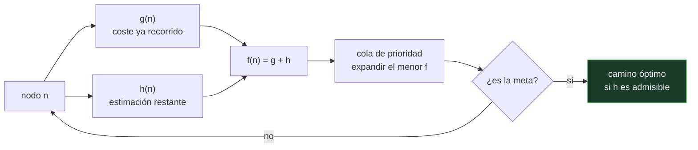

# P67 — A*

> Ruta simbólica · Convierte la heurística en garantía: si la estimación nunca se pasa,
> el camino que devuelve es el óptimo. No es una heurística mejor, es un teorema.

**Nivel:** L3 · **Motor:** `a_estrella` · **Notebook:** [`P67_a_estrella.ipynb`](../../../notebooks/papers/P67_a_estrella.ipynb)
· **Anexo:** [complejidad y coste](../../annexes/A05_COMPLEJIDAD_Y_COSTE.md)

## 1. Identificación

| Campo | Valor |
|---|---|
| **Título original** | *A Formal Basis for the Heuristic Determination of Minimum Cost Paths* |
| **Autoría** | Peter E. Hart, Nils J. Nilsson, Bertram Raphael |
| **Año** | 1968 |
| **Venue** | IEEE Transactions on Systems Science and Cybernetics, 4(2), 100–107 |
| **Fuente primaria** | [doi:10.1109/TSSC.1968.300136](https://doi.org/10.1109/TSSC.1968.300136) |
| **Acceso** | Restringido |
| **Fecha de consulta** | 2026-08-17 |

## 2. Problema anterior

Había dos familias de búsqueda y ninguna servía. La exhaustiva —Dijkstra, costo uniforme—
garantizaba el camino óptimo y no escalaba: explora en todas las direcciones por igual. La
heurística iba directa a la meta y no garantizaba nada: podía devolver un camino mucho peor sin
avisar.

En medio no había teoría. Se usaban heurísticas porque «funcionaban», sin saber bajo qué
condiciones ni con qué pérdida.

## 3. Propuesta

Evaluar cada nodo por la suma de las dos mitades:

```text
f(n) = g(n) + h(n)
```

donde `g(n)` es el coste **real** ya recorrido y `h(n)` la estimación de lo que falta. Y una
condición sobre `h`:

> **Admisibilidad**: `h(n)` nunca sobrestima el coste real restante.

El teorema: si `h` es admisible, A* devuelve el camino de coste mínimo. Y un segundo resultado,
menos citado: A* es **óptimamente eficiente** entre los algoritmos que usan la misma información
— ningún otro expande menos nodos con garantía de optimalidad.

## 4. Intuición sin fórmulas

Ir a un sitio a pie. La búsqueda exhaustiva explora todas las calles a la misma distancia, en
círculos concéntricos. La voraz camina siempre hacia donde el destino parece más cerca y se mete
en callejones sin salida.

A* hace lo sensato: prefiere las calles que combinan «ya he andado poco» con «esto queda cerca».
Y la condición de admisibilidad es la garantía de que el mapa no te engaña diciendo que algo está
más lejos de lo que está.

**Dónde deja de funcionar la analogía:** una persona corrige sobre la marcha si ve que se ha
equivocado. A* no necesita corregir: la garantía es previa, y depende solo de la propiedad de `h`.

## 5. Matemática mínima

```text
f(n) = g(n) + h(n)

Admisibilidad:  h(n) ≤ h*(n)  para todo n,  con h* el coste real restante
Consistencia:   h(n) ≤ c(n, n') + h(n')     (más fuerte: evita reexpandir)

Teorema:  h admisible ⟹ A* devuelve el camino óptimo
          h = 0        ⟹ A* degenera en costo uniforme
          g ignorada    ⟹ búsqueda voraz, rápida y sin garantía
```

La miniatura ejecuta las cuatro variantes sobre el mismo grafo de siete nodos:

| Estrategia | Coste devuelto | Nodos expandidos | ¿Óptimo? |
|---|---:|---:|:--:|
| costo uniforme | 8 | 7 | sí |
| voraz (solo h) | 10 | 4 | **no** |
| A* con h admisible | 8 | 5 | sí |
| A* con h que sobrestima en D | 10 | — | **no** |

La última fila es la que hay que mirar: la heurística inadmisible sobrestima en **un solo nodo**,
y ese nodo está en el camino óptimo. La garantía se pierde exactamente ahí.

<!-- puente:inicio -->
> [!TIP]
> **Puente matemático.** Esta sección da por sabido lo siguiente. Si algo no te suena,
> léelo primero: está explicado una sola vez, en un solo sitio, y sirve para todas las fichas.

| Dónde | Qué necesitas de ahí |
|---|---|
| [**A05 §1** · Notación O(): qué dice y qué no](../../annexes/A05_COMPLEJIDAD_Y_COSTE.md#1-notación-o-qué-dice-y-qué-no) | por qué reducir el número de nodos expandidos importa más que optimizar la constante |
<!-- puente:fin -->

## 6. Arquitectura o flujo



## 7. Qué observar en el paper original

- La **demostración de admisibilidad**, que es corta y merece seguirse: el argumento es que si A*
  terminara con un camino subóptimo, existiría un nodo en la frontera del camino óptimo con `f`
  menor, y por tanto se habría expandido antes.
- El resultado de **eficiencia óptima**, que suele olvidarse y es la mitad del valor del artículo.
- La discusión sobre qué pasa cuando `h = 0`: A* se convierte en costo uniforme. La heurística no
  es un añadido, es un parámetro que interpola entre dos algoritmos conocidos.
- La **corrección de 1972** de los propios autores sobre la condición de consistencia, que es más
  fuerte que la admisibilidad y es la que evita reexpandir nodos.

## 8. Evidencia y resultados

Es un artículo teórico: demuestra la admisibilidad y la eficiencia óptima, e ilustra con
problemas de búsqueda de caminos.

> Los resultados son teoremas con hipótesis explícitas. Es de los pocos casos en IA donde la
> garantía es matemática y no empírica, y por eso el artículo envejece tan bien.

La miniatura comprueba las hipótesis y su consecuencia: verifica nodo a nodo que la heurística
admisible nunca sobrestima, y exhibe qué ocurre cuando una sola entrada de la tabla se pasa.

## 9. Impacto

- Es probablemente el algoritmo de IA más usado en producción: navegación, videojuegos,
  planificación de rutas, robótica móvil.
- Fija el vocabulario con el que se habla de búsqueda informada: `g`, `h`, `f`, admisibilidad,
  consistencia.
- Su estructura sobrevive al cambio de paradigma: la búsqueda en árbol de
  [AlphaGo](../P27_alphago/README.md) es esta idea con una red neuronal aportando la estimación en
  lugar de una fórmula escrita a mano.
- Y aporta al programa una lección transferible: la diferencia entre «funciona bien en mis pruebas»
  y «tiene una garantía con hipótesis comprobables».

## 10. Limitaciones

1. **La memoria.** A* guarda la frontera completa y en problemas grandes eso es el cuello de
   botella. De ahí IDA*, SMA* y las variantes con memoria acotada.
2. **La garantía depende de una hipótesis que hay que demostrar.** Una heurística «que funciona»
   no es admisible por defecto, y comprobarlo es trabajo.
3. **Admisibilidad no es consistencia.** Con heurísticas admisibles pero no consistentes puede
   hacer falta reexpandir nodos.
4. **Sigue siendo exponencial** en el peor caso: si la heurística no informa, el coste es el de la
   búsqueda ciega.
5. **Necesita costes bien definidos.** En dominios donde el coste es incierto o multiobjetivo, la
   formulación no aplica directamente.

## 11. Errores comunes

| Error | Corrección |
|---|---|
| «A* siempre encuentra el camino óptimo» | Solo si la heurística es admisible. Con una que sobrestime aunque sea en un nodo, devuelve un camino y no avisa de que no es el mejor. |
| «Una heurística mejor es la que estima con más precisión» | Una heurística más informada expande menos nodos, sí — pero si al ganar precisión pierde admisibilidad, pierde la garantía. Precisión y admisibilidad son cosas distintas. |
| «La búsqueda voraz es A* sin g» | Correcto, y por eso pierde la optimalidad: sin g no hay memoria del coste ya pagado, y el algoritmo se deja llevar por la estimación. |
| «Con h = 0 el algoritmo no sirve» | Con h = 0 A* es exactamente el costo uniforme: sigue siendo óptimo, solo que sin información expande mucho más. |
| «Admisible y consistente son lo mismo» | La consistencia es más fuerte e implica admisibilidad. Es la condición que garantiza no tener que reexpandir nodos ya cerrados. |

## 12. Relación con trabajos anteriores

- **Dijkstra (1959)** — caminos mínimos sin heurística: el caso `h = 0` de este algoritmo.
- **[P64 General Problem Solver](../P64_gps/README.md) (1959)** — la búsqueda guiada por
  conocimiento del dominio, sin garantía formal.
- **[P58 Símbolos y búsqueda](../P58_simbolos_y_busqueda/README.md) (1976)** — el marco que
  enuncia la hipótesis de la búsqueda heurística, posterior pero conceptualmente envolvente.

## 13. Relación con trabajos posteriores

- **Hart, Nilsson y Raphael (1972)** — la corrección sobre la condición de consistencia.
  [doi:10.1145/1056777.1056779](https://doi.org/10.1145/1056777.1056779)
- **Korf (1985)** — IDA*: la misma garantía con memoria lineal.
  [doi:10.1016/0004-3702(85)90084-0](https://doi.org/10.1016/0004-3702(85)90084-0)
- **[P27 AlphaGo](../P27_alphago/README.md) (2016)** — búsqueda guiada con la estimación aprendida
  por una red en lugar de escrita a mano.
- **[P68 STRIPS](../P68_strips/README.md) (1971)** — la representación sobre la que esta búsqueda
  se aplica en planificación.

## 14. Notebook asociado

[`P67_a_estrella.ipynb`](../../../notebooks/papers/P67_a_estrella.ipynb)

**Qué implementa:** las cuatro estrategias sobre el mismo grafo —costo uniforme, voraz, A* admisible y A* con heurística que sobrestima—, con coste, nodos expandidos y la comprobación nodo a nodo de la admisibilidad.

**Qué NO implementa:** no hay grafos grandes, ni memoria acotada, ni la distinción entre admisibilidad y consistencia, ni las variantes (IDA*, A* ponderado) que se usan en la práctica.

```bash
ai-evolution paper-lab P67 --seed 7
```

## 15. Actividades Bloom

| Nivel | Actividad |
|---|---|
| **Recordar** | Escribe la fórmula de `f(n)` y di qué representa cada término. |
| **Explicar** | Explica qué es una heurística admisible. |
| **Aplicar** | Ejecuta el notebook y comprueba nodo a nodo que la heurística admisible no sobrestima. |
| **Analizar** | Analiza por qué la búsqueda voraz encuentra rápido y encuentra mal. |
| **Evaluar** | «Mi heurística funciona bien, luego A* me da el óptimo». Evalúa la afirmación. |
| **Crear** | Implementa A* en una rejilla con obstáculos, multiplica la heurística por 1,5 y mide qué ganas en nodos y qué pierdes en calidad. |

## 16. Autoevaluación

1. ¿Qué combina A* que las alternativas no combinaban?
2. ¿Qué es la admisibilidad?
3. ¿Qué garantiza el teorema del artículo?
4. ¿Qué pasa si la heurística sobrestima en un solo nodo?
5. ¿En qué se convierte A* con `h = 0`?
6. ¿Qué es la eficiencia óptima de A*?
7. ¿Cuál es su límite práctico principal?

## 17. Respuestas esperadas

1. El coste ya recorrido (`g`) con la estimación de lo que falta (`h`). La exhaustiva solo usaba `g` y la voraz solo `h`; ninguna de las dos daba a la vez rapidez y garantía.
2. Que la heurística nunca sobrestime el coste real restante desde cualquier nodo hasta la meta. Es una condición de optimismo.
3. Que si `h` es admisible, A* devuelve el camino de coste mínimo. La garantía es matemática y depende solo de esa propiedad de `h`.
4. Se pierde la garantía. En la miniatura, sobrestimar en D —que está en el camino óptimo— hace que A* devuelva un camino de coste 10 en vez de 8, sin ningún aviso.
5. En la búsqueda de costo uniforme, es decir Dijkstra. Sigue siendo óptimo, pero sin información expande muchos más nodos.
6. Que ningún otro algoritmo que use la misma heurística puede expandir menos nodos garantizando optimalidad. Es la mitad menos citada del artículo.
7. La memoria: guarda la frontera completa. En problemas grandes es el cuello de botella, y por eso existen IDA* y las variantes con memoria acotada.

## 18. Fuentes primarias

- Hart, P. E., Nilsson, N. J. y Raphael, B. (1968). *A Formal Basis for the Heuristic
  Determination of Minimum Cost Paths*. **IEEE Transactions on Systems Science and Cybernetics**,
  4(2), 100–107. [doi:10.1109/TSSC.1968.300136](https://doi.org/10.1109/TSSC.1968.300136) ·
  consultado 2026-08-17.
- Hart, P. E., Nilsson, N. J. y Raphael, B. (1972). *Correction to «A Formal Basis…»*.
  [doi:10.1145/1056777.1056779](https://doi.org/10.1145/1056777.1056779) · consultado 2026-08-17.
- Korf, R. (1985). *Depth-first Iterative-Deepening: An Optimal Admissible Tree Search*.
  [doi:10.1016/0004-3702(85)90084-0](https://doi.org/10.1016/0004-3702(85)90084-0) ·
  consultado 2026-08-17.

---

[⬅️ Anterior: P66 Resolución](../P66_resolucion/README.md) ·
[📇 Índice](../../catalog/PAPERS_INDEX.md) ·
[📝 Evaluación](../../../assessments/papers/P67_a_estrella.md) ·
[🏫 Clase 015 · Costo uniforme, búsqueda voraz y A*](../../../classes/part-01-symbolic-ai-search-logic-and-planning/015-costo-uniforme-busqueda-voraz-y-a/README.md) ·
[➡️ Siguiente: P68 STRIPS](../P68_strips/README.md)
