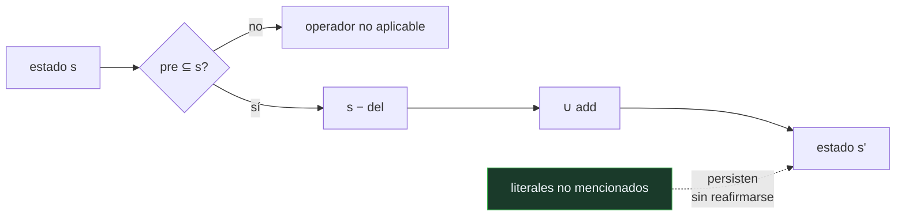

# P68 — STRIPS

> Ruta simbólica · Precondición, añadir, borrar. Con tres listas resuelve el problema del
> marco por convención, y de paso descubre que las submetas se estorban.

**Nivel:** L2 · **Motor:** `strips` · **Notebook:** [`P68_strips.ipynb`](../../../notebooks/papers/P68_strips.ipynb)
· **Anexo:** [complejidad y coste](../../annexes/A05_COMPLEJIDAD_Y_COSTE.md)

## 1. Identificación

| Campo | Valor |
|---|---|
| **Título original** | *STRIPS: A New Approach to the Application of Theorem Proving to Problem Solving* |
| **Autoría** | Richard E. Fikes, Nils J. Nilsson |
| **Año** | 1971 |
| **Venue** | Artificial Intelligence, 2(3–4), 189–208 |
| **Fuente primaria** | [doi:10.1016/0004-3702(71)90010-5](https://doi.org/10.1016/0004-3702(71)90010-5) |
| **Acceso** | Restringido |
| **Fecha de consulta** | 2026-08-17 |

## 2. Problema anterior

Planificar con un demostrador de teoremas choca con el **problema del marco**: para describir una
acción no basta con decir qué cambia, hay que decir también todo lo que **no** cambia.

Si un robot empuja una caja, hay que afirmar explícitamente que las paredes siguen donde estaban,
que las otras cajas no se han movido, que la puerta sigue abierta. Con `n` literales y `m`
acciones hacen falta del orden de `n × m` axiomas de persistencia, y el demostrador se ahoga en
ellos antes de llegar a nada interesante.

## 3. Propuesta

Salir de la lógica para la parte del cambio. Un operador se describe con **tres listas**:

```text
pre : lo que tiene que ser cierto para poder aplicarlo
add : los literales que pasan a ser ciertos
del : los literales que dejan de serlo
```

Y una convención que lo resuelve todo: **lo que no aparece en `add` ni en `del` persiste**. El
problema del marco desaparece porque nadie tiene que escribir la persistencia — se asume.

STRIPS combina esa representación con búsqueda por análisis medios-fines al estilo de
[GPS](../P64_gps/README.md), y demuestra teoremas solo dentro de un estado, no a través del
tiempo.

## 4. Intuición sin fórmulas

Un parte de incidencias. No escribes «la mesa sigue en su sitio, la silla también, la ventana
sigue cerrada». Escribes solo lo que cambió: «se rompió la lámpara». Todo el mundo entiende que lo
no mencionado sigue igual.

**Dónde deja de funcionar la analogía:** en un parte de incidencias esa convención es informal y a
veces falla. Aquí es una regla dura, y por eso obliga a que cada operador declare **todos** sus
efectos. Un efecto olvidado no es una omisión menor: es un estado del mundo incorrecto.

## 5. Matemática mínima

```text
Operador ⟨pre, add, del⟩ aplicable en s  ⟺  pre ⊆ s
Resultado:   s' = (s − del) ∪ add

    mover(C, A→mesa):
        pre : sobre(C,A), libre(C)
        add : sobre(C,mesa), libre(A)
        del : sobre(C,A)
```

La miniatura aplica ese operador sobre el estado inicial y comprueba que **4 literales** que el
operador no menciona siguen siendo ciertos sin que nadie los reafirme.

Y después ataca la meta `{sobre(A,B), sobre(B,C)}` desde el estado con `C` sobre `A`:

| Orden de submetas | Submetas conseguidas |
|---|---:|
| «A sobre B» primero | 1 de 2 |
| «B sobre C» primero | 1 de 2 |
| intercalando (3 pasos) | **2 de 2** |

Ningún orden lineal resuelve. La solución existe y es corta: lo que falla es el esquema de cerrar
una submeta antes de tocar la siguiente. Eso es la **anomalía de Sussman**.

## 6. Arquitectura o flujo



## 7. Qué observar en el paper original

- La **motivación explícita**: el artículo nace del robot Shakey, y sus decisiones se entienden
  mejor sabiendo que había un robot real que tenía que actuar.
- Cómo se **separa** la demostración de teoremas —que sigue usándose dentro de un estado— de la
  descripción del cambio, que sale de la lógica.
- El **supuesto de mundo cerrado**: lo que no está afirmado se considera falso. Es lo que hace que
  las tres listas basten.
- La discusión sobre **macro-operadores** y aprendizaje de planes (las tablas triangulares), que
  es la parte menos citada y la que anticipa el aprendizaje de habilidades reutilizables.

## 8. Evidencia y resultados

El artículo describe el sistema y su comportamiento en el dominio del robot Shakey y en mundos de
bloques, con ejemplos de planes construidos.

> Es una demostración de viabilidad con un robot real detrás, no una evaluación comparativa. La
> anomalía de Sussman se documenta poco después y se convierte en el caso de prueba estándar.

La miniatura reproduce la representación exacta —tres listas— y exhibe las dos cosas que importan:
la persistencia de lo no mencionado y el fallo de la planificación lineal.

## 9. Impacto

- La representación ⟨pre, add, del⟩ es la que sigue usándose. **PDDL**, el lenguaje estándar de
  planificación desde 1998, es esencialmente STRIPS con azúcar sintáctico.
- Popularizó el **mundo de bloques** como dominio de referencia, con todo lo bueno y lo malo que
  eso trajo.
- La anomalía de Sussman motivó la planificación **no lineal** y el orden parcial, que es la línea
  dominante durante los ochenta y noventa.
- El problema reaparece intacto en los agentes actuales: descomponer una tarea en subtareas y
  ejecutarlas en orden falla exactamente igual cuando las subtareas interactúan.

## 10. Limitaciones

1. **El supuesto de mundo cerrado** es cómodo y falso en cualquier dominio abierto: lo no
   afirmado no siempre es falso.
2. **Acciones deterministas y estado completamente observable.** Nada de incertidumbre, sensores
   ruidosos o acciones que fallan — que es la situación real de un robot.
3. **La planificación lineal no basta**, y el propio dominio de bloques lo demuestra con un
   ejemplo de tres pasos.
4. **Sin coste ni duración.** Todas las acciones valen igual y son instantáneas.
5. **El problema de la ramificación** —qué efectos indirectos tiene una acción— queda fuera: hay
   que declararlos todos a mano en `add` y `del`.

## 11. Errores comunes

| Error | Corrección |
|---|---|
| «STRIPS resuelve el problema del marco» | Lo resuelve **por convención**, no por lógica: asume que lo no mencionado persiste. Es una solución práctica y tiene el coste de exigir que cada operador declare todos sus efectos. |
| «La anomalía de Sussman es un fallo de implementación» | Es una propiedad del esquema lineal. El dominio es trivial y el plan correcto tiene tres pasos; lo que falla es cerrar una submeta antes de tocar la siguiente. |
| «Basta con probar el otro orden de submetas» | La miniatura lo comprueba: ningún orden lineal resuelve. Hace falta intercalar. |
| «PDDL es un lenguaje distinto» | PDDL estandariza esta misma representación. Quien entiende las tres listas entiende el núcleo de PDDL. |
| «El problema desapareció con la planificación moderna» | La interacción entre submetas sigue viva. Un agente que descompone una tarea y ejecuta los pasos en orden se encuentra la misma anomalía con otro nombre. |

## 12. Relación con trabajos anteriores

- **[P64 General Problem Solver](../P64_gps/README.md) (1959)** — el análisis medios-fines que
  STRIPS conserva como estrategia de búsqueda.
- **McCarthy y Hayes (1969)** — el enunciado del problema del marco, que es lo que este artículo
  esquiva.
- **[P66 Resolución](../P66_resolucion/README.md) (1965)** — el demostrador que STRIPS sigue
  usando dentro de cada estado.

## 13. Relación con trabajos posteriores

- **Sacerdoti (1975)** — planificación no lineal y orden parcial: la respuesta directa a la
  anomalía. [doi:10.1016/0004-3702(75)90005-4](https://doi.org/10.1016/0004-3702(75)90005-4)
- **McDermott et al. (1998)** — PDDL, el lenguaje que estandariza esta representación.
  [PDDL 1.2](https://www.cs.cmu.edu/~mmv/planning/readings/98aips-PDDL.pdf)
- **[P32 Voyager](../P32_voyager/README.md) (2023)** — biblioteca de habilidades reutilizables: la
  idea de los macro-operadores de STRIPS, cincuenta años después.
- **[P13 ReAct](../P13_react/README.md) (2022)** — planificar y actuar intercalados, que es
  exactamente lo que la anomalía enseña que hay que hacer.

## 14. Notebook asociado

[`P68_strips.ipynb`](../../../notebooks/papers/P68_strips.ipynb)

**Qué implementa:** la representación de un operador con sus tres listas, la comprobación de qué literales persisten sin ser mencionados, y la anomalía de Sussman con los dos órdenes lineales frente al plan intercalado de tres pasos.

**Qué NO implementa:** no hay búsqueda de planes propiamente dicha, ni orden parcial, ni macro-operadores. El planificador es lineal a propósito, para que la anomalía se vea.

```bash
ai-evolution paper-lab P68 --seed 7
```

## 15. Actividades Bloom

| Nivel | Actividad |
|---|---|
| **Recordar** | Escribe las tres listas del operador `mover(C, A→mesa)`. |
| **Explicar** | Explica en qué consiste el problema del marco. |
| **Aplicar** | Ejecuta el notebook y aplica el operador a mano sobre el estado inicial. |
| **Analizar** | Analiza por qué ningún orden lineal de submetas resuelve la meta. |
| **Evaluar** | «La anomalía se arregla probando el otro orden». Evalúa la afirmación. |
| **Crear** | Escribe el dominio en PDDL y resuélvelo con un planificador real; compara la longitud del plan. |

## 16. Autoevaluación

1. ¿Qué tres listas describen un operador STRIPS?
2. ¿Qué es el problema del marco?
3. ¿Cómo lo resuelve STRIPS?
4. ¿Qué es el supuesto de mundo cerrado?
5. ¿Qué es la anomalía de Sussman?
6. ¿Por qué no se arregla cambiando el orden de las submetas?
7. ¿Dónde reaparece este problema hoy?

## 17. Respuestas esperadas

1. Precondiciones (lo que debe ser cierto para aplicarlo), lista de añadir (lo que pasa a ser cierto) y lista de borrar (lo que deja de serlo).
2. La necesidad de declarar explícitamente todo lo que **no** cambia al ejecutar una acción. En lógica eso exige un axioma por literal y por acción, y hace inviable planificar.
3. Por convención: lo que no aparece en `add` ni en `del` persiste. No es una solución lógica, es una regla de la representación, y funciona.
4. Que lo que no está afirmado en el estado se considera falso. Es lo que permite que las tres listas describan el estado completo.
5. Que en el mundo de bloques hay metas —como `sobre(A,B)` y `sobre(B,C)` desde una configuración concreta— que ningún planificador lineal resuelve, aunque exista un plan corto.
6. Porque el problema no está en el orden sino en el esquema: cerrar una submeta completa antes de tocar la siguiente destruye lo conseguido. La miniatura comprueba que los dos órdenes fallan igual.
7. En cualquier agente que descomponga una tarea en subtareas y las ejecute secuencialmente. Cuando las subtareas interactúan, cerrar una rompe otra.

## 18. Fuentes primarias

- Fikes, R. E. y Nilsson, N. J. (1971). *STRIPS: A New Approach to the Application of Theorem
  Proving to Problem Solving*. **Artificial Intelligence**, 2(3–4), 189–208.
  [doi:10.1016/0004-3702(71)90010-5](https://doi.org/10.1016/0004-3702(71)90010-5) ·
  consultado 2026-08-17.
- Sacerdoti, E. (1975). *The Nonlinear Nature of Plans*.
  [doi:10.1016/0004-3702(75)90005-4](https://doi.org/10.1016/0004-3702(75)90005-4) ·
  consultado 2026-08-17.
- McDermott, D. et al. (1998). *PDDL — The Planning Domain Definition Language*.
  [PDDL 1.2](https://www.cs.cmu.edu/~mmv/planning/readings/98aips-PDDL.pdf) · consultado 2026-08-17.

---

[⬅️ Anterior: P67 A*](../P67_a_estrella/README.md) ·
[📇 Índice](../../catalog/PAPERS_INDEX.md) ·
[📝 Evaluación](../../../assessments/papers/P68_strips.md) ·
[🏫 Clase 023 · Planificación clásica con STRIPS y PDDL](../../../classes/part-01-symbolic-ai-search-logic-and-planning/023-planificacion-clasica-con-strips-y-pddl/README.md) ·
[➡️ Siguiente: P69 Factores de certeza](../P69_mycin/README.md)
