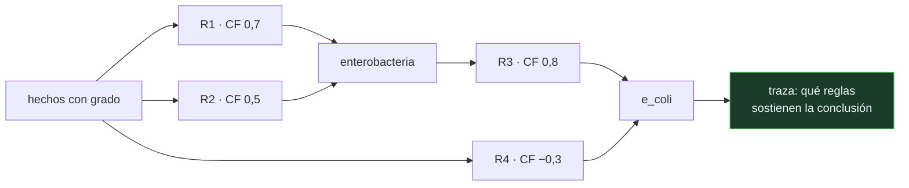

# P69 — Factores de certeza

> Ruta simbólica · El motor de MYCIN: razonar con grados de creencia sin probabilidades,
> y explicar cada conclusión por las reglas que la sostienen.

**Nivel:** L2 · **Motor:** `mycin` · **Notebook:** [`P69_mycin.ipynb`](../../../notebooks/papers/P69_mycin.ipynb)
· **Anexo:** [probabilidad y verosimilitud](../../annexes/A02_PROBABILIDAD_Y_VEROSIMILITUD.md)

## 1. Identificación

| Campo | Valor |
|---|---|
| **Título original** | *A Model of Inexact Reasoning in Medicine* |
| **Autoría** | Edward H. Shortliffe, Bruce G. Buchanan |
| **Año** | 1975 |
| **Venue** | Mathematical Biosciences, 23(3–4), 351–379 |
| **Fuente primaria** | [doi:10.1016/0025-5564(75)90047-4](https://doi.org/10.1016/0025-5564%2875%2990047-4) |
| **Acceso** | Restringido |
| **Fecha de consulta** | 2026-08-17 |

## 2. Problema anterior

El conocimiento clínico está hecho de indicios que no son ni ciertos ni falsos. «Un bacilo
gramnegativo sugiere enterobacteria» no es una implicación lógica: es una inclinación.

La lógica de [P66](../P66_resolucion/README.md) no admite grados. La probabilidad bayesiana sí,
pero exigía distribuciones conjuntas sobre decenas de variables que nadie podía estimar ni
declarar: los médicos no tenían esos números y las tablas necesarias eran astronómicas.

Y había un requisito adicional, no técnico: un médico no acepta una recomendación que no puede
discutir.

## 3. Propuesta

Los **factores de certeza**. Cada regla lleva un número en `[−1, 1]`: positivo si la evidencia
apoya la conclusión, negativo si la desmiente, cero si es irrelevante.

Y un álgebra para combinarlos que cumple tres cosas que sus autores consideraban imprescindibles:

- **satura**: acumular indicios a favor acerca a 1 pero no lo alcanza;
- **admite evidencia en contra** en el mismo eje;
- es **modular**: se puede añadir una regla sin recalcular las demás.

Más el requisito que resultó decisivo: cada conclusión arrastra la lista de reglas que la
sostienen, así que el sistema puede explicar su razonamiento.

## 4. Intuición sin fórmulas

Un jurado que va sumando indicios. Cada testimonio inclina un poco la balanza, ninguno la
resuelve, y dos testimonios que apuntan igual no duplican la convicción: la aumentan cada vez
menos. Un testimonio en contra descuenta.

**Dónde deja de funcionar la analogía:** un jurado sabe que dos testigos que hablaron entre sí no
aportan evidencia independiente. El álgebra de factores de certeza no lo sabe: trata cada regla
como si aportara información nueva, y ahí es donde se aparta de la probabilidad.

## 5. Matemática mínima

```text
Disparo de una regla:
    CF(conclusión) = min(CF de las premisas) × CF(regla)

Combinación de dos aportes:
    ambos ≥ 0 :  CF = a + b·(1 − a)              ← satura por debajo de 1
    ambos < 0 :  CF = a + b·(1 + a)
    signos ≠  :  CF = (a + b) / (1 − min(|a|,|b|))
```

La miniatura encadena cuatro reglas sobre cinco hechos con grado:

| Conclusión | Factor de certeza |
|---|---:|
| enterobacteria | **0,933** |
| e_coli | **0,701** |

Ninguna llega a 1. Y la regla `R4`, con factor **−0,3**, resta en el mismo eje: la evidencia en
contra no vive en una escala aparte.

<!-- puente:inicio -->
> [!TIP]
> **Puente matemático.** Esta sección da por sabido lo siguiente. Si algo no te suena,
> léelo primero: está explicado una sola vez, en un solo sitio, y sirve para todas las fichas.

| Dónde | Qué necesitas de ahí |
|---|---|
| [**A02 §1** · Softmax](../../annexes/A02_PROBABILIDAD_Y_VEROSIMILITUD.md#1-softmax) | cómo se convierte una puntuación sin normalizar en algo que se parece a una creencia, y en qué se diferencia de una probabilidad |
<!-- puente:fin -->

## 6. Arquitectura o flujo



## 7. Qué observar en el paper original

- La **justificación** de por qué no usan probabilidad. No es ignorancia: es un argumento sobre
  qué datos existen y qué puede declarar un experto humano.
- La distinción entre **medida de creencia** (MB) y **medida de descreimiento** (MD), y cómo el
  factor de certeza sale de su diferencia. La miniatura trabaja con el CF ya combinado.
- El énfasis en la **modularidad**: poder añadir una regla sin tocar las demás era un requisito de
  ingeniería del conocimiento, no una elegancia teórica.
- La parte de **explicación**: MYCIN podía responder «por qué» y «cómo», y eso es lo que lo hizo
  aceptable en un hospital.

## 8. Evidencia y resultados

El artículo presenta el modelo y su justificación; la evaluación clínica de MYCIN llega en
trabajos posteriores, donde su desempeño resultó comparable al de especialistas en meningitis.

> El sistema **nunca se usó en producción clínica**, y no por su exactitud: por responsabilidad
> legal, por la ausencia de integración con los sistemas del hospital y por el coste de mantener
> la base de reglas.

La miniatura del eje reproduce la mecánica de combinación y encadenamiento, y contrasta un caso
concreto con la cuenta probabilística equivalente para que se vea que coincidir en un caso no es
ser equivalente.

## 9. Impacto

- MYCIN es el sistema experto canónico y el que abrió la industria de los años ochenta.
- Su arquitectura —base de reglas separada del motor de inferencia— dio lugar a los **shells** de
  sistemas expertos, que es la idea de reutilizar el motor cambiando el conocimiento.
- La **explicabilidad** fue su aportación más duradera: sigue siendo la ventaja estructural del
  razonamiento simbólico frente a un modelo denso, y la razón de que
  [P72](../P72_neurosimbolico/README.md) proponga combinarlos.
- Su fracaso comercial enseñó el **cuello de botella de la adquisición de conocimiento**: escribir
  y mantener 600 reglas cuesta más que escribirlas una vez.

## 10. Limitaciones

1. **Los factores de certeza no son probabilidades.** Su álgebra no se deriva de los axiomas de
   Kolmogorov y puede dar resultados que violan la regla de Bayes.
2. **Supone independencia implícita** entre las evidencias que combina. Cuando dos reglas apoyan
   la misma conclusión por la misma razón subyacente, el resultado infla la creencia.
3. **El coste de construcción es el límite real.** Cada regla y cada factor los pone un experto,
   y mantenerlos al día es un trabajo permanente.
4. **No aprende.** No hay datos, ni ajuste, ni validación estadística dentro del motor.
5. **Los propios autores lo revisaron.** Heckerman y Shortliffe (1992) analizan bajo qué
   condiciones el modelo es defendible, y son más estrechas de lo que parecía.

## 11. Errores comunes

| Error | Corrección |
|---|---|
| «Un CF de 0,7 significa una probabilidad de 0,7» | No. Es un grado de creencia con un álgebra propia que no respeta los axiomas de la probabilidad ni la regla de Bayes. |
| «Acumulando indicios se llega a la certeza» | La combinación `a + b(1−a)` satura: por muchos indicios a favor que se sumen, el resultado se acerca a 1 sin alcanzarlo. |
| «MYCIN falló porque no era lo bastante bueno» | Su desempeño era comparable al de especialistas. Falló por responsabilidad legal, integración y coste de mantenimiento de la base de reglas. |
| «La evidencia en contra necesita una escala aparte» | En este modelo vive en el mismo eje, con factores negativos, y se combina con su propia fórmula. |
| «Los sistemas expertos son cosa del pasado» | Los motores de reglas siguen en producción en banca, seguros y sanidad. Lo que envejeció fue la promesa de sustituir al experto, no la técnica. |

## 12. Relación con trabajos anteriores

- **Feigenbaum, Buchanan y Lederberg (1971)** — DENDRAL: el primer sistema experto, del mismo
  grupo, sobre espectrometría de masas.
- **[P66 Resolución](../P66_resolucion/README.md) (1965)** — la inferencia lógica que aquí se
  relaja para admitir grados.
- **Zadeh (1965)** — los conjuntos difusos: la otra respuesta de la época al mismo problema.

## 13. Relación con trabajos posteriores

- **Heckerman y Shortliffe (1992)** — la revisión crítica de los factores de certeza por uno de
  sus autores. [doi:10.1016/0933-3657(92)90036-O](https://doi.org/10.1016/0933-3657%2892%2990036-O)
- **Pearl (1988)** — las redes bayesianas: la alternativa probabilística que acabó imponiéndose
  porque hizo tratables las distribuciones conjuntas.
- **[P72 Neuro-simbólico](../P72_neurosimbolico/README.md) (2020)** — el retorno de la
  explicabilidad simbólica, ahora combinada con percepción aprendida.
- **[P52 Superposición](../P52_superposition/README.md) (2023)** — el problema inverso: buscar
  explicación dentro de un modelo que no la lleva incorporada.

## 14. Notebook asociado

[`P69_mycin.ipynb`](../../../notebooks/papers/P69_mycin.ipynb)

**Qué implementa:** el encadenamiento hacia delante sobre cuatro reglas con factores de certeza, la traza con el aporte de cada regla, la combinación que satura y el contraste con la cuenta probabilística equivalente.

**Qué NO implementa:** no hay separación entre MB y MD, ni encadenamiento hacia atrás, ni el subsistema de explicación de MYCIN, que era la mitad de su valor práctico.

```bash
ai-evolution paper-lab P69 --seed 7
```

## 15. Actividades Bloom

| Nivel | Actividad |
|---|---|
| **Recordar** | Escribe la fórmula de combinación de dos evidencias a favor. |
| **Explicar** | Explica por qué acumular indicios no lleva a la certeza. |
| **Aplicar** | Ejecuta el notebook y añade una regla con factor negativo. |
| **Analizar** | Analiza qué supone el modelo sobre la independencia de las evidencias. |
| **Evaluar** | «Un CF es una probabilidad». Evalúa la afirmación con los datos del motor. |
| **Crear** | Escribe diez reglas para un dominio que conozcas, con sus factores, y documenta qué conclusiones cambian al variar el orden de disparo. |

## 16. Autoevaluación

1. ¿Por qué no usaron probabilidad bayesiana?
2. ¿Qué rango tiene un factor de certeza y qué significa cada extremo?
3. ¿Cómo se combinan dos evidencias a favor?
4. ¿Qué propiedad tiene esa combinación?
5. ¿Qué hizo aceptable a MYCIN entre médicos?
6. ¿Por qué no llegó a usarse en producción?
7. ¿Cuál es la crítica técnica principal al modelo?

## 17. Respuestas esperadas

1. Porque exigía distribuciones conjuntas sobre decenas de variables que nadie podía estimar ni declarar. No era rechazo teórico: era que los números no existían.
2. De −1 a 1. Un factor de 1 es certeza a favor, −1 certeza en contra, y 0 significa que la evidencia es irrelevante para esa conclusión.
3. Con `CF = a + b·(1 − a)`. El segundo aporte se aplica sobre lo que queda por convencer, no sobre el total.
4. Satura: se acerca a 1 sin alcanzarlo. Por muchos indicios débiles que se acumulen, no se obtiene certeza.
5. Que podía explicar cada conclusión enumerando las reglas que la sostenían. Un médico podía discutir el razonamiento, no solo aceptar o rechazar el resultado.
6. Por responsabilidad legal, por falta de integración con los sistemas hospitalarios y por el coste de mantener la base de reglas. No por su exactitud.
7. Que el álgebra no se deriva de los axiomas de la probabilidad y supone independencia implícita entre evidencias. Los propios autores lo revisaron en 1992.

## 18. Fuentes primarias

- Shortliffe, E. H. y Buchanan, B. G. (1975). *A Model of Inexact Reasoning in Medicine*.
  **Mathematical Biosciences**, 23(3–4), 351–379.
  [doi:10.1016/0025-5564(75)90047-4](https://doi.org/10.1016/0025-5564%2875%2990047-4) ·
  consultado 2026-08-17.
- Heckerman, D. y Shortliffe, E. (1992). *From certainty factors to belief networks*.
  [doi:10.1016/0933-3657(92)90036-O](https://doi.org/10.1016/0933-3657%2892%2990036-O) ·
  consultado 2026-08-17.
- Pearl, J. (1988). *Probabilistic Reasoning in Intelligent Systems*.
  [doi:10.1016/C2009-0-27609-4](https://doi.org/10.1016/C2009-0-27609-4) · consultado 2026-08-17.

---

[⬅️ Anterior: P68 STRIPS](../P68_strips/README.md) ·
[📇 Índice](../../catalog/PAPERS_INDEX.md) ·
[📝 Evaluación](../../../assessments/papers/P69_mycin.md) ·
[🏫 Clase 022 · Sistemas expertos y motores de reglas](../../../classes/part-01-symbolic-ai-search-logic-and-planning/022-sistemas-expertos-y-motores-de-reglas/README.md) ·
[➡️ Siguiente: P70 Consistencia de arco](../P70_arco_consistencia/README.md)
