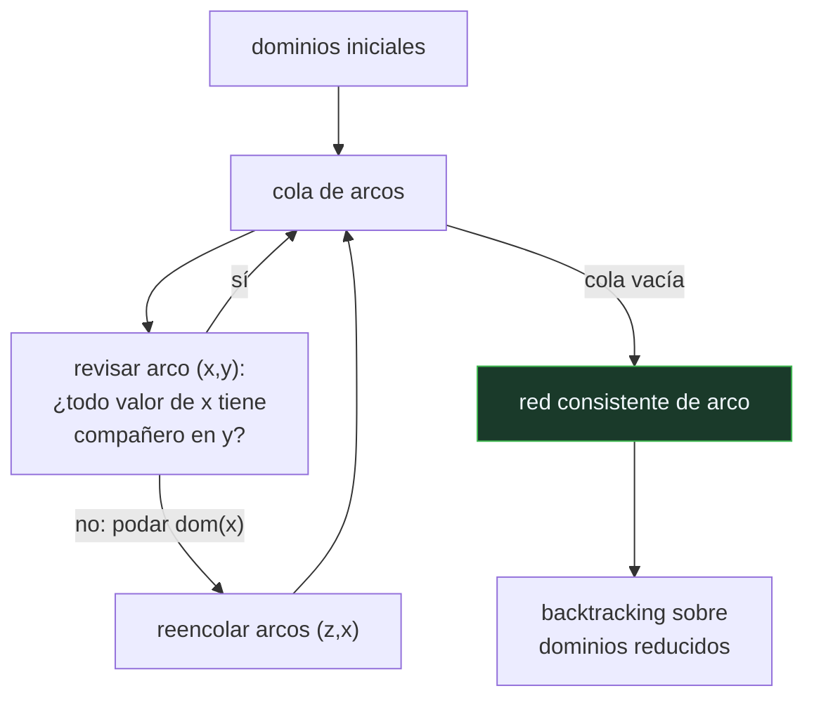

# P70 — Consistencia de arco

> Ruta simbólica · Podar antes de buscar. En una red con estructura de árbol, la
> consistencia de arco deja la búsqueda sin un solo retroceso.

**Nivel:** L3 · **Motor:** `arco_consistencia` · **Notebook:** [`P70_arco_consistencia.ipynb`](../../../notebooks/papers/P70_arco_consistencia.ipynb)
· **Anexo:** [complejidad y coste](../../annexes/A05_COMPLEJIDAD_Y_COSTE.md)

## 1. Identificación

| Campo | Valor |
|---|---|
| **Título original** | *Consistency in Networks of Relations* |
| **Autoría** | Alan K. Mackworth |
| **Año** | 1977 |
| **Venue** | Artificial Intelligence, 8(1), 99–118 |
| **Fuente primaria** | [doi:10.1016/0004-3702(77)90007-8](https://doi.org/10.1016/0004-3702%2877%2990007-8) |
| **Acceso** | Restringido |
| **Fecha de consulta** | 2026-08-17 |

## 2. Problema anterior

El retroceso cronológico descubre lo mismo una y otra vez. Asigna un valor, avanza, choca con
una restricción, retrocede, prueba otro valor, avanza por otra rama y vuelve a chocar con la
misma restricción por la misma razón.

La información —que cierto valor es incompatible con sus vecinos— se halla y se tira en cada rama.
Y como el descubrimiento es **local** —depende solo de un par de variables— no había ninguna razón
para volver a hacerlo.

## 3. Propuesta

Separar la deducción de la búsqueda. Antes de asignar nada, hacer la red **consistente de arco**:

> Un arco `(x, y)` es consistente si todo valor del dominio de `x` tiene al menos un compañero
> legal en el dominio de `y`.

Si un valor de `x` no lo tiene, no puede estar en ninguna solución y se elimina. Eliminarlo puede
hacer inconsistentes otros arcos, así que se repropaga en cascada. Los algoritmos **AC-1, AC-2 y
AC-3** formalizan ese procedimiento con eficiencias crecientes; AC-3 es el que se enseña.

El artículo sitúa además la consistencia de arco dentro de una jerarquía —consistencia de nodo, de
arco, de camino, k-consistencia— con un compromiso claro entre coste de poda y poda conseguida.

## 4. Intuición sin fórmulas

Un sudoku otra vez, pero mirando solo lápices. Antes de escribir ningún número, tachas de cada
casilla los candidatos que ya son imposibles por su fila, su columna o su cuadro. Tachar uno puede
dejar otra casilla con un solo candidato, que a su vez tacha más.

Cuando terminas de tachar, la mayoría de las casillas tiene muy pocas opciones, y escribir es
fácil.

**Dónde deja de funcionar la analogía:** en el sudoku ese proceso a veces resuelve el puzle
entero. En general no: dejar todos los dominios no vacíos no garantiza que exista solución.

## 5. Matemática mínima

```text
Arco (x, y) consistente ⟺ ∀a ∈ dom(x)  ∃b ∈ dom(y) : compatible(a, b)

AC-3:
    cola ← todos los arcos
    mientras la cola no esté vacía:
        (x, y) ← sacar
        si podar dom(x) elimina algo:
            volver a encolar los arcos (z, x) para todo vecino z ≠ y

Coste O(e·d³) con e arcos y d el tamaño de dominio.
```

La miniatura usa una red en cadena: 6 variables, dominio `1..12`, restricción `v(i) − v(i+1) ≥ 2`.

| Medida | Sin AC-3 | Con AC-3 |
|---|---:|---:|
| valores podados antes de buscar | 0 | **60 de 72** |
| nodos visitados | 233 | **7** |
| retrocesos | 226 | **0** |
| solución encontrada | la misma | la misma |

Los cero retrocesos no son suerte: en una red con **estructura de árbol**, la consistencia de arco
garantiza búsqueda sin retroceso. Una cadena es un árbol.

## 6. Arquitectura o flujo



## 7. Qué observar en el paper original

- La **jerarquía de consistencias** y su compromiso: más consistencia poda más y cuesta más. Es
  la decisión de diseño central en cualquier resolvedor de restricciones.
- La evolución **AC-1 → AC-2 → AC-3**: cada uno evita repetir trabajo del anterior. Comparar los
  tres enseña más sobre diseño de algoritmos que muchos capítulos de manual.
- La formulación como **red de relaciones**, deliberadamente general: no es un algoritmo de
  coloreado de mapas, es un marco para restricciones binarias cualesquiera.
- La conexión con el **filtrado de Waltz** en interpretación de escenas, que es el antecedente
  concreto del que sale la generalización.

## 8. Evidencia y resultados

El artículo analiza los algoritmos y su complejidad, y los sitúa dentro de la jerarquía de
consistencias. La evidencia es analítica: cotas de coste y propiedades demostradas.

> El resultado de que la consistencia de arco basta para búsqueda sin retroceso en redes con
> estructura de árbol se formaliza poco después (Freuder, 1982). Aquí está la maquinaria.

La miniatura elige deliberadamente una red en cadena para que la propiedad sea visible y
comprobable: 226 retrocesos frente a 0 no es una diferencia de matiz.

## 9. Impacto

- La propagación de restricciones es el núcleo de todos los resolvedores CP modernos, y AC-3 es
  el algoritmo que se enseña en primer lugar.
- Se usa en producción en planificación de horarios, asignación de recursos, configuración de
  productos y verificación.
- La disciplina de **deducir todo lo posible antes de decidir** es la misma que hace viable
  [DPLL](../P65_dpll/README.md), y aparece en cualquier motor de inferencia serio.
- La jerarquía de consistencias dio lugar a una línea de investigación entera sobre el compromiso
  entre poda y coste, que sigue activa.

## 10. Limitaciones

1. **No decide satisfacibilidad.** Puede dejar todos los dominios no vacíos y que el problema no
   tenga solución: la consistencia local no implica la global.
2. **La propiedad de búsqueda sin retroceso vale para árboles.** En redes con ciclos —el mapa de
   Australia, por ejemplo— ayuda pero no la garantiza.
3. **Coste O(e·d³)**, mejorado después por AC-4 y AC-2001. En problemas donde la poda es escasa,
   el preproceso puede no compensar.
4. **Solo restricciones binarias** en su formulación original. Las n-arias exigen extensiones.
5. **Es preproceso.** Mantener la consistencia *durante* la búsqueda —forward checking, MAC— es
   trabajo posterior y a menudo más eficaz.

## 11. Errores comunes

| Error | Corrección |
|---|---|
| «Si AC-3 deja todos los dominios no vacíos, hay solución» | No. La consistencia de arco es local: garantiza compatibilidad por pares, no globalmente. Puede no haber ninguna solución. |
| «La consistencia de arco puede descartar soluciones» | Nunca. Elimina solo valores que no participan en ninguna solución. La miniatura lo comprueba: las dos búsquedas devuelven la misma. |
| «Más consistencia siempre es mejor» | Cuesta más. La k-consistencia poda más y su coste crece rápido; el punto óptimo depende del problema. |
| «AC-3 resuelve el CSP» | Reduce dominios. Después sigue haciendo falta buscar, salvo que la red sea un árbol y los dominios queden unitarios. |
| «Vale solo para coloreado de mapas» | Está formulado para redes de relaciones binarias cualesquiera. El coloreado es el ejemplo didáctico, no el alcance. |

## 12. Relación con trabajos anteriores

- **Waltz (1972)** — el filtrado de etiquetas en interpretación de escenas: el antecedente
  concreto del que sale la generalización.
- **Montanari (1974)** — redes de restricciones y su formulación algebraica.
- **[P65 DPLL](../P65_dpll/README.md) (1962)** — la misma disciplina de deducir antes de decidir,
  en el caso booleano.

## 13. Relación con trabajos posteriores

- **Freuder (1982)** — redes con estructura de árbol y búsqueda sin retroceso: la formalización de
  la propiedad que exhibe la miniatura.
  [doi:10.1145/322290.322292](https://doi.org/10.1145/322290.322292)
- **Bessière y Régin (2001)** — AC-2001 y el coste óptimo de la consistencia de arco.
  [doi:10.1016/S0004-3702(01)00074-5](https://doi.org/10.1016/S0004-3702%2801%2900074-5)
- **Sabin y Freuder (1994)** — MAC: mantener la consistencia durante la búsqueda, no solo antes.
- **[P68 STRIPS](../P68_strips/README.md) (1971)** — la planificación como problema de
  restricciones es una de las líneas que se abren desde aquí.

## 14. Notebook asociado

[`P70_arco_consistencia.ipynb`](../../../notebooks/papers/P70_arco_consistencia.ipynb)

**Qué implementa:** AC-3 completo sobre una red en cadena, con el conteo de revisiones de arco y valores podados, y la comparación de nodos y retrocesos del backtracking con y sin poda previa.

**Qué NO implementa:** no hay jerarquía de consistencias (nodo, camino, k-consistencia), ni mantenimiento durante la búsqueda, ni restricciones n-arias. La red es un árbol para que la propiedad se vea.

```bash
ai-evolution paper-lab P70 --seed 7
```

## 15. Actividades Bloom

| Nivel | Actividad |
|---|---|
| **Recordar** | Define cuándo un arco es consistente. |
| **Explicar** | Explica por qué eliminar un valor obliga a reencolar otros arcos. |
| **Aplicar** | Ejecuta el notebook y observa los dominios que quedan tras AC-3. |
| **Analizar** | Analiza por qué el retroceso baja de 226 a 0 en esta red. |
| **Evaluar** | «Si todos los dominios quedan llenos, hay solución». Evalúa la afirmación. |
| **Crear** | Modela el coloreado del mapa de Australia y comprueba que ahí la poda ayuda menos; explica por qué. |

## 16. Autoevaluación

1. ¿Qué es la consistencia de arco?
2. ¿Por qué hay que repropagar tras podar un valor?
3. ¿Descarta AC-3 alguna solución?
4. ¿Decide AC-3 si el problema es satisfacible?
5. ¿Qué propiedad especial tienen las redes con estructura de árbol?
6. ¿Cuál es el coste de AC-3?
7. ¿Qué diferencia hay entre podar antes y podar durante la búsqueda?

## 17. Respuestas esperadas

1. Que todo valor del dominio de una variable tenga al menos un compañero legal en el dominio de cada vecina. Si no lo tiene, ese valor no puede estar en ninguna solución.
2. Porque eliminar un valor de `dom(x)` puede dejar sin compañero a valores de las vecinas de `x`. El efecto se propaga en cascada, y por eso se reencolan los arcos `(z, x)`.
3. Nunca. Solo elimina valores que no participan en ninguna solución, y por eso el conjunto de soluciones no cambia.
4. No. Es una condición **local**: puede dejar todos los dominios no vacíos y que el problema sea insatisfacible. Consistencia local no implica consistencia global.
5. Que si la red es consistente de arco, la búsqueda puede completarse sin un solo retroceso. En la miniatura eso se comprueba: 0 retrocesos frente a 226.
6. O(e·d³) con `e` arcos y `d` el tamaño de dominio. AC-4 y AC-2001 lo mejoran.
7. Podar antes es preproceso: se hace una vez y sirve para toda la búsqueda. Mantener la consistencia durante —forward checking, MAC— cuesta en cada nodo pero poda con la información de las asignaciones ya hechas, y suele compensar.

## 18. Fuentes primarias

- Mackworth, A. K. (1977). *Consistency in Networks of Relations*. **Artificial Intelligence**,
  8(1), 99–118. [doi:10.1016/0004-3702(77)90007-8](https://doi.org/10.1016/0004-3702%2877%2990007-8) ·
  consultado 2026-08-17.
- Freuder, E. (1982). *A Sufficient Condition for Backtrack-Free Search*.
  [doi:10.1145/322290.322292](https://doi.org/10.1145/322290.322292) · consultado 2026-08-17.
- Bessière, C. y Régin, J.-C. (2001). *Refining the basic constraint propagation algorithm*.
  [doi:10.1016/S0004-3702(01)00074-5](https://doi.org/10.1016/S0004-3702%2801%2900074-5) ·
  consultado 2026-08-17.

---

[⬅️ Anterior: P69 Factores de certeza](../P69_mycin/README.md) ·
[📇 Índice](../../catalog/PAPERS_INDEX.md) ·
[📝 Evaluación](../../../assessments/papers/P70_arco_consistencia.md) ·
[🏫 Clase 018 · Problemas de satisfacción de restricciones](../../../classes/part-01-symbolic-ai-search-logic-and-planning/018-problemas-de-satisfaccion-de-restricciones/README.md) ·
[➡️ Siguiente: P71 Ontologías](../P71_ontologia/README.md)
