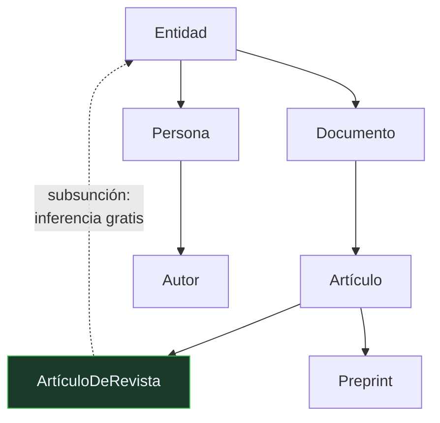

# P71 — Ontologías

> Ruta simbólica · Una ontología no describe el mundo: fija qué se acuerda decir de él.
> La definición que se sigue citando, y cinco criterios para juzgar una.

**Nivel:** L1 · **Motor:** `ontologia` · **Notebook:** [`P71_ontologia.ipynb`](../../../notebooks/papers/P71_ontologia.ipynb)
· **Anexo:** [complejidad y coste](../../annexes/A05_COMPLEJIDAD_Y_COSTE.md)

## 1. Identificación

| Campo | Valor |
|---|---|
| **Título original** | *A Translation Approach to Portable Ontology Specifications* |
| **Autoría** | Thomas R. Gruber |
| **Año** | 1993 |
| **Venue** | Knowledge Acquisition, 5(2), 199–220 |
| **Fuente primaria** | [doi:10.1006/knac.1993.1008](https://doi.org/10.1006/knac.1993.1008) |
| **Acceso** | Restringido |
| **Fecha de consulta** | 2026-08-17 |

## 2. Problema anterior

A principios de los noventa había muchas bases de conocimiento y ninguna se entendía con otra.
Dos sistemas podían usar el término «documento» y designar cosas distintas; uno contaba los
borradores y el otro no.

El problema no se arregla traduciendo símbolos: no es de sintaxis. Es que cada sistema arrastra
una **conceptualización** implícita —qué entidades existen y cómo se relacionan— que nadie ha
escrito en ninguna parte. Sin hacerla explícita, compartir conocimiento entre sistemas es
imposible por construcción.

## 3. Propuesta

La definición que se sigue citando treinta años después:

> Una ontología es una **especificación explícita de una conceptualización**.

Con dos consecuencias que el artículo desarrolla. Primera: adoptar una ontología es asumir un
**compromiso ontológico** — comprometerse a usar los términos de forma consistente con lo
declarado. No es un diccionario descriptivo, es un acuerdo vinculante entre agentes.

Segunda: una ontología se puede juzgar. Gruber propone **cinco criterios de diseño**: claridad,
coherencia, extensibilidad, sesgo de codificación mínimo y compromiso ontológico mínimo. El
último es el más contraintuitivo: hay que afirmar **lo menos posible** sobre el mundo modelado,
para dejar libertad a quien la adopte.

## 4. Intuición sin fórmulas

Dos departamentos que reportan «ventas del trimestre» y dan cifras distintas. Nadie ha cometido
un error de cálculo: uno cuenta el pedido cuando se firma y el otro cuando se cobra.

Arreglarlo no es revisar las hojas de cálculo. Es acordar por escrito qué cuenta como venta —y ese
acuerdo, no la descripción de la realidad, es la ontología.

**Dónde deja de funcionar la analogía:** el acuerdo entre departamentos se puede renegociar cada
trimestre. Una ontología compartida entre sistemas que ya han indexado millones de registros no,
y por eso el criterio de compromiso mínimo importa tanto.

## 5. Matemática mínima

No hay formalismo propio: el artículo trabaja sobre lógica de primer orden y se apoya en la
**subsunción**, que da inferencia sin coste.

```text
Jerarquía:  ArtículoDeRevista ⊑ Artículo ⊑ Documento ⊑ Entidad

Declarar:   tipo(P08) = ArtículoDeRevista
Se infiere: P08 es Artículo, Documento y Entidad     ← 3 hechos que nadie escribió
```

Y el punto que la miniatura hace visible: dos agentes con conceptualizaciones distintas del mismo
término responden distinto a la misma pregunta sobre el mismo corpus.

| Agente | «Publicación» incluye | Publicaciones contadas |
|---|---|---:|
| A | solo artículos de revista | **1** |
| B | artículos de revista y preprints | **2** |

Ninguno se equivoca. No hay error de datos: hay compromisos distintos, y por eso hay que
declararlos.

## 6. Arquitectura o flujo



## 7. Qué observar en el paper original

- La **definición** en su formulación original, y el cuidado con la palabra «conceptualización»:
  no es el mundo, es una forma de verlo.
- Los **cinco criterios**, que son la parte directamente aplicable y siguen siendo el checklist
  con el que se revisa un esquema hoy.
- El argumento del **compromiso ontológico mínimo**: cuanto menos afirme una ontología, más
  sistemas podrán adoptarla. Es contraintuitivo y es la clave de la portabilidad.
- El **enfoque de traducción** que da título al artículo: en vez de imponer un formalismo, definir
  la ontología de modo que se pueda traducir a varios.

## 8. Evidencia y resultados

Es un artículo conceptual y metodológico, con ejemplos del proyecto Ontolingua. No hay
experimentos ni medición.

> Su fuerza es la calidad de las distinciones. Un artículo así se juzga por si sus conceptos
> siguen sirviendo décadas después, y estos sirven.

La miniatura de este eje no reproduce nada del artículo: construye una jerarquía pequeña para
exhibir la inferencia por subsunción y el desacuerdo entre dos compromisos distintos.

## 9. Impacto

- Su definición es la más citada del área y la que aparece en cualquier introducción a la
  representación del conocimiento.
- Es antecedente directo de **RDF**, **OWL** y toda la web semántica.
- Los cinco criterios se siguen usando para revisar esquemas de datos, vocabularios controlados y
  taxonomías de producto.
- El problema que plantea reaparece intacto en la ingeniería actual: el esquema de una API, el
  contrato de una herramienta de agente y el vocabulario de un índice para
  [RAG](../P11_rag/README.md) son ontologías, se llamen así o no.

## 10. Limitaciones

1. **No dice cómo construir una buena ontología.** Da criterios para juzgarla, que es distinto y
   más fácil.
2. **El coste de mantenimiento es el límite real.** Una ontología viva hay que actualizarla, y esa
   es la razón por la que muchas iniciativas grandes se abandonaron.
3. **Los criterios pueden entrar en conflicto.** Claridad y compromiso mínimo tiran en direcciones
   opuestas, y el artículo no da regla de arbitraje.
4. **Es anterior a RDF y OWL**: su contexto técnico es el de compartir conocimiento entre sistemas
   de IA de los noventa.
5. **El acuerdo entre partes es un problema social**, no técnico. Ninguna definición formal obliga
   a nadie a adoptarla.

## 11. Errores comunes

| Error | Corrección |
|---|---|
| «Una ontología es un diccionario de términos» | Un diccionario recoge cómo se usa una palabra. Una ontología decide qué se va a decir con ella y compromete a quien la adopta. |
| «Una ontología describe la realidad» | Describe una **conceptualización** de la realidad. Dos ontologías correctas pueden ser incompatibles y ninguna estar equivocada. |
| «Cuanto más detallada, mejor» | El criterio de compromiso ontológico mínimo dice lo contrario: cuanto menos afirme, más sistemas podrán adoptarla sin conflicto. |
| «Es lo mismo que una taxonomía» | Una taxonomía es una jerarquía de clases. Una ontología añade relaciones, restricciones y axiomas, y con ellos capacidad de inferencia. |
| «Es un concepto de los noventa ya superado» | El esquema de una API, el contrato de una herramienta de agente y el vocabulario de un índice de recuperación son ontologías. El nombre cambió; el problema no. |

## 12. Relación con trabajos anteriores

- **[P66 Resolución](../P66_resolucion/README.md) (1965)** — la maquinaria de inferencia sobre la
  que estas representaciones razonan.
- **Brachman y Schmolze (1985)** — KL-ONE y las lógicas descriptivas: la formalización de la
  subsunción.
- **Miller (1995)** — WordNet: una conceptualización léxica a gran escala, contemporánea y de otro
  estilo.

## 13. Relación con trabajos posteriores

- **Berners-Lee, Hendler y Lassila (2001)** — la web semántica: esta idea a escala de la web.
  [doi:10.1038/scientificamerican0501-34](https://doi.org/10.1038/scientificamerican0501-34)
- **W3C (2012)** — OWL 2: el estándar que materializa buena parte de la propuesta.
  [OWL 2 Overview](https://www.w3.org/TR/owl2-overview/)
- **[P11 RAG](../P11_rag/README.md) (2020)** — el problema del vocabulario compartido reaparece en
  cómo se indexa y se recupera.
- **[P72 Neuro-simbólico](../P72_neurosimbolico/README.md) (2020)** — las restricciones que aporta
  el lado simbólico salen de una ontología, explícita o no.

## 14. Notebook asociado

[`P71_ontologia.ipynb`](../../../notebooks/papers/P71_ontologia.ipynb)

**Qué implementa:** una jerarquía de siete clases con inferencia por subsunción, los cinco criterios de diseño, y el caso de dos agentes que cuentan distinto sobre el mismo corpus por tener compromisos distintos.

**Qué NO implementa:** no hay razonador de lógica descriptiva, ni propiedades, ni restricciones, ni disyunciones. La subsunción se calcula recorriendo un árbol.

```bash
ai-evolution paper-lab P71 --seed 7
```

## 15. Actividades Bloom

| Nivel | Actividad |
|---|---|
| **Recordar** | Escribe la definición de ontología del artículo. |
| **Explicar** | Explica qué es un compromiso ontológico. |
| **Aplicar** | Ejecuta el notebook y añade una clase nueva a la jerarquía. |
| **Analizar** | Analiza por qué el criterio de compromiso mínimo favorece la portabilidad. |
| **Evaluar** | «Los dos agentes no pueden tener razón a la vez». Evalúa la afirmación. |
| **Crear** | Escribe la ontología mínima de un dominio que conozcas y pásale los cinco criterios. |

## 16. Autoevaluación

1. ¿Cuál es la definición de ontología del artículo?
2. ¿Qué es un compromiso ontológico?
3. ¿Cuáles son los cinco criterios de diseño?
4. ¿Por qué el compromiso mínimo es deseable?
5. ¿Qué aporta la subsunción?
6. ¿Puede haber dos ontologías incompatibles y ambas correctas?
7. ¿Dónde vive este problema en la ingeniería actual?

## 17. Respuestas esperadas

1. Una especificación explícita de una conceptualización. Explícita porque está escrita, y de una conceptualización porque es una forma de ver el dominio, no el dominio.
2. El acuerdo de usar los términos de forma consistente con lo declarado. Adoptar una ontología obliga; no es una descripción que se pueda tomar o dejar según convenga.
3. Claridad, coherencia, extensibilidad, sesgo de codificación mínimo y compromiso ontológico mínimo.
4. Porque cuanto menos afirme la ontología sobre el mundo, más sistemas podrán adoptarla sin entrar en conflicto con sus propios supuestos. Es la condición de la portabilidad.
5. Inferencia sin coste: declarar que algo pertenece a una clase implica automáticamente todas sus superclases. En la miniatura, una declaración produce tres hechos que nadie escribió.
6. Sí. Dos conceptualizaciones distintas del mismo dominio pueden ser ambas coherentes y dar respuestas distintas a la misma pregunta. Por eso el artículo insiste en declarar el compromiso.
7. En los esquemas de API, en los contratos de herramientas de agentes y en el vocabulario con el que se indexa un corpus para recuperación. Son ontologías aunque no se llamen así.

## 18. Fuentes primarias

- Gruber, T. R. (1993). *A Translation Approach to Portable Ontology Specifications*.
  **Knowledge Acquisition**, 5(2), 199–220.
  [doi:10.1006/knac.1993.1008](https://doi.org/10.1006/knac.1993.1008) · consultado 2026-08-17.
- Berners-Lee, T., Hendler, J. y Lassila, O. (2001). *The Semantic Web*.
  [doi:10.1038/scientificamerican0501-34](https://doi.org/10.1038/scientificamerican0501-34) ·
  consultado 2026-08-17.
- W3C (2012). *OWL 2 Web Ontology Language Document Overview*.
  [w3.org/TR/owl2-overview](https://www.w3.org/TR/owl2-overview/) · consultado 2026-08-17.

---

[⬅️ Anterior: P70 Consistencia de arco](../P70_arco_consistencia/README.md) ·
[📇 Índice](../../catalog/PAPERS_INDEX.md) ·
[📝 Evaluación](../../../assessments/papers/P71_ontologia.md) ·
[🏫 Clase 021 · Representación del conocimiento y ontologías](../../../classes/part-01-symbolic-ai-search-logic-and-planning/021-representacion-del-conocimiento-y-ontologias/README.md) ·
[➡️ Siguiente: P72 Neuro-simbólico](../P72_neurosimbolico/README.md)
