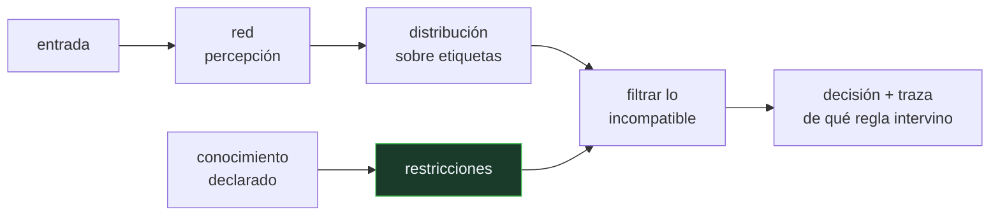

# P72 — Neuro-simbólico

> Ruta simbólica · La percepción estima y los símbolos restringen. Una hoja de ruta
> abierta, no un método cerrado: se lee con fecha.

**Nivel:** L5 · **Motor:** `neurosimbolico` · **Notebook:** [`P72_neurosimbolico.ipynb`](../../../notebooks/papers/P72_neurosimbolico.ipynb)
· **Anexo:** [probabilidad y verosimilitud](../../annexes/A02_PROBABILIDAD_Y_VEROSIMILITUD.md)

> [!WARNING]
> Esta ficha es de **frontera**: el artículo es un manifiesto y una agenda de
> investigación, no un método con resultados comparables. Lo estable son las preguntas;
> lo inestable, los sistemas concretos de cada temporada. Última revisión: **2026-08-17**.

## 1. Identificación

| Campo | Valor |
|---|---|
| **Título original** | *Neurosymbolic AI: The 3rd Wave* |
| **Autoría** | Artur d'Avila Garcez, Luis C. Lamb |
| **Año** | 2020 |
| **Venue** | arXiv:2012.05876 · Artificial Intelligence Review (2023) |
| **Fuente primaria** | [arXiv:2012.05876](https://arxiv.org/abs/2012.05876) |
| **Acceso** | Abierto |
| **Fecha de consulta** | 2026-08-17 |

## 2. Problema anterior

Las dos tradiciones tienen exactamente el punto ciego de la otra.

Las redes profundas aprenden de datos ruidosos y generalizan, pero no razonan con reglas, no
respetan restricciones duras que nadie les ha enseñado con ejemplos, y no pueden explicar por qué
concluyeron lo que concluyeron.

Los sistemas simbólicos —los de esta ruta entera— razonan, respetan restricciones y explican cada
paso, pero necesitan que alguien escriba el conocimiento a mano y se rompen ante la entrada
ruidosa que constituye el mundo real.

Elegir uno de los dos ha sido la historia del campo. La pregunta es si hay que elegir.

## 3. Propuesta

No un método: una **agenda**. El artículo ordena los requisitos que debería cumplir un sistema
que integre ambas tradiciones y revisa qué líneas los abordan:

- **representación**: cómo conviven vectores densos y estructuras simbólicas;
- **aprendizaje**: cómo se aprende de datos sin perder las restricciones declaradas;
- **razonamiento**: cómo se aplican reglas sobre representaciones aprendidas;
- **explicación**: cómo se justifica una conclusión en términos que una persona pueda auditar.

Y una tesis de fondo: la integración no es una media entre dos sistemas, sino una **división del
trabajo** — la percepción estima y los símbolos restringen.

## 4. Intuición sin fórmulas

Un radiólogo con un protocolo. La vista entrenada detecta la anomalía; el protocolo dice que
ciertas combinaciones son imposibles y que ciertos hallazgos obligan a una prueba adicional.

El protocolo no ve nada. La vista no conoce el protocolo. El sistema es la composición, y su valor
depende de que el protocolo sea correcto.

**Dónde deja de funcionar la analogía:** el radiólogo puede ignorar el protocolo cuando ve algo
que no encaja. Un filtro simbólico duro no puede: si la regla es falsa, la conclusión correcta
queda descartada sin recurso. Por eso las reglas tienen que ser auditables.

## 5. Matemática mínima

No hay formalismo único: eso es parte de lo que el artículo señala como problema abierto. La
miniatura usa la integración más simple posible —filtrar el espacio de salida— para exhibir la
asimetría que importa:

```text
percepción  → distribución sobre etiquetas
restricción → elimina las etiquetas incompatibles con el contexto
decisión    → argmax sobre lo que queda
```

Con la regla `escena(salón) ∧ etiqueta(x, coche) → ⊥`:

| Escena | ¿Vale la regla? | Solo percepción | Con la regla |
|---|:--:|---:|---:|
| salón | sí | 2 de 4 | **4 de 4** |
| garaje | no | 2 de 2 | **0 de 2** |

Ahí está todo. El conocimiento simbólico correcto corrige errores que la red comete **con
confianza** —0,55 y 0,48 en los dos casos del salón—. El conocimiento simbólico incorrecto no
degrada un poco: destruye.

<!-- puente:inicio -->
> [!TIP]
> **Puente matemático.** Esta sección da por sabido lo siguiente. Si algo no te suena,
> léelo primero: está explicado una sola vez, en un solo sitio, y sirve para todas las fichas.

| Dónde | Qué necesitas de ahí |
|---|---|
| [**A02 §1** · Softmax](../../annexes/A02_PROBABILIDAD_Y_VEROSIMILITUD.md#1-softmax) | de dónde sale la distribución sobre etiquetas que la restricción filtra |
<!-- puente:fin -->

## 6. Arquitectura o flujo



## 7. Qué observar en el paper original

- Que es un **manifiesto**: no hay tabla de resultados que reproducir ni benchmark que superar.
  Leerlo esperando eso lleva a descartarlo injustamente.
- La **taxonomía de integraciones** que revisa, desde el acoplamiento débil —dos sistemas que se
  pasan resultados— hasta la incorporación de restricciones dentro de la función de pérdida.
- La insistencia en la **explicación** como requisito, no como añadido. Es la herencia directa de
  [MYCIN](../P69_mycin/README.md).
- La conexión con la **composicionalidad** y la generalización sistemática, que es el argumento
  técnico más fuerte a favor de la hibridación.

## 8. Evidencia y resultados

El artículo revisa literatura y propone una agenda. No presenta experimentos propios ni
comparaciones cuantitativas.

> Como todo texto de frontera, su valor está en las preguntas que ordena, y su fecha importa: los
> sistemas concretos que cita envejecen rápido, la estructura del problema no.

La miniatura de este eje no reproduce ningún sistema del artículo. Construye el caso mínimo —una
distribución y una restricción— para que se vea con números la asimetría entre el beneficio de una
regla correcta y el coste de una incorrecta.

## 9. Impacto

- Dio nombre y estructura a una comunidad que estaba dispersa, con conferencia propia y una
  agenda compartida.
- Su vocabulario —la «tercera ola»— se usa hoy para situar trabajos que combinan modelos de
  lenguaje con verificadores, motores de reglas o solucionadores.
- El patrón que describe está en producción sin llamarse así: un modelo genera y un verificador
  externo comprueba. [SWE-bench](../P51_swebench/README.md) evalúa exactamente eso, y el uso de
  herramientas de [Toolformer](../P14_toolformer/README.md) en adelante es la misma división del
  trabajo.
- Para el programa cierra la ruta simbólica con la pregunta correcta: no cuál de las dos
  tradiciones ganó, sino cómo se combinan y qué se paga.

## 10. Limitaciones

1. **No es un método.** No se puede implementar «lo que dice el artículo»: hay que elegir una de
   las líneas que revisa.
2. **No hay evaluación comparativa.** Sin benchmarks compartidos, es difícil saber qué enfoque de
   integración funciona mejor y en qué.
3. **El conocimiento simbólico sigue siendo caro de obtener**, que es exactamente el cuello de
   botella que hundió a los sistemas expertos.
4. **Una restricción incorrecta destruye.** La miniatura lo cuantifica: 2 de 2 a 0 de 2. El
   enfoque exige garantías sobre el conocimiento declarado.
5. **Es texto de frontera y envejece.** Debe releerse con fecha, y el propio programa lo trata
   como nodo revisable.

## 11. Errores comunes

| Error | Corrección |
|---|---|
| «El artículo demuestra que el enfoque neuro-simbólico funciona mejor» | No demuestra nada: es una hoja de ruta. No contiene experimentos ni comparaciones. |
| «Integrar es hacer una media entre las dos salidas» | La tesis es una división del trabajo: la percepción estima y los símbolos restringen. No son dos opiniones que se promedien. |
| «Añadir reglas solo puede mejorar» | Una regla falsa descarta la conclusión correcta sin recurso. La miniatura pasa de 2 de 2 a 0 de 2 con una sola regla mal aplicada. |
| «Es una vuelta a los sistemas expertos» | Comparte la exigencia de explicabilidad, pero no la de escribir todo el conocimiento: la percepción se aprende de datos. |
| «Es un enfoque marginal» | El patrón está en producción: un modelo genera y un verificador externo comprueba. Se llame o no neuro-simbólico, es la misma estructura. |

## 12. Relación con trabajos anteriores

- **[P69 Factores de certeza](../P69_mycin/README.md) (1975)** — la explicabilidad como requisito
  de aceptación, que este artículo recupera.
- **[P58 Símbolos y búsqueda](../P58_simbolos_y_busqueda/README.md) (1976)** — la hipótesis
  simbólica que el aprendizaje profundo puso en cuestión.
- **Garcez, Broda y Gabbay (2002)** — *Neural-Symbolic Learning Systems*: la línea previa de los
  mismos autores.

## 13. Relación con trabajos posteriores

- **Manhaeve et al. (2018)** — DeepProbLog: lógica probabilística diferenciable, una de las
  integraciones concretas que el artículo revisa. [arXiv:1805.10872](https://arxiv.org/abs/1805.10872)
- **[P14 Toolformer](../P14_toolformer/README.md) (2023)** — el modelo aprende a delegar en
  sistemas externos: la división del trabajo, aprendida.
- **[P29 Árbol de pensamientos](../P29_tree_of_thoughts/README.md) (2023)** — búsqueda simbólica
  sobre generación neuronal.
- **[P51 SWE-bench](../P51_swebench/README.md) (2023)** — verificación externa y ejecutable de lo
  que un modelo produce.

## 14. Notebook asociado

[`P72_neurosimbolico.ipynb`](../../../notebooks/papers/P72_neurosimbolico.ipynb)

**Qué implementa:** el filtrado de una distribución de percepción por una restricción de contexto, en dos escenas: una donde la regla vale y otra donde no, con la ganancia y el coste medidos.

**Qué NO implementa:** no hay ninguna red, ni entrenamiento, ni imágenes, ni integración en la pérdida o en la arquitectura, que es donde está la dificultad real del enfoque.

```bash
ai-evolution paper-lab P72 --seed 7
```

## 15. Actividades Bloom

| Nivel | Actividad |
|---|---|
| **Recordar** | Enumera los cuatro requisitos que el artículo pide a un sistema integrado. |
| **Explicar** | Explica la división del trabajo entre percepción y símbolos. |
| **Aplicar** | Ejecuta el notebook e identifica los dos objetos que la regla corrige. |
| **Analizar** | Analiza por qué una restricción incorrecta destruye en vez de degradar. |
| **Evaluar** | «Añadir conocimiento del dominio solo puede ayudar». Evalúa la afirmación. |
| **Crear** | Aplica dos restricciones de dominio sobre las salidas de un clasificador tuyo, mide la ganancia y busca deliberadamente un caso donde la restricción sea falsa. |

## 16. Autoevaluación

1. ¿Qué punto ciego tiene cada tradición?
2. ¿Qué tipo de texto es este artículo?
3. ¿En qué consiste la división del trabajo que propone?
4. ¿Qué pasa cuando la restricción simbólica es correcta?
5. ¿Y cuando es falsa?
6. ¿Cuál sigue siendo el cuello de botella del enfoque?
7. ¿Dónde está este patrón en producción hoy?

## 17. Respuestas esperadas

1. Las redes aprenden de datos ruidosos pero no razonan con reglas ni explican. Los sistemas simbólicos razonan y explican pero necesitan el conocimiento escrito a mano y se rompen con entrada ruidosa.
2. Un manifiesto y una hoja de ruta. No contiene experimentos, resultados ni comparaciones: ordena requisitos y revisa líneas de trabajo.
3. La percepción estima —devuelve una distribución sobre posibilidades— y los símbolos restringen —eliminan lo incompatible con el conocimiento declarado—. No es un promedio entre dos opiniones.
4. Corrige errores que la red comete con confianza. En la miniatura, la escena del salón pasa de 2 de 4 a 4 de 4 sin reentrenar nada.
5. Descarta la conclusión correcta sin recurso. En el garaje, la misma regla lleva el resultado de 2 de 2 a 0 de 2. Por eso las reglas deben estar declaradas y ser auditables.
6. Obtener y mantener el conocimiento simbólico: el mismo cuello de botella que hundió a los sistemas expertos en los ochenta.
7. En cualquier arquitectura donde un modelo genera y un verificador externo comprueba: ejecución de tests, comprobadores de tipos, solucionadores, validación de esquemas.

## 18. Fuentes primarias

- Garcez, A. d'A. y Lamb, L. C. (2020). *Neurosymbolic AI: The 3rd Wave*.
  [arXiv:2012.05876](https://arxiv.org/abs/2012.05876) · publicado en **Artificial Intelligence
  Review** (2023) · consultado 2026-08-17.
- Manhaeve, R. et al. (2018). *DeepProbLog: Neural Probabilistic Logic Programming*.
  [arXiv:1805.10872](https://arxiv.org/abs/1805.10872) · consultado 2026-08-17.
- Marcus, G. (2020). *The Next Decade in AI: Four Steps Towards Robust Artificial Intelligence*.
  [arXiv:2002.06177](https://arxiv.org/abs/2002.06177) · consultado 2026-08-17.

---

[⬅️ Anterior: P71 Ontologías](../P71_ontologia/README.md) ·
[📇 Índice](../../catalog/PAPERS_INDEX.md) ·
[📝 Evaluación](../../../assessments/papers/P72_neurosimbolico.md) ·
[🏫 Clase 024 · Proyecto: asistente neuro-simbólico explicable](../../../classes/part-01-symbolic-ai-search-logic-and-planning/024-proyecto-asistente-neuro-simbolico-explicable/README.md) ·
[➡️ Siguiente: P73 k-medias](../P73_kmeans/README.md)
