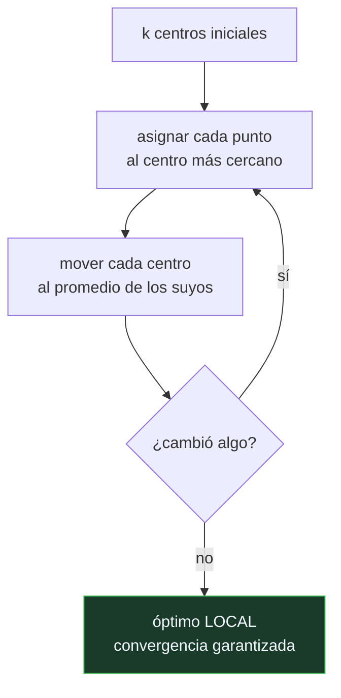

# P73 — k-medias

> Ruta clásica · Dos pasos que se alternan y siempre terminan. Terminar no es acertar:
> converge a un óptimo local, y con qué arranque se decide el resultado.

**Nivel:** L2 · **Motor:** `kmeans` · **Notebook:** [`P73_kmeans.ipynb`](../../../notebooks/papers/P73_kmeans.ipynb)
· **Anexo:** [álgebra y geometría](../../annexes/A01_ALGEBRA_Y_GEOMETRIA.md)

## 1. Identificación

| Campo | Valor |
|---|---|
| **Título original** | *Least Squares Quantization in PCM* |
| **Autoría** | Stuart P. Lloyd |
| **Año** | 1982 |
| **Venue** | IEEE Transactions on Information Theory, 28(2), 129–137 · manuscrito de 1957 |
| **Fuente primaria** | [doi:10.1109/TIT.1982.1056489](https://doi.org/10.1109/TIT.1982.1056489) |
| **Acceso** | Restringido |
| **Fecha de consulta** | 2026-08-17 |

## 2. Problema anterior

Transmitir una señal continua por un canal digital exige representarla con un número finito de
niveles. Elegir esos niveles minimizando el error cuadrático es un problema de optimización
combinatorio: hay que decidir a la vez dónde poner los representantes y qué puntos van con cada
uno, y las dos decisiones dependen entre sí.

La solución exacta exige recorrer todas las particiones posibles. Para cualquier tamaño realista
eso es inabordable.

## 3. Propuesta

Alternar las dos decisiones, resolviendo cada una de forma óptima dada la otra:

1. **asignar**: cada punto va con el representante más cercano;
2. **mover**: cada representante se coloca en el centro de los puntos que le tocaron.

Ambos pasos reducen el error cuadrático total —o lo dejan igual—, y el número de asignaciones
posibles es finito. De ahí sale la demostración de convergencia: el algoritmo **termina siempre**.

Lo que no demuestra —y el artículo no lo pretende— es que termine en el óptimo global.

## 4. Intuición sin fórmulas

Repartir k tiendas por una ciudad. Cada vecino compra en la más cercana; cada tienda se muda al
centro de su clientela. Cuando nadie cambia de tienda y ninguna se mueve, has terminado.

Y si empiezas colocando las tiendas en otro sitio, puedes acabar en un reparto distinto, también
estable, también peor.

**Dónde deja de funcionar la analogía:** las tiendas tienen costes y los vecinos preferencias. Aquí
solo hay distancia euclídea, y eso implica un supuesto fuerte: que los grupos son aproximadamente
esféricos y de tamaño parecido.

## 5. Matemática mínima

```text
Inercia:  J = Σ_i ‖xᵢ − c(xᵢ)‖²

Paso de asignación : c(xᵢ) ← argmin_j ‖xᵢ − cⱼ‖        → J no sube
Paso de movimiento : cⱼ ← media de los xᵢ asignados a j → J no sube

J no sube nunca + hay un número finito de asignaciones ⟹ el algoritmo TERMINA
```

La miniatura ejecuta ocho arranques aleatorios sobre los mismos doce puntos:

| Magnitud | Valor |
|---|---:|
| pasos hasta converger | 3 |
| inercias finales distintas | **2** |
| mejor inercia | 1,4125 |
| peor inercia | 61,5854 |

Y la inercia por k: `[167,88 · 61,87 · 1,41 · 1,12 · 0,68]` para k = 1, 2, 3, 4, 6. **Decrece
siempre**, y por eso no sirve para elegir k.

<!-- puente:inicio -->
> [!TIP]
> **Puente matemático.** Esta sección da por sabido lo siguiente. Si algo no te suena,
> léelo primero: está explicado una sola vez, en un solo sitio, y sirve para todas las fichas.

| Dónde | Qué necesitas de ahí |
|---|---|
| [**A01 §2** · Norma y coseno](../../annexes/A01_ALGEBRA_Y_GEOMETRIA.md#2-norma-y-coseno) | qué mide la distancia euclídea y qué supone sobre la forma de los grupos |
<!-- puente:fin -->

## 6. Arquitectura o flujo



## 7. Qué observar en el paper original

- El contexto: es un artículo de **cuantización de señales**, no de agrupamiento. El manuscrito es
  de 1957 en los Laboratorios Bell y no se publicó hasta 1982.
- La **demostración de convergencia**, que es corta y depende solo de que ambos pasos no suben el
  error.
- Que el artículo **no propone un método de inicialización**. Ese hueco es el que llena k-means++
  cincuenta años después.
- La condición de optimalidad para el caso continuo —cada representante en el centroide de su
  región y cada frontera equidistante—, que es de donde sale la teselación de Voronoi.

## 8. Evidencia y resultados

El artículo es teórico: demuestra las condiciones necesarias de optimalidad y la convergencia del
procedimiento iterativo, con ejemplos de cuantización escalar.

> No hay evaluación comparativa. En 1957 no existía ni el problema de «agrupamiento» tal como se
> plantea hoy, ni conjuntos de prueba con los que comparar.

La miniatura mide lo que se puede comprobar en un cuaderno y es lo que más importa en la práctica:
que la convergencia no protege del óptimo local, y que la inercia no sirve para elegir k.

## 9. Impacto

- Es, con la regresión, el algoritmo más ejecutado de la historia del análisis de datos. Está en
  todas las bibliotecas y en casi todos los pipelines de exploración.
- Su estructura de **alternar dos pasos, cada uno óptimo dado el otro**, es un patrón que reaparece
  en todas partes: es el esqueleto del algoritmo EM.
- La cuantización que motiva el artículo es hoy una técnica central en compresión de modelos: los
  métodos de cuantificación a 4 y 8 bits de [QLoRA](../P49_qlora/README.md) resuelven el mismo
  problema con otro vocabulario.
- Y sus dos debilidades —inicialización y elección de k— generaron literatura propia durante
  décadas.

## 10. Limitaciones

1. **Óptimo local.** Converger no es acertar: la miniatura obtiene dos resultados muy distintos
   sobre los mismos puntos según el arranque.
2. **La inercia no elige k.** Decrece siempre al aumentar k, con mínimo en un grupo por punto.
3. **Supone grupos esféricos y de tamaño similar**, porque minimiza distancia euclídea al centro.
   Con formas alargadas o anidadas falla y no avisa.
4. **Sensible a la escala.** Una variable con rango numérico grande domina la distancia.
5. **Sensible a valores atípicos**, porque la media lo es. La variante con medianas (k-medoides) es
   más robusta y más cara.

## 11. Errores comunes

| Error | Corrección |
|---|---|
| «Si converge, ha encontrado la mejor solución» | Converge siempre y a un óptimo local. La miniatura muestra inercias finales de 1,41 y 61,59 sobre los mismos datos. |
| «El k óptimo es el que minimiza la inercia» | La inercia decrece siempre al subir k. Su mínimo está en k = n, un grupo por punto. |
| «Da igual la escala de las variables» | La distancia euclídea suma las dimensiones. Una variable en milímetros pesa mil veces más que la misma en metros. |
| «Sirve para cualquier forma de grupo» | Minimiza la distancia al centro: eso presupone grupos convexos y aproximadamente esféricos. Con dos anillos concéntricos falla por completo. |
| «Lo inventó Lloyd en 1982» | El manuscrito es de 1957 y circuló como informe interno; MacQueen le puso el nombre «k-means» en 1967. La publicación llegó veinticinco años después. |

## 12. Relación con trabajos anteriores

- **[P53 PCA](../P53_pca/README.md) (1901)** — la otra forma de resumir: reducir dimensiones en
  vez de agrupar puntos.
- **Steinhaus (1956)** — la formulación del problema de partición óptima, contemporánea e
  independiente.
- **[P55 Shannon](../P55_shannon/README.md) (1948)** — la teoría de la información dentro de la
  cual se plantea la cuantización.

## 13. Relación con trabajos posteriores

- **MacQueen (1967)** — el nombre «k-means» y la variante en línea.
- **Arthur y Vassilvitskii (2007)** — k-means++: una inicialización con garantía de aproximación.
- **[P83 t-SNE](../P83_tsne/README.md) (2008)** — ver la estructura en vez de imponerle k grupos.
- **[P49 QLoRA](../P49_qlora/README.md) (2023)** — la cuantización que motiva este artículo,
  aplicada a los pesos de un modelo de lenguaje.

## 14. Notebook asociado

[`P73_kmeans.ipynb`](../../../notebooks/papers/P73_kmeans.ipynb)

**Qué implementa:** el algoritmo completo con la monotonía de la inercia, ocho arranques aleatorios con sus inercias finales, y la curva de inercia frente a k.

**Qué NO implementa:** no hay k-means++, ni criterios de selección de k (codo, silueta), ni variantes robustas. Tampoco hay datos de alta dimensión, donde la distancia euclídea se comporta peor.

```bash
ai-evolution paper-lab P73 --seed 7
```

## 15. Actividades Bloom

| Nivel | Actividad |
|---|---|
| **Recordar** | Escribe los dos pasos del algoritmo y di qué minimiza cada uno. |
| **Explicar** | Explica por qué el algoritmo termina siempre. |
| **Aplicar** | Ejecuta el notebook y compara el mejor y el peor arranque. |
| **Analizar** | Analiza por qué la inercia no puede usarse para elegir k. |
| **Evaluar** | «El algoritmo convergió, luego el resultado es bueno». Evalúa la afirmación. |
| **Crear** | Aplica k-medias a datos reales con y sin estandarizar, y documenta cuánto cambian los grupos. |

## 16. Autoevaluación

1. ¿Qué minimiza k-medias?
2. ¿Por qué está garantizada la convergencia?
3. ¿Garantiza eso el óptimo global?
4. ¿Por qué no sirve la inercia para elegir k?
5. ¿Qué supone el algoritmo sobre la forma de los grupos?
6. ¿Por qué importa la escala de las variables?
7. ¿De dónde viene el algoritmo?

## 17. Respuestas esperadas

1. La inercia: la suma de distancias al cuadrado de cada punto a su centro asignado.
2. Porque los dos pasos —asignar y mover— nunca aumentan la inercia, y el número de asignaciones posibles es finito. No se puede bajar indefinidamente ni repetir una asignación.
3. No. Garantiza llegar a un óptimo **local**. La miniatura obtiene inercias finales de 1,41 y 61,59 sobre los mismos doce puntos, según el arranque.
4. Porque decrece de forma monótona al aumentar k: su mínimo absoluto está en un grupo por punto, que no es una respuesta útil. El criterio tiene que venir de fuera.
5. Que son aproximadamente esféricos y de tamaño similar, porque minimiza la distancia euclídea al centro. Con grupos alargados o anidados el resultado no significa nada.
6. Porque la distancia euclídea suma las diferencias de todas las dimensiones. Una variable con rango numérico grande domina la asignación sin aportar más información.
7. De un manuscrito de Lloyd de 1957 en los Laboratorios Bell sobre cuantización de señales. Se publicó en 1982; el nombre «k-means» es de MacQueen (1967).

## 18. Fuentes primarias

- Lloyd, S. P. (1982). *Least Squares Quantization in PCM*. **IEEE Transactions on Information
  Theory**, 28(2), 129–137. [doi:10.1109/TIT.1982.1056489](https://doi.org/10.1109/TIT.1982.1056489)
  · consultado 2026-08-17.
- MacQueen, J. (1967). *Some methods for classification and analysis of multivariate observations*.
  [Proyecto Euclid](https://projecteuclid.org/euclid.bsmsp/1200512992) · consultado 2026-08-17.
- Arthur, D. y Vassilvitskii, S. (2007). *k-means++: The Advantages of Careful Seeding*.
  [ACM DL](https://dl.acm.org/doi/10.5555/1283383.1283494) · consultado 2026-08-17.

---

[⬅️ Anterior: P72 Neuro-simbólico](../P72_neurosimbolico/README.md) ·
[📇 Índice](../../catalog/PAPERS_INDEX.md) ·
[📝 Evaluación](../../../assessments/papers/P73_kmeans.md) ·
[🏫 Clase 043 · Clustering y reducción de dimensionalidad](../../../classes/part-03-classical-machine-learning/043-clustering-y-reduccion-de-dimensionalidad/README.md) ·
[➡️ Siguiente: P74 Árboles de decisión](../P74_id3/README.md)
