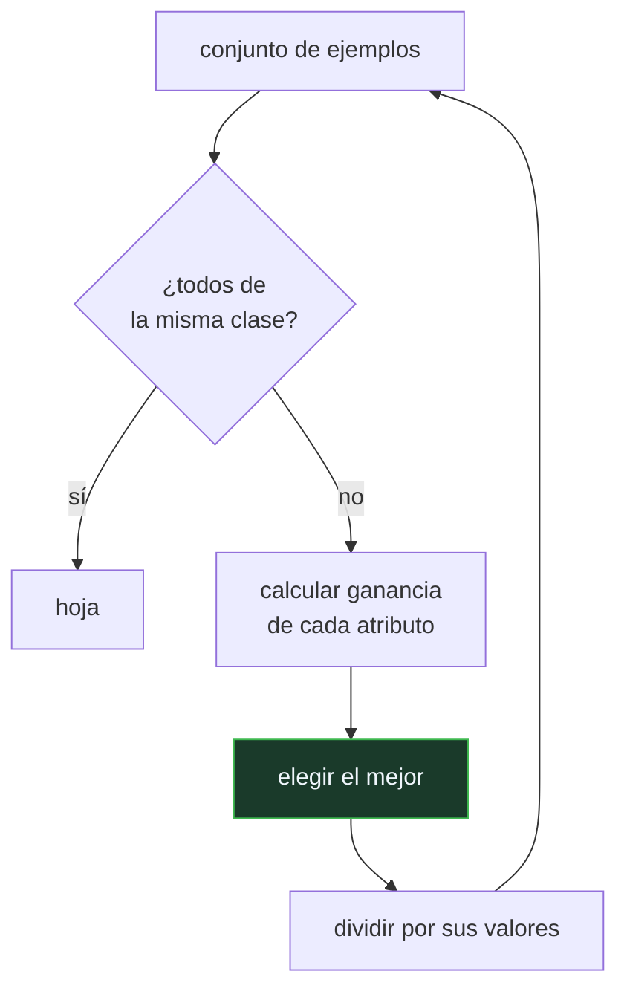

# P74 — Árboles de decisión

> Ruta clásica · Un modelo que una persona puede leer, construido eligiendo en cada nodo
> la pregunta que más incertidumbre elimina. Con un sesgo que el propio autor documenta.

**Nivel:** L2 · **Motor:** `id3` · **Notebook:** [`P74_id3.ipynb`](../../../notebooks/papers/P74_id3.ipynb)
· **Anexo:** [probabilidad y verosimilitud](../../annexes/A02_PROBABILIDAD_Y_VEROSIMILITUD.md)

## 1. Identificación

| Campo | Valor |
|---|---|
| **Título original** | *Induction of Decision Trees* |
| **Autoría** | J. Ross Quinlan |
| **Año** | 1986 |
| **Venue** | Machine Learning, 1(1), 81–106 |
| **Fuente primaria** | [doi:10.1007/BF00116251](https://doi.org/10.1007/BF00116251) |
| **Acceso** | Restringido |
| **Fecha de consulta** | 2026-08-17 |

## 2. Problema anterior

Un clasificador estadístico devuelve un número. En un banco, en un hospital o en un tribunal,
alguien tiene que explicar la decisión, y «el modelo dio 0,73» no es una explicación.

Hacía falta un modelo que se pudiera **leer**: una secuencia de preguntas sobre los datos que
cualquiera pudiera seguir, y un procedimiento automático para construirla a partir de ejemplos, en
lugar de que un experto la escribiera a mano como en [MYCIN](../P69_mycin/README.md).

## 3. Propuesta

Construir el árbol de arriba abajo, y en cada nodo elegir el atributo que más reduce la
incertidumbre sobre la clase. La incertidumbre se mide con la entropía de
[Shannon](../P55_shannon/README.md), y la reducción esperada es la **ganancia de información**.

Quinlan documenta además el problema del criterio: la ganancia prefiere sistemáticamente los
atributos con muchos valores distintos, porque trocear más siempre reduce la entropía residual. Y
propone la corrección: dividir la ganancia por la información de la propia división —la **razón de
ganancia**—.

## 4. Intuición sin fórmulas

El juego de las veinte preguntas. La buena pregunta no es la que te da una respuesta interesante:
es la que parte el espacio de posibilidades por la mitad.

Preguntar «¿es un mamífero?» descarta la mitad del reino animal. Preguntar «¿es un ornitorrinco?»
casi nunca descarta nada — salvo que aciertes.

**Dónde deja de funcionar la analogía:** en las veinte preguntas hay un objetivo único. Aquí hay
catorce ejemplos y el árbol tiene que servir para el ejemplo quince, que no ha visto. Una pregunta
que parte perfectamente los catorce puede no partir nada del futuro: es justo lo que pasa con un
identificador de fila.

## 5. Matemática mínima

```text
Entropía:  H(S) = −Σ_c p_c · log₂ p_c

Ganancia:  G(S, A) = H(S) − Σ_v (|S_v|/|S|) · H(S_v)

Información de la división:  I(S, A) = −Σ_v (|S_v|/|S|) · log₂(|S_v|/|S|)
Razón de ganancia:           GR(S, A) = G(S, A) / I(S, A)
```

Sobre los catorce ejemplos clásicos, ampliados con un atributo «zona» de siete valores y un
identificador de fila:

| Atributo | Valores | Ganancia | Razón de ganancia |
|---|---:|---:|---:|
| cielo | 3 | 0,2467 | **0,1564** |
| humedad | 2 | 0,1518 | 0,1518 |
| viento | 2 | 0,0481 | 0,0488 |
| temperatura | 3 | 0,0292 | 0,0188 |
| zona | 7 | **0,3149** | 0,1144 |
| id | 14 | **0,9403** | 0,2470 |

Dos lecturas. La corrección **funciona** en el caso realista: «zona» gana en ganancia y pierde en
razón de ganancia frente a «cielo». Y **no salva** el caso patológico: con el identificador dentro,
ningún criterio de división lo desbanca.

<!-- puente:inicio -->
> [!TIP]
> **Puente matemático.** Esta sección da por sabido lo siguiente. Si algo no te suena,
> léelo primero: está explicado una sola vez, en un solo sitio, y sirve para todas las fichas.

| Dónde | Qué necesitas de ahí |
|---|---|
| [**A02 §2** · Entropía](../../annexes/A02_PROBABILIDAD_Y_VEROSIMILITUD.md#2-entropía) | qué mide la entropía y por qué su reducción es una buena medida de «cuánto informa» una pregunta |
<!-- puente:fin -->

## 6. Arquitectura o flujo



## 7. Qué observar en el paper original

- La **discusión del sesgo** hacia atributos con muchos valores. Quinlan no lo esconde: lo mide y
  propone la corrección. Es un ejemplo de cómo se documenta un límite.
- El tratamiento de **ruido** y de **atributos irrelevantes**, y los experimentos sobre cuánto
  degrada cada uno.
- La discusión sobre **valores ausentes**, que se completa en C4.5.
- Que el criterio es **voraz**: elegir el mejor atributo en cada nodo no produce el árbol más
  pequeño ni el más exacto. Es una heurística, y el artículo lo dice.

## 8. Evidencia y resultados

Experimentos sobre dominios de la época —incluido el clásico de finales de partida de ajedrez— con
medidas de tamaño del árbol y exactitud, y estudios del efecto del ruido.

> Los conjuntos son pequeños para el estándar actual, y no hay comparación con otras familias de
> clasificadores. Lo que se demuestra es que el procedimiento produce árboles razonables y legibles.

La miniatura reproduce el criterio exacto sobre los catorce ejemplos canónicos y exhibe el sesgo
del criterio con dos casos: uno realista, que la razón de ganancia corrige, y uno patológico, que
no.

## 9. Impacto

- ID3 y su sucesor **C4.5** fueron durante veinte años los clasificadores más usados fuera de la
  academia, y C4.5 encabezó la lista de los diez algoritmos más influyentes de la minería de datos.
- El árbol es la unidad de los dos grandes conjuntos: el **boosting**
  ([P78](../P78_adaboost/README.md)) y los **bosques aleatorios**
  ([P79](../P79_random_forest/README.md)). Todo el dominio actual del gradient boosting sobre datos
  tabulares descansa sobre esta pieza.
- La **interpretabilidad** como requisito de diseño, no como añadido posterior, entra aquí en el
  aprendizaje automático.
- Y aporta un ejemplo metodológico: publicar el sesgo de tu propio criterio junto con el criterio.

## 10. Limitaciones

1. **Sobreajusta si no se poda.** Un árbol crecido hasta hojas puras memoriza el entrenamiento.
   La poda es de C4.5, no de ID3.
2. **Solo atributos categóricos.** Los continuos y los valores ausentes llegan con C4.5.
3. **Voraz y sin retroceso.** El árbol resultante no es el más pequeño ni necesariamente el mejor.
4. **Inestable.** Cambiar unos pocos ejemplos puede producir un árbol completamente distinto — lo
   cual es, precisamente, lo que aprovechan los bosques.
5. **El sesgo del criterio se corrige a medias.** La razón de ganancia arregla el caso realista y no
   convierte un identificador en un atributo aceptable.

## 11. Errores comunes

| Error | Corrección |
|---|---|
| «Un árbol es interpretable por definición» | Un árbol de tres niveles lo es. Uno de cuarenta niveles y ocho mil hojas, no. La interpretabilidad depende del tamaño, y el tamaño depende de la poda. |
| «La ganancia de información elige siempre el mejor atributo» | Elige el que más reduce la entropía en ESE nodo. Prefiere sistemáticamente los atributos con muchos valores, y con un identificador llega al absurdo. |
| «La razón de ganancia resuelve el sesgo» | Lo corrige en el caso realista —«zona» pierde frente a «cielo»— y no salva el patológico. Con un identificador dentro, ningún criterio funciona. |
| «Un árbol grande es un árbol mejor» | Es un árbol que ha memorizado. La exactitud en entrenamiento sube y la de prueba baja: es la definición de sobreajuste. |
| «Los árboles están superados por las redes» | En datos tabulares, los conjuntos de árboles siguen siendo el estado del arte. Lo que está superado es el árbol único sin podar. |

## 12. Relación con trabajos anteriores

- **[P55 Shannon](../P55_shannon/README.md) (1948)** — la entropía con la que se mide la
  incertidumbre que cada pregunta elimina.
- **Hunt et al. (1966)** — Concept Learning System: el antecedente directo de la construcción
  descendente.
- **[P69 MYCIN](../P69_mycin/README.md) (1975)** — reglas legibles escritas a mano; aquí se
  aprenden de ejemplos.

## 13. Relación con trabajos posteriores

- **Quinlan (1993)** — C4.5: valores continuos, ausentes, poda y conversión a reglas.
- **Breiman et al. (1984)** — CART: la familia paralela, con impureza de Gini y árboles de
  regresión.
- **[P78 AdaBoost](../P78_adaboost/README.md) (1997)** — árboles diminutos en serie.
- **[P79 Bosques aleatorios](../P79_random_forest/README.md) (2001)** — árboles profundos en
  paralelo y descorrelacionados.

## 14. Notebook asociado

[`P74_id3.ipynb`](../../../notebooks/papers/P74_id3.ipynb)

**Qué implementa:** el cálculo de entropía, ganancia, información de división y razón de ganancia para cada atributo, la construcción del árbol hasta profundidad 2, y los dos casos de sesgo del criterio.

**Qué NO implementa:** no hay poda, ni atributos continuos, ni valores ausentes, ni conversión a reglas: las cuatro cosas que hacen usable a C4.5 y que no están en el artículo de 1986.

```bash
ai-evolution paper-lab P74 --seed 7
```

## 15. Actividades Bloom

| Nivel | Actividad |
|---|---|
| **Recordar** | Escribe la fórmula de la ganancia de información. |
| **Explicar** | Explica por qué la ganancia prefiere los atributos con muchos valores. |
| **Aplicar** | Ejecuta el notebook y añade un atributo nuevo con dos valores. |
| **Analizar** | Analiza por qué la razón de ganancia corrige a «zona» y no a «id». |
| **Evaluar** | «El árbol es interpretable». Evalúa qué haría falta para que la afirmación sea cierta. |
| **Crear** | Construye el árbol completo sin límite de profundidad, mide dentro y fuera de muestra, y pódalo. |

## 16. Autoevaluación

1. ¿Qué criterio usa ID3 para elegir el atributo de cada nodo?
2. ¿Qué sesgo tiene ese criterio?
3. ¿Qué es la razón de ganancia?
4. ¿Corrige el sesgo por completo?
5. ¿Qué le falta a ID3 respecto de C4.5?
6. ¿Por qué es inestable un árbol de decisión?
7. ¿Dónde sigue vivo este algoritmo?

## 17. Respuestas esperadas

1. La ganancia de información: la reducción esperada de la entropía de la clase al dividir por los valores de ese atributo.
2. Prefiere los atributos con muchos valores distintos, porque trocear más siempre reduce la entropía residual. Con un identificador de fila la ganancia es máxima y el árbol no generaliza nada.
3. La ganancia dividida por la información de la propia división. Como esa información crece con el número de valores, penaliza a los atributos muy troceados.
4. No. Corrige el caso realista —en la miniatura, «zona» con siete valores pierde frente a «cielo» con tres— y no salva el patológico: un identificador de fila sigue ganando. La solución ahí es no incluirlo entre los atributos.
5. Poda, atributos continuos, valores ausentes y conversión del árbol a reglas. C4.5 añade las cuatro cosas siete años después.
6. Porque el criterio es voraz: cambiar unos pocos ejemplos puede cambiar el atributo elegido en la raíz, y con él todo el árbol. Esa inestabilidad es lo que aprovechan los bosques.
7. Como unidad de los conjuntos: boosting y bosques aleatorios están hechos de árboles, y dominan los datos tabulares.

## 18. Fuentes primarias

- Quinlan, J. R. (1986). *Induction of Decision Trees*. **Machine Learning**, 1(1), 81–106.
  [doi:10.1007/BF00116251](https://doi.org/10.1007/BF00116251) · consultado 2026-08-17.
- Quinlan, J. R. (1993). *C4.5: Programs for Machine Learning*.
  [doi:10.1016/C2009-0-27846-9](https://doi.org/10.1016/C2009-0-27846-9) · consultado 2026-08-17.
- Breiman, L. et al. (1984). *Classification and Regression Trees*.
  [doi:10.1201/9781315139470](https://doi.org/10.1201/9781315139470) · consultado 2026-08-17.

---

[⬅️ Anterior: P73 k-medias](../P73_kmeans/README.md) ·
[📇 Índice](../../catalog/PAPERS_INDEX.md) ·
[📝 Evaluación](../../../assessments/papers/P74_id3.md) ·
[🏫 Clase 040 · Árboles de decisión y reglas interpretables](../../../classes/part-03-classical-machine-learning/040-arboles-de-decision-y-reglas-interpretables/README.md) ·
[➡️ Siguiente: P75 Vectores soporte](../P75_svm/README.md)
