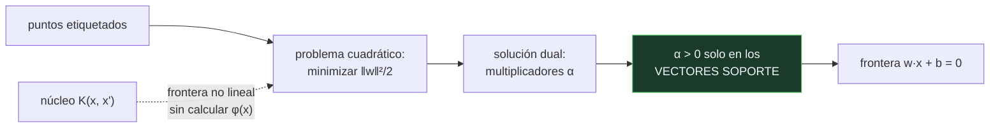

# P75 — Vectores soporte

> Ruta clásica · Cuando muchos clasificadores aciertan igual en entrenamiento, hace falta
> otro criterio. El margen es ese criterio, y tiene justificación teórica.

**Nivel:** L3 · **Motor:** `svm` · **Notebook:** [`P75_svm.ipynb`](../../../notebooks/papers/P75_svm.ipynb)
· **Anexo:** [álgebra y geometría](../../annexes/A01_ALGEBRA_Y_GEOMETRIA.md)

## 1. Identificación

| Campo | Valor |
|---|---|
| **Título original** | *Support-Vector Networks* |
| **Autoría** | Corinna Cortes, Vladimir Vapnik |
| **Año** | 1995 |
| **Venue** | Machine Learning, 20(3), 273–297 |
| **Fuente primaria** | [doi:10.1007/BF00994018](https://doi.org/10.1007/BF00994018) |
| **Acceso** | Restringido |
| **Fecha de consulta** | 2026-08-17 |

## 2. Problema anterior

Cuando los datos son separables, hay infinitos hiperplanos que aciertan el 100 % en
entrenamiento. Todos son indistinguibles por el criterio habitual —el error empírico— y sin embargo
generalizan de forma muy distinta: uno que pasa rozando los puntos clasificará mal el primer
ejemplo nuevo que se desvíe un poco.

El perceptrón de [P01](../P01_perceptron/README.md) devuelve **uno cualquiera** de ellos, el que
toque según el orden de los datos. Faltaba un criterio para elegir, y una razón para preferirlo.

## 3. Propuesta

Elegir el hiperplano de **margen máximo**: el que deja la mayor distancia posible a los puntos más
cercanos de ambas clases.

La justificación viene de la teoría del aprendizaje estadístico de Vapnik: minimizar el error
empírico no basta, hay que controlar también la capacidad del conjunto de hipótesis. Maximizar el
margen es exactamente eso — **minimización del riesgo estructural**.

El artículo añade dos piezas que lo hicieron práctico: el **margen blando**, que admite errores con
un coste `C`, y el **truco del núcleo**, que permite fronteras no lineales sin calcular
explícitamente en el espacio transformado.

## 4. Intuición sin fórmulas

Trazar una frontera entre dos países con un río en medio. Puedes dibujarla pegada a una orilla o
por el centro del cauce. Las dos separan igual de bien hoy; la del centro aguanta mejor una crecida.

Y hay un detalle que sorprende: la frontera solo depende de las casas más cercanas al río. Las que
están tierra adentro podrían mudarse sin que la línea se moviera un milímetro.

**Dónde deja de funcionar la analogía:** el río existe. En un problema real puede no haber ninguna
separación limpia, y ahí entra el margen blando: aceptar que algunos puntos queden del lado
equivocado, a cambio de un margen más ancho.

## 5. Matemática mínima

```text
Margen geométrico:  γ = mín_i  yᵢ(w·xᵢ + b) / ‖w‖

Problema primal:    minimizar  ‖w‖²/2
                    sujeto a   yᵢ(w·xᵢ + b) ≥ 1   para todo i

Margen blando:      minimizar  ‖w‖²/2 + C·Σ ξᵢ      ξᵢ ≥ 0
Truco del núcleo:   sustituir  x·x'  por  K(x, x')
```

La miniatura busca entre separadores válidos sobre ocho puntos:

| Magnitud | Valor |
|---|---:|
| hiperplanos que aciertan el 100 % | **15** |
| margen del peor | 0,2306 |
| margen del mejor | **0,956** |
| puntos que definen la frontera | **3 de 8** |

Un factor de cuatro entre el mejor y el peor margen, con exactitud idéntica en entrenamiento. Y la
solución depende de tres puntos: los **vectores soporte**.

<!-- puente:inicio -->
> [!TIP]
> **Puente matemático.** Esta sección da por sabido lo siguiente. Si algo no te suena,
> léelo primero: está explicado una sola vez, en un solo sitio, y sirve para todas las fichas.

| Dónde | Qué necesitas de ahí |
|---|---|
| [**A01 §3** · Hiperplanos y separabilidad](../../annexes/A01_ALGEBRA_Y_GEOMETRIA.md#3-hiperplanos-y-separabilidad) | qué es un hiperplano, cómo se mide la distancia de un punto a él y qué significa separable |
<!-- puente:fin -->

## 6. Arquitectura o flujo



## 7. Qué observar en el paper original

- La **formulación dual** y por qué importa: en ella los datos aparecen solo como productos
  escalares, y ahí es donde encaja el truco del núcleo.
- La **condición de holgura complementaria**: los multiplicadores son distintos de cero solo en los
  vectores soporte. De ahí la esparsidad de la solución.
- El papel del parámetro **C** en el margen blando: cuánto se penaliza cada violación. Es el mando
  que arbitra entre margen ancho y errores tolerados.
- La conexión con la **dimensión VC** y las cotas de generalización: es lo que convierte el margen
  en criterio y no en preferencia.

## 8. Evidencia y resultados

Experimentos de reconocimiento de dígitos manuscritos comparando núcleos polinómicos de distinto
grado y contra otros clasificadores de la época, con tasas de error competitivas.

> Lo notable no es el número: es que el mismo método, con núcleos distintos, cubre desde fronteras
> lineales hasta muy complejas sin cambiar el algoritmo de optimización.

La miniatura no resuelve el problema cuadrático dual: busca entre candidatos y compara márgenes.
Basta para exhibir el punto —que la exactitud no distingue y el margen sí— pero no es una
implementación de SVM.

## 9. Impacto

- Fue el clasificador de referencia entre 1995 y 2012, hasta que
  [AlexNet](../P04_alexnet/README.md) cambió el panorama en visión.
- El **truco del núcleo** se extendió a regresión, análisis de componentes, detección de anomalías y
  agrupamiento: es una familia de métodos, no un algoritmo.
- La idea de **regularizar controlando la capacidad** —no solo ajustar— estructura todo lo que vino
  después, incluida la penalización de [P77](../P77_lasso/README.md) y el weight decay de las
  redes.
- Y sigue siendo la primera opción razonable con pocos datos y muchas dimensiones, donde las redes
  profundas no tienen con qué entrenarse.

## 10. Limitaciones

1. **Escala mal con el número de ejemplos.** El problema cuadrático crece con `n²`; con millones
   de ejemplos es impracticable sin aproximaciones.
2. **No da probabilidades.** La salida es una distancia con signo; convertirla en probabilidad exige
   un paso aparte, que es justo el escalado de Platt de
   [P82](../P82_calibracion/README.md).
3. **Elegir el núcleo y sus parámetros es trabajo**, y hacerlo mal cuesta más que la diferencia
   entre familias de modelos.
4. **La interpretabilidad se pierde con núcleos no lineales**: la frontera vive en un espacio que no
   se puede inspeccionar.
5. **El margen máximo es un sesgo inductivo**, con justificación teórica pero no una garantía: puede
   ser el sesgo equivocado para un problema concreto.

## 11. Errores comunes

| Error | Corrección |
|---|---|
| «La SVM encuentra «la» frontera correcta» | Encuentra la de margen máximo. Es un criterio con justificación teórica, no una verdad sobre los datos. |
| «Todos los puntos contribuyen al modelo» | Solo los vectores soporte. En la miniatura, 3 de 8: el resto podría moverse sin cambiar nada. |
| «El truco del núcleo proyecta los datos a más dimensiones» | Calcula productos escalares EN ese espacio sin construirlo. La diferencia es justamente lo que lo hace viable. |
| «Un margen mayor implica mejor generalización siempre» | Es lo que sugiere la teoría bajo sus supuestos. En la práctica hay que comprobarlo fuera de muestra como todo lo demás. |
| «Las SVM quedaron obsoletas» | Con pocos datos y muchas dimensiones siguen siendo competitivas, y su formulación es la base de una familia entera de métodos con núcleo. |

## 12. Relación con trabajos anteriores

- **[P01 El perceptrón](../P01_perceptron/README.md) (1958)** — encuentra *un* separador; aquí se
  elige *cuál*.
- **Vapnik y Chervonenkis (1974)** — la teoría del aprendizaje estadístico que justifica el
  criterio.
- **Boser, Guyon y Vapnik (1992)** — el clasificador de margen óptimo con núcleos, el antecedente
  directo.

## 13. Relación con trabajos posteriores

- **Platt (1999)** — salidas probabilísticas para SVM: lo que hace falta cuando la distancia no
  basta. Se retoma en [P82](../P82_calibracion/README.md).
- **[P77 Lasso](../P77_lasso/README.md) (1996)** — otra forma de restringir la capacidad del modelo,
  con otra geometría.
- **[P04 AlexNet](../P04_alexnet/README.md) (2012)** — el trabajo que desplaza a las SVM en visión.
- **Schölkopf y Smola** — *Learning with Kernels*: la generalización de la idea a toda una familia
  de métodos.

## 14. Notebook asociado

[`P75_svm.ipynb`](../../../notebooks/papers/P75_svm.ipynb)

**Qué implementa:** la comparación de márgenes entre hiperplanos que aciertan el 100 % en entrenamiento, y la identificación de los vectores soporte que definen la frontera del mejor.

**Qué NO implementa:** no resuelve el problema cuadrático dual ni implementa núcleos ni margen blando: busca entre candidatos. Es la intuición del margen, no una SVM.

```bash
ai-evolution paper-lab P75 --seed 7
```

## 15. Actividades Bloom

| Nivel | Actividad |
|---|---|
| **Recordar** | Escribe la definición de margen geométrico. |
| **Explicar** | Explica por qué la exactitud en entrenamiento no distingue entre separadores. |
| **Aplicar** | Ejecuta el notebook y compara el margen del mejor y del peor separador. |
| **Analizar** | Analiza por qué solo los vectores soporte definen la solución. |
| **Evaluar** | «Este modelo acierta el 100 %, luego es el mejor». Evalúa la afirmación. |
| **Crear** | Entrena SVM con núcleo lineal y RBF sobre datos no separables y compara el número de vectores soporte. |

## 16. Autoevaluación

1. ¿Qué problema resuelve el criterio del margen?
2. ¿Qué es un vector soporte?
3. ¿Qué aporta el margen blando?
4. ¿Qué hace el truco del núcleo?
5. ¿Da probabilidades una SVM?
6. ¿Cuál es su principal limitación de escala?
7. ¿Por qué el margen máximo es un criterio y no una preferencia?

## 17. Respuestas esperadas

1. El de elegir entre hiperplanos que aciertan igual en entrenamiento. La miniatura encuentra 15 separadores perfectos con márgenes de 0,23 a 0,96: la exactitud no los distingue.
2. Un punto que toca el margen y por tanto define la frontera. En la miniatura son 3 de 8; los demás podrían moverse sin cambiar el modelo.
3. Permite que algunos puntos queden del lado equivocado, con un coste `C` por cada violación. Sin él, un solo punto mal etiquetado impide encontrar solución.
4. Permite calcular productos escalares en un espacio transformado de dimensión alta —o infinita— sin construir ese espacio. La formulación dual solo necesita esos productos.
5. No directamente: devuelve una distancia con signo. Convertirla en probabilidad exige un paso de calibración, como el escalado de Platt.
6. El coste crece con el cuadrado del número de ejemplos. Con millones de datos hace falta aproximar.
7. Porque viene de la teoría del aprendizaje estadístico: controlar la capacidad del conjunto de hipótesis acota el error de generalización. No es una intuición estética.

## 18. Fuentes primarias

- Cortes, C. y Vapnik, V. (1995). *Support-Vector Networks*. **Machine Learning**, 20(3), 273–297.
  [doi:10.1007/BF00994018](https://doi.org/10.1007/BF00994018) · consultado 2026-08-17.
- Boser, B., Guyon, I. y Vapnik, V. (1992). *A Training Algorithm for Optimal Margin Classifiers*.
  [doi:10.1145/130385.130401](https://doi.org/10.1145/130385.130401) · consultado 2026-08-17.
- Schölkopf, B. y Smola, A. *Learning with Kernels*.
  [MIT Press](https://mitpress.mit.edu/9780262536578/learning-with-kernels/) · consultado 2026-08-17.

---

[⬅️ Anterior: P74 Árboles de decisión](../P74_id3/README.md) ·
[📇 Índice](../../catalog/PAPERS_INDEX.md) ·
[📝 Evaluación](../../../assessments/papers/P75_svm.md) ·
[🏫 Clase 039 · Clasificación logística y umbrales](../../../classes/part-03-classical-machine-learning/039-clasificacion-logistica-y-umbrales/README.md) ·
[➡️ Siguiente: P76 Validación cruzada](../P76_validacion_cruzada/README.md)
