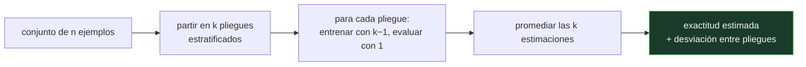

# P76 — Validación cruzada

> Ruta clásica · Mide los estimadores en vez de suponerlos. De aquí sale la costumbre de
> los diez pliegues estratificados, y la razón por la que no es una costumbre.

**Nivel:** L3 · **Motor:** `validacion_cruzada` · **Notebook:** [`P76_validacion_cruzada.ipynb`](../../../notebooks/papers/P76_validacion_cruzada.ipynb)
· **Anexo:** [probabilidad y verosimilitud](../../annexes/A02_PROBABILIDAD_Y_VEROSIMILITUD.md)

## 1. Identificación

| Campo | Valor |
|---|---|
| **Título original** | *A Study of Cross-Validation and Bootstrap for Accuracy Estimation and Model Selection* |
| **Autoría** | Ron Kohavi |
| **Año** | 1995 |
| **Venue** | IJCAI'95, 1137–1143 |
| **Fuente primaria** | [Actas IJCAI'95](https://www.ijcai.org/Proceedings/95-2/Papers/016.pdf) |
| **Acceso** | Abierto |
| **Fecha de consulta** | 2026-08-17 |

## 2. Problema anterior

Los artículos reportaban exactitudes sin decir cómo las habían estimado. Holdout, validación
cruzada con distintos números de pliegues y bootstrap dan números **distintos** sobre los mismos
datos y el mismo modelo.

Peor: dos personas con el mismo modelo y el mismo conjunto pueden publicar cifras muy diferentes
sin que ninguna haga nada incorrecto. Nadie había medido cuál de esos estimadores es preferible,
ni en qué sentido.

## 3. Propuesta

Tratar el estimador como objeto de estudio. Kohavi compara empíricamente holdout, validación
cruzada con k de 2 a 20 —con y sin estratificación— y bootstrap sobre conjuntos reales,
descomponiendo el error en **sesgo** y **varianza**.

La recomendación que sale de ahí, y que se convirtió en el estándar del campo: **validación cruzada
estratificada de diez pliegues**. No porque tenga el menor sesgo —dejar-uno-fuera lo tiene menor—
sino porque su varianza es mucho menor a un coste computacional razonable.

## 4. Intuición sin fórmulas

Medir la altura media de una ciudad. Puedes medir a treinta personas al azar, o dividir a los
cien vecinos en diez grupos y medirlos a todos, un grupo cada vez.

Las dos formas dan la altura media correcta **en promedio**. Pero si repites el experimento, la
primera te dará números que oscilan mucho más — porque solo mides a treinta.

**Dónde deja de funcionar la analogía:** medir la altura no cambia a las personas. Entrenar con
menos datos sí cambia el modelo, y ese es el otro efecto que Kohavi mide: los estimadores con
conjuntos de entrenamiento pequeños subestiman lo que el modelo haría con todos los datos.

## 5. Matemática mínima

```text
Holdout p/q      : entrena con p %, evalúa con q %      → test de tamaño q·n
Validación k     : k particiones; cada ejemplo pasa por
                   el test exactamente una vez          → test de tamaño n
Dejar uno fuera  : k = n                                → sesgo mínimo, varianza alta
Estratificada    : cada pliegue conserva la proporción de clases
```

La miniatura simula 200 conjuntos extraídos de una población con exactitud real **0,78**:

| Estimador | Media | Desviación | Rango | Ejemplos de test |
|---|---:|---:|---|---:|
| holdout 70/30 | 0,7765 | **0,0753** | [0,60 – 0,97] | 30 |
| validación cruzada 5 | 0,7836 | 0,0468 | — | 100 |
| validación cruzada 10 | 0,7836 | **0,0454** | — | 100 |

Los sesgos son de milésimas: el problema **no es el sesgo**. Es que el holdout es **1,66× más
disperso**, y la razón es aritmética — evalúa sobre 30 ejemplos en lugar de 100.

<!-- puente:inicio -->
> [!TIP]
> **Puente matemático.** Esta sección da por sabido lo siguiente. Si algo no te suena,
> léelo primero: está explicado una sola vez, en un solo sitio, y sirve para todas las fichas.

| Dónde | Qué necesitas de ahí |
|---|---|
| [**A02 §3** · Verosimilitud y entropía cruzada](../../annexes/A02_PROBABILIDAD_Y_VEROSIMILITUD.md#3-verosimilitud-y-entropía-cruzada) | por qué una estimación sobre pocos ejemplos tiene tanta varianza y qué la reduce |
<!-- puente:fin -->

## 6. Arquitectura o flujo



## 7. Qué observar en el paper original

- La **descomposición en sesgo y varianza** del estimador, que es el marco con el que se compara
  todo lo demás.
- Por qué **dejar-uno-fuera no gana** pese a tener el sesgo menor: su varianza es alta y su coste,
  n entrenamientos.
- El efecto de la **estratificación**, que reduce tanto sesgo como varianza y es gratis. Es la parte
  de la recomendación que más se olvida.
- La advertencia sobre **usar la misma validación para seleccionar y para reportar**: eso sesga el
  número reportado, y es el error más común treinta años después.

## 8. Evidencia y resultados

Experimentos sistemáticos sobre conjuntos reales de la época, con miles de repeticiones, midiendo
sesgo y varianza de cada estimador.

> Es un artículo empírico sobre metodología: su aportación no es un algoritmo sino una medición de
> las herramientas que todo el mundo usaba sin medir.

La miniatura simula el fenómeno con una moneda sesgada para aislar la varianza del estimador. No
reentrena modelos, así que no reproduce el otro efecto —el sesgo por entrenar con menos datos— que
el artículo sí mide.

## 9. Impacto

- Fijó la práctica estándar de evaluación en aprendizaje automático durante treinta años. Cuando
  una biblioteca ofrece `cv=10` por defecto, es por este artículo.
- Estableció que la **elección del estimador es parte del método**, no un detalle de
  implementación.
- Es antecedente directo del checklist de reproducibilidad de
  [P63](../P63_reproducibilidad/README.md): declarar cómo se estimó es tan importante como el
  número.
- Su advertencia sobre seleccionar y evaluar con la misma validación es el origen de la práctica de
  la **validación anidada**.

## 10. Limitaciones

1. **Los conjuntos son pequeños** para el estándar actual, y las conclusiones sobre el número
   óptimo de pliegues pueden no trasladarse a millones de ejemplos.
2. **Supone ejemplos independientes e idénticamente distribuidos.** Con series temporales o datos
   agrupados, barajar es sencillamente incorrecto.
3. **No cubre el caso de fuga de datos** por preprocesado hecho antes de partir, que hoy es el modo
   de fallo más frecuente.
4. **La validación cruzada es cara**: k entrenamientos. Con modelos grandes eso puede ser
   prohibitivo, y ahí el compromiso cambia.
5. **No resuelve la selección de modelo y la estimación a la vez**: hacerlo con la misma partición
   sesga, y la corrección —validación anidada— multiplica el coste.

## 11. Errores comunes

| Error | Corrección |
|---|---|
| «Validación cruzada y holdout dan lo mismo si el conjunto es grande» | Convergen, pero con los tamaños habituales el holdout es mucho más disperso: 1,66× en la miniatura, sobre 100 ejemplos. |
| «Dejar-uno-fuera es el mejor estimador porque tiene menos sesgo» | Tiene menos sesgo y mucha más varianza, y cuesta n entrenamientos. El artículo recomienda 10 pliegues justamente por el compromiso. |
| «Da igual estratificar» | La estratificación reduce sesgo y varianza sin coste. Con clases desbalanceadas, no estratificar puede dejar pliegues sin ejemplos de la clase minoritaria. |
| «Se puede usar la misma validación para elegir hiperparámetros y para reportar» | Eso sesga el número reportado hacia arriba. Hace falta validación anidada o un conjunto de test reservado. |
| «Se puede barajar cualquier conjunto de datos» | Con series temporales, barajar mezcla futuro y pasado y produce estimaciones sistemáticamente optimistas. Ahí hay que validar en ventanas. |

## 12. Relación con trabajos anteriores

- **Stone (1974)** — la formulación de la validación cruzada como método de evaluación.
- **Efron (1979)** — el bootstrap, la alternativa que Kohavi compara.
- **[P74 Árboles de decisión](../P74_id3/README.md) (1986)** — uno de los modelos sobre los que se
  hacen los experimentos.

## 13. Relación con trabajos posteriores

- **Varma y Simon (2006)** — el sesgo de seleccionar y evaluar con la misma validación.
  [doi:10.1186/1471-2105-7-91](https://doi.org/10.1186/1471-2105-7-91)
- **Cawley y Talbot (2010)** — sobreajuste en la selección de modelo y cómo evitarlo.
  [JMLR 11](https://www.jmlr.org/papers/v11/cawley10a.html)
- **[P63 Reproducibilidad](../P63_reproducibilidad/README.md) (2021)** — declarar el estimador como
  requisito de publicación.
- **[P86 Competición M4](../P86_m4/README.md) (2018)** — el mismo problema con datos temporales,
  donde la validación cruzada estándar no vale.

## 14. Notebook asociado

[`P76_validacion_cruzada.ipynb`](../../../notebooks/papers/P76_validacion_cruzada.ipynb)

**Qué implementa:** la simulación de 200 conjuntos con exactitud real conocida, y la comparación de sesgo, desviación y rango entre holdout y validación cruzada de 5 y 10 pliegues.

**Qué NO implementa:** no reentrena modelos, así que no reproduce el sesgo por entrenar con menos datos, ni la estratificación, ni el bootstrap. Aísla la varianza del estimador.

```bash
ai-evolution paper-lab P76 --seed 7
```

## 15. Actividades Bloom

| Nivel | Actividad |
|---|---|
| **Recordar** | Explica la diferencia entre holdout y validación cruzada de k pliegues. |
| **Explicar** | Explica por qué el holdout tiene más varianza. |
| **Aplicar** | Ejecuta el notebook y calcula cuántas veces más disperso es el holdout. |
| **Analizar** | Analiza por qué dejar-uno-fuera no es la mejor opción pese a su bajo sesgo. |
| **Evaluar** | «El modelo alcanza un 92 %». Evalúa qué falta para que la afirmación sea comparable. |
| **Crear** | Evalúa un modelo tuyo con holdout repetido y con validación cruzada de 10 pliegues, y publica media, desviación y número de corridas. |

## 16. Autoevaluación

1. ¿Qué se compara en el artículo?
2. ¿Por qué el holdout tiene más varianza que la validación cruzada?
3. ¿Cuál es la recomendación del artículo y por qué?
4. ¿Por qué no gana dejar-uno-fuera?
5. ¿Qué aporta la estratificación?
6. ¿Cuándo NO se puede usar validación cruzada estándar?
7. ¿Qué error metodológico advierte el artículo?

## 17. Respuestas esperadas

1. Los estimadores de exactitud: holdout, validación cruzada con distintos k y bootstrap, descompuestos en sesgo y varianza sobre conjuntos reales.
2. Porque evalúa sobre una fracción de los datos. En la miniatura, 30 ejemplos frente a 100: menos ejemplos de test significa más ruido en la estimación.
3. Validación cruzada estratificada de diez pliegues, porque su varianza es baja a un coste computacional razonable. No es la de menor sesgo: es el mejor compromiso.
4. Porque su varianza es alta —los modelos entrenados en cada iteración son casi idénticos y sus errores están muy correlacionados— y cuesta n entrenamientos.
5. Conserva la proporción de clases en cada pliegue. Reduce sesgo y varianza sin coste adicional, y es imprescindible con clases desbalanceadas.
6. Con datos que no son independientes: series temporales, medidas repetidas del mismo sujeto, datos agrupados. Barajar mezcla información que en producción no estaría disponible.
7. Usar la misma validación para seleccionar el modelo y para reportar su exactitud. Eso sesga el número hacia arriba y exige validación anidada.

## 18. Fuentes primarias

- Kohavi, R. (1995). *A Study of Cross-Validation and Bootstrap for Accuracy Estimation and Model
  Selection*. **IJCAI'95**, 1137–1143.
  [Actas](https://www.ijcai.org/Proceedings/95-2/Papers/016.pdf) · consultado 2026-08-17.
- Varma, S. y Simon, R. (2006). *Bias in error estimation when using cross-validation for model
  selection*. [doi:10.1186/1471-2105-7-91](https://doi.org/10.1186/1471-2105-7-91) ·
  consultado 2026-08-17.
- Cawley, G. y Talbot, N. (2010). *On Over-fitting in Model Selection*.
  [JMLR 11](https://www.jmlr.org/papers/v11/cawley10a.html) · consultado 2026-08-17.

---

[⬅️ Anterior: P75 Vectores soporte](../P75_svm/README.md) ·
[📇 Índice](../../catalog/PAPERS_INDEX.md) ·
[📝 Evaluación](../../../assessments/papers/P76_validacion_cruzada.md) ·
[🏫 Clase 037 · Flujo supervisado y partición train/validation/test](../../../classes/part-03-classical-machine-learning/037-flujo-supervisado-y-particion-train-validation-test/README.md) ·
[➡️ Siguiente: P77 Lasso](../P77_lasso/README.md)
