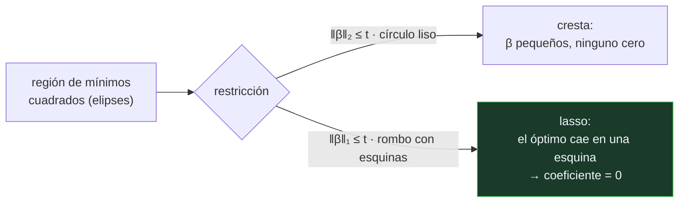

# P77 — Lasso

> Ruta clásica · Una penalización con esquinas. Los coeficientes irrelevantes no se
> encogen: caen exactamente a cero, y el modelo se selecciona solo.

**Nivel:** L3 · **Motor:** `lasso` · **Notebook:** [`P77_lasso.ipynb`](../../../notebooks/papers/P77_lasso.ipynb)
· **Anexo:** [cálculo y gradientes](../../annexes/A03_CALCULO_Y_GRADIENTES.md)

## 1. Identificación

| Campo | Valor |
|---|---|
| **Título original** | *Regression Shrinkage and Selection via the Lasso* |
| **Autoría** | Robert Tibshirani |
| **Año** | 1996 |
| **Venue** | Journal of the Royal Statistical Society, Series B, 58(1), 267–288 |
| **Fuente primaria** | [doi:10.1111/j.2517-6161.1996.tb02080.x](https://doi.org/10.1111/j.2517-6161.1996.tb02080.x) |
| **Acceso** | Restringido |
| **Fecha de consulta** | 2026-08-17 |

## 2. Problema anterior

Con muchas variables, los mínimos cuadrados dan coeficientes grandes de signo arbitrario que
sobreajustan y producen un modelo imposible de interpretar.

Había dos remedios y ninguno servía del todo. La **selección por subconjuntos** —probar
combinaciones de variables y quedarse con la mejor— es discreta y por tanto inestable: cambiar un
dato puede cambiar el conjunto elegido. La **regresión de cresta** es estable y continua, pero
encoge todos los coeficientes y no elimina ninguno: el modelo sigue teniendo todas las variables.

## 3. Propuesta

Penalizar la suma de los **valores absolutos** de los coeficientes en lugar de la suma de sus
cuadrados:

```text
minimizar   RSS + α·Σ |βⱼ|
```

La consecuencia es geométrica y sorprendente. La restricción `Σ|βⱼ| ≤ t` define un rombo —en más
dimensiones, un politopo— con **esquinas sobre los ejes**. El óptimo tiende a caer en una esquina,
y estar en una esquina significa que algunas coordenadas valen exactamente cero.

La bola de la cresta es lisa y no tiene esquinas: por eso encoge y no anula. El lasso **estima y
selecciona en la misma operación**, y lo hace de forma continua y por tanto estable.

## 4. Intuición sin fórmulas

Un presupuesto que repartir entre variables. Con la cresta, el coste de una variable crece con el
cuadrado: la primera unidad es casi gratis, así que compensa dar un poco a todas.

Con el lasso, el coste es lineal: la primera unidad cuesta lo mismo que la última. Si una variable
no aporta lo suficiente para pagar su primera unidad, se queda **sin nada**.

**Dónde deja de funcionar la analogía:** el presupuesto reparte algo escaso entre usos
independientes. Aquí las variables interactúan, y si dos son casi idénticas el lasso se queda con
una de las dos casi al azar — que es su punto débil conocido.

## 5. Matemática mínima

```text
Cresta (L2):  minimizar  RSS + α·Σ βⱼ²      →  encoge, nunca anula
Lasso  (L1):  minimizar  RSS + α·Σ |βⱼ|     →  ANULA

Operador de umbral suave, que es de donde sale el cero exacto:
    β ← signo(z)·máx(0, |z| − α·lr)
        si |z| ≤ α·lr  →  β = 0  exactamente
```

La miniatura ajusta sobre 60 observaciones y 8 variables, de las que solo 3 tienen efecto real:

| Método | Coeficientes exactamente cero | Nulos reales detectados |
|---|---:|---:|
| sin penalización | 0 | — |
| cresta L2 | **0** | — |
| lasso L1 | **4** | 4 de 5 |

Y el camino de regularización muestra el mando: con `α = 0,05` sobreviven 6 variables; con
`α = 1,2`, 4. Elegir `α` es elegir cuánta parsimonia se compra y a qué precio en ajuste.

## 6. Arquitectura o flujo



## 7. Qué observar en el paper original

- El **argumento geométrico** de las esquinas, que es la parte que hay que entender y la que
  explica todo el comportamiento del método.
- La discusión sobre **estabilidad** frente a la selección por subconjuntos: el lasso es continuo
  en los datos, la selección discreta no.
- Los **algoritmos** que propone para resolverlo, anteriores a LARS y al descenso por coordenadas
  que se usan hoy.
- El tratamiento de la **elección de `t`** por validación cruzada, que conecta directamente con
  [P76](../P76_validacion_cruzada/README.md): sin un estimador honesto, el hiperparámetro se elige
  mal.

## 8. Evidencia y resultados

Simulaciones con estructuras de correlación controladas y ejemplos reales, comparando error de
predicción y número de variables seleccionadas frente a mínimos cuadrados, cresta y selección por
subconjuntos.

> El resultado no es que el lasso gane siempre en predicción: es que consigue modelos mucho más
> pequeños con un error comparable, y de forma estable.

La miniatura reproduce el mecanismo con datos sintéticos donde se conoce la verdad, que es lo único
que permite decir «identificó 4 de las 5 variables nulas».

## 9. Impacto

- Es uno de los artículos más citados de la estadística moderna y el punto de partida de la
  literatura sobre esparsidad.
- Abrió el problema de la **alta dimensión** —más variables que observaciones—, central en
  genómica, y con él toda la teoría de recuperación esparsa.
- La idea de **restringir el espacio de soluciones para obtener algo manejable** reaparece en
  [LoRA](../P48_lora/README.md): en vez de ajustar todos los pesos, restringir la actualización a
  rango bajo.
- Y su lección práctica sigue vigente: la regularización no es un truco contra el sobreajuste, es
  una forma de codificar qué modelos consideramos aceptables.

## 10. Limitaciones

1. **Inestable con variables muy correlacionadas**: se queda con una del grupo casi al azar. La
   red elástica (Zou y Hastie, 2005) existe por esto.
2. **Selecciona como mucho `n` variables** cuando hay más variables que observaciones, por
   construcción.
3. **Los coeficientes están sesgados hacia cero**, incluso los de las variables que sí importan.
4. **La inferencia post-selección es delicada**: los intervalos de confianza calculados sobre las
   variables seleccionadas no son válidos sin corrección.
5. **Un cero no es una afirmación causal**: significa que, dadas las demás variables y esa
   penalización, no aporta.

## 11. Errores comunes

| Error | Corrección |
|---|---|
| «El lasso y la cresta hacen lo mismo con distinta fórmula» | La cresta encoge y nunca anula; el lasso pone coeficientes exactamente en cero. La miniatura lo comprueba: 4 ceros frente a 0. |
| «Un coeficiente en cero significa que la variable no influye» | Significa que, dadas las demás variables y esa penalización, no aporta. Es condicional y no es causal. |
| «Con variables correlacionadas el lasso elige la mejor» | Se queda con una casi arbitrariamente. Cambiar unos pocos datos puede cambiar cuál. |
| «Elegir alpha es un detalle» | Alpha determina cuántas variables sobreviven. En la miniatura, de 6 a 4 según el valor: es parte del modelo y se elige por validación. |
| «La regularización es un truco contra el sobreajuste» | Es una forma de declarar qué soluciones consideramos aceptables. El sobreajuste se reduce como consecuencia. |

## 12. Relación con trabajos anteriores

- **Hoerl y Kennard (1970)** — la regresión de cresta: la penalización L2 que encoge sin anular.
- **Breiman (1995)** — el garrote no negativo, el antecedente directo del lasso.
- **[P76 Validación cruzada](../P76_validacion_cruzada/README.md) (1995)** — el estimador con el
  que se elige el parámetro de penalización.

## 13. Relación con trabajos posteriores

- **Zou y Hastie (2005)** — red elástica: combina L1 y L2 para manejar variables correlacionadas.
  [doi:10.1111/j.1467-9868.2005.00503.x](https://doi.org/10.1111/j.1467-9868.2005.00503.x)
- **Efron et al. (2004)** — LARS: el camino de regularización completo con el coste de una única
  regresión. [doi:10.1214/009053604000000067](https://doi.org/10.1214/009053604000000067)
- **[P48 LoRA](../P48_lora/README.md) (2021)** — restringir el espacio de actualizaciones para
  obtener algo manejable, con otra restricción.
- **[P81 Selección de variables](../P81_seleccion_de_caracteristicas/README.md) (2003)** — el
  panorama completo de métodos, donde el lasso es la familia embebida.

## 14. Notebook asociado

[`P77_lasso.ipynb`](../../../notebooks/papers/P77_lasso.ipynb)

**Qué implementa:** el descenso con umbral suave para L1 y con gradiente para L2 sobre datos donde se conoce qué variables importan, y el camino de regularización completo.

**Qué NO implementa:** no hay LARS, ni descenso por coordenadas, ni elección de alpha por validación cruzada, ni red elástica. Tampoco el caso de más variables que observaciones.

```bash
ai-evolution paper-lab P77 --seed 7
```

## 15. Actividades Bloom

| Nivel | Actividad |
|---|---|
| **Recordar** | Escribe las dos funciones objetivo, con penalización L1 y L2. |
| **Explicar** | Explica por qué la geometría de la bola L1 produce ceros exactos. |
| **Aplicar** | Ejecuta el notebook y observa el camino de regularización. |
| **Analizar** | Analiza qué hace cada penalización con la variable que es copia ruidosa de otra. |
| **Evaluar** | «El lasso identificó las variables importantes». Evalúa qué afirma exactamente eso. |
| **Crear** | Ajusta un lasso con alpha elegido por validación cruzada sobre datos reales y comprueba si el conjunto seleccionado es estable al cambiar la partición. |

## 16. Autoevaluación

1. ¿Qué penaliza el lasso y qué la cresta?
2. ¿Por qué el lasso produce ceros exactos?
3. ¿Qué ventaja tiene sobre la selección por subconjuntos?
4. ¿Qué le pasa con dos variables muy correlacionadas?
5. ¿Qué significa que un coeficiente sea cero?
6. ¿Qué papel juega alpha?
7. ¿Dónde reaparece esta idea en el aprendizaje profundo?

## 17. Respuestas esperadas

1. El lasso penaliza la suma de valores absolutos de los coeficientes (norma L1); la cresta, la suma de sus cuadrados (norma L2).
2. Porque la región `Σ|βⱼ| ≤ t` es un politopo con esquinas sobre los ejes, y el óptimo tiende a caer en una esquina. Estar en una esquina significa tener coordenadas exactamente nulas.
3. Que es continuo en los datos y por tanto **estable**: la selección por subconjuntos es discreta, y cambiar un dato puede cambiar por completo el conjunto elegido.
4. Se queda con una de las dos casi arbitrariamente, y cuál puede cambiar con pequeñas variaciones en los datos. La red elástica se propuso para corregirlo.
5. Que, dadas las demás variables incluidas y ese valor de alpha, esa variable no aporta. Es una afirmación condicional sobre el modelo, no causal sobre el mundo.
6. Controla cuánta penalización se aplica y, con ella, cuántas variables sobreviven. En la miniatura, de 6 variables vivas con alpha 0,05 a 4 con alpha 1,2.
7. En LoRA: restringir las actualizaciones a un subespacio de rango bajo en lugar de ajustar todos los pesos. Es la misma estrategia —restringir el espacio de soluciones— con otra restricción.

## 18. Fuentes primarias

- Tibshirani, R. (1996). *Regression Shrinkage and Selection via the Lasso*. **JRSS-B**, 58(1),
  267–288. [doi:10.1111/j.2517-6161.1996.tb02080.x](https://doi.org/10.1111/j.2517-6161.1996.tb02080.x)
  · consultado 2026-08-17.
- Zou, H. y Hastie, T. (2005). *Regularization and variable selection via the elastic net*.
  [doi:10.1111/j.1467-9868.2005.00503.x](https://doi.org/10.1111/j.1467-9868.2005.00503.x) ·
  consultado 2026-08-17.
- Efron, B. et al. (2004). *Least Angle Regression*.
  [doi:10.1214/009053604000000067](https://doi.org/10.1214/009053604000000067) ·
  consultado 2026-08-17.

---

[⬅️ Anterior: P76 Validación cruzada](../P76_validacion_cruzada/README.md) ·
[📇 Índice](../../catalog/PAPERS_INDEX.md) ·
[📝 Evaluación](../../../assessments/papers/P77_lasso.md) ·
[🏫 Clase 038 · Regresión lineal, regularización y diagnóstico](../../../classes/part-03-classical-machine-learning/038-regresion-lineal-regularizacion-y-diagnostico/README.md) ·
[➡️ Siguiente: P78 AdaBoost](../P78_adaboost/README.md)
