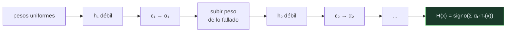

# P78 — AdaBoost

> Ruta clásica · Muchos clasificadores apenas mejores que el azar, en serie, cada uno
> mirando lo que el anterior falló. La suma ponderada resuelve lo que ninguno sabía.

**Nivel:** L3 · **Motor:** `adaboost` · **Notebook:** [`P78_adaboost.ipynb`](../../../notebooks/papers/P78_adaboost.ipynb)
· **Anexo:** [cálculo y gradientes](../../annexes/A03_CALCULO_Y_GRADIENTES.md)

## 1. Identificación

| Campo | Valor |
|---|---|
| **Título original** | *A Decision-Theoretic Generalization of On-Line Learning and an Application to Boosting* |
| **Autoría** | Yoav Freund, Robert E. Schapire |
| **Año** | 1997 |
| **Venue** | Journal of Computer and System Sciences, 55(1), 119–139 |
| **Fuente primaria** | [doi:10.1006/jcss.1997.1504](https://doi.org/10.1006/jcss.1997.1504) |
| **Acceso** | Restringido |
| **Fecha de consulta** | 2026-08-17 |

## 2. Problema anterior

Kearns y Valiant habían planteado una pregunta teórica: ¿un aprendiz **débil** —uno que solo
garantiza acertar un poco más que el azar— puede convertirse en uno **fuerte**, arbitrariamente
preciso?

Schapire había demostrado que sí en 1990, pero su construcción era impracticable: exigía conocer de
antemano la ventaja del aprendiz débil sobre el azar, y esa cantidad no se conoce. El resultado era
teóricamente importante y operativamente inútil.

## 3. Propuesta

AdaBoost, donde «Ada» es por **adaptativo**: el algoritmo se ajusta solo a la calidad de cada
aprendiz, sin que nadie se la diga.

En cada ronda se entrena un clasificador sobre una distribución de pesos, se mide su error
**ponderado**, y de ahí salen dos cosas: cuánto vota ese clasificador en la decisión final
(`α = ½·ln((1−ε)/ε)`) y cómo se redistribuyen los pesos para la ronda siguiente —sube el peso de lo
que falló, baja el de lo que acertó—.

El artículo demuestra además que el error de entrenamiento del conjunto decrece
**exponencialmente** con el número de rondas.

## 4. Intuición sin fórmulas

Un comité de especialistas estrechos. El primero solo sabe distinguir por el precio. El segundo se
contrata sabiendo qué casos falló el primero, y se especializa en ellos. El tercero, en lo que
fallan los dos.

Ninguno resuelve el problema. El comité, con voto ponderado por acierto, sí.

**Dónde deja de funcionar la analogía:** los especialistas humanos tienen conocimiento propio. Aquí
el «especialista» es el mismo algoritmo simple aplicado a datos reponderados; toda la
especialización viene de los pesos. Y si un caso está mal etiquetado, el comité contratará a
alguien tras otro para acertar algo que es imposible acertar.

## 5. Matemática mínima

```text
D₁(i) = 1/n
Para t = 1..T:
    hₜ  ← aprendiz débil sobre Dₜ
    εₜ  ← Σ_i Dₜ(i)·[hₜ(xᵢ) ≠ yᵢ]              ← error PONDERADO
    αₜ  ← ½·ln((1 − εₜ)/εₜ)                     ← más voto a quien menos falla
    Dₜ₊₁(i) ∝ Dₜ(i)·exp(−αₜ·yᵢ·hₜ(xᵢ))

H(x) = signo( Σₜ αₜ·hₜ(x) )

Error de entrenamiento ≤ Π_t 2·√(εₜ(1−εₜ))      → decrece exponencialmente
```

La miniatura ataca un problema de **banda central** —`y = +1` si `4 ≤ x ≤ 7`— que ningún corte
único puede describir:

| Modelo | Exactitud |
|---|---:|
| mejor tocón individual (de 22) | 75,0 % |
| conjunto ponderado, ronda 3 | **91,7 %** |

Y el peso del ejemplo más difícil pasa de 0,0833 —el reparto uniforme— a **0,293**.

## 6. Arquitectura o flujo



## 7. Qué observar en el paper original

- La **cota exponencial** sobre el error de entrenamiento y su demostración, que es breve y
  elegante.
- La discusión sobre por qué AdaBoost **no sobreajusta tanto como debería** según la teoría VC — un
  fenómeno que se explicó después en términos de márgenes y que dio literatura para una década.
- El marco general: el artículo va de aprendizaje en línea y decisión, y el boosting es la
  aplicación. El resultado es más general que el algoritmo famoso.
- Que el aprendiz débil es una **caja negra**: cualquier algoritmo que acepte pesos sirve.

## 8. Evidencia y resultados

Análisis teórico con la cota exponencial, más experimentos sobre conjuntos de referencia de la
época comparando con el aprendiz débil suelto y con bagging.

> La cota es sobre el error de **entrenamiento**. Que el error de prueba también baje —y que siga
> bajando después de que el de entrenamiento llegue a cero— es un fenómeno empírico que motivó la
> teoría de márgenes posterior.

La miniatura elige un problema representable por una suma de tocones para que el efecto se vea sin
ambigüedad. La exactitud reportada es de entrenamiento: no hay conjunto de prueba.

## 9. Impacto

- Ganó el premio Gödel en 2003. Es uno de los resultados más influyentes del aprendizaje
  automático.
- Su descendencia domina hoy los **datos tabulares**: gradient boosting, XGBoost, LightGBM y
  CatBoost son variantes de la misma idea con otra función de pérdida.
- Friedman, Hastie y Tibshirani (2000) lo reinterpretaron como **ajuste aditivo por etapas** con
  pérdida exponencial, y esa lectura es la que abrió el camino al gradient boosting.
- El detector de caras de Viola-Jones (2001), que puso detección facial en cámaras baratas, es
  AdaBoost sobre características simples.

## 10. Limitaciones

1. **Sensible al ruido de etiqueta.** Un ejemplo mal etiquetado no se puede acertar nunca, y su
   peso crece ronda tras ronda hasta acaparar la atención del conjunto.
2. **La cota es sobre error de entrenamiento**, no de generalización. La resistencia al
   sobreajuste es empírica y su explicación teórica llegó después.
3. **Serial por construcción.** Cada ronda depende de la anterior: no se paraleliza como un bosque.
4. **Requiere que el aprendiz débil acepte pesos**, o simular los pesos por remuestreo.
5. **Con muchas rondas y aprendices poco débiles** puede sobreajustar como cualquier otro modelo:
   la resistencia no es inmunidad.

## 11. Errores comunes

| Error | Corrección |
|---|---|
| «AdaBoost no sobreajusta» | Sobreajusta menos de lo que la teoría VC predeciría, y con datos ruidosos sobreajusta claramente. La resistencia es empírica y tiene condiciones. |
| «Los clasificadores débiles se promedian» | Se combinan con voto PONDERADO por competencia: α = ½·ln((1−ε)/ε). No es una media. |
| «El peso alto de un ejemplo indica que es importante» | Indica que el conjunto lo falla. Si está mal etiquetado, un peso alto es una señal de alarma, no de que el algoritmo esté trabajando bien. |
| «Boosting y bagging son variantes de lo mismo» | Bagging entrena en paralelo sobre remuestreos y reduce varianza. Boosting entrena en serie corrigiendo residuos y reduce sesgo. Son estrategias opuestas. |
| «Hace falta un aprendiz base bueno» | Al contrario: funciona con aprendices apenas mejores que el azar, y ese es el resultado. Un tocón de un solo corte basta. |

## 12. Relación con trabajos anteriores

- **Schapire (1990)** — la primera demostración de que el aprendizaje débil implica el fuerte, sin
  algoritmo práctico.
- **Kearns y Valiant (1989)** — la pregunta original en el marco PAC.
- **[P74 Árboles de decisión](../P74_id3/README.md) (1986)** — la fuente del aprendiz débil
  canónico: el tocón de decisión.

## 13. Relación con trabajos posteriores

- **Friedman, Hastie y Tibshirani (2000)** — boosting como modelo aditivo: la lectura que abre el
  gradient boosting. [doi:10.1214/aos/1016218223](https://doi.org/10.1214/aos/1016218223)
- **Viola y Jones (2001)** — detección de caras en tiempo real con AdaBoost.
- **Chen y Guestrin (2016)** — XGBoost: la implementación que domina los datos tabulares.
  [doi:10.1145/2939672.2939785](https://doi.org/10.1145/2939672.2939785)
- **[P79 Bosques aleatorios](../P79_random_forest/README.md) (2001)** — la estrategia opuesta:
  paralelo y descorrelacionado.

## 14. Notebook asociado

[`P78_adaboost.ipynb`](../../../notebooks/papers/P78_adaboost.ipynb)

**Qué implementa:** el bucle completo de AdaBoost sobre un problema de banda, con el error ponderado, el alpha de cada ronda, la evolución de la exactitud del conjunto y la migración de los pesos hacia los ejemplos difíciles.

**Qué NO implementa:** no hay conjunto de prueba, ni la cota teórica, ni gradient boosting. Los aprendices débiles son tocones de un solo corte sobre una dimensión.

```bash
ai-evolution paper-lab P78 --seed 7
```

## 15. Actividades Bloom

| Nivel | Actividad |
|---|---|
| **Recordar** | Escribe la fórmula de alpha y explica qué mide. |
| **Explicar** | Explica por qué el peso de un ejemplo sube cuando se falla. |
| **Aplicar** | Ejecuta el notebook y sigue la exactitud del conjunto ronda a ronda. |
| **Analizar** | Analiza por qué ningún tocón describe una banda y la suma de dos sí. |
| **Evaluar** | «AdaBoost no sobreajusta». Evalúa la afirmación. |
| **Crear** | Introduce un 5 % de etiquetas erróneas y observa qué le pasa a los pesos y a la exactitud. |

## 16. Autoevaluación

1. ¿Qué pregunta teórica responde el boosting?
2. ¿Qué significa que AdaBoost sea adaptativo?
3. ¿Cómo se calcula el voto de cada clasificador?
4. ¿Qué se hace con los pesos de los ejemplos?
5. ¿Qué demuestra el artículo sobre el error?
6. ¿Cuál es su punto débil conocido?
7. ¿En qué se diferencia del bagging?

## 17. Respuestas esperadas

1. Si un aprendiz débil —apenas mejor que el azar— puede convertirse en uno fuerte. La respuesta era afirmativa desde 1990; lo que faltaba era un algoritmo practicable.
2. Que no necesita conocer de antemano la ventaja del aprendiz débil sobre el azar: la mide en cada ronda y ajusta el peso del voto en consecuencia.
3. Con `α = ½·ln((1−ε)/ε)`, donde ε es su error ponderado. Cuanto menos falla, más vota. Es una media ponderada por competencia, no una media.
4. Se multiplican por `exp(−α·y·h(x))`: suben los de los ejemplos fallados y bajan los de los acertados. La ronda siguiente se concentra en lo que la anterior no resolvió.
5. Que el error de **entrenamiento** del conjunto decrece exponencialmente con el número de rondas, mientras cada aprendiz sea algo mejor que el azar.
6. El ruido de etiqueta. Un ejemplo mal etiquetado es imposible de acertar, su peso crece sin límite y el conjunto acaba dedicando capacidad a memorizar el error.
7. El bagging entrena en paralelo sobre remuestreos independientes y reduce varianza. El boosting entrena en serie, cada modelo corrigiendo al anterior, y reduce sesgo.

## 18. Fuentes primarias

- Freund, Y. y Schapire, R. E. (1997). *A Decision-Theoretic Generalization of On-Line Learning
  and an Application to Boosting*. **JCSS**, 55(1), 119–139.
  [doi:10.1006/jcss.1997.1504](https://doi.org/10.1006/jcss.1997.1504) · consultado 2026-08-17.
- Friedman, J., Hastie, T. y Tibshirani, R. (2000). *Additive Logistic Regression*.
  [doi:10.1214/aos/1016218223](https://doi.org/10.1214/aos/1016218223) · consultado 2026-08-17.
- Chen, T. y Guestrin, C. (2016). *XGBoost: A Scalable Tree Boosting System*.
  [doi:10.1145/2939672.2939785](https://doi.org/10.1145/2939672.2939785) · consultado 2026-08-17.

---

[⬅️ Anterior: P77 Lasso](../P77_lasso/README.md) ·
[📇 Índice](../../catalog/PAPERS_INDEX.md) ·
[📝 Evaluación](../../../assessments/papers/P78_adaboost.md) ·
[🏫 Clase 041 · Random forest, boosting y ensembles](../../../classes/part-03-classical-machine-learning/041-random-forest-boosting-y-ensembles/README.md) ·
[➡️ Siguiente: P79 Bosques aleatorios](../P79_random_forest/README.md)
