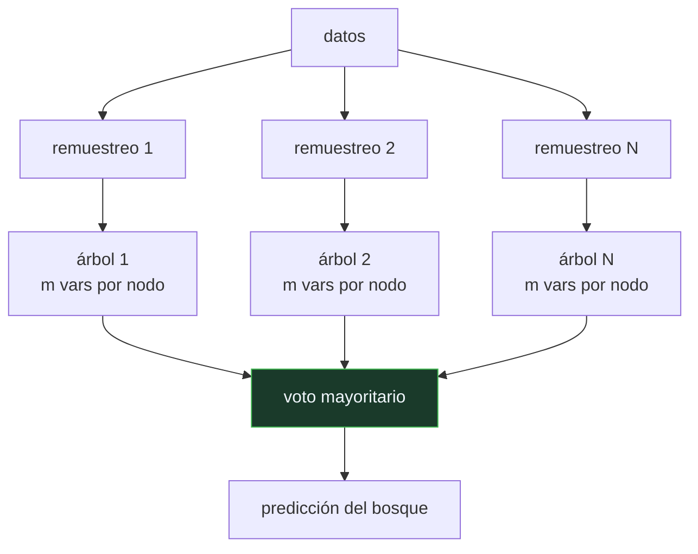

# P79 — Bosques aleatorios

> Ruta clásica · Empeorar cada árbol a propósito para mejorar el bosque. El error depende
> de la fuerza de los árboles y de su correlación, y hay que arbitrar entre las dos.

**Nivel:** L3 · **Motor:** `random_forest` · **Notebook:** [`P79_random_forest.ipynb`](../../../notebooks/papers/P79_random_forest.ipynb)
· **Anexo:** [probabilidad y verosimilitud](../../annexes/A02_PROBABILIDAD_Y_VEROSIMILITUD.md)

## 1. Identificación

| Campo | Valor |
|---|---|
| **Título original** | *Random Forests* |
| **Autoría** | Leo Breiman |
| **Año** | 2001 |
| **Venue** | Machine Learning, 45(1), 5–32 |
| **Fuente primaria** | [doi:10.1023/A:1010933404324](https://doi.org/10.1023/A:1010933404324) |
| **Acceso** | Restringido |
| **Fecha de consulta** | 2026-08-17 |

## 2. Problema anterior

El bagging —entrenar cada árbol sobre un remuestreo de los datos y votar— reducía la varianza y
funcionaba bien. Pero tenía un techo: los árboles seguían **pareciéndose demasiado**.

Ante los mismos datos, la misma variable dominante se elige en la raíz una y otra vez, y a partir
de ahí los árboles divergen poco. Promediar modelos que se equivocan en lo mismo no corrige nada:
el error común sobrevive al promedio.

## 3. Propuesta

Añadir una segunda fuente de azar, esta vez sobre las **preguntas** y no sobre los datos: en cada
nodo, considerar solo un subconjunto aleatorio de `m` variables.

El efecto es doble y va en direcciones opuestas. Cada árbol individual **empeora**, porque a veces
no puede usar la mejor variable. Y los árboles se **descorrelacionan**, porque cada uno se ve
obligado a explorar caminos distintos.

Breiman formaliza el compromiso con una cota: el error del bosque está acotado por
`ρ̄·(1 − s²)/s²`, con `ρ̄` la correlación media entre árboles y `s` su fuerza. Bajar `ρ̄` puede
compensar bajar `s`, y `m` es el mando que arbitra entre ambos.

## 4. Intuición sin fórmulas

Un jurado. Si todos han leído los mismos periódicos, doce opiniones valen una. Para que el jurado
aporte algo, sus miembros tienen que haberse informado por vías distintas — aunque cada uno esté
peor informado que un experto único.

**Dónde deja de funcionar la analogía:** un jurado mal informado a propósito sería un desastre.
Aquí funciona porque los errores individuales son en buena medida **independientes**, y al votar se
cancelan. Si los árboles fueran malos de la misma forma, el bosque heredaría el error.

## 5. Matemática mínima

```text
Error del bosque ≲ ρ̄·(1 − s²)/s²

    ρ̄ = correlación media entre las predicciones de dos árboles cualesquiera
    s  = fuerza media (margen esperado) de un árbol

bagging       → diversidad por los DATOS (remuestreo bootstrap)
subespacio m  → diversidad por las PREGUNTAS disponibles en cada nodo
out-of-bag    → cada árbol no vio ~37 % de los datos: validación gratis
```

La miniatura barre `m` sobre 200 ejemplos con 8 variables y árboles de profundidad 3:

| Variables por árbol | Error del árbol medio | Error del bosque | Acuerdo entre árboles |
|---:|---:|---:|---:|
| 8 | 0,3087 | **0,2167** | 0,7238 |
| 5 | 0,3707 | 0,3167 | 0,6007 |
| 3 | 0,3993 | 0,2667 | 0,5688 |
| 2 | 0,4047 | 0,2333 | 0,5399 |

Dos monotonías limpias: al bajar `m`, el **acuerdo cae** y el **árbol individual empeora**. El
error del bosque no es monótono: tiene un óptimo, y aquí está en `m = 8`. Ese es exactamente el
compromiso que describe la cota.

## 6. Arquitectura o flujo



## 7. Qué observar en el paper original

- La **cota** y su lectura: es la formalización del compromiso entre fuerza y correlación, y lo
  que convierte el método en algo más que una receta.
- La estimación **out-of-bag**: cada árbol no vio aproximadamente el 37 % de los datos, y evaluarlo
  sobre ellos da validación sin coste adicional. Es una de las aportaciones prácticas más útiles.
- La **importancia de variables por permutación**, que se popularizó desde aquí — con el sesgo que
  Strobl et al. documentaron después.
- La afirmación de que **no sobreajusta al añadir árboles**: la convergencia del error al aumentar
  N, que sí está demostrada.

## 8. Evidencia y resultados

Experimentos sobre numerosos conjuntos de referencia comparando con bagging, boosting y árboles
únicos, más el análisis teórico de la cota.

> El resultado empírico central es la robustez: rinde bien sobre muchos conjuntos distintos con
> hiperparámetros por defecto. Eso es lo que lo hizo tan usado.

La miniatura reproduce el mecanismo y las dos monotonías. El óptimo de `m` que sale aquí es de
estos datos concretos: la conclusión transferible es que el compromiso existe, no el valor.

## 9. Impacto

- Fue durante quince años el clasificador de referencia para datos tabulares, y sigue siendo la
  línea base obligatoria antes de intentar nada más complejo.
- El estudio de Fernández-Delgado et al. (2014), con 179 clasificadores sobre 121 conjuntos, lo
  situó en el primer puesto general.
- La **estimación out-of-bag** popularizó la idea de obtener validación sin reservar datos.
- La **importancia de variables** que introduce es hoy una herramienta estándar de análisis, con
  sus sesgos conocidos y documentados.

## 10. Limitaciones

1. **No es interpretable.** Un árbol se lee; quinientos no. La importancia de variables es un
   resumen, no una explicación.
2. **La importancia por defecto está sesgada** hacia variables con muchos niveles o alta
   cardinalidad (Strobl et al., 2007). La importancia por permutación corrige parte del problema.
3. **`m` es un hiperparámetro real.** La heurística `√p` es un punto de partida razonable, no una
   respuesta.
4. **Coste de memoria y de inferencia**: guardar y recorrer cientos de árboles no es gratis.
5. **Peor que el boosting en muchos problemas tabulares**, especialmente cuando hay tiempo para
   ajustar hiperparámetros.

## 11. Errores comunes

| Error | Corrección |
|---|---|
| «Más árboles siempre mejoran el bosque» | Reducen la varianza del voto y saturan pronto. No reducen el sesgo: si todos los árboles se equivocan igual, promediar mil devuelve el mismo error. |
| «Los árboles del bosque son mejores que un árbol solo» | Son PEORES individualmente, y a propósito. En la miniatura, el árbol medio empeora de 0,3087 a 0,4047 al bajar m de 8 a 2. |
| «Random forest es bagging con más árboles» | El bagging aporta diversidad por los datos. Random forest añade el subespacio aleatorio de variables, que es lo que descorrelaciona de verdad. |
| «La importancia de variables indica causalidad» | Indica cuánto usa el modelo cada variable. Con variables correlacionadas, la importancia se reparte entre ellas de forma arbitraria. |
| «m = √p es el valor correcto» | Es una heurística por defecto. La miniatura muestra que el óptimo depende de los datos: aquí gana usar todas las variables. |

## 12. Relación con trabajos anteriores

- **Breiman (1996)** — bagging: la primera mitad de la idea.
- **Ho (1998)** — subespacios aleatorios: la segunda mitad, planteada de forma independiente.
- **[P74 Árboles de decisión](../P74_id3/README.md) (1986)** — la unidad del conjunto, y su
  inestabilidad es justo lo que se aprovecha.

## 13. Relación con trabajos posteriores

- **[P80 Las dos culturas](../P80_dos_culturas/README.md) (2001)** — del mismo autor y del mismo
  año: el argumento de por qué esto es una forma legítima de hacer estadística.
- **Fernández-Delgado et al. (2014)** — la comparación masiva que lo consagró.
  [JMLR 15](https://www.jmlr.org/papers/v15/delgado14a.html)
- **Strobl et al. (2007)** — el sesgo de la importancia de variables.
  [doi:10.1186/1471-2105-8-25](https://doi.org/10.1186/1471-2105-8-25)
- **Chen y Guestrin (2016)** — XGBoost: la alternativa en serie que hoy suele ganarle.

## 14. Notebook asociado

[`P79_random_forest.ipynb`](../../../notebooks/papers/P79_random_forest.ipynb)

**Qué implementa:** un bosque con bagging y subespacio aleatorio de variables, con el barrido de `m` y las tres medidas: error del árbol medio, error del bosque y acuerdo entre árboles.

**Qué NO implementa:** no hay estimación out-of-bag, ni importancia de variables, ni árboles profundos. Con 25 árboles de profundidad 3 se ve el mecanismo, no el rendimiento real del método.

```bash
ai-evolution paper-lab P79 --seed 7
```

## 15. Actividades Bloom

| Nivel | Actividad |
|---|---|
| **Recordar** | Escribe las dos fuentes de azar de un bosque aleatorio. |
| **Explicar** | Explica por qué descorrelacionar los árboles mejora el conjunto. |
| **Aplicar** | Ejecuta el notebook y observa las dos monotonías del barrido de m. |
| **Analizar** | Analiza por qué el error del bosque no es monótono en m. |
| **Evaluar** | «Añadir árboles siempre mejora». Evalúa la afirmación. |
| **Crear** | Entrena un bosque real, barre m y dibuja las dos curvas; compara el óptimo con la heurística √p. |

## 16. Autoevaluación

1. ¿Qué dos fuentes de azar usa un bosque aleatorio?
2. ¿Qué dice la cota de Breiman?
3. ¿Qué le pasa al árbol individual al bajar m?
4. ¿Y al acuerdo entre árboles?
5. ¿Por qué existe un valor óptimo de m?
6. ¿Qué es la estimación out-of-bag?
7. ¿Es interpretable un bosque?

## 17. Respuestas esperadas

1. El remuestreo bootstrap de los datos (bagging) y el subconjunto aleatorio de variables considerado en cada nodo (subespacio aleatorio).
2. Que el error del bosque está acotado por `ρ̄(1−s²)/s²`: depende de la correlación media entre árboles y de su fuerza individual. Bajar la correlación puede compensar bajar la fuerza.
3. Empeora. En la miniatura, el error del árbol medio sube de 0,3087 a 0,4047 al pasar de 8 variables por nodo a 2.
4. Baja. El acuerdo cae de 0,7238 a 0,5399 en el mismo barrido: los árboles exploran caminos distintos y se equivocan de formas distintas.
5. Porque las dos cantidades de la cota se mueven en direcciones opuestas al variar m. El óptimo depende de los datos: en la miniatura está en m = 8.
6. Evaluar cada árbol sobre los ejemplos que su remuestreo no incluyó —alrededor del 37 %—. Da una estimación de validación sin reservar datos.
7. No en el sentido de un árbol único. La importancia de variables es un resumen útil, con sesgos conocidos, no una explicación de decisiones individuales.

## 18. Fuentes primarias

- Breiman, L. (2001). *Random Forests*. **Machine Learning**, 45(1), 5–32.
  [doi:10.1023/A:1010933404324](https://doi.org/10.1023/A:1010933404324) · consultado 2026-08-17.
- Fernández-Delgado, M. et al. (2014). *Do we Need Hundreds of Classifiers to Solve Real World
  Classification Problems?* [JMLR 15](https://www.jmlr.org/papers/v15/delgado14a.html) ·
  consultado 2026-08-17.
- Strobl, C. et al. (2007). *Bias in random forest variable importance measures*.
  [doi:10.1186/1471-2105-8-25](https://doi.org/10.1186/1471-2105-8-25) · consultado 2026-08-17.

---

[⬅️ Anterior: P78 AdaBoost](../P78_adaboost/README.md) ·
[📇 Índice](../../catalog/PAPERS_INDEX.md) ·
[📝 Evaluación](../../../assessments/papers/P79_random_forest.md) ·
[🏫 Clase 041 · Random forest, boosting y ensembles](../../../classes/part-03-classical-machine-learning/041-random-forest-boosting-y-ensembles/README.md) ·
[➡️ Siguiente: P80 Las dos culturas](../P80_dos_culturas/README.md)
