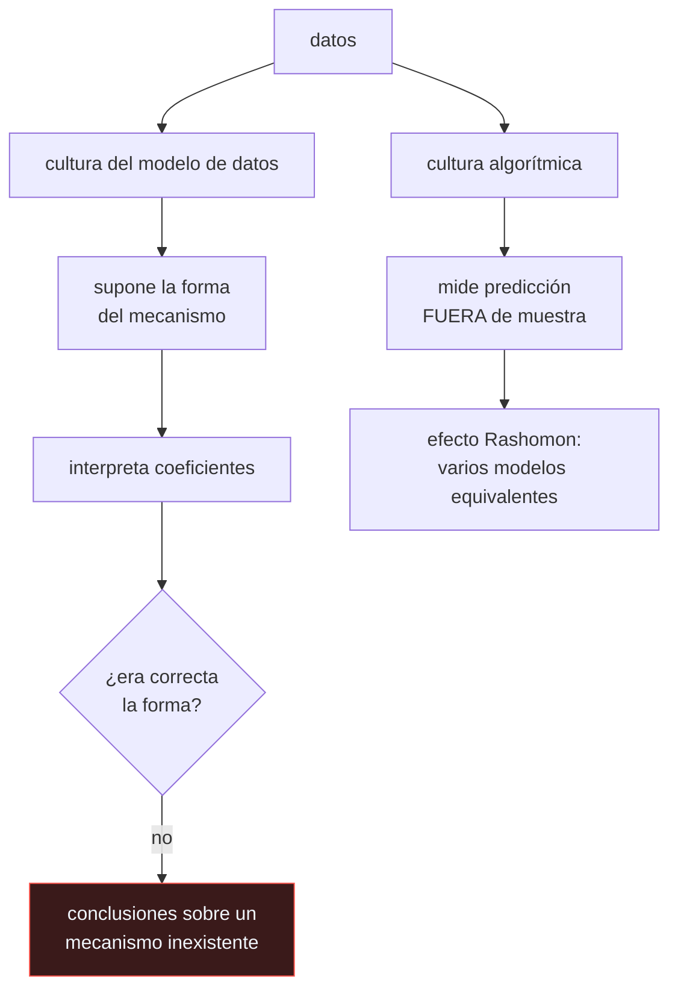

# P80 — Las dos culturas

> Ruta clásica · No propone un método: propone una discusión sobre para qué sirve un
> modelo. Y advierte de que muchos modelos casi iguales cuentan historias distintas.

**Nivel:** L1 · **Motor:** `dos_culturas` · **Notebook:** [`P80_dos_culturas.ipynb`](../../../notebooks/papers/P80_dos_culturas.ipynb)
· **Anexo:** [probabilidad y verosimilitud](../../annexes/A02_PROBABILIDAD_Y_VEROSIMILITUD.md)

## 1. Identificación

| Campo | Valor |
|---|---|
| **Título original** | *Statistical Modeling: The Two Cultures* |
| **Autoría** | Leo Breiman |
| **Año** | 2001 |
| **Venue** | Statistical Science, 16(3), 199–231 · con comentarios y réplica |
| **Fuente primaria** | [doi:10.1214/ss/1009213726](https://doi.org/10.1214/ss/1009213726) |
| **Acceso** | Abierto |
| **Fecha de consulta** | 2026-08-17 |

## 2. Problema anterior

La estadística académica trabajaba —según Breiman, en un 98 %— suponiendo que los datos son
generados por un modelo estocástico de forma conocida: lineal, logístico, de Cox. El trabajo
consistía en estimar sus parámetros, validar sus supuestos e interpretar sus coeficientes.

El problema es que ese supuesto casi nunca es cierto. Y si la forma es falsa, la validación de
supuestos detecta poco, los coeficientes describen un mecanismo que no existe, y las conclusiones
sobre «el efecto de esta variable» no se sostienen sobre nada.

## 3. Propuesta

Distinguir dos culturas y, sobre todo, sus criterios de éxito:

- **cultura del modelo de datos**: supone la forma del mecanismo, valida supuestos, interpreta
  coeficientes;
- **cultura algorítmica**: trata el mecanismo como desconocido, admite modelos difíciles de leer y
  se juzga por **exactitud predictiva medida fuera de muestra**.

Y una advertencia que es el argumento más incómodo del artículo: el **efecto Rashomon**. Suele
haber muchos modelos con exactitud casi idéntica y explicaciones incompatibles entre sí. Si es así,
la explicación no está determinada por los datos.

## 4. Intuición sin fórmulas

Un mapa y un GPS. El mapa te enseña la estructura de la ciudad; el GPS te lleva. Si el mapa está
mal dibujado, seguirás creyendo que entiendes la ciudad mientras te pierdes.

Breiman no dice que los mapas no sirvan. Dice que hay que comprobar si el mapa se parece a la
ciudad antes de usarlo para explicar por qué las calles están donde están — y que esa comprobación
casi nunca se hacía.

**Dónde deja de funcionar la analogía:** un GPS que te lleva bien no te enseña nada de la ciudad, y
eso es una pérdida real. El artículo lo reconoce; lo que niega es que un mapa equivocado sea mejor
que un GPS por el hecho de ser un mapa.

## 5. Matemática mínima

No hay formalismo: es un artículo de posición. Lo que sí se puede exhibir es el mecanismo del
efecto Rashomon.

La miniatura genera datos donde `y` depende de una **interacción** `x₁·x₂` más un término lineal, e
incluye `x₄`, copia ruidosa de `x₁`:

| Enfoque | Exactitud fuera de muestra |
|---|---:|
| lineal en las variables originales | 0,70 |
| con el término de interacción | **0,90** |

Y cuatro modelos distintos con exactitudes entre **0,8625 y 0,90** —una banda de 0,0375— con
coeficientes muy distintos para `x₁` y para su copia `x₄`.

Todos «explican» los datos. No cuentan la misma historia. Elegir uno e interpretar sus coeficientes
es elegir una narración entre varias compatibles con la evidencia.

## 6. Arquitectura o flujo



## 7. Qué observar en el paper original

- El dato con el que abre: que el 98 % de los estadísticos trabajaban en la primera cultura. Es
  una provocación deliberada y funcionó.
- Los tres **dilemas** que enuncia: Rashomon (multiplicidad de modelos buenos), Occam (el conflicto
  entre simplicidad y exactitud) y Bellman (la dimensionalidad, que resulta ser una ventaja y no
  solo una maldición).
- Los **comentarios de Cox, Efron y Parzen** publicados junto al artículo, y la réplica de Breiman.
  Leer la discusión completa vale más que el artículo solo.
- La distinción entre **validar supuestos** y **medir predicción**, que es el punto operativo.

## 8. Evidencia y resultados

Es un artículo de posición argumentado con ejemplos de la práctica del autor como consultor y con
resultados de la literatura, no un estudio empírico.

> El propio formato lo dice: se publica con comentarios de tres estadísticos de primera línea y una
> réplica. Es una discusión, y hay que leerla como tal.

La miniatura no reproduce nada del artículo: construye el caso mínimo donde el mecanismo real es
una interacción, para que se vea qué pasa cuando la forma supuesta es falsa y cuántos modelos
distintos alcanzan una exactitud parecida.

## 9. Impacto

- Es el artículo más citado de la relación entre estadística y aprendizaje automático, y el que dio
  vocabulario a una discusión que llevaba décadas sin nombre.
- La exigencia de **medir fuera de muestra** como criterio principal es hoy la práctica estándar, y
  buena parte del mérito es de este texto.
- El **efecto Rashomon** se ha convertido en un concepto propio, con literatura sobre conjuntos de
  modelos equivalentes y sobre lo que se puede y no se puede concluir de ellos.
- Y sigue vivo en la discusión sobre interpretabilidad: Rudin (2019) argumenta, contra Breiman, que
  en decisiones de alto riesgo hay que exigir modelos interpretables por diseño.

## 10. Limitaciones

1. **La dicotomía es una simplificación** y el propio Breiman lo admite en la réplica: hay trabajo
   que no cae limpiamente en ninguna cultura.
2. **No resuelve cuándo la interpretación está justificada**, que es lo que a menudo se necesita
   decidir.
3. **El 98 % es retórico**, no una medición.
4. **La exactitud predictiva no siempre es el objetivo.** En ciencia básica, en política pública o
   en medicina, entender el mecanismo puede importar más que predecir.
5. **Veinte años después el panorama es otro**: los modelos algorítmicos ganaron, y con ellos
   llegaron problemas —opacidad, sesgo, imposibilidad de auditar— que este artículo no anticipa.

## 11. Errores comunes

| Error | Corrección |
|---|---|
| «Breiman dice que los modelos estadísticos no sirven» | Dice que suponer una forma sin comprobarla y luego interpretar sus coeficientes no está justificado. Es una crítica al procedimiento, no a la herramienta. |
| «La cultura algorítmica ignora la interpretabilidad» | Propone medidas propias —importancia de variables, análisis de sensibilidad— y renuncia a interpretar coeficientes de un modelo cuya forma no se ha validado. |
| «Si dos modelos aciertan lo mismo, dan la misma explicación» | Es exactamente lo contrario: el efecto Rashomon. En la miniatura, cuatro modelos en una banda de 0,0375 con coeficientes muy distintos. |
| «Basta con validar los supuestos del modelo» | Las pruebas de bondad de ajuste tienen poca potencia con muchas variables. Que no rechacen no significa que la forma sea correcta. |
| «El artículo resolvió la discusión» | La abrió. Rudin (2019) argumenta lo contrario para decisiones de alto riesgo, y la discusión sigue viva. |

## 12. Relación con trabajos anteriores

- **[P79 Bosques aleatorios](../P79_random_forest/README.md) (2001)** — del mismo autor y del
  mismo año: el método que este artículo defiende conceptualmente.
- **[P76 Validación cruzada](../P76_validacion_cruzada/README.md) (1995)** — la herramienta que
  hace posible el criterio de la cultura algorítmica.
- **[P75 Vectores soporte](../P75_svm/README.md) (1995)** — otro ejemplo de la segunda cultura, con
  justificación teórica propia.

## 13. Relación con trabajos posteriores

- **Efron (2020)** — el balance de las dos culturas veinte años después.
  [doi:10.1080/01621459.2020.1762613](https://doi.org/10.1080/01621459.2020.1762613)
- **Rudin (2019)** — el argumento contrario: en decisiones de alto riesgo, exigir modelos
  interpretables. [doi:10.1038/s42256-019-0048-x](https://doi.org/10.1038/s42256-019-0048-x)
- **[P82 Calibración](../P82_calibracion/README.md) (2005)** — qué medir cuando el objetivo es
  predecir bien y no solo ordenar.
- **[P62 Validez de benchmarks](../P62_benchmark_validez/README.md) (2021)** — la otra cara: qué
  pasa cuando el criterio de exactitud tampoco mide lo que dice.

## 14. Notebook asociado

[`P80_dos_culturas.ipynb`](../../../notebooks/papers/P80_dos_culturas.ipynb)

**Qué implementa:** el contraste entre un modelo lineal y uno con la interacción sobre datos cuyo mecanismo real se conoce, y cuatro modelos Rashomon con exactitudes parecidas y coeficientes distintos.

**Qué NO implementa:** las dos culturas se implementan aquí con regresión logística y distintos rasgos. En el artículo la cultura algorítmica son bosques y SVM, y el mecanismo real nunca se conoce.

```bash
ai-evolution paper-lab P80 --seed 7
```

## 15. Actividades Bloom

| Nivel | Actividad |
|---|---|
| **Recordar** | Describe las dos culturas y su criterio de éxito. |
| **Explicar** | Explica qué es el efecto Rashomon. |
| **Aplicar** | Ejecuta el notebook y compara los coeficientes de x1 y x4 entre los modelos Rashomon. |
| **Analizar** | Analiza por qué interpretar coeficientes de un modelo mal especificado es problemático. |
| **Evaluar** | «Los dos modelos aciertan igual, luego dan la misma explicación». Evalúa la afirmación. |
| **Crear** | Ajusta tres modelos de familias distintas con exactitudes parecidas y compara qué variable señala cada uno como importante. |

## 16. Autoevaluación

1. ¿Cuáles son las dos culturas?
2. ¿Qué critica Breiman de la primera?
3. ¿Qué es el efecto Rashomon?
4. ¿Qué consecuencia tiene para la interpretación de coeficientes?
5. ¿Qué criterio propone la cultura algorítmica?
6. ¿Cuál es la principal limitación del argumento?
7. ¿Qué dice hoy la discusión sobre interpretabilidad?

## 17. Respuestas esperadas

1. La del modelo de datos, que supone un mecanismo generador de forma conocida, y la algorítmica, que trata el mecanismo como desconocido y se juzga por predicción fuera de muestra.
2. Que suponer la forma sin comprobarla y después interpretar los coeficientes como «el efecto» de cada variable no está justificado: si la forma es falsa, esos números describen un mecanismo inexistente.
3. Que suele haber muchos modelos con exactitud casi idéntica y explicaciones incompatibles entre sí. En la miniatura, cuatro modelos en una banda de 0,0375 con coeficientes muy distintos.
4. Que la explicación no está determinada por los datos. Elegir un modelo e interpretar sus coeficientes es elegir una narración entre varias igual de compatibles con la evidencia.
5. La exactitud predictiva medida **fuera de muestra**, sobre datos que el modelo no usó ni para entrenar ni para elegir hiperparámetros.
6. Que la dicotomía es una simplificación —el propio autor lo admite— y que no dice cuándo la interpretación sí está justificada, que es lo que a menudo hay que decidir.
7. Que en decisiones de alto riesgo conviene exigir modelos interpretables **por diseño** en lugar de explicar cajas negras a posteriori (Rudin, 2019). Es el contraargumento vivo.

## 18. Fuentes primarias

- Breiman, L. (2001). *Statistical Modeling: The Two Cultures*. **Statistical Science**, 16(3),
  199–231. [doi:10.1214/ss/1009213726](https://doi.org/10.1214/ss/1009213726) ·
  consultado 2026-08-17.
- Efron, B. (2020). *Prediction, Estimation, and Attribution*.
  [doi:10.1080/01621459.2020.1762613](https://doi.org/10.1080/01621459.2020.1762613) ·
  consultado 2026-08-17.
- Rudin, C. (2019). *Stop Explaining Black Box Machine Learning Models for High Stakes Decisions*.
  [doi:10.1038/s42256-019-0048-x](https://doi.org/10.1038/s42256-019-0048-x) ·
  consultado 2026-08-17.

---

[⬅️ Anterior: P79 Bosques aleatorios](../P79_random_forest/README.md) ·
[📇 Índice](../../catalog/PAPERS_INDEX.md) ·
[📝 Evaluación](../../../assessments/papers/P80_dos_culturas.md) ·
[🏫 Clase 047 · Métricas, calibración, sesgo y costo de error](../../../classes/part-03-classical-machine-learning/047-metricas-calibracion-sesgo-y-costo-de-error/README.md) ·
[➡️ Siguiente: P81 Selección de variables](../P81_seleccion_de_caracteristicas/README.md)
