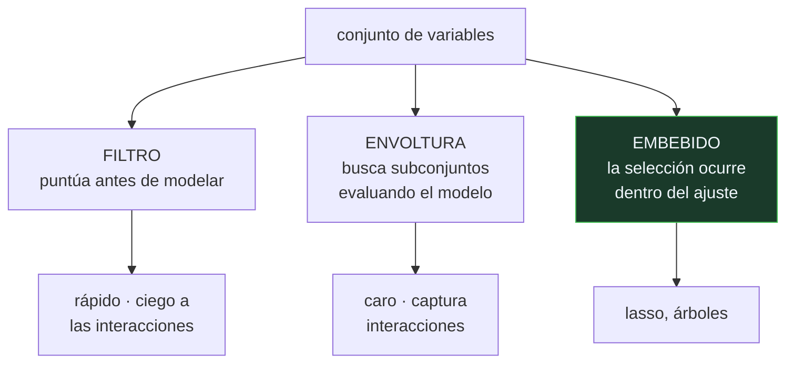

# P81 — Selección de variables

> Ruta clásica · Ordenar variables por su correlación con la etiqueta falla en las dos
> direcciones, y el artículo lo demuestra con contraejemplos que caben en una figura.

**Nivel:** L3 · **Motor:** `seleccion_de_caracteristicas` · **Notebook:** [`P81_seleccion_de_caracteristicas.ipynb`](../../../notebooks/papers/P81_seleccion_de_caracteristicas.ipynb)
· **Anexo:** [probabilidad y verosimilitud](../../annexes/A02_PROBABILIDAD_Y_VEROSIMILITUD.md)

## 1. Identificación

| Campo | Valor |
|---|---|
| **Título original** | *An Introduction to Variable and Feature Selection* |
| **Autoría** | Isabelle Guyon, André Elisseeff |
| **Año** | 2003 |
| **Venue** | Journal of Machine Learning Research, 3, 1157–1182 |
| **Fuente primaria** | [JMLR 3:1157–1182](https://www.jmlr.org/papers/v3/guyon03a.html) |
| **Acceso** | Abierto |
| **Fecha de consulta** | 2026-08-17 |

## 2. Problema anterior

Con miles de variables y pocas muestras —el caso típico en genómica o en texto— hay que reducir
antes de modelar. El método habitual era ordenar las variables por su correlación con la etiqueta y
quedarse con las primeras.

Es rápido, es intuitivo y falla de dos formas que casi nadie enunciaba: descarta variables que
solas no informan pero juntas lo determinan todo, y descarta como «redundantes» variables que
juntas cancelan ruido.

## 3. Propuesta

Un marco que ordena el problema en tres familias:

- **filtros**: puntúan variables antes de modelar, con un criterio propio;
- **envolturas**: usan el modelo como caja negra y buscan el subconjunto que mejor rinde;
- **métodos embebidos**: la selección ocurre dentro del ajuste, como en el
  [lasso](../P77_lasso/README.md).

Y dos advertencias con contraejemplo, que son la parte que se recuerda:

1. una variable **inútil por separado puede ser imprescindible acompañada**;
2. dos variables **redundantes pueden ser mejores juntas** que cualquiera de ellas sola.

## 4. Intuición sin fórmulas

Elegir a los miembros de un equipo por su rendimiento individual. Dos jugadores mediocres pueden
funcionar perfectamente juntos, y un fichaje estrella puede no aportar nada si duplica lo que ya
tienes.

Y al revés: dos jugadores que hacen lo mismo no siempre sobran, porque entre los dos cometen menos
errores que cualquiera solo.

**Dónde deja de funcionar la analogía:** en un equipo la complementariedad se ve a simple vista.
Aquí no: la correlación de cada variable con la etiqueta puede ser exactamente cero mientras el par
determina la respuesta por completo.

## 5. Matemática mínima

```text
Caso 1 — complementariedad (XOR):
    a, b ∈ {−1, +1},   y = 1  si  a·b > 0
    corr(a, y) ≈ 0     corr(b, y) ≈ 0     y el par la determina por completo

Caso 2 — redundancia útil:
    r₁ = señal + ruido₁,   r₂ = señal + ruido₂,  ruidos independientes
    Var[(r₁+r₂)/2] = Var[ruido]/2   ← promediar cancela ruido
```

La miniatura mide los dos casos sobre 400 observaciones:

| Situación | Resultado |
|---|---|
| exactitud con «a» sola | 0,5 |
| exactitud con «b» sola | 0,5083 |
| exactitud con las dos | **1,0** |
| correlaciones univariantes de a y b con `y` | 0,0903 y 0,0091 |
| error estimando con «r₁» sola | 0,5379 |
| error promediando «r₁» y «r₂» | **0,3003** |

Un ranking por correlación descarta «a» y «b» antes de llegar a mirarlas juntas, y descarta «r₂»
por redundante justo cuando promediarla es lo que reduce el error.

## 6. Arquitectura o flujo



## 7. Qué observar en el paper original

- Las **dos figuras de contraejemplo**, que son lo más citado del artículo y lo que hay que tener
  presente cada vez que alguien ordena variables por correlación.
- La distinción entre **relevancia** y **utilidad**: una variable puede ser relevante y no aportar
  nada dado el resto, y al revés.
- La discusión sobre **validación**: seleccionar variables usando todos los datos y después evaluar
  con validación cruzada es una fuga de información, y produce estimaciones optimistas.
- La sección práctica con la lista de comprobación, que sigue siendo un buen punto de partida.

## 8. Evidencia y resultados

Es un artículo de revisión y síntesis, con contraejemplos construidos y referencias a los
resultados de las competiciones de selección de variables del NIPS.

> Su valor no está en un resultado nuevo sino en organizar el campo y en enunciar con precisión dos
> modos de fallo que se cometían —y se cometen— constantemente.

La miniatura construye los dos contraejemplos con datos sintéticos y los mide, que es la única
forma de que «una variable inútil sola puede ser imprescindible» deje de ser una frase y pase a ser
un número.

## 9. Impacto

- Es la referencia estándar sobre selección de variables y una de las más citadas de JMLR.
- Su taxonomía —filtros, envolturas, embebidos— es la que se usa para clasificar cualquier método
  nuevo.
- La advertencia sobre la fuga de información al seleccionar antes de validar corrigió una práctica
  muy extendida, especialmente en bioinformática.
- Y su tesis central sobrevive al cambio de paradigma: en la era de los modelos que aprenden sus
  propias representaciones, la pregunta «¿qué aporta esta variable **dadas las demás**?» sigue
  siendo la correcta, y es la que responden métodos como SHAP.

## 10. Limitaciones

1. **Es de 2003.** El panorama previo a los modelos que aprenden representaciones; muchas técnicas
   concretas están superadas.
2. **No resuelve la inestabilidad de la selección**: con datos correlacionados, el conjunto elegido
   cambia con pequeñas variaciones de la muestra.
3. **Las envolturas son caras** y el artículo no ofrece un criterio claro de cuándo compensan.
4. **Los contraejemplos son extremos.** En datos reales la complementariedad suele ser parcial y el
   ranking univariante no falla de forma tan limpia.
5. **No cubre la selección causal**: qué variables *hay que* incluir para estimar un efecto es otro
   problema, con otras reglas.

## 11. Errores comunes

| Error | Corrección |
|---|---|
| «Las variables con baja correlación con la etiqueta se pueden descartar» | En el ejemplo XOR, ambas tienen correlación casi nula y juntas determinan la etiqueta por completo. |
| «Las variables correlacionadas entre sí son redundantes» | Si sus ruidos son independientes, promediarlas reduce la varianza. «Redundante» es una propiedad de la información, no de la correlación. |
| «Seleccionar variables y luego validar con validación cruzada es correcto» | Si la selección usó todos los datos, la validación posterior está contaminada. La selección tiene que ocurrir dentro de cada pliegue. |
| «Menos variables siempre generaliza mejor» | Reducir ayuda cuando hay ruido y pocas muestras. Quitar variables complementarias empeora, y el ranking univariante es precisamente el método que las quita. |
| «Con modelos profundos ya no hace falta seleccionar» | Cambia el método, no la pregunta. «¿Qué aporta esta variable dadas las demás?» sigue siendo lo que responden los métodos de atribución. |

## 12. Relación con trabajos anteriores

- **[P77 Lasso](../P77_lasso/README.md) (1996)** — el ejemplo canónico de método embebido.
- **Kohavi y John (1997)** — las envolturas para selección de subconjuntos.
  [doi:10.1016/S0004-3702(97)00043-X](https://doi.org/10.1016/S0004-3702%2897%2900043-X)
- **[P76 Validación cruzada](../P76_validacion_cruzada/README.md) (1995)** — el estimador que hay
  que usar bien para no contaminar la selección.

## 13. Relación con trabajos posteriores

- **Lundberg y Lee (2017)** — SHAP: atribución con garantías de la teoría de juegos.
  [arXiv:1705.07874](https://arxiv.org/abs/1705.07874)
- **[P52 Superposición](../P52_superposition/README.md) (2023)** — la misma pregunta dentro de un
  modelo denso: qué representa cada dirección.
- **[P80 Las dos culturas](../P80_dos_culturas/README.md) (2001)** — por qué la importancia de una
  variable depende del modelo que se ajuste.

## 14. Notebook asociado

[`P81_seleccion_de_caracteristicas.ipynb`](../../../notebooks/papers/P81_seleccion_de_caracteristicas.ipynb)

**Qué implementa:** los dos contraejemplos medidos: complementariedad tipo XOR con correlaciones univariantes casi nulas, y reducción de ruido al promediar dos variables «redundantes».

**Qué NO implementa:** no hay envolturas, ni métodos embebidos, ni estabilidad de la selección. Los clasificadores son reglas de una línea: se aísla la relación entre variables y etiqueta.

```bash
ai-evolution paper-lab P81 --seed 7
```

## 15. Actividades Bloom

| Nivel | Actividad |
|---|---|
| **Recordar** | Enumera las tres familias de métodos de selección. |
| **Explicar** | Explica por qué una variable con correlación nula puede ser imprescindible. |
| **Aplicar** | Ejecuta el notebook y comprueba las exactitudes por separado y conjuntas. |
| **Analizar** | Analiza por qué promediar dos variables «redundantes» reduce el error. |
| **Evaluar** | «Estas dos variables están correlacionadas, quito una». Evalúa la decisión. |
| **Crear** | Compara ranking univariante, selección hacia delante y lasso sobre un conjunto propio. |

## 16. Autoevaluación

1. ¿Qué tres familias de métodos distingue el artículo?
2. ¿Cuál es el primer modo de fallo del ranking univariante?
3. ¿Y el segundo?
4. ¿Por qué promediar dos variables ruidosas ayuda?
5. ¿Qué error de validación advierte el artículo?
6. ¿A qué familia pertenece el lasso?
7. ¿Sigue siendo pertinente con modelos que aprenden representaciones?

## 17. Respuestas esperadas

1. Filtros, que puntúan las variables antes de modelar; envolturas, que buscan subconjuntos evaluando el modelo; y métodos embebidos, donde la selección ocurre dentro del ajuste.
2. Que descarta variables complementarias: en el caso XOR, «a» y «b» tienen correlación casi nula con la etiqueta y juntas la determinan por completo.
3. Que descarta variables «redundantes» que en realidad reducen ruido. Promediar dos medidas de la misma señal con ruidos independientes baja el error a la mitad de la varianza.
4. Porque los ruidos son independientes y se cancelan parcialmente al promediar, mientras la señal común se conserva. En la miniatura, el error baja de 0,5379 a 0,3003.
5. Seleccionar variables usando todos los datos y validar después. La selección ya vio el conjunto de test, y la estimación resultante es optimista.
6. A la de los métodos embebidos: la penalización L1 selecciona mientras estima, dentro del mismo problema de optimización.
7. Sí. Cambia el método —hoy se usan atribuciones como SHAP— pero la pregunta es la misma: qué aporta esta variable **dadas las demás**.

## 18. Fuentes primarias

- Guyon, I. y Elisseeff, A. (2003). *An Introduction to Variable and Feature Selection*.
  **JMLR**, 3, 1157–1182. [JMLR](https://www.jmlr.org/papers/v3/guyon03a.html) ·
  consultado 2026-08-17.
- Kohavi, R. y John, G. (1997). *Wrappers for feature subset selection*.
  [doi:10.1016/S0004-3702(97)00043-X](https://doi.org/10.1016/S0004-3702%2897%2900043-X) ·
  consultado 2026-08-17.
- Lundberg, S. y Lee, S.-I. (2017). *A Unified Approach to Interpreting Model Predictions*.
  [arXiv:1705.07874](https://arxiv.org/abs/1705.07874) · consultado 2026-08-17.

---

[⬅️ Anterior: P80 Las dos culturas](../P80_dos_culturas/README.md) ·
[📇 Índice](../../catalog/PAPERS_INDEX.md) ·
[📝 Evaluación](../../../assessments/papers/P81_seleccion_de_caracteristicas.md) ·
[🏫 Clase 042 · Ingeniería y selección de características](../../../classes/part-03-classical-machine-learning/042-ingenieria-y-seleccion-de-caracteristicas/README.md) ·
[➡️ Siguiente: P82 Calibración](../P82_calibracion/README.md)
