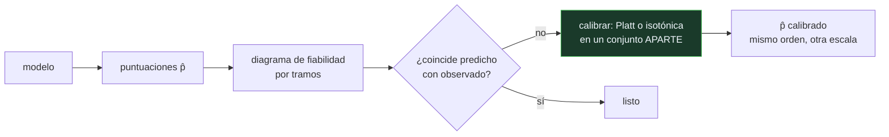

# P82 — Calibración

> Ruta clásica · Ordenar bien no es estimar bien. Un modelo con AUC excelente puede tener
> probabilidades sistemáticamente sesgadas, y nadie lo nota si no se mide.

**Nivel:** L3 · **Motor:** `calibracion` · **Notebook:** [`P82_calibracion.ipynb`](../../../notebooks/papers/P82_calibracion.ipynb)
· **Anexo:** [probabilidad y verosimilitud](../../annexes/A02_PROBABILIDAD_Y_VEROSIMILITUD.md)

## 1. Identificación

| Campo | Valor |
|---|---|
| **Título original** | *Predicting Good Probabilities with Supervised Learning* |
| **Autoría** | Alexandru Niculescu-Mizil, Rich Caruana |
| **Año** | 2005 |
| **Venue** | ICML '05, 625–632 |
| **Fuente primaria** | [doi:10.1145/1102351.1102430](https://doi.org/10.1145/1102351.1102430) |
| **Acceso** | Restringido |
| **Fecha de consulta** | 2026-08-17 |

## 2. Problema anterior

La salida de un clasificador se trata rutinariamente como una probabilidad: se compara con un
umbral de coste, se combina con otra, se le enseña a una persona que tiene que decidir.

Pero las métricas de uso común —exactitud, AUC— solo miden si el **orden** es correcto. Un modelo
puede ordenar perfectamente y devolver números que no corresponden a ninguna frecuencia real, y
ninguna de esas métricas lo delata. Peor: distintas familias de modelos se descalibran de formas
características y distintas, y nadie lo había caracterizado.

## 3. Propuesta

Medir la calibración como propiedad aparte, con dos herramientas:

- el **diagrama de fiabilidad**: agrupar las predicciones por tramos y comparar la probabilidad
  media predicha con la frecuencia observada en cada tramo;
- puntuaciones propias como el **Brier**, que penalizan orden y calibración a la vez.

Y corregirla con dos métodos que **no alteran el orden**: el escalado de Platt —ajustar una
sigmoide sobre las salidas— y la **regresión isotónica** —una función monótona por tramos ajustada
a los datos—.

El artículo caracteriza además cómo se descalibra cada familia: los bosques y el boosting empujan
hacia el centro, el bayes ingenuo hacia los extremos.

## 4. Intuición sin fórmulas

Un meteorólogo que siempre acierta cuál de dos días llueve más, pero cuyos porcentajes no
significan nada: dice 90 % los días que llueve el 60 % de las veces.

Para decidir si llevas paraguas cuando te lo dice al 90 %, el orden no basta. Necesitas que el
número corresponda a una frecuencia.

**Dónde deja de funcionar la analogía:** el meteorólogo puede aprender de su historial. Un modelo
no se recalibra solo: hay que hacerlo explícitamente y —esto es lo que más se olvida— con datos
distintos de los que se usaron para entrenarlo.

## 5. Matemática mínima

```text
Calibrado ⟺ P(y = 1 | p̂ = p) = p   para todo p

Diagrama de fiabilidad: por tramo, comparar  p̂ media  con  frecuencia observada
Brier = (1/n)·Σ (p̂ᵢ − yᵢ)²          ← orden Y calibración a la vez

Corrección monótona → no cambia el orden → no cambia el AUC
```

La miniatura simula un modelo que **ordena bien y exagera hacia los extremos**:

| Medida | Antes | Después de calibrar |
|---|---:|---:|
| AUC | 0,8214 | 0,8268 |
| Brier | 0,1774 | **0,1673** |
| error medio de calibración | 0,0542 | 0,0 |

El AUC apenas se mueve —lo poco que cambia son empates que introduce el troceado— y el Brier baja.
La calibración **reescala, no reordena**.

> Ese 0,0 final está medido sobre los mismos datos con los que se calibró, así que es optimista por
> construcción. En un caso real hay que reservar un conjunto aparte.

<!-- puente:inicio -->
> [!TIP]
> **Puente matemático.** Esta sección da por sabido lo siguiente. Si algo no te suena,
> léelo primero: está explicado una sola vez, en un solo sitio, y sirve para todas las fichas.

| Dónde | Qué necesitas de ahí |
|---|---|
| [**A02 §3** · Verosimilitud y entropía cruzada](../../annexes/A02_PROBABILIDAD_Y_VEROSIMILITUD.md#3-verosimilitud-y-entropía-cruzada) | por qué una pérdida propia premia decir la probabilidad correcta y no la más segura |
<!-- puente:fin -->

## 6. Arquitectura o flujo



## 7. Qué observar en el paper original

- La **caracterización por familias**: qué modelos se descalibran hacia el centro y cuáles hacia
  los extremos, y por qué. Es la parte más útil en la práctica.
- La comparación entre **Platt e isotónica**: la sigmoide necesita menos datos y supone una forma;
  la isotónica es más flexible y sobreajusta con pocos datos.
- La insistencia en **calibrar con un conjunto reservado**. Es el error más frecuente al aplicar
  estas técnicas.
- Las **métricas propias** y por qué importan: una métrica propia se optimiza diciendo la
  probabilidad verdadera, no la más conveniente.

## 8. Evidencia y resultados

Estudio empírico amplio sobre múltiples conjuntos y familias de modelos —bosques, boosting, SVM,
redes, bayes ingenuo, árboles— con y sin calibración, midiendo varias métricas.

> Es un artículo de medición sistemática: su aportación es el mapa de qué familia se descalibra
> cómo, y qué corrección le conviene a cada una.

La miniatura simula un modelo mal calibrado a partir de una probabilidad real conocida, que en un
problema de verdad no se observa. Sirve para exhibir la diferencia entre orden y estimación, no
para reproducir el estudio.

## 9. Impacto

- Fijó la calibración como propiedad que hay que **medir y reportar**, no suponer.
- El diagrama de fiabilidad y el Brier son hoy herramientas estándar en cualquier evaluación seria
  de clasificadores probabilísticos.
- El problema resurgió con fuerza en aprendizaje profundo: Guo et al. (2017) mostraron que las
  redes modernas están **peor calibradas** que las de los noventa pese a ser más exactas.
- Y es directamente relevante para los modelos de lenguaje: la confianza expresada por un modelo
  —en logits o en palabras— rara vez está calibrada, y se usa constantemente como si lo estuviera.

## 10. Limitaciones

1. **Calibrar exige datos reservados.** Hacerlo sobre los mismos datos de evaluación da un
   resultado optimista, como el 0,0 de la miniatura.
2. **La calibración es específica de la distribución.** Si cambia la población, hay que recalibrar.
3. **La isotónica sobreajusta con pocos datos**; Platt supone una forma sigmoide que puede no
   valer.
4. **No arregla el orden.** Un modelo que ordena mal seguirá ordenando mal después de calibrar.
5. **Calibración global no implica calibración por subgrupos**: un modelo puede estar calibrado en
   conjunto y sesgado en un subgrupo concreto, que es el problema de equidad.

## 11. Errores comunes

| Error | Corrección |
|---|---|
| «Un AUC alto implica buenas probabilidades» | El AUC solo mide el orden. La miniatura tiene AUC 0,82 y un error medio de calibración de 0,054. |
| «La calibración mejora la exactitud» | No cambia el orden y por tanto no cambia las decisiones con un umbral fijo del 0,5. Cambia las decisiones cuando el umbral es otro, y las probabilidades que se comunican. |
| «Se puede calibrar con los datos de evaluación» | Eso sobreajusta la calibración. Hace falta un conjunto reservado, igual que para cualquier otro ajuste. |
| «Las redes modernas están bien calibradas» | Guo et al. (2017) mostraron lo contrario: están peor calibradas que modelos más antiguos y menos exactos. |
| «Si el modelo está calibrado, es justo» | La calibración global no implica calibración por subgrupos. Un modelo puede estar calibrado en conjunto y sesgado en una población concreta. |

## 12. Relación con trabajos anteriores

- **Platt (1999)** — el escalado sigmoide para convertir salidas de SVM en probabilidades.
- **[P75 Vectores soporte](../P75_svm/README.md) (1995)** — un modelo cuya salida es una distancia
  con signo, no una probabilidad.
- **Brier (1950)** — la puntuación propia que lleva su nombre.
- **[P80 Las dos culturas](../P80_dos_culturas/README.md) (2001)** — qué medir cuando el objetivo
  es predecir.

## 13. Relación con trabajos posteriores

- **Guo et al. (2017)** — la descalibración de las redes profundas modernas.
  [arXiv:1706.04599](https://arxiv.org/abs/1706.04599)
- **[P50 IA constitucional](../P50_constitutional_ai/README.md) (2022)** — cuando la salida de un
  modelo se usa para decidir, la fiabilidad de su confianza importa.
- **[P62 Validez de benchmarks](../P62_benchmark_validez/README.md) (2021)** — la misma pregunta un
  nivel más arriba: si el número mide lo que dice.

## 14. Notebook asociado

[`P82_calibracion.ipynb`](../../../notebooks/papers/P82_calibracion.ipynb)

**Qué implementa:** el diagrama de fiabilidad por tramos antes y después de calibrar, con AUC y Brier, sobre un modelo que ordena bien y exagera hacia los extremos.

**Qué NO implementa:** la calibración se hace sobre los mismos datos que se evalúan, que es justo lo que no se debe hacer y se declara. Tampoco hay escalado de Platt ni comparación entre familias de modelos.

```bash
ai-evolution paper-lab P82 --seed 7
```

## 15. Actividades Bloom

| Nivel | Actividad |
|---|---|
| **Recordar** | Define qué significa que un modelo esté calibrado. |
| **Explicar** | Explica por qué el AUC no detecta la descalibración. |
| **Aplicar** | Ejecuta el notebook y localiza el tramo con mayor desviación. |
| **Analizar** | Analiza por qué la calibración no cambia el AUC. |
| **Evaluar** | «El modelo tiene 0,95 de AUC, sus probabilidades son fiables». Evalúa la afirmación. |
| **Crear** | Calibra un modelo tuyo con Platt y con isotónica en un conjunto reservado y compara AUC y Brier. |

## 16. Autoevaluación

1. ¿Qué significa que un modelo esté calibrado?
2. ¿Por qué el AUC no mide calibración?
3. ¿Qué es un diagrama de fiabilidad?
4. ¿Qué mide el Brier que no mide el AUC?
5. ¿Por qué la calibración no cambia el orden?
6. ¿Dónde hay que calibrar?
7. ¿Cuándo importa especialmente la calibración?

## 17. Respuestas esperadas

1. Que entre los casos a los que asigna probabilidad `p`, la proporción de positivos reales sea aproximadamente `p`. El número corresponde a una frecuencia.
2. Porque el AUC solo depende del **orden** de las puntuaciones. Aplicar cualquier transformación monótona no lo cambia, aunque destroce la correspondencia con las frecuencias.
3. Una tabla o gráfico que agrupa las predicciones por tramos y compara, en cada tramo, la probabilidad media predicha con la frecuencia observada de positivos.
4. El Brier penaliza también la distancia entre la probabilidad predicha y el resultado. Un modelo que ordena bien y exagera tiene buen AUC y peor Brier.
5. Porque tanto el escalado de Platt como la regresión isotónica son transformaciones **monótonas**: reescalan los valores sin cambiar su orden relativo.
6. En un conjunto reservado, distinto del de entrenamiento y del de evaluación. Calibrar sobre los datos de evaluación da un resultado optimista por construcción.
7. Cuando la probabilidad se usa para algo más que ordenar: decidir con un umbral de coste, combinarla con otra fuente, o presentarla a una persona que va a decidir con ella.

## 18. Fuentes primarias

- Niculescu-Mizil, A. y Caruana, R. (2005). *Predicting Good Probabilities with Supervised
  Learning*. **ICML '05**, 625–632.
  [doi:10.1145/1102351.1102430](https://doi.org/10.1145/1102351.1102430) · consultado 2026-08-17.
- Guo, C. et al. (2017). *On Calibration of Modern Neural Networks*.
  [arXiv:1706.04599](https://arxiv.org/abs/1706.04599) · consultado 2026-08-17.
- Brier, G. (1950). *Verification of forecasts expressed in terms of probability*.
  [doi:10.1175/1520-0493(1950)078<0001:VOFEIT>2.0.CO;2](https://doi.org/10.1175/1520-0493(1950)078<0001:VOFEIT>2.0.CO;2)
  · consultado 2026-08-17.

---

[⬅️ Anterior: P81 Selección de variables](../P81_seleccion_de_caracteristicas/README.md) ·
[📇 Índice](../../catalog/PAPERS_INDEX.md) ·
[📝 Evaluación](../../../assessments/papers/P82_calibracion.md) ·
[🏫 Clase 047 · Métricas, calibración, sesgo y costo de error](../../../classes/part-03-classical-machine-learning/047-metricas-calibracion-sesgo-y-costo-de-error/README.md) ·
[➡️ Siguiente: P83 t-SNE](../P83_tsne/README.md)
