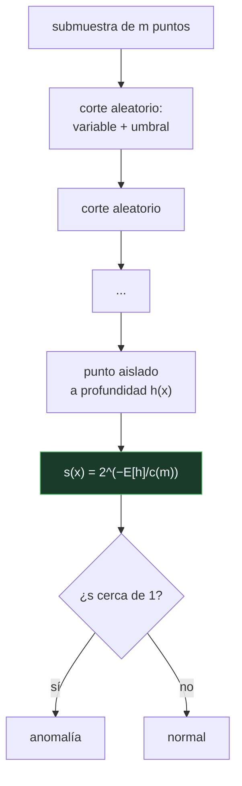

# P84 — Bosque de aislamiento

> Ruta clásica · Da la vuelta a la detección de anomalías: en vez de modelar lo normal,
> mide cuántos cortes al azar hacen falta para dejar cada punto solo.

**Nivel:** L2 · **Motor:** `isolation_forest` · **Notebook:** [`P84_isolation_forest.ipynb`](../../../notebooks/papers/P84_isolation_forest.ipynb)
· **Anexo:** [complejidad y coste](../../annexes/A05_COMPLEJIDAD_Y_COSTE.md)

## 1. Identificación

| Campo | Valor |
|---|---|
| **Título original** | *Isolation Forest* |
| **Autoría** | Fei Tony Liu, Kai Ming Ting, Zhi-Hua Zhou |
| **Año** | 2008 |
| **Venue** | ICDM 2008, 413–422 |
| **Fuente primaria** | [doi:10.1109/ICDM.2008.17](https://doi.org/10.1109/ICDM.2008.17) |
| **Acceso** | Restringido |
| **Fecha de consulta** | 2026-08-17 |

## 2. Problema anterior

Todos los métodos de detección de anomalías hacían lo mismo: construir un modelo de lo **normal**
—una densidad, un conjunto de vecindades, un perfil— y medir la distancia a ese modelo.

Eso tiene tres costes. Es caro: modelar bien la normalidad requiere estimar densidades o calcular
distancias entre todos los pares. Supone una forma para la distribución normal, que puede ser
falsa. Y dedica casi todo el esfuerzo computacional a caracterizar los puntos que **no interesan**,
porque las anomalías son pocas por definición.

## 3. Propuesta

No modelar nada. Construir árboles cortando el espacio al azar —una variable al azar, un umbral al
azar dentro de su rango— y contar **cuántos cortes hacen falta para dejar cada punto solo**.

La intuición es directa: un punto en una zona densa necesita muchos cortes para quedar aislado,
porque siempre hay vecinos al otro lado. Un punto raro está en una región poco poblada y un corte
cualquiera lo separa enseguida.

La longitud media del camino sobre muchos árboles, normalizada por la longitud esperada en un árbol
de búsqueda binaria, da la puntuación de anomalía. Y el coste es lineal, con submuestras pequeñas.

## 4. Intuición sin fórmulas

Encontrar al que no encaja en una fiesta. No hace falta un perfil del invitado típico: basta con
ir dividiendo la sala por criterios arbitrarios —los de camisa clara a un lado, los altos al
otro—. Quien se queda solo en dos o tres divisiones es el que desentona.

**Dónde deja de funcionar la analogía:** funciona con quien desentona **globalmente**. Alguien que
está en medio de un grupo pero se comporta distinto no se queda solo antes que los demás: este
método no lo ve, y hace falta otra idea.

## 5. Matemática mínima

```text
h(x)  = número de cortes aleatorios hasta aislar x
E[h(x)] = media sobre los árboles del bosque

c(m) = 2·H(m−1) − 2(m−1)/m     ← camino medio en un árbol binario con m nodos
                                  (H = número armónico)

s(x) = 2^(−E[h(x)] / c(m))

s → 1    se aísla enseguida  → anomalía
s ≈ 0,5  camino medio        → normal
```

La miniatura, con 60 puntos normales, 3 anómalos y 40 árboles sobre submuestras de 32:

| Medida | Normales | Anómalos |
|---|---:|---:|
| longitud media de camino | 6,64 | **2,27** |
| puntuación media | 0,471 | **0,772** |

Y en el ranking por puntuación, las **3 de 3** anomalías reales aparecen en las tres primeras
posiciones.

<!-- puente:inicio -->
> [!TIP]
> **Puente matemático.** Esta sección da por sabido lo siguiente. Si algo no te suena,
> léelo primero: está explicado una sola vez, en un solo sitio, y sirve para todas las fichas.

| Dónde | Qué necesitas de ahí |
|---|---|
| [**A05 §1** · Notación O(): qué dice y qué no](../../annexes/A05_COMPLEJIDAD_Y_COSTE.md#1-notación-o-qué-dice-y-qué-no) | por qué el coste lineal frente al cuadrático cambia qué problemas son abordables |
<!-- puente:fin -->

## 6. Arquitectura o flujo



## 7. Qué observar en el paper original

- La **inversión conceptual**, enunciada en la introducción: aislar en vez de modelar. Es toda la
  aportación y cabe en una frase.
- El análisis del **submuestreo**: usar submuestras pequeñas —128 puntos por árbol— no solo es más
  barato, sino que **mejora** la detección al reducir el enmascaramiento entre anomalías cercanas.
- La **normalización por c(m)**, que hace comparables las puntuaciones entre conjuntos de distinto
  tamaño.
- El límite de altura `⌈log₂ m⌉`: no hace falta aislar del todo los puntos normales, basta con
  saber que están lejos de aislarse.

## 8. Evidencia y resultados

Comparación con métodos de la época —LOF, ORCA, técnicas de una clase— sobre conjuntos de
referencia, midiendo AUC y tiempo de ejecución.

> El resultado más citado es el de **coste**: tiempo lineal y memoria constante frente a métodos
> cuadráticos, con detección comparable o mejor en anomalías globales.

La miniatura reproduce el mecanismo con anomalías muy separadas. Confirma la separación de caminos
y el ranking; no dice nada sobre el caso difícil, que es el de las anomalías locales.

## 9. Impacto

- Es hoy uno de los métodos por defecto de detección de anomalías, disponible en las bibliotecas
  estándar y usado en producción para fraude, mantenimiento predictivo y detección de intrusiones.
- Su **coste lineal** lo hizo aplicable a volúmenes donde los métodos basados en distancias eran
  impensables.
- La idea de que **el submuestreo mejora** —y no solo abarata— fue contraintuitiva y generó
  literatura propia.
- Es también un buen ejemplo metodológico: replantear la pregunta suele rendir más que optimizar la
  respuesta a la pregunta anterior.

## 10. Limitaciones

1. **Anomalías locales.** Un punto dentro de la nube con densidad distinta no se aísla antes que
   sus vecinos. Para eso está LOF, con otra idea.
2. **Cortes paralelos a los ejes.** Las anomalías que solo lo son en una dirección oblicua se
   detectan peor; la variante *extended isolation forest* lo corrige.
3. **No da un umbral.** La puntuación ordena; decidir dónde cortar exige conocer o suponer la
   proporción de anomalías.
4. **Sensible a variables irrelevantes**: si la mayoría de las variables son ruido, los cortes al
   azar caen casi siempre en ellas.
5. **No explica** por qué un punto es anómalo, solo que se aísla pronto.

## 11. Errores comunes

| Error | Corrección |
|---|---|
| «Detecta cualquier tipo de anomalía» | Detecta bien las globales —puntos alejados de todo— y mal las locales, que viven dentro de la nube con densidad distinta. |
| «Hay que usar todos los datos en cada árbol» | El artículo muestra que submuestras pequeñas (≈128) funcionan mejor: reducen el enmascaramiento entre anomalías cercanas y abaratan el cálculo. |
| «La puntuación es una probabilidad» | Es un valor en (0, 1) construido para ordenar. No corresponde a ninguna frecuencia y no está calibrado. |
| «Necesita datos etiquetados» | Es completamente no supervisado: no ve etiquetas en ningún momento. Las etiquetas solo hacen falta para evaluarlo. |
| «Modela la distribución normal de los datos» | No modela nada. Esa es la inversión conceptual del artículo: mide directamente la facilidad de aislamiento. |

## 12. Relación con trabajos anteriores

- **Breunig et al. (2000)** — LOF: el factor de anomalía local, el método de referencia anterior y
  el que sí ve las anomalías locales.
  [doi:10.1145/335191.335388](https://doi.org/10.1145/335191.335388)
- **[P79 Bosques aleatorios](../P79_random_forest/README.md) (2001)** — la estructura de conjunto
  de árboles con cortes aleatorios, aquí llevada al caso no supervisado.

## 13. Relación con trabajos posteriores

- **Liu, Ting y Zhou (2012)** — la versión extendida con el análisis del submuestreo.
  [doi:10.1145/2133360.2133363](https://doi.org/10.1145/2133360.2133363)
- **Hariri et al. (2019)** — *extended isolation forest*: cortes no paralelos a los ejes.
- **[P42 Ejemplos adversarios](../P42_adversarial/README.md) (2014)** — el problema
  inverso: puntos construidos para NO parecer anómalos.

## 14. Notebook asociado

[`P84_isolation_forest.ipynb`](../../../notebooks/papers/P84_isolation_forest.ipynb)

**Qué implementa:** la construcción de árboles con cortes aleatorios, la longitud media de camino por punto, la puntuación normalizada y el ranking con las anomalías reales marcadas.

**Qué NO implementa:** no implementa el límite de altura ⌈log₂ m⌉ ni el submuestreo exacto del artículo, y usa anomalías muy separadas. El caso de anomalías locales, que es donde el método falla, no está.

```bash
ai-evolution paper-lab P84 --seed 7
```

## 15. Actividades Bloom

| Nivel | Actividad |
|---|---|
| **Recordar** | Explica qué mide h(x). |
| **Explicar** | Explica por qué un punto anómalo se aísla con menos cortes. |
| **Aplicar** | Ejecuta el notebook y compara las longitudes medias de camino. |
| **Analizar** | Analiza por qué el submuestreo puede mejorar la detección y no solo abaratarla. |
| **Evaluar** | «La puntuación 0,8 significa un 80 % de probabilidad de ser anomalía». Evalúa la afirmación. |
| **Crear** | Aplica un bosque de aislamiento a un registro real, revisa a mano las veinte primeras posiciones y documenta cuántas eran anomalías de verdad. |

## 16. Autoevaluación

1. ¿Qué inversión conceptual propone el artículo?
2. ¿Qué mide la longitud de camino?
3. ¿Para qué sirve la normalización por c(m)?
4. ¿Qué tipo de anomalías detecta bien?
5. ¿Y cuáles detecta mal?
6. ¿Por qué ayuda el submuestreo?
7. ¿Es la puntuación una probabilidad?

## 17. Respuestas esperadas

1. No modelar la normalidad para medir la distancia a ella, sino medir directamente lo fácil que es aislar cada punto con cortes aleatorios.
2. Cuántos cortes aleatorios hacen falta para dejar el punto solo. En la miniatura, 2,27 de media para los anómalos y 6,64 para los normales.
3. Para hacer comparables las puntuaciones entre conjuntos de distinto tamaño: `c(m)` es la longitud media esperada en un árbol de búsqueda binaria con `m` nodos.
4. Las **globales**: puntos alejados de todo, en regiones poco pobladas del espacio.
5. Las **locales**: puntos dentro de la nube pero en una zona de densidad distinta. Para esos hace falta LOF u otra idea.
6. Porque reduce el enmascaramiento: cuando hay varias anomalías cercanas, en la muestra completa se protegen entre sí y ninguna queda aislada pronto. Con submuestras pequeñas es improbable que coincidan.
7. No. Es un valor en (0, 1) construido para ordenar. No está calibrado y no corresponde a ninguna frecuencia observable.

## 18. Fuentes primarias

- Liu, F. T., Ting, K. M. y Zhou, Z.-H. (2008). *Isolation Forest*. **ICDM 2008**, 413–422.
  [doi:10.1109/ICDM.2008.17](https://doi.org/10.1109/ICDM.2008.17) · consultado 2026-08-17.
- Liu, F. T., Ting, K. M. y Zhou, Z.-H. (2012). *Isolation-Based Anomaly Detection*.
  [doi:10.1145/2133360.2133363](https://doi.org/10.1145/2133360.2133363) · consultado 2026-08-17.
- Breunig, M. et al. (2000). *LOF: Identifying Density-Based Local Outliers*.
  [doi:10.1145/335191.335388](https://doi.org/10.1145/335191.335388) · consultado 2026-08-17.

---

[⬅️ Anterior: P83 t-SNE](../P83_tsne/README.md) ·
[📇 Índice](../../catalog/PAPERS_INDEX.md) ·
[📝 Evaluación](../../../assessments/papers/P84_isolation_forest.md) ·
[🏫 Clase 044 · Detección de anomalías](../../../classes/part-03-classical-machine-learning/044-deteccion-de-anomalias/README.md) ·
[➡️ Siguiente: P85 Factorización matricial](../P85_factorizacion_matricial/README.md)
