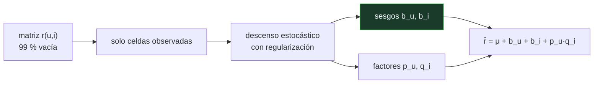

# P85 — Factorización matricial

> Ruta clásica · Predecir en una matriz donde falta casi todo. Y una lección que se salta
> casi todo el mundo: los sesgos hacen la mitad del trabajo, antes que los gustos.

**Nivel:** L3 · **Motor:** `factorizacion_matricial` · **Notebook:** [`P85_factorizacion_matricial.ipynb`](../../../notebooks/papers/P85_factorizacion_matricial.ipynb)
· **Anexo:** [álgebra y geometría](../../annexes/A01_ALGEBRA_Y_GEOMETRIA.md)

## 1. Identificación

| Campo | Valor |
|---|---|
| **Título original** | *Matrix Factorization Techniques for Recommender Systems* |
| **Autoría** | Yehuda Koren, Robert Bell, Chris Volinsky |
| **Año** | 2009 |
| **Venue** | IEEE Computer, 42(8), 30–37 |
| **Fuente primaria** | [doi:10.1109/MC.2009.263](https://doi.org/10.1109/MC.2009.263) |
| **Acceso** | Restringido |
| **Fecha de consulta** | 2026-08-17 |

## 2. Problema anterior

Una matriz de usuarios por artículos con el 99 % de las celdas vacías. Hay que predecir las que
faltan.

Los métodos por **vecindad** —buscar usuarios parecidos y promediar sus notas— eran los estándar y
tenían dos problemas: escalaban mal, porque exigen comparar todos los pares, y no capturaban
estructura latente. Si a dos usuarios les gustan películas distintas del mismo género, la
similitud directa no lo ve.

## 3. Propuesta

Describir a cada usuario y a cada artículo con un vector de pocos **factores latentes**, y predecir
la nota como su producto escalar. Los factores no se declaran: emergen del ajuste.

Dos decisiones hacen que funcione. La primera: ajustar **solo sobre las celdas observadas** con
descenso de gradiente estocástico, en vez de rellenar las vacías con la media —que era lo que se
hacía y sesgaba todo—. La segunda: incluir **términos de sesgo** explícitos para usuario y
artículo, más la media global.

```text
r̂(u,i) = μ + b_u + b_i + p_u · q_i
```

Sin esos sesgos, los factores latentes acaban gastándose en aprender que hay usuarios generosos y
artículos populares, en lugar de aprender preferencias.

## 4. Intuición sin fórmulas

Describir el gusto de alguien con cinco números en vez de con la lista de todo lo que ha visto.
Y describir cada película con los mismos cinco ejes. La afinidad es cuánto coinciden.

Nadie decide qué significan esos ejes. Salen del ajuste, y a veces se parecen a géneros y a veces
no se parecen a nada nombrable.

**Dónde deja de funcionar la analogía:** la persona real no tiene cinco números. El modelo tampoco
afirma que los tenga: afirma que con cinco números predice bien las notas que faltan, que es una
afirmación mucho más modesta y comprobable.

## 5. Matemática mínima

```text
r̂(u,i) = μ + b_u + b_i + p_u · q_i

minimizar  Σ_{(u,i) observadas} (r(u,i) − r̂(u,i))² + λ(‖p_u‖² + ‖q_i‖² + b_u² + b_i²)

Actualización por descenso estocástico, para cada observación:
    e ← r − r̂
    b_u ← b_u + γ(e − λ·b_u)        p_u ← p_u + γ(e·q_i − λ·p_u)
    b_i ← b_i + γ(e − λ·b_i)        q_i ← q_i + γ(e·p_u − λ·q_i)
```

La miniatura entrena sobre el 54 % de una matriz de 12×8 y evalúa sobre las celdas ocultas:

| Modelo | RMSE fuera de muestra |
|---|---:|
| predecir siempre la media | 0,7989 |
| solo sesgos de usuario y artículo | **0,5786** |
| dos factores latentes + sesgos | **0,3691** |

Los sesgos recorren más de la mitad del camino antes de que aparezca ningún «gusto». Sin esas dos
líneas base, un RMSE suelto no dice nada.

<!-- puente:inicio -->
> [!TIP]
> **Puente matemático.** Esta sección da por sabido lo siguiente. Si algo no te suena,
> léelo primero: está explicado una sola vez, en un solo sitio, y sirve para todas las fichas.

| Dónde | Qué necesitas de ahí |
|---|---|
| [**A01 §1** · Producto escalar](../../annexes/A01_ALGEBRA_Y_GEOMETRIA.md#1-producto-escalar) | qué mide `p_u · q_i` y por qué un producto escalar alto significa afinidad |
<!-- puente:fin -->

## 6. Arquitectura o flujo



## 7. Qué observar en el paper original

- La insistencia en los **sesgos**. Es la parte más práctica del artículo y la que menos se cita:
  modelar primero lo aburrido.
- El **descenso estocástico sobre las celdas observadas**, frente a rellenar las vacías. Es la
  decisión que hace viable el método a escala.
- La discusión sobre **dinámica temporal**: los gustos cambian, y modelar la deriva mejoró
  sustancialmente los resultados en el Netflix Prize.
- La distinción entre **realimentación explícita** (notas) e **implícita** (qué se vio, qué se
  saltó), y cómo incorporarla.

## 8. Evidencia y resultados

Resultados sobre el conjunto del Netflix Prize, con la progresión de RMSE al añadir cada
componente: media, sesgos, factores, dinámica temporal, realimentación implícita.

> El artículo es una síntesis divulgativa de varios trabajos técnicos del equipo ganador, escrita
> para *IEEE Computer*. Es de las mejores puertas de entrada al tema que existen.

La miniatura reproduce el modelo básico —sesgos más factores— sobre una matriz de juguete donde el
mecanismo se conoce, para que las dos líneas base sean comparables de verdad.

## 9. Impacto

- Es la base de los sistemas de recomendación durante una década, y sigue siendo la línea base
  obligatoria antes de intentar nada más complejo.
- El **Netflix Prize** que documenta cambió la práctica del campo: conjuntos abiertos, evaluación
  común y competición pública.
- La idea de **factores latentes aprendidos** conecta directamente con los embeddings de
  [word2vec](../P05_word2vec/README.md): representar entidades con vectores densos cuyas
  dimensiones no se declaran.
- Y su lección sobre las líneas base es transferible a cualquier problema: sin ellas, una métrica
  no se puede interpretar.

## 10. Limitaciones

1. **Arranque en frío.** Un usuario o artículo nuevo no tiene observaciones y el modelo no puede
   decir nada. Es el problema práctico más común y el artículo lo trata solo parcialmente.
2. **El RMSE no es calidad de recomendación.** Ordenar bien los diez primeros y acertar la nota son
   objetivos distintos. Netflix nunca desplegó el modelo ganador.
3. **Los factores no son interpretables** salvo por inspección, y esa interpretación es a
   posteriori.
4. **Supone que faltan al azar**, y no es cierto: la gente puntúa lo que ve, y ve lo que le
   recomiendan.
5. **No modela el efecto de la propia recomendación** sobre el comportamiento futuro, que es un
   bucle de realimentación real.

## 11. Errores comunes

| Error | Corrección |
|---|---|
| «Los factores latentes corresponden a géneros» | A veces se parecen y a veces no. No hay ninguna garantía: son direcciones que minimizan el error, no categorías. |
| «Se puede rellenar con la media y factorizar» | Eso sesga la solución hacia la media. La aportación práctica es ajustar SOLO sobre las celdas observadas. |
| «Los sesgos son un detalle» | En la miniatura recorren más de la mitad del camino: de 0,7989 a 0,5786 antes de que aparezca ningún factor latente. |
| «Un RMSE bajo implica buenas recomendaciones» | El RMSE mide error de predicción de nota. La calidad de una lista de recomendaciones depende del orden, la diversidad y la novedad. |
| «Ganó el Netflix Prize, luego se usó en producción» | Netflix no desplegó el modelo ganador: el coste de ingeniería no compensaba la mejora sobre las métricas que de verdad les importaban. |

## 12. Relación con trabajos anteriores

- **[P53 PCA](../P53_pca/README.md) (1901)** — la descomposición en factores, aquí adaptada a una
  matriz con huecos.
- **Sarwar et al. (2001)** — el filtrado colaborativo por artículos, el método al que reemplaza.
- **[P77 Lasso](../P77_lasso/README.md) (1996)** — la regularización sin la cual estos modelos
  sobreajustan de inmediato.

## 13. Relación con trabajos posteriores

- **Bell y Koren (2007)** — las lecciones técnicas del Netflix Prize.
  [doi:10.1145/1345448.1345465](https://doi.org/10.1145/1345448.1345465)
- **[P05 word2vec](../P05_word2vec/README.md) (2013)** — la misma idea de representar entidades con
  vectores densos aprendidos, aplicada al lenguaje.
- **Rendle et al. (2019)** — las líneas base bien ajustadas siguen ganando a muchos métodos
  neuronales. [doi:10.1145/3298689.3347058](https://doi.org/10.1145/3298689.3347058)
- **[P11 RAG](../P11_rag/README.md) (2020)** — recuperar por similitud en un espacio de
  representación: el mismo mecanismo, otro problema.

## 14. Notebook asociado

[`P85_factorizacion_matricial.ipynb`](../../../notebooks/papers/P85_factorizacion_matricial.ipynb)

**Qué implementa:** el descenso estocástico sobre celdas observadas con sesgos y regularización, y la comparación contra dos líneas base —media global y solo sesgos— en las celdas ocultas.

**Qué NO implementa:** no hay arranque en frío, ni dinámica temporal, ni realimentación implícita, ni métricas de ranking. La matriz es de 12×8 con densidad mucho mayor que la real.

```bash
ai-evolution paper-lab P85 --seed 7
```

## 15. Actividades Bloom

| Nivel | Actividad |
|---|---|
| **Recordar** | Escribe la fórmula de predicción con sus cuatro términos. |
| **Explicar** | Explica por qué se ajusta solo sobre las celdas observadas. |
| **Aplicar** | Ejecuta el notebook y compara las tres líneas. |
| **Analizar** | Analiza por qué los sesgos deben modelarse antes que los factores. |
| **Evaluar** | «El RMSE bajó, luego las recomendaciones son mejores». Evalúa la afirmación. |
| **Crear** | Implementa la factorización sobre un conjunto público, con regularización elegida por validación, y compárala con un recomendador por popularidad. |

## 16. Autoevaluación

1. ¿Qué representan los factores latentes?
2. ¿Por qué no se rellenan las celdas vacías?
3. ¿Qué aportan los términos de sesgo?
4. ¿Qué es el arranque en frío?
5. ¿Mide el RMSE la calidad de una recomendación?
6. ¿Qué supone el modelo sobre las celdas que faltan?
7. ¿Con qué idea posterior conecta directamente?

## 17. Respuestas esperadas

1. Direcciones en un espacio de pocas dimensiones que resumen a usuarios y artículos. Nadie las declara: emergen del ajuste, y a veces se parecen a géneros y a veces no.
2. Porque rellenar con la media sesga la solución hacia ella. Ajustar solo sobre lo observado, con descenso estocástico, es lo que hace el método viable y correcto.
3. Capturan que hay usuarios que puntúan alto todo y artículos que gustan a todos. En la miniatura recorren más de la mitad del camino: de RMSE 0,7989 a 0,5786.
4. Que un usuario o un artículo nuevo no tiene observaciones, y el modelo no puede predecir nada para él. Es el problema práctico más frecuente.
5. No. Mide el error al predecir la nota. La calidad de una lista depende del orden de los primeros elementos, de la diversidad y de la novedad, que son otros objetivos.
6. Que faltan al azar, y no es cierto: la gente puntúa lo que ve, y ve lo que le recomiendan. Ese sesgo de selección no está modelado.
7. Con los embeddings de word2vec: representar entidades mediante vectores densos aprendidos cuyas dimensiones no se declaran de antemano.

## 18. Fuentes primarias

- Koren, Y., Bell, R. y Volinsky, C. (2009). *Matrix Factorization Techniques for Recommender
  Systems*. **IEEE Computer**, 42(8), 30–37.
  [doi:10.1109/MC.2009.263](https://doi.org/10.1109/MC.2009.263) · consultado 2026-08-17.
- Bell, R. y Koren, Y. (2007). *Lessons from the Netflix Prize Challenge*.
  [doi:10.1145/1345448.1345465](https://doi.org/10.1145/1345448.1345465) · consultado 2026-08-17.
- Rendle, S. et al. (2019). *On the Difficulty of Evaluating Baselines*.
  [doi:10.1145/3298689.3347058](https://doi.org/10.1145/3298689.3347058) · consultado 2026-08-17.

---

[⬅️ Anterior: P84 Bosque de aislamiento](../P84_isolation_forest/README.md) ·
[📇 Índice](../../catalog/PAPERS_INDEX.md) ·
[📝 Evaluación](../../../assessments/papers/P85_factorizacion_matricial.md) ·
[🏫 Clase 046 · Sistemas de recomendación](../../../classes/part-03-classical-machine-learning/046-sistemas-de-recomendacion/README.md) ·
[➡️ Siguiente: P86 Competición M4](../P86_m4/README.md)
