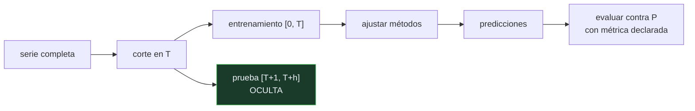

# P86 — Competición M4

> Ruta clásica · Cien mil series y sesenta y un métodos para responder empíricamente qué
> funciona al predecir. Y el resultado incomoda a casi todo el mundo.

**Nivel:** L3 · **Motor:** `m4` · **Notebook:** [`P86_m4.ipynb`](../../../notebooks/papers/P86_m4.ipynb)
· **Anexo:** [complejidad y coste](../../annexes/A05_COMPLEJIDAD_Y_COSTE.md)

## 1. Identificación

| Campo | Valor |
|---|---|
| **Título original** | *The M4 Competition: Results, findings, conclusion and way forward* |
| **Autoría** | Spyros Makridakis, Evangelos Spiliotis, Vassilios Assimakopoulos |
| **Año** | 2018 |
| **Venue** | International Journal of Forecasting, 34(4), 802–808 |
| **Fuente primaria** | [doi:10.1016/j.ijforecast.2018.06.001](https://doi.org/10.1016/j.ijforecast.2018.06.001) |
| **Acceso** | Abierto |
| **Fecha de consulta** | 2026-08-17 |

## 2. Problema anterior

Cada artículo sobre predicción de series temporales reportaba mejoras sobre **sus** series y
**sus** líneas base. Con datos distintos, horizontes distintos y métricas distintas, los resultados
no eran comparables entre sí.

En esas condiciones el campo no puede acumular conocimiento: no hay forma de saber si un método
nuevo mejora de verdad o si simplemente se evaluó en condiciones favorables. Es la versión temporal
del problema que [P76](../P76_validacion_cruzada/README.md) planteó para la clasificación.

## 3. Propuesta

Una competición abierta con las condiciones fijadas de antemano:

- **100 000 series reales** de dominios distintos —micro, industria, macro, finanzas, demografía—
  y frecuencias distintas;
- horizontes fijos y **datos de evaluación ocultos** a los participantes;
- **métricas declaradas antes** de empezar (sMAPE y MASE, más una medida de intervalos);
- publicación de todos los resultados y del código.

Es lo más parecido a un experimento controlado que ha tenido el campo, y su diseño es tan
importante como sus conclusiones.

## 4. Intuición sin fórmulas

Un examen a ciegas con el temario publicado y las respuestas guardadas en un sobre. Cada
participante entrega su predicción sin ver la solución, y la corrección la hace un tercero con un
criterio anunciado antes.

Sin ese sobre, cualquiera puede afinar su método hasta que acierte lo que ya conoce y llamarlo
predicción.

**Dónde deja de funcionar la analogía:** un examen mide a personas comparables. Aquí los métodos
tienen costes de cómputo, complejidad y datos requeridos muy distintos, y la competición ordena por
error sin ponderar eso.

## 5. Matemática mínima

```text
Backtesting honesto:
    entrenar con [0, T]      predecir [T+1, T+h]      evaluar contra lo real

El error no es de fórmula: es de PROTOCOLO. Todo dato usado para elegir el modelo
—incluidos hiperparámetros— tiene que estar antes de T.
```

La miniatura ilustra la trampa con una serie sintética de 72 puntos y horizonte 12:

| Método | MAE dentro de muestra | MAE fuera de muestra |
|---|---:|---:|
| polinomio grado 11 | **6,31** | **6 983,04** |
| polinomio grado 5 | 7,11 | 60,05 |
| polinomio grado 1 | 7,71 | **7,48** |
| estacional ingenuo | — | 8,90 |
| combinación de tres | — | 8,94 |
| deriva | — | 12,10 |
| ingenuo | — | 15,35 |

El que mejor ajusta el pasado es el peor prediciendo el futuro, por tres órdenes de magnitud. Y la
combinación queda **3ª de 7**: no gana, y tampoco se hunde — que es exactamente el perfil que la M4
encontró sobre 100 000 series.

<!-- puente:inicio -->
> [!TIP]
> **Puente matemático.** Esta sección da por sabido lo siguiente. Si algo no te suena,
> léelo primero: está explicado una sola vez, en un solo sitio, y sirve para todas las fichas.

| Dónde | Qué necesitas de ahí |
|---|---|
| [**A05 §8** · Checklist antes de creerte una cifra de rendimiento](../../annexes/A05_COMPLEJIDAD_Y_COSTE.md#8-checklist-antes-de-creerte-una-cifra-de-rendimiento) | qué comprobar antes de aceptar cualquier número de mejora, aquí aplicado a predicción |
<!-- puente:fin -->

## 6. Arquitectura o flujo



## 7. Qué observar en el paper original

- El **diseño de la competición**, que es la mitad de su valor: series ocultas, métricas
  anunciadas, código publicado.
- Los **hallazgos principales**: los métodos híbridos —estadístico más aprendizaje automático—
  ganaron; los métodos de aprendizaje automático puros quedaron por debajo de las líneas base
  estadísticas; y la combinación resultó difícil de batir.
- La sección sobre **intervalos de predicción**, sistemáticamente demasiado estrechos en casi todos
  los métodos. Es el hallazgo más incómodo y el menos citado.
- La comparación con las competiciones **M1, M2 y M3**: qué conclusiones se repiten y cuáles no.

## 8. Evidencia y resultados

Los resultados de 61 métodos sobre 100 000 series, con evaluación fuera de muestra sobre datos
que los participantes no vieron, y métricas declaradas antes de empezar.

> Es de los pocos artículos del programa cuya evidencia es directamente una **medición a gran
> escala con protocolo preinscrito**. Eso lo hace inusualmente sólido para las conclusiones que
> saca, y muy limitado para las que no.

La miniatura no reproduce la competición: exhibe con una sola serie el modo de fallo que la
competición está diseñada para evitar, que es evaluar dentro de muestra.

## 9. Impacto

- Cambió la práctica de la predicción de series temporales: publicar código, evaluar fuera de
  muestra y comparar contra líneas base ingenuas se volvió obligatorio.
- El método ganador —ES-RNN, de Slawek Smyl— es **híbrido**: suavizado exponencial combinado con
  una red recurrente. Ese resultado orientó la investigación de la década siguiente.
- La constatación de que los métodos de aprendizaje automático puros no batían a las líneas base
  estadísticas fue un correctivo importante en 2018.
- Y su modelo de competición abierta con datos ocultos se ha replicado en otros campos.

## 10. Limitaciones

1. **La competición ordena por error medio** y no pondera coste de cómputo, complejidad ni datos
   requeridos.
2. **Las series están anonimizadas y descontextualizadas**: no hay variables externas, que en la
   práctica suelen ser lo más informativo.
3. **Horizontes fijos por frecuencia.** No cubre todos los casos de uso reales.
4. **Es una foto de 2018.** Los métodos profundos para series mejoraron después, y la M5 (2020)
   dio resultados distintos con datos jerárquicos.
5. **Las conclusiones son estadísticas sobre 100 000 series.** No dicen qué método usar en **tu**
   serie: eso hay que medirlo.

## 11. Errores comunes

| Error | Corrección |
|---|---|
| «El aprendizaje automático no funciona en series temporales» | En 2018 los métodos puros quedaron por debajo de las líneas base estadísticas. El ganador fue híbrido, y la M5 de 2020 dio resultados distintos. |
| «La combinación de métodos siempre gana» | Rara vez es la mejor. Su virtud es que casi nunca es la peor, y por eso es la apuesta razonable sin información sobre la serie concreta. |
| «Un buen ajuste al histórico indica un buen modelo» | En la miniatura, el que mejor ajusta el pasado predice tres órdenes de magnitud peor. Son objetivos distintos y a menudo opuestos. |
| «Las líneas base ingenuas son un trámite» | Son el listón. Un método que no supera al ingenuo estacional fuera de muestra no ha demostrado nada. |
| «Los intervalos de predicción publicados son fiables» | El hallazgo más incómodo de la M4 es que casi todos los métodos producen intervalos demasiado estrechos: subestiman sistemáticamente la incertidumbre. |

## 12. Relación con trabajos anteriores

- **Makridakis y Hibon (2000)** — la competición M3, con 3 003 series: el antecedente directo.
- **[P76 Validación cruzada](../P76_validacion_cruzada/README.md) (1995)** — el mismo problema de
  estimación honesta, en datos sin orden temporal.
- **Box y Jenkins (1970)** — la metodología ARIMA, una de las familias evaluadas.

## 13. Relación con trabajos posteriores

- **Makridakis et al. (2020)** — el análisis extendido de la M4 con los 100 000 resultados.
  [doi:10.1016/j.ijforecast.2019.04.014](https://doi.org/10.1016/j.ijforecast.2019.04.014)
- **Competición M5 (2020)** — datos jerárquicos de ventas reales, donde el gradient boosting sí
  dominó.
- **[P62 Validez de benchmarks](../P62_benchmark_validez/README.md) (2021)** — qué preguntar a
  cualquier evaluación, incluida esta.
- **Hyndman y Athanasopoulos** — *Forecasting: Principles and Practice*, el manual abierto de
  referencia. [otexts.com/fpp3](https://otexts.com/fpp3/)

## 14. Notebook asociado

[`P86_m4.ipynb`](../../../notebooks/papers/P86_m4.ipynb)

**Qué implementa:** el contraste entre ajuste dentro de muestra y error fuera de muestra sobre una serie con tendencia y estacionalidad, con líneas base ingenuas, polinomios de tres grados y una combinación simple.

**Qué NO implementa:** una sola serie sintética, una sola partición y sin validación en ventanas deslizantes. No reproduce la competición ni permite concluir nada sobre qué método es mejor en general.

```bash
ai-evolution paper-lab P86 --seed 7
```

## 15. Actividades Bloom

| Nivel | Actividad |
|---|---|
| **Recordar** | Describe el protocolo de evaluación de la competición. |
| **Explicar** | Explica por qué el mejor ajuste dentro de muestra puede ser el peor fuera. |
| **Aplicar** | Ejecuta el notebook y compara los dos rankings. |
| **Analizar** | Analiza por qué la combinación de métodos rara vez gana y casi nunca pierde. |
| **Evaluar** | «Mi modelo reproduce el histórico casi perfectamente». Evalúa la afirmación. |
| **Crear** | Evalúa una serie de tu trabajo con ventanas deslizantes contra el ingenuo estacional y una combinación de tres métodos simples. |

## 16. Autoevaluación

1. ¿Qué problema del campo aborda la competición?
2. ¿Qué condiciones fija su diseño?
3. ¿Qué tipo de método ganó?
4. ¿Qué pasó con los métodos de aprendizaje automático puros?
5. ¿Cuál es el perfil de la combinación de métodos?
6. ¿Cuál fue el hallazgo más incómodo?
7. ¿Qué NO se puede concluir de la M4?

## 17. Respuestas esperadas

1. Que cada trabajo evaluaba con sus propias series, horizontes y métricas, de modo que los resultados no eran comparables y el campo no podía acumular conocimiento.
2. 100 000 series reales de dominios y frecuencias distintas, horizontes fijos, datos de evaluación ocultos a los participantes, métricas declaradas de antemano y publicación de código y resultados.
3. Un método **híbrido**: el ES-RNN de Slawek Smyl, que combina suavizado exponencial con una red recurrente. Ni puramente estadístico ni puramente aprendizaje automático.
4. Quedaron por debajo de las líneas base estadísticas. Fue un correctivo importante en 2018, y la M5 de 2020 —con datos jerárquicos— dio un resultado distinto.
5. Rara vez es la mejor y casi nunca es la peor. En la miniatura queda 3ª de 7. Sin información sobre la serie concreta, es la apuesta razonable.
6. Que los intervalos de predicción de casi todos los métodos son demasiado estrechos: subestiman sistemáticamente la incertidumbre. Es el resultado menos citado.
7. Qué método usar en una serie concreta. Las conclusiones son estadísticas sobre 100 000 series; para un caso particular hay que medir con el mismo protocolo.

## 18. Fuentes primarias

- Makridakis, S., Spiliotis, E. y Assimakopoulos, V. (2018). *The M4 Competition: Results,
  findings, conclusion and way forward*. **International Journal of Forecasting**, 34(4), 802–808.
  [doi:10.1016/j.ijforecast.2018.06.001](https://doi.org/10.1016/j.ijforecast.2018.06.001) ·
  consultado 2026-08-17.
- Makridakis, S. et al. (2020). *The M4 Competition: 100,000 time series and 61 forecasting
  methods*. [doi:10.1016/j.ijforecast.2019.04.014](https://doi.org/10.1016/j.ijforecast.2019.04.014)
  · consultado 2026-08-17.
- Hyndman, R. y Athanasopoulos, G. *Forecasting: Principles and Practice*.
  [otexts.com/fpp3](https://otexts.com/fpp3/) · consultado 2026-08-17.

---

[⬅️ Anterior: P85 Factorización matricial](../P85_factorizacion_matricial/README.md) ·
[📇 Índice](../../catalog/PAPERS_INDEX.md) ·
[📝 Evaluación](../../../assessments/papers/P86_m4.md) ·
[🏫 Clase 045 · Series temporales y backtesting](../../../classes/part-03-classical-machine-learning/045-series-temporales-y-backtesting/README.md) ·
[➡️ Índice de papers](../../catalog/PAPERS_INDEX.md)
