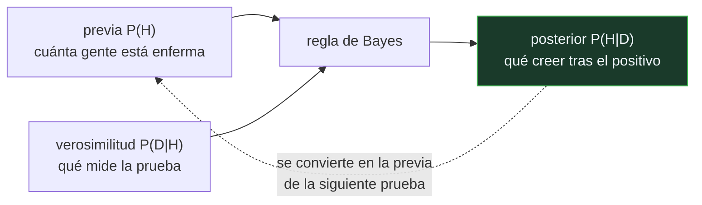

# P87 — Teorema de Bayes

> Ruta probabilística · La regla que invierte el condicional. Y el error de razonamiento
> más caro del mundo: olvidar cuánta gente está enferma antes de leer el positivo.

**Nivel:** L2 · **Motor:** `bayes` · **Notebook:** [`P87_bayes.ipynb`](../../../notebooks/papers/P87_bayes.ipynb)
· **Anexo:** [probabilidad y verosimilitud](../../annexes/A02_PROBABILIDAD_Y_VEROSIMILITUD.md)

## 1. Identificación

| Campo | Valor |
|---|---|
| **Título original** | *An Essay towards solving a Problem in the Doctrine of Chances* |
| **Autoría** | Thomas Bayes · publicado póstumamente por Richard Price |
| **Año** | 1763 |
| **Venue** | Philosophical Transactions of the Royal Society, 53, 370–418 |
| **Fuente primaria** | [doi:10.1098/rstl.1763.0053](https://doi.org/10.1098/rstl.1763.0053) |
| **Acceso** | Abierto |
| **Fecha de consulta** | 2026-08-17 |

## 2. Problema anterior

La probabilidad del siglo XVIII sabía resolver la pregunta directa: dada una urna con una
proporción conocida de bolas blancas, ¿qué probabilidad hay de sacar tres blancas seguidas?

La pregunta que hace falta para **aprender de la experiencia** es la inversa: he sacado tres bolas
blancas, ¿qué proporción tiene la urna? Y esa no tenía tratamiento. Sin ella no se puede pasar de
los datos a la causa, que es exactamente lo que hacen la ciencia y cualquier sistema que aprenda.

## 3. Propuesta

Tratar la cantidad desconocida como una variable con **distribución previa**, y actualizarla con
la verosimilitud de lo observado:

```text
P(H | D) = P(D | H) · P(H) / P(D)
```

Bayes lo plantea con una mesa de billar: una bola cae en una posición desconocida y otras van
cayendo a su izquierda o a su derecha. Cada observación reduce el rango plausible de la primera.

La forma que hoy se usa —y la generalización a cualquier problema— es de Laplace, que la redescubre
independientemente veinte años después y le da su alcance.

## 4. Intuición sin fórmulas

Un detector de humo en una cocina. Suena. ¿Hay fuego?

Depende de dos cosas que la pregunta no menciona: cuántas veces suena cuando hay fuego, y **cuántos
incendios hay en esa cocina**. Si el detector es buenísimo pero nunca hay incendios, casi todas las
alarmas son falsas — y no porque el detector falle.

**Dónde deja de funcionar la analogía:** el detector de humo tiene una tasa de fallo estable. En la
mayoría de los problemas reales, sensibilidad y prevalencia se estiman con error, y ese error se
propaga al resultado.

## 5. Matemática mínima

```text
P(H | D) = P(D | H) · P(H) / P(D)

En odds, que es donde se entiende:
    odds posteriores = odds previas × razón de verosimilitud
    razón de verosimilitud = sensibilidad / (1 − especificidad)
```

La miniatura evalúa la **misma prueba** —99 % de sensibilidad y especificidad— en tres poblaciones:

| Escenario | Prevalencia | P(enfermo \| positivo) | De cada 100 positivos, sanos |
|---|---:|---:|---:|
| cribado poblacional | 0,001 | **0,0902** | 91 |
| grupo de riesgo | 0,05 | 0,8390 | 16 |
| con síntomas claros | 0,40 | **0,9851** | 1 |

Un factor de once entre la primera fila y la tercera, **con la misma prueba**. Y en odds la
actualización es una multiplicación: cada positivo independiente multiplica por 99, así que tres
llevan de 0,001 a 0,999.

La simulación sobre 100 000 personas lo confirma contando: 985 de los 1 095 positivos están sanos.

<!-- puente:inicio -->
> [!TIP]
> **Puente matemático.** Esta sección da por sabido lo siguiente. Si algo no te suena,
> léelo primero: está explicado una sola vez, en un solo sitio, y sirve para todas las fichas.

| Dónde | Qué necesitas de ahí |
|---|---|
| [**A02 §3** · Verosimilitud y entropía cruzada](../../annexes/A02_PROBABILIDAD_Y_VEROSIMILITUD.md#3-verosimilitud-y-entropía-cruzada) | qué es la verosimilitud `P(D|H)` y por qué no es lo mismo que `P(H|D)` |
<!-- puente:fin -->

## 6. Arquitectura o flujo



## 7. Qué observar en el paper original

- Que el problema original **no es de diagnóstico**: es sobre una mesa de billar y una proporción
  desconocida. La aplicación médica es muy posterior.
- El **problema de la previa**: qué suponer cuando no se sabe nada. Bayes propone una previa uniforme
  y Price lo defiende; la discusión sobre previas no informativas sigue abierta hoy.
- El papel de **Richard Price**, que publica el ensayo tras la muerte de Bayes y añade el prefacio.
  Sin él, el ensayo no existiría como texto público.
- Que la formulación general y la notación moderna son de **Laplace** (1774, 1812), no de este
  ensayo. Atribuir a Bayes la regla que se usa hoy es históricamente inexacto y muy común.

## 8. Evidencia y resultados

Es un artículo matemático del siglo XVIII: propone el problema, construye la solución con un
argumento geométrico sobre la mesa de billar y la demuestra.

> No hay experimento ni datos. Y hay una parte del ensayo —la aproximación numérica— que es densa
> incluso para el lector actual, y que casi nunca se lee.

La miniatura de este eje no reproduce el ensayo: aplica la regla al caso donde su consecuencia es
más contraintuitiva y más consecuente, y la comprueba contando personas además de calculando.

## 9. Impacto

- Es el fundamento de toda la estadística bayesiana, de los filtros de spam, de la fusión de
  sensores ([P96](../P96_kalman/README.md)) y de la inferencia moderna.
- La negligencia de la tasa base que expone es uno de los sesgos cognitivos mejor documentados
  (Kahneman y Tversky), y aparece en tribunales, en medicina y en cualquier sistema de alertas.
- En aprendizaje automático es la base de la clasificación probabilística, y el marco dentro del
  cual [P91](../P91_redes_bayesianas/README.md) hace tratable la inferencia con muchas variables.
- Y da al programa un criterio operativo: antes de creerse la precisión de un detector, preguntar
  cuántos casos positivos hay realmente.

## 10. Limitaciones

1. **La previa hay que ponerla.** De dónde sale cuando no se sabe nada es un problema abierto, y
   con pocos datos la elección domina el resultado.
2. **La independencia entre pruebas casi nunca se cumple.** Multiplicar razones de verosimilitud de
   dos pruebas correlacionadas sobreestima la certeza, a veces mucho.
3. **Sensibilidad y especificidad se estiman**, con su propio intervalo, y ese error se propaga.
4. **El cálculo se vuelve intratable** con muchas variables: es el problema que motiva las redes
   bayesianas dos siglos después.
5. **La atribución histórica es confusa**: la regla moderna es de Laplace, y el propio ensayo es
   más limitado de lo que su fama sugiere.

## 11. Errores comunes

| Error | Corrección |
|---|---|
| «P(positivo | enfermo) es lo mismo que P(enfermo | positivo)» | Es la falacia del fiscal. En la miniatura, 0,99 frente a 0,09: dos órdenes de diferencia según a quién se aplique la prueba. |
| «Una prueba con 99 % de exactitud acierta el 99 % de las veces que da positivo» | Depende por completo de la prevalencia. Con prevalencia 0,001, el 91 % de los positivos están sanos. |
| «Bayes formuló la regla que usamos hoy» | El ensayo trata un problema concreto sobre una mesa de billar. La forma general y su aplicación son de Laplace. |
| «Repetir la prueba resuelve el problema» | Solo si los errores son independientes. Dos pruebas del mismo tipo suelen fallar por la misma razón, y multiplicar sus razones de verosimilitud infla la certeza. |
| «La previa es subjetiva, luego el método no es científico» | La previa es explícita y discutible, que es más de lo que ofrecen los supuestos implícitos de cualquier otro método. Con datos suficientes, además, deja de dominar. |

## 12. Relación con trabajos anteriores

- **De Moivre (1718)** — *The Doctrine of Chances*: el tratado del que el título toma su nombre.
- **Jacob Bernoulli (1713)** — la ley de los grandes números: el problema directo, del que este es
  el inverso.

## 13. Relación con trabajos posteriores

- **Laplace (1774, 1812)** — la formulación general y la notación que se usa hoy.
- **[P88 Teorema de Cox](../P88_cox/README.md) (1946)** — por qué esta regla no es una opción entre
  varias sino la única consistente.
- **[P91 Redes bayesianas](../P91_redes_bayesianas/README.md) (1986)** — cómo aplicarla cuando hay
  decenas de variables.
- **Gigerenzer y Hoffrage (1995)** — por qué expresar el problema en frecuencias naturales lo hace
  comprensible. [doi:10.1037/0033-295X.102.4.684](https://doi.org/10.1037/0033-295X.102.4.684)

## 14. Notebook asociado

[`P87_bayes.ipynb`](../../../notebooks/papers/P87_bayes.ipynb)

**Qué implementa:** el cálculo del posterior para la misma prueba en cuatro poblaciones distintas, la actualización en odds con pruebas sucesivas, y una simulación sobre 100 000 personas que llega al mismo resultado contando.

**Qué NO implementa:** no hay previas continuas, ni estimación de sensibilidad con incertidumbre, ni dependencia entre pruebas. Los tres son lo que complica el caso real.

```bash
ai-evolution paper-lab P87 --seed 7
```

## 15. Actividades Bloom

| Nivel | Actividad |
|---|---|
| **Recordar** | Escribe la regla de Bayes e identifica cada término. |
| **Explicar** | Explica por qué la prevalencia cambia la respuesta. |
| **Aplicar** | Ejecuta el notebook y calcula el posterior para una prevalencia de 0,01. |
| **Analizar** | Analiza por qué la simulación por conteo da lo mismo que la fórmula. |
| **Evaluar** | «La prueba tiene un 99 % de exactitud, luego un positivo es casi seguro». Evalúa la afirmación. |
| **Crear** | Aplica la regla a un detector de fraude real: estima tasa base, sensibilidad y especificidad, y calcula qué proporción de alertas serán falsas. |

## 16. Autoevaluación

1. ¿Qué pregunta responde la regla que la probabilidad directa no responde?
2. ¿Qué es la tasa base y por qué importa?
3. ¿Qué es la razón de verosimilitud?
4. ¿Por qué en odds la actualización es una multiplicación?
5. ¿Qué supone encadenar varias pruebas?
6. ¿Quién formuló la regla en su forma actual?
7. ¿De dónde sale la previa?

## 17. Respuestas esperadas

1. La inversa: qué causa es probable dados los datos observados, en lugar de qué datos esperar dada una causa conocida. Es la que hace falta para aprender de la experiencia.
2. La proporción de casos positivos en la población a la que se aplica la prueba. Importa porque determina cuántos de los positivos son falsos: con prevalencia 0,001 y una prueba del 99 %, 91 de cada 100 positivos están sanos.
3. El cociente `sensibilidad / (1 − especificidad)`: cuántas veces más probable es ese resultado si la hipótesis es cierta que si no lo es.
4. Porque la regla de Bayes en forma de odds separa limpiamente lo previo de la evidencia: cada dato independiente multiplica las odds por su razón de verosimilitud.
5. Independencia condicional entre ellas. En la práctica dos pruebas del mismo tipo fallan por las mismas causas, y multiplicar sus razones sobreestima la certeza.
6. Laplace, de forma independiente y veinte años después. El ensayo de Bayes trata un caso concreto sobre una mesa de billar.
7. Del conocimiento del dominio, de datos anteriores o de un criterio de no informatividad. Es explícita y discutible, que es su ventaja: los supuestos de otros métodos no lo son.

## 18. Fuentes primarias

- Bayes, T. (1763). *An Essay towards solving a Problem in the Doctrine of Chances*.
  **Philosophical Transactions**, 53, 370–418.
  [doi:10.1098/rstl.1763.0053](https://doi.org/10.1098/rstl.1763.0053) · consultado 2026-08-17.
- Stigler, S. (1983). *Who Discovered Bayes's Theorem?*
  [doi:10.1080/00031305.1983.10483086](https://doi.org/10.1080/00031305.1983.10483086) ·
  consultado 2026-08-17.
- Gigerenzer, G. y Hoffrage, U. (1995). *How to Improve Bayesian Reasoning Without Instruction*.
  [doi:10.1037/0033-295X.102.4.684](https://doi.org/10.1037/0033-295X.102.4.684) ·
  consultado 2026-08-17.

---

[⬅️ Anterior: P86 Competición M4](../P86_m4/README.md) ·
[📇 Índice](../../catalog/PAPERS_INDEX.md) ·
[📝 Evaluación](../../../assessments/papers/P87_bayes.md) ·
[🏫 Clase 026 · Teorema de Bayes y actualización de creencias](../../../classes/part-02-probabilistic-evolutionary-and-decision-ai/026-teorema-de-bayes-y-actualizacion-de-creencias/README.md) ·
[➡️ Siguiente: P88 Teorema de Cox](../P88_cox/README.md)
