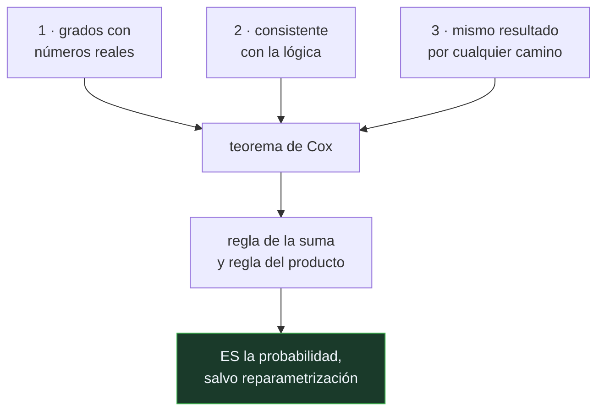

# P88 — Teorema de Cox

> Ruta probabilística · Por qué probabilidad y no otra escala. Tres condiciones mínimas
> bastan para que la respuesta sea única: no se elige, se deduce.

**Nivel:** L3 · **Motor:** `cox` · **Notebook:** [`P88_cox.ipynb`](../../../notebooks/papers/P88_cox.ipynb)
· **Anexo:** [probabilidad y verosimilitud](../../annexes/A02_PROBABILIDAD_Y_VEROSIMILITUD.md)

## 1. Identificación

| Campo | Valor |
|---|---|
| **Título original** | *Probability, Frequency and Reasonable Expectation* |
| **Autoría** | Richard T. Cox |
| **Año** | 1946 |
| **Venue** | American Journal of Physics, 14(1), 1–13 |
| **Fuente primaria** | [doi:10.1119/1.1990764](https://doi.org/10.1119/1.1990764) |
| **Acceso** | Restringido |
| **Fecha de consulta** | 2026-08-17 |

## 2. Problema anterior

Hay muchas formas propuestas de razonar con incertidumbre: frecuencias, grados de creencia,
factores de certeza, posibilidades, funciones de creencia. Cada escuela defiende la suya y la
discusión se resuelve por gusto, por tradición o por conveniencia computacional.

Faltaba un argumento de principio: ¿hay alguna razón —no de costumbre— para preferir la
probabilidad? Sin ella, la elección entre formalismos es arbitraria, y en IA eso se traduce en
sistemas cuyo comportamiento nadie puede justificar.

## 3. Propuesta

Pedirle a cualquier medida razonable de plausibilidad tres cosas mínimas:

1. **representar grados con números reales**, de modo que se puedan comparar;
2. **ser consistente con la lógica** en los casos extremos: lo cierto tiene el grado máximo y las
   reglas se reducen a las lógicas cuando no hay incertidumbre;
3. **ser internamente consistente**: si una conclusión se puede alcanzar razonando por dos caminos,
   los dos tienen que dar el mismo grado.

Y demostrar que cualquier medida que cumpla las tres es **isomorfa a la probabilidad**: satisface
necesariamente la regla de la suma y la del producto.

## 4. Intuición sin fórmulas

Medir temperatura. Puedes usar grados Celsius, Fahrenheit o Kelvin, y las tres escalas son
distintas. Pero no puedes inventarte una en la que el agua hierva por debajo de donde se congela:
la estructura del orden está fijada por el fenómeno, aunque los números no lo estén.

Cox demuestra que con las creencias pasa lo mismo. Cualquier escala coherente es la probabilidad,
reetiquetada.

**Dónde deja de funcionar la analogía:** la temperatura es una magnitud física medible. Aquí no se
mide nada: se deduce qué reglas debe cumplir un razonamiento que no quiera contradecirse.

## 5. Matemática mínima

```text
Consistencia interna ⟹  hay una función F tal que  P(A∧B|C) = F(P(A|B∧C), P(B|C))
Consistencia con la lógica ⟹  F es asociativa
Álgebra funcional ⟹  existe un reescalado en el que F es el PRODUCTO

Y análogamente para la negación ⟹  regla de la SUMA
```

La miniatura llega a la misma conclusión por otro camino —el del **libro holandés**— porque se
comprueba con una resta:

| Creencia | Paga por dos apuestas | Cobra pase lo que pase | Resultado garantizado |
|---|---:|---:|---:|
| 0,6 en «llueve» y 0,6 en «no llueve» | 120 | 100 | **−20** |
| 0,6 y 0,4 | 100 | 100 | 0 |

Quien viola la regla de la suma pierde con certeza, sin que haga falta saber si llueve. Y la escala
no es única: elevar al cubo conserva el orden y sigue cumpliendo los desiderata. Lo fijado es la
**estructura**.

<!-- puente:inicio -->
> [!TIP]
> **Puente matemático.** Esta sección da por sabido lo siguiente. Si algo no te suena,
> léelo primero: está explicado una sola vez, en un solo sitio, y sirve para todas las fichas.

| Dónde | Qué necesitas de ahí |
|---|---|
| [**A02 §3** · Verosimilitud y entropía cruzada](../../annexes/A02_PROBABILIDAD_Y_VEROSIMILITUD.md#3-verosimilitud-y-entropía-cruzada) | la regla del producto en acción: cómo se combinan evidencias independientes |
<!-- puente:fin -->

## 6. Arquitectura o flujo



## 7. Qué observar en el paper original

- El **enunciado de los desiderata** y con qué cuidado están elegidos: cada uno parece inocuo por
  separado, y juntos no dejan margen.
- Que el artículo se publica en una revista de **física**, no de matemáticas ni de filosofía. Cox
  llega al problema desde la inferencia experimental.
- La **derivación de la ecuación funcional** y el paso donde aparece la asociatividad: es el corazón
  técnico y el punto donde luego se discutieron los supuestos.
- Que el resultado es de **unicidad salvo reparametrización**, no de identidad: es una afirmación
  más fuerte y más sutil de lo que suele citarse.

## 8. Evidencia y resultados

Es un artículo puramente teórico: enuncia los desiderata, plantea las ecuaciones funcionales que
implican y las resuelve.

> No hay experimentos. Y hay supuestos técnicos —diferenciabilidad, densidad de ciertos conjuntos—
> que Cox no explicita del todo y que Halpern (1999) mostró que hacen falta para que la
> demostración sea correcta.

La miniatura no reproduce la demostración: exhibe la consecuencia por la vía del libro holandés,
que es de Ramsey y de Finetti y no de Cox, pero llega al mismo sitio y se comprueba con una resta.

## 9. Impacto

- Es el argumento de referencia del bayesianismo objetivo, desarrollado en profundidad por Jaynes
  en *Probability Theory: The Logic of Science*.
- Da a la probabilidad un estatus distinto del de una convención: la convierte en la **extensión
  única de la lógica** a grados de creencia.
- Por contraste, permite situar con precisión qué renuncian formalismos como los factores de
  certeza de [P69](../P69_mycin/README.md) o los conjuntos difusos de
  [P89](../P89_fuzzy/README.md): no son errores, son decisiones con un coste declarable.
- Y aporta al programa el criterio para juzgar cualquier «score de confianza» que aparezca en un
  sistema: si no cumple la regla de la suma, es explotable.

## 10. Limitaciones

1. **Los supuestos técnicos importan.** Halpern (1999) construyó contraejemplos con dominios
   finitos donde la demostración, tal como está enunciada, falla.
2. **No dice de dónde salen las previas.** Que la estructura sea única no fija los números
   iniciales, y ese es el problema práctico.
3. **Presupone que la creencia se representa con un solo número.** Formalismos con intervalos o con
   conjuntos de probabilidades rechazan justamente ese desiderátum.
4. **No es un argumento contra la utilidad de otros formalismos**: la lógica difusa responde otra
   pregunta, no la misma peor.
5. **Es abstracto y difícil de aplicar**: no da ningún método, solo una justificación.

## 11. Errores comunes

| Error | Corrección |
|---|---|
| «El teorema demuestra que la probabilidad es la única forma de tratar la incertidumbre» | Demuestra que es la única que cumple ESOS tres desiderata. Rechazar uno de ellos —por ejemplo, representar la creencia con un solo número— abre otras opciones legítimas. |
| «La probabilidad tiene una escala privilegiada» | El resultado es de unicidad salvo reparametrización monótona. Lo fijado es la estructura, no los números. |
| «El libro holandés es el argumento de Cox» | Es el de Ramsey y de Finetti, y parte de las apuestas en vez de los desiderata. Convergen, y esa convergencia es interesante, pero no son el mismo argumento. |
| «Un sistema con puntuaciones que no suman 1 está mal diseñado» | Está mal diseñado como medida de creencia sobre alternativas excluyentes. Si mide otra cosa —pertenencia, prioridad, coste— la regla de la suma no aplica. |
| «La demostración es incuestionable» | Sus supuestos técnicos fueron discutidos y precisados después. El resultado sobrevive, con hipótesis mejor enunciadas. |

## 12. Relación con trabajos anteriores

- **[P87 Teorema de Bayes](../P87_bayes/README.md) (1763)** — la regla cuya justificación de
  principio aporta este artículo.
- **Keynes (1921)** — *A Treatise on Probability*: la probabilidad como relación lógica entre
  proposiciones.
- **Ramsey (1926) y de Finetti (1937)** — la coherencia vía apuestas, el otro camino a la misma
  conclusión.

## 13. Relación con trabajos posteriores

- **Jaynes** — *Probability Theory: The Logic of Science*: el desarrollo completo del programa.
  [doi:10.1017/CBO9780511790423](https://doi.org/10.1017/CBO9780511790423)
- **Halpern (1999)** — la revisión crítica de los supuestos técnicos.
  [doi:10.1613/jair.644](https://doi.org/10.1613/jair.644)
- **[P91 Redes bayesianas](../P91_redes_bayesianas/README.md) (1986)** — la respuesta a la objeción
  práctica: la probabilidad sí es tratable si se explota la estructura.
- **[P69 Factores de certeza](../P69_mycin/README.md) (1975)** — el formalismo alternativo cuyo
  coste este teorema permite nombrar con precisión.

## 14. Notebook asociado

[`P88_cox.ipynb`](../../../notebooks/papers/P88_cox.ipynb)

**Qué implementa:** los tres desiderata, el cálculo del arbitraje contra una creencia incoherente y contra una coherente, y la comprobación de que un reescalado monótono conserva la estructura.

**Qué NO implementa:** no reproduce la demostración de Cox ni sus ecuaciones funcionales. Usa el libro holandés, que es otro argumento con la misma conclusión y cabe en veinte líneas.

```bash
ai-evolution paper-lab P88 --seed 7
```

## 15. Actividades Bloom

| Nivel | Actividad |
|---|---|
| **Recordar** | Enuncia los tres desiderata. |
| **Explicar** | Explica qué significa que una medida sea isomorfa a la probabilidad. |
| **Aplicar** | Ejecuta el notebook y calcula el arbitraje contra una creencia de 0,3 y 0,3. |
| **Analizar** | Analiza por qué un reescalado monótono no rompe los desiderata. |
| **Evaluar** | «La probabilidad es una convención entre varias». Evalúa la afirmación. |
| **Crear** | Revisa un sistema de puntuación que uses y comprueba si sus números cumplen la regla de la suma sobre alternativas excluyentes. |

## 16. Autoevaluación

1. ¿Qué pregunta responde el teorema?
2. ¿Cuáles son los tres desiderata?
3. ¿Qué significa «isomorfa a la probabilidad»?
4. ¿Es única la escala?
5. ¿Qué es un libro holandés?
6. ¿Qué renuncian los formalismos que no cumplen los desiderata?
7. ¿Qué no resuelve el teorema?

## 17. Respuestas esperadas

1. Por qué usar probabilidad y no cualquier otra escala de plausibilidad. La responde deduciendo la probabilidad de condiciones mínimas, en lugar de postularla.
2. Representar los grados con números reales; ser consistente con la lógica en los casos extremos; y dar el mismo resultado sea cual sea el camino de razonamiento.
3. Que existe un reescalado bajo el cual esa medida satisface exactamente la regla de la suma y la del producto. Es la misma estructura con otros números.
4. No. Cualquier transformación monótona —elevar al cubo, por ejemplo— sigue cumpliendo los desiderata. Lo fijado es la estructura de las reglas, no la escala.
5. Un conjunto de apuestas que garantiza pérdida a quien las acepte, sea cual sea el resultado. Solo es construible contra creencias incoherentes.
6. Alguno de los desiderata. Los factores de certeza renuncian a la regla de la suma; los conjuntos difusos, a que la medida sea sobre alternativas excluyentes. Son decisiones con coste, no errores.
7. De dónde salen las probabilidades previas. Fija la estructura del razonamiento, no su punto de partida.

## 18. Fuentes primarias

- Cox, R. T. (1946). *Probability, Frequency and Reasonable Expectation*. **American Journal of
  Physics**, 14(1), 1–13. [doi:10.1119/1.1990764](https://doi.org/10.1119/1.1990764) ·
  consultado 2026-08-17.
- Halpern, J. (1999). *A Counterexample to Theorems of Cox and Fine*.
  [doi:10.1613/jair.644](https://doi.org/10.1613/jair.644) · consultado 2026-08-17.
- Jaynes, E. T. *Probability Theory: The Logic of Science*.
  [doi:10.1017/CBO9780511790423](https://doi.org/10.1017/CBO9780511790423) · consultado 2026-08-17.

---

[⬅️ Anterior: P87 Teorema de Bayes](../P87_bayes/README.md) ·
[📇 Índice](../../catalog/PAPERS_INDEX.md) ·
[📝 Evaluación](../../../assessments/papers/P88_cox.md) ·
[🏫 Clase 025 · Razonamiento con incertidumbre](../../../classes/part-02-probabilistic-evolutionary-and-decision-ai/025-razonamiento-con-incertidumbre/README.md) ·
[➡️ Siguiente: P89 Conjuntos difusos](../P89_fuzzy/README.md)
