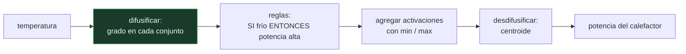

# P89 — Conjuntos difusos

> Ruta probabilística · Vaguedad, que no es incertidumbre. A 25 °C no hay un 70 % de
> probabilidad de que haga calor: hace calor en un grado de 0,7.

**Nivel:** L2 · **Motor:** `fuzzy` · **Notebook:** [`P89_fuzzy.ipynb`](../../../notebooks/papers/P89_fuzzy.ipynb)
· **Anexo:** [probabilidad y verosimilitud](../../annexes/A02_PROBABILIDAD_Y_VEROSIMILITUD.md)

## 1. Identificación

| Campo | Valor |
|---|---|
| **Título original** | *Fuzzy Sets* |
| **Autoría** | Lotfi A. Zadeh |
| **Año** | 1965 |
| **Venue** | Information and Control, 8(3), 338–353 |
| **Fuente primaria** | [doi:10.1016/S0019-9958(65)90241-X](https://doi.org/10.1016/S0019-9958(65)90241-X) |
| **Acceso** | Abierto |
| **Fecha de consulta** | 2026-08-17 |

## 2. Problema anterior

La teoría de conjuntos es binaria: un elemento pertenece o no pertenece. Pero los predicados con
los que las personas describen el mundo —«alto», «caliente», «cerca», «rápido»— no tienen frontera
nítida.

Forzarlos a un umbral produce sistemas que cambian de decisión ante una diferencia irrelevante: a
24,9 °C no hace calor y a 25,0 °C sí. Y en control automático eso significa oscilación, desgaste y
comportamiento a saltos donde el proceso es continuo.

## 3. Propuesta

Generalizar la función característica. En vez de `μ_A(x) ∈ {0, 1}`, permitir
`μ_A(x) ∈ [0, 1]`: el **grado de pertenencia**.

Y definir sobre ella las operaciones de conjuntos:

```text
A ∩ B → min(μ_A, μ_B)      A ∪ B → max(μ_A, μ_B)      ¬A → 1 − μ_A
```

Zadeh insiste desde la primera página en que esto **no es probabilidad**: los grados de pertenencia
no tienen que sumar uno y no describen la incertidumbre sobre un hecho, sino la vaguedad de un
predicado.

## 4. Intuición sin fórmulas

Una montaña. ¿Dónde empieza exactamente? No hay una línea en el suelo, y sin embargo todo el
mundo distingue una montaña de una llanura.

La pregunta «¿esto es montaña, sí o no?» está mal planteada; «¿en qué grado es montaña?» sí tiene
respuesta útil. Y la respuesta no es una probabilidad: no hay ninguna incertidumbre sobre el
terreno, lo vago es el concepto.

**Dónde deja de funcionar la analogía:** la altura de la montaña es objetiva. El grado de
pertenencia lo asigna una persona, y dos expertos razonables pueden dar curvas distintas. Esa es la
crítica más seria al enfoque y no tiene respuesta técnica.

## 5. Matemática mínima

```text
Clásico:  μ_A(x) ∈ {0, 1}          Difuso:  μ_A(x) ∈ [0, 1]

Operadores de Zadeh:
    min y max — idempotentes:  min(a, a) = a
    frente al producto de la probabilidad, que no lo es: a·a = a²
```

La miniatura mide tres conjuntos sobre la temperatura:

| °C | frío | templado | caluroso | **suma** |
|---:|---:|---:|---:|---:|
| 8 | 1,0 | 0 | 0 | 1,0 |
| 16 | 0,25 | 0,4 | 0 | **0,65** |
| 20 | 0 | 1,0 | 0 | 1,0 |
| 25 | 0 | 0,5 | 0,286 | **0,786** |
| 33 | 0 | 0 | 1,0 | 1,0 |

Las sumas **no dan 1**, y no tienen por qué: no es una distribución. Y el controlador difuso pasa
de 100 a 0 de potencia interpolando entre reglas activadas parcialmente, sin un solo umbral duro.

## 6. Arquitectura o flujo



## 7. Qué observar en el paper original

- La **insistencia en la primera página** en que no es probabilidad. Es el malentendido que Zadeh
  pasó décadas corrigiendo, y sigue vivo.
- Las definiciones de **inclusión, complemento, unión e intersección** difusas, y la comprobación de
  que se reducen a las clásicas cuando los grados son 0 o 1.
- La noción de **conjunto convexo difuso** y las operaciones de corte por nivel (α-cortes), que son
  la herramienta práctica para pasar de difuso a nítido.
- Que el artículo **no propone control difuso**: eso llega diez años después con Mamdani. Zadeh
  propone un lenguaje matemático, no una aplicación.

## 8. Evidencia y resultados

Es un artículo de definiciones y propiedades: introduce el concepto, define las operaciones y
demuestra que generalizan las clásicas.

> No hay experimentos ni aplicación. La validación empírica llega con Mamdani y Assilian (1975),
> que controlan una máquina de vapor real con reglas difusas.

La miniatura de este eje no reproduce nada del artículo: construye tres conjuntos y un controlador
para exhibir las dos cosas que hay que entender —que las pertenencias no suman 1 y que el AND
difuso es idempotente— y hacerlas comprobables.

## 9. Impacto

- El **control difuso** se instaló en productos de consumo masivo en los años ochenta y noventa:
  lavadoras, cámaras, aire acondicionado, y el metro de Sendai.
- Su ventaja práctica es concreta: permite escribir el control en el lenguaje del operario experto,
  sin modelo matemático del proceso.
- Generó una familia matemática amplia —t-normas, lógicas multivaluadas, medidas de posibilidad—
  con vida propia.
- Y en el programa sirve para una distinción que se necesita constantemente: **vaguedad no es
  incertidumbre**, y confundirlas produce sistemas que responden a la pregunta equivocada.

## 10. Limitaciones

1. **Las funciones de pertenencia las escribe una persona.** No se estiman de datos y no hay
   criterio objetivo para sus vértices: es la crítica central y no tiene respuesta técnica.
2. **La elección de operadores no está determinada.** Min/max es una opción entre muchas familias
   de t-normas, y cambia el resultado.
3. **No escala en número de variables**: el número de reglas crece exponencialmente con las
   entradas.
4. **Elkan (1993)** argumentó que, bajo ciertos supuestos razonables, la lógica difusa colapsa a la
   bivaluada. El debate que siguió fue intenso y no está zanjado.
5. **No aprende.** Todo el conocimiento se introduce a mano, con el mismo cuello de botella que los
   sistemas expertos.

## 11. Errores comunes

| Error | Corrección |
|---|---|
| «Un grado de pertenencia es una probabilidad» | No. Las pertenencias no suman 1 —en la miniatura dan 0,65 y 0,786 en dos filas— y describen vaguedad del predicado, no incertidumbre sobre un hecho. |
| «La lógica difusa sustituye a la probabilidad» | Responden preguntas distintas. «¿Cuán alto es?» y «¿qué probabilidad hay de que sea alto?» no son la misma pregunta. |
| «Zadeh propuso el control difuso» | Propuso el marco matemático. El control difuso es de Mamdani y Assilian, diez años después. |
| «El AND difuso es el producto» | En la formulación de Zadeh es el mínimo, que es idempotente. El producto es otra t-norma válida, con otras propiedades. |
| «Es una técnica obsoleta» | Sigue en producción en control industrial y electrodomésticos. Lo que envejeció fue la ambición de sustituir a la probabilidad, no la técnica. |

## 12. Relación con trabajos anteriores

- **Łukasiewicz (1920)** — las lógicas multivaluadas: el antecedente formal de admitir valores
  entre verdadero y falso.
- **Black (1937)** — la vaguedad y los perfiles de consistencia, el planteamiento filosófico del
  problema.
- **[P88 Teorema de Cox](../P88_cox/README.md) (1946)** — el marco que este enfoque rechaza
  explícitamente, y por qué.

## 13. Relación con trabajos posteriores

- **Mamdani y Assilian (1975)** — el primer controlador difuso de un proceso real.
  [doi:10.1016/S0020-7373(75)80002-2](https://doi.org/10.1016/S0020-7373(75)80002-2)
- **Elkan (1993)** — *The Paradoxical Success of Fuzzy Logic*: la crítica más citada.
  [doi:10.1109/64.336150](https://doi.org/10.1109/64.336150)
- **[P69 Factores de certeza](../P69_mycin/README.md) (1975)** — la otra respuesta de la época al
  mismo problema, desde la medicina.

## 14. Notebook asociado

[`P89_fuzzy.ipynb`](../../../notebooks/papers/P89_fuzzy.ipynb)

**Qué implementa:** tres conjuntos difusos sobre la temperatura con sus grados de pertenencia y su suma, un controlador de tres reglas con desdifusificación por centroide, y la comparación entre los operadores de Zadeh y los de la probabilidad.

**Qué NO implementa:** no hay α-cortes, ni otras familias de t-normas, ni aprendizaje de las funciones de pertenencia. Y el controlador es de una sola entrada: el problema de la explosión de reglas no se ve.

```bash
ai-evolution paper-lab P89 --seed 7
```

## 15. Actividades Bloom

| Nivel | Actividad |
|---|---|
| **Recordar** | Define grado de pertenencia y di en qué se diferencia de una probabilidad. |
| **Explicar** | Explica por qué las pertenencias no tienen que sumar 1. |
| **Aplicar** | Ejecuta el notebook y calcula la potencia del controlador a 22 °C. |
| **Analizar** | Analiza la diferencia entre el AND de Zadeh y el producto. |
| **Evaluar** | «La lógica difusa es probabilidad con otro nombre». Evalúa la afirmación. |
| **Crear** | Diseña un controlador difuso de tres reglas para un problema tuyo y mueve los vértices un 20 %; documenta cuánto cambia la salida. |

## 16. Autoevaluación

1. ¿Qué generaliza un conjunto difuso?
2. ¿Por qué un grado de pertenencia no es una probabilidad?
3. ¿Cuáles son los operadores de Zadeh?
4. ¿Qué propiedad tiene el mínimo que no tiene el producto?
5. ¿De dónde salen las funciones de pertenencia?
6. ¿Quién propuso el control difuso?
7. ¿Cuál es la crítica más seria al enfoque?

## 17. Respuestas esperadas

1. La función característica de un conjunto: en vez de valer 0 o 1, toma cualquier valor en el intervalo [0, 1].
2. Porque las pertenencias no suman 1 sobre los conjuntos considerados, y porque describen la vaguedad del predicado y no la incertidumbre sobre un hecho. A 25 °C hace calor en grado 0,7; no hay un 70 % de probabilidad de que haga calor.
3. Mínimo para la intersección, máximo para la unión y complemento a uno para la negación.
4. La idempotencia: `min(a, a) = a`, mientras `a · a = a²`. Repetir la misma información no aumenta el grado, que es lo apropiado cuando se habla de vaguedad.
5. Las escribe una persona, a partir del conocimiento del dominio. No se estiman de datos y no hay criterio objetivo: es la crítica central al enfoque.
6. Mamdani y Assilian, en 1975, controlando una máquina de vapor. El artículo de Zadeh propone el marco matemático, no la aplicación.
7. Que las funciones de pertenencia y la elección de operadores son arbitrarias, y determinan por completo el comportamiento del sistema.

## 18. Fuentes primarias

- Zadeh, L. A. (1965). *Fuzzy Sets*. **Information and Control**, 8(3), 338–353.
  [doi:10.1016/S0019-9958(65)90241-X](https://doi.org/10.1016/S0019-9958(65)90241-X) ·
  consultado 2026-08-17.
- Mamdani, E. y Assilian, S. (1975). *An experiment in linguistic synthesis with a fuzzy logic
  controller*. [doi:10.1016/S0020-7373(75)80002-2](https://doi.org/10.1016/S0020-7373(75)80002-2) ·
  consultado 2026-08-17.
- Elkan, C. (1993). *The Paradoxical Success of Fuzzy Logic*.
  [doi:10.1109/64.336150](https://doi.org/10.1109/64.336150) · consultado 2026-08-17.

---

[⬅️ Anterior: P88 Teorema de Cox](../P88_cox/README.md) ·
[📇 Índice](../../catalog/PAPERS_INDEX.md) ·
[📝 Evaluación](../../../assessments/papers/P89_fuzzy.md) ·
[🏫 Clase 032 · Lógica difusa y control aproximado](../../../classes/part-02-probabilistic-evolutionary-and-decision-ai/032-logica-difusa-y-control-aproximado/README.md) ·
[➡️ Siguiente: P90 Algoritmos genéticos](../P90_algoritmos_geneticos/README.md)
