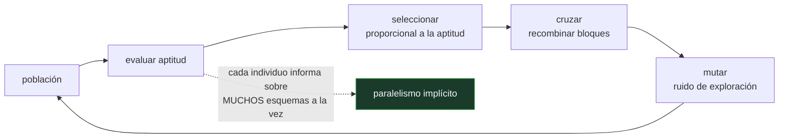

# P90 — Algoritmos genéticos

> Ruta probabilística · Una población que se reproduce reparte los ensayos casi como
> conviene. Y hay funciones construidas para que ese reparto se equivoque con confianza.

**Nivel:** L2 · **Motor:** `algoritmos_geneticos` · **Notebook:** [`P90_algoritmos_geneticos.ipynb`](../../../notebooks/papers/P90_algoritmos_geneticos.ipynb)
· **Anexo:** [complejidad y coste](../../annexes/A05_COMPLEJIDAD_Y_COSTE.md)

## 1. Identificación

| Campo | Valor |
|---|---|
| **Título original** | *Genetic Algorithms and the Optimal Allocation of Trials* |
| **Autoría** | John H. Holland |
| **Año** | 1973 |
| **Venue** | SIAM Journal on Computing, 2(2), 88–105 |
| **Fuente primaria** | [doi:10.1137/0202009](https://doi.org/10.1137/0202009) |
| **Acceso** | Restringido |
| **Fecha de consulta** | 2026-08-17 |

## 2. Problema anterior

Buscar en un espacio enorme sin gradiente obliga a decidir constantemente entre **explorar** lo
desconocido y **explotar** lo que ya se sabe que funciona. Cada evaluación gastada explorando es
una que no se gastó explotando.

Ese reparto tiene un nombre en teoría de la decisión —el problema del bandido de varios brazos— y
una solución conocida. Lo que faltaba era un argumento de por qué una población con selección y
recombinación resuelve bien ese reparto sin que nadie se lo haya programado.

## 3. Propuesta

Analizar la población no como un conjunto de individuos sino como un evaluador implícito de
**esquemas**: patrones con comodines, como `11****…`. Cada individuo pertenece a muchos esquemas a
la vez, así que evaluar `n` individuos aporta información sobre muchos más de `n` patrones — es el
**paralelismo implícito**.

Y demostrar que la reproducción proporcional a la aptitud asigna ensayos a los esquemas de forma
cercana a la óptima del problema del bandido: los que rinden reciben una proporción creciente,
exponencialmente.

## 4. Intuición sin fórmulas

Un restaurante que prueba platos. No evalúa recetas completas: evalúa combinaciones —«con
mantequilla», «poco hecho», «con limón»— y cada plato que sirve informa sobre todas las
combinaciones que contiene.

Las que gustan aparecen en más platos de la carta siguiente. Nadie decide eso explícitamente:
emerge de servir más lo que se pide más.

**Dónde deja de funcionar la analogía:** en el restaurante los ingredientes se combinan de forma
más o menos aditiva. Si un plato solo funciona cuando **todos** sus ingredientes son los correctos
y cualquier subconjunto sabe peor, el método converge a la carta equivocada. Eso es una función
deceptiva.

## 5. Matemática mínima

```text
Esquema H: patrón con comodines, p. ej. 1 1 * * * …
Orden o(H): número de posiciones fijas       Longitud δ(H): distancia entre la primera y la última

Teorema de los esquemas (forma simplificada):
    m(H, t+1) ≥ m(H, t) · f(H)/f̄ · [1 − p_c·δ(H)/(L−1) − o(H)·p_m]

    los esquemas CORTOS, de BAJO ORDEN y por encima de la media
    reciben ensayos exponencialmente crecientes
```

La miniatura mide dos experimentos con el mismo presupuesto de 1 600 evaluaciones:

| Experimento | Resultado |
|---|---|
| OneMax (sin trampa) | algoritmo **20/20** · búsqueda aleatoria **17** |
| trampa deceptiva de 4 bits | **escapa**: 21 de 21 |
| trampa deceptiva de 10 bits | **no escapa**: 19 frente a 21 |

Esa frontera es el resultado que importa. El bloque corto lo reensambla el cruce por azar antes de
que la selección lo fije; el largo, no.

<!-- puente:inicio -->
> [!TIP]
> **Puente matemático.** Esta sección da por sabido lo siguiente. Si algo no te suena,
> léelo primero: está explicado una sola vez, en un solo sitio, y sirve para todas las fichas.

| Dónde | Qué necesitas de ahí |
|---|---|
| [**A05 §1** · Notación O(): qué dice y qué no](../../annexes/A05_COMPLEJIDAD_Y_COSTE.md#1-notación-o-qué-dice-y-qué-no) | por qué un espacio de 2²⁰ no se puede recorrer y hace falta una heurística poblacional |
<!-- puente:fin -->

## 6. Arquitectura o flujo



## 7. Qué observar en el paper original

- La conexión con el **problema del bandido**, que es lo que da al artículo su título y su carácter
  de resultado teórico y no de receta.
- El **paralelismo implícito**: la afirmación de que una población de `n` individuos procesa del
  orden de `n³` esquemas. Es la parte más citada y la más discutida.
- Que el teorema de los esquemas es una **desigualdad sobre esquemas cortos y de bajo orden**, no
  una garantía de convergencia. Se cita mucho más de lo que se lee.
- Que Holland escribe desde la **adaptación** como fenómeno general, no desde la optimización.
  Su libro de 1975 se titula *Adaptation in Natural and Artificial Systems*.

## 8. Evidencia y resultados

Es un artículo teórico: plantea la analogía con el bandido, define los esquemas y deriva la
desigualdad de reproducción.

> No hay experimentos comparativos. La validación empírica del método llega en la década siguiente,
> y con ella también las críticas al teorema de los esquemas como explicación.

La miniatura mide lo que sí se puede medir en un cuaderno: que el método bate a la búsqueda
aleatoria con el mismo presupuesto cuando hay estructura, y que hay estructura construida a
propósito para que falle.

## 9. Impacto

- Funda la **computación evolutiva** como campo, con conferencias, revistas y aplicaciones propias.
- La programación genética de Koza (1992) lleva la idea a la evolución de programas.
- La idea de mantener una **población de soluciones diversas** en vez de una sola reaparece en
  optimización de hiperparámetros y en búsqueda de arquitecturas.
- Y aporta al programa la lección más transferible sobre heurísticas: no buscan en el vacío,
  explotan la estructura que haya. Cuando la estructura engaña, el método se equivoca con la misma
  confianza con la que acierta.

## 10. Limitaciones

1. **El teorema de los esquemas no explica el éxito del método.** Es una cota sobre esquemas
   cortos y de bajo orden, y hay literatura considerable cuestionando su valor explicativo.
2. **Las funciones deceptivas lo derrotan**, y la miniatura mide dónde está la frontera: escapa de
   una trampa de 4 bits y no de una de 10.
3. **No hay garantía de convergencia** al óptimo global, ni cota útil de tiempo.
4. **Muchos hiperparámetros**: tamaño de población, tasa de cruce, tasa de mutación, esquema de
   selección. Todos importan y ninguno tiene valor canónico.
5. **El teorema No Free Lunch** (Wolpert y Macready, 1997) impone el límite general: promediado
   sobre todas las funciones posibles, ningún optimizador bate al azar.

## 11. Errores comunes

| Error | Corrección |
|---|---|
| «Los algoritmos genéticos son optimizadores de propósito general» | No existe tal cosa: el teorema No Free Lunch lo prohíbe. Que funcionen en un problema es una afirmación sobre ese problema. |
| «El teorema de los esquemas demuestra que el método converge» | Es una desigualdad sobre la proporción de ciertos esquemas en la generación siguiente. No garantiza convergencia ni acota el tiempo. |
| «Más mutación explora mejor» | Con mutación alta el método degenera en búsqueda aleatoria y pierde lo que había aprendido. Es un equilibrio, no una palanca monótona. |
| «Si no encuentra el óptimo, faltan generaciones» | Puede estar en un óptimo local de una función deceptiva, y ahí más generaciones solo consolidan la respuesta equivocada. |
| «La analogía biológica explica por qué funciona» | La analogía motiva el diseño. Lo que explica el comportamiento —hasta donde se explica— es el análisis de asignación de ensayos, y sigue en discusión. |

## 12. Relación con trabajos anteriores

- **Fogel, Owens y Walsh (1966)** — programación evolutiva: la línea paralela e independiente.
- **Robbins (1952)** — el problema del bandido de varios brazos, el marco de decisión que Holland
  usa como referencia de optimalidad.
- **[P58 Símbolos y búsqueda](../P58_simbolos_y_busqueda/README.md) (1976)** — la búsqueda como
  marco general, del que esto es una familia sin heurística explícita.

## 13. Relación con trabajos posteriores

- **Goldberg y Holland (1988)** — la introducción que popularizó el método fuera de la academia.
  [doi:10.1023/A:1022602019183](https://doi.org/10.1023/A:1022602019183)
- **Koza (1992)** — programación genética: evolucionar programas en vez de cadenas.
- **Wolpert y Macready (1997)** — *No Free Lunch*: el límite que acota a toda esta familia.
  [doi:10.1109/4235.585893](https://doi.org/10.1109/4235.585893)
- **[P92 Enjambre de partículas](../P92_pso/README.md) (1995)** — la otra familia poblacional, sin
  recombinación.

## 14. Notebook asociado

[`P90_algoritmos_geneticos.ipynb`](../../../notebooks/papers/P90_algoritmos_geneticos.ipynb)

**Qué implementa:** el bucle completo de selección, cruce y mutación sobre dos funciones: una sin trampa —donde bate a la búsqueda aleatoria con el mismo presupuesto— y una deceptiva a dos escalas, para localizar dónde el método falla.

**Qué NO implementa:** no hay teorema de los esquemas demostrado, ni programación genética, ni codificaciones reales o de permutación. La aptitud es instantánea, que es lo contrario del caso real.

```bash
ai-evolution paper-lab P90 --seed 7
```

## 15. Actividades Bloom

| Nivel | Actividad |
|---|---|
| **Recordar** | Define esquema, orden y longitud definitoria. |
| **Explicar** | Explica qué es el paralelismo implícito. |
| **Aplicar** | Ejecuta el notebook y compara las dos trampas. |
| **Analizar** | Analiza por qué el cruce reensambla un bloque de 4 bits y no uno de 10. |
| **Evaluar** | «El algoritmo genético encontró el óptimo». Evalúa qué habría que comprobar antes de creerlo. |
| **Crear** | Codifica un problema real como cromosoma y compáralo con una búsqueda aleatoria del mismo presupuesto. |

## 16. Autoevaluación

1. ¿Qué problema de decisión usa Holland como referencia?
2. ¿Qué es un esquema?
3. ¿Qué es el paralelismo implícito?
4. ¿Qué dice el teorema de los esquemas?
5. ¿Qué es una función deceptiva?
6. ¿Escapa el método de cualquier trampa?
7. ¿Qué límite general impone el No Free Lunch?

## 17. Respuestas esperadas

1. El del bandido de varios brazos: cómo repartir ensayos entre alternativas cuando probar cuesta y hay que decidir entre explorar y explotar.
2. Un patrón con comodines sobre el cromosoma, como `11****…`. Un individuo pertenece simultáneamente a muchos esquemas.
3. Que evaluar `n` individuos aporta información sobre muchos más de `n` esquemas, porque cada individuo pertenece a muchos a la vez. La población procesa patrones en paralelo sin representarlos.
4. Que los esquemas cortos, de bajo orden y con aptitud por encima de la media reciben una proporción exponencialmente creciente de la población. Es una desigualdad, no una garantía de convergencia.
5. Una función donde el gradiente de aptitud apunta en dirección contraria al óptimo global: los subconjuntos buenos del óptimo parecen peores que los del óptimo local.
6. No. En la miniatura escapa de una trampa de 4 bits y no de una de 10: el cruce reensambla bloques cortos por azar, pero no bloques largos.
7. Que promediado sobre todas las funciones objetivo posibles, ningún optimizador rinde mejor que la búsqueda aleatoria. Cualquier ventaja es una afirmación sobre una clase de problemas.

## 18. Fuentes primarias

- Holland, J. H. (1973). *Genetic Algorithms and the Optimal Allocation of Trials*. **SIAM
  Journal on Computing**, 2(2), 88–105. [doi:10.1137/0202009](https://doi.org/10.1137/0202009) ·
  consultado 2026-08-17.
- Goldberg, D. y Holland, J. (1988). *Genetic Algorithms and Machine Learning*.
  [doi:10.1023/A:1022602019183](https://doi.org/10.1023/A:1022602019183) · consultado 2026-08-17.
- Wolpert, D. y Macready, W. (1997). *No Free Lunch Theorems for Optimization*.
  [doi:10.1109/4235.585893](https://doi.org/10.1109/4235.585893) · consultado 2026-08-17.

---

[⬅️ Anterior: P89 Conjuntos difusos](../P89_fuzzy/README.md) ·
[📇 Índice](../../catalog/PAPERS_INDEX.md) ·
[📝 Evaluación](../../../assessments/papers/P90_algoritmos_geneticos.md) ·
[🏫 Clase 033 · Algoritmos genéticos](../../../classes/part-02-probabilistic-evolutionary-and-decision-ai/033-algoritmos-geneticos/README.md) ·
[➡️ Siguiente: P91 Redes bayesianas](../P91_redes_bayesianas/README.md)
