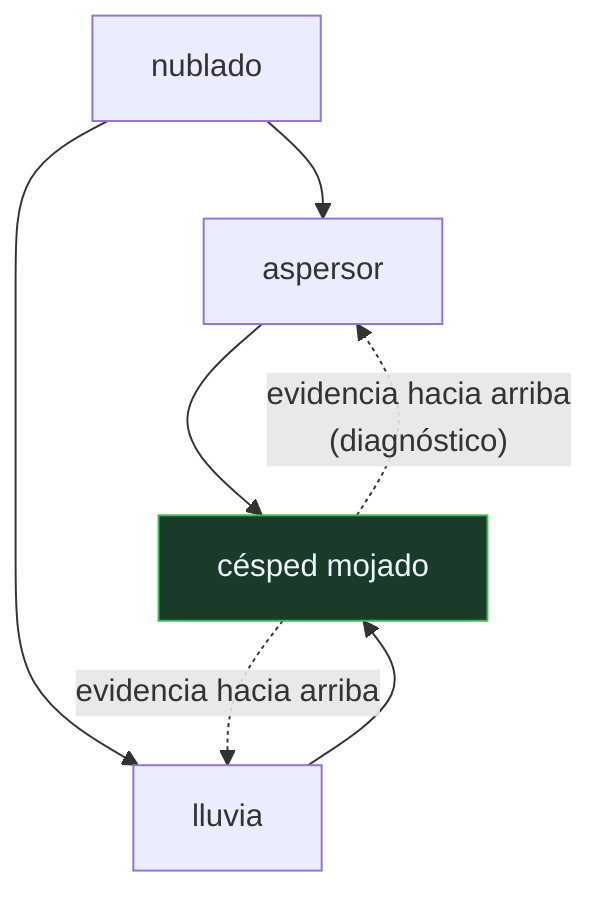

# P91 — Redes bayesianas

> Ruta probabilística · Devuelve la probabilidad a la IA haciéndola tratable: el grafo
> dice qué guardar y qué se puede propagar localmente.

**Nivel:** L3 · **Motor:** `redes_bayesianas` · **Notebook:** [`P91_redes_bayesianas.ipynb`](../../../notebooks/papers/P91_redes_bayesianas.ipynb)
· **Anexo:** [probabilidad y verosimilitud](../../annexes/A02_PROBABILIDAD_Y_VEROSIMILITUD.md)

## 1. Identificación

| Campo | Valor |
|---|---|
| **Título original** | *Fusion, Propagation, and Structuring in Belief Networks* |
| **Autoría** | Judea Pearl |
| **Año** | 1986 |
| **Venue** | Artificial Intelligence, 29(3), 241–288 |
| **Fuente primaria** | [doi:10.1016/0004-3702(86)90072-X](https://doi.org/10.1016/0004-3702%2886%2990072-X) |
| **Acceso** | Restringido |
| **Fecha de consulta** | 2026-08-17 |

## 2. Problema anterior

La probabilidad tenía la justificación de principio ([P88](../P88_cox/README.md)) y una objeción
práctica que parecía definitiva: con `n` variables binarias, la tabla conjunta tiene `2ⁿ` entradas.

Con 30 variables son mil millones de números que nadie puede estimar, almacenar ni actualizar. Esa
fue la razón técnica —no filosófica— por la que la IA de los setenta abandonó la probabilidad y
construyó [factores de certeza](../P69_mycin/README.md) y otros formalismos aproximados.

## 3. Propuesta

Observar que casi todas esas entradas son redundantes, porque **casi todo es condicionalmente
independiente de casi todo**. Representar esas independencias con un grafo dirigido acíclico:

```text
P(x₁ … xₙ) = Π P(xᵢ | padres(xᵢ))
```

Cada nodo necesita solo su tabla condicional dada su familia. Y la actualización de creencias se
puede hacer por **paso de mensajes entre nodos vecinos**: cada nodo combina lo que le llega de sus
padres (predicción) con lo que le llega de sus hijos (diagnóstico), sin necesidad de un cálculo
global.

## 4. Intuición sin fórmulas

Un rumor en una oficina grande. Para saber qué cree cada persona no hace falta modelar todas las
combinaciones posibles de creencias: basta saber quién habla con quién.

La estructura de conversaciones determina qué información llega a dónde, y actualizar la creencia
de alguien solo requiere consultar a sus vecinos inmediatos.

**Dónde deja de funcionar la analogía:** en una oficina hay corrillos y la información vuelve por
donde vino. En un grafo con ciclos, el paso de mensajes deja de ser exacto — y por eso hace falta
el algoritmo del árbol de uniones.

## 5. Matemática mínima

```text
Factorización:  P(x₁…xₙ) = Π P(xᵢ | padres(xᵢ))

Dos patrones que el grafo codifica y la correlación no:

    causa común    A ← C → B    dependientes, INDEPENDIENTES dado C
    efecto común   A → E ← B    independientes, DEPENDIENTES dado E   ← explicar y descartar
```

La miniatura usa la red canónica —nublado → {aspersor, lluvia} → césped mojado—:

| Consulta | Resultado |
|---|---:|
| P(lluvia) sin información | 0,5 |
| P(lluvia \| césped mojado) | **0,7079** |
| P(lluvia \| césped mojado, aspersor encendido) | **0,3204** |
| parámetros de la tabla conjunta | 15 |
| parámetros de la red | **9** |

Saber que el aspersor estuvo encendido **baja** la probabilidad de lluvia: una causa explica el
efecto y descarta a la otra. Con 4 variables el ahorro de parámetros es modesto; con 30, es la
diferencia entre mil millones y unas decenas.

<!-- puente:inicio -->
> [!TIP]
> **Puente matemático.** Esta sección da por sabido lo siguiente. Si algo no te suena,
> léelo primero: está explicado una sola vez, en un solo sitio, y sirve para todas las fichas.

| Dónde | Qué necesitas de ahí |
|---|---|
| [**A02 §3** · Verosimilitud y entropía cruzada](../../annexes/A02_PROBABILIDAD_Y_VEROSIMILITUD.md#3-verosimilitud-y-entropía-cruzada) | cómo se combina la evidencia que llega de varios sitios sobre la misma variable |
<!-- puente:fin -->

## 6. Arquitectura o flujo



## 7. Qué observar en el paper original

- El **algoritmo de paso de mensajes** y su separación entre evidencia causal (de padres a hijos) y
  evidencia diagnóstica (de hijos a padres). Es la parte técnica central.
- Que la propagación es **exacta en poliárboles** —grafos sin ciclos no dirigidos— y deja de serlo
  en cuanto hay bucles. Esa limitación motiva todo el trabajo posterior.
- La discusión de **explicar y descartar** como fenómeno que los sistemas de reglas no capturaban, y
  que era una de las críticas a los formalismos aproximados.
- El vocabulario que introduce —**creencia, evidencia, mensajes λ y π**— y que se convirtió en el
  estándar del área.

## 8. Evidencia y resultados

El artículo desarrolla el formalismo y demuestra la corrección del paso de mensajes en
poliárboles, con ejemplos de razonamiento diagnóstico.

> La demostración vale para grafos **sin bucles**. La propagación en grafos generales es un problema
> distinto, que se resuelve con el árbol de uniones (Lauritzen y Spiegelhalter, 1988) y que en el
> caso general sigue siendo NP-difícil.

La miniatura calcula por enumeración —cuatro variables caben en la tabla— y comprueba tanto el
patrón de explicar y descartar como la independencia condicional que el grafo promete.

## 9. Impacto

- Devolvió la probabilidad al centro de la IA, y con ella el rigor que los formalismos aproximados
  de los setenta habían tenido que sacrificar.
- Es la base de los **modelos gráficos probabilísticos**, una familia que incluye modelos ocultos de
  Markov, campos aleatorios condicionales y buena parte de la visión por computador de los 2000.
- El **paso de mensajes** reaparece en decodificación de códigos LDPC —que es cómo funciona el
  wifi— y en las redes neuronales de grafos.
- Y lleva directamente a la agenda causal de Pearl: el mismo grafo que hace tratable la inferencia
  es el que permite distinguir ver de hacer, en
  [P95](../P95_causalidad/README.md).

## 10. Limitaciones

1. **La inferencia exacta es NP-difícil** en grafos generales. El grafo hace tratable el caso con
   estructura, no todos los casos.
2. **El paso de mensajes solo es exacto sin bucles.** En grafos con ciclos se usa propagación
   aproximada, sin garantía de convergencia.
3. **Las tablas condicionales hay que estimarlas**, y su número crece exponencialmente con el
   número de padres de cada nodo.
4. **Aprender la estructura del grafo a partir de datos** es mucho más difícil que aprender los
   parámetros, y en general no está identificada.
5. **Las flechas no son causales por sí solas.** Un mismo conjunto de independencias admite varios
   grafos; leerlas como causalidad exige supuestos adicionales.

## 11. Errores comunes

| Error | Corrección |
|---|---|
| «Las flechas del grafo representan correlaciones» | Representan dependencias con dirección. Y el patrón de efecto común hace que dos variables independientes se vuelvan dependientes al observar el efecto: ninguna correlación hace eso. |
| «Saber más siempre aumenta la creencia en una causa» | Explicar y descartar: en la miniatura, saber del aspersor BAJA la probabilidad de lluvia de 0,7079 a 0,3204. |
| «Las redes bayesianas resuelven el problema de la intratabilidad» | Lo resuelven cuando hay estructura de independencia que explotar. En el caso general la inferencia sigue siendo NP-difícil. |
| «Una flecha significa causalidad» | El grafo codifica independencias. Varios grafos distintos pueden codificar las mismas, y leer causalidad exige supuestos que no están en los datos. |
| «Con más variables la red siempre es mejor que la tabla» | Solo si hay independencias que explotar. Si todo depende de todo, la red degenera en la tabla conjunta completa. |

## 12. Relación con trabajos anteriores

- **[P87 Teorema de Bayes](../P87_bayes/README.md) (1763)** — la regla de actualización que la red
  aplica localmente.
- **[P88 Teorema de Cox](../P88_cox/README.md) (1946)** — la justificación de principio a la que
  faltaba viabilidad práctica.
- **[P69 Factores de certeza](../P69_mycin/README.md) (1975)** — el formalismo aproximado que esta
  propuesta viene a sustituir, y con qué argumento.

## 13. Relación con trabajos posteriores

- **Pearl (1988)** — *Probabilistic Reasoning in Intelligent Systems*: el libro que consolida el
  área. [doi:10.1016/C2009-0-27609-4](https://doi.org/10.1016/C2009-0-27609-4)
- **Lauritzen y Spiegelhalter (1988)** — el árbol de uniones: inferencia exacta con bucles.
  [doi:10.1111/j.2517-6161.1988.tb01721.x](https://doi.org/10.1111/j.2517-6161.1988.tb01721.x)
- **[P95 Herramientas causales](../P95_causalidad/README.md) (2019)** — qué se puede hacer con el
  mismo grafo cuando la pregunta es de intervención.
- **[P94 Stan](../P94_programacion_probabilistica/README.md) (2017)** — declarar el modelo y dejar
  la inferencia a un motor general.

## 14. Notebook asociado

[`P91_redes_bayesianas.ipynb`](../../../notebooks/papers/P91_redes_bayesianas.ipynb)

**Qué implementa:** el cálculo por enumeración de la red canónica, la comprobación del patrón de explicar y descartar, la verificación de la independencia condicional y el conteo de parámetros frente a la tabla conjunta.

**Qué NO implementa:** no implementa paso de mensajes ni árbol de uniones: con cuatro variables la conjunta cabe entera y se calcula directamente. Tampoco hay aprendizaje de estructura ni de parámetros.

```bash
ai-evolution paper-lab P91 --seed 7
```

## 15. Actividades Bloom

| Nivel | Actividad |
|---|---|
| **Recordar** | Escribe la factorización de la conjunta según el grafo. |
| **Explicar** | Explica el patrón de explicar y descartar. |
| **Aplicar** | Ejecuta el notebook y calcula P(nublado | césped mojado). |
| **Analizar** | Analiza por qué el grafo ahorra parámetros y en qué caso no ahorraría ninguno. |
| **Evaluar** | «Las flechas del grafo son relaciones causales». Evalúa la afirmación. |
| **Crear** | Modela un diagnóstico de tu dominio con cuatro o cinco variables y calcula una consulta con evidencia parcial. |

## 16. Autoevaluación

1. ¿Qué objeción práctica a la probabilidad resuelve el artículo?
2. ¿Qué codifica el grafo?
3. ¿Qué es explicar y descartar?
4. ¿Cuándo es exacto el paso de mensajes?
5. ¿Cuántos parámetros ahorra la factorización?
6. ¿Es tratable la inferencia en cualquier red?
7. ¿Significan causalidad las flechas?

## 17. Respuestas esperadas

1. Que la tabla de probabilidad conjunta crece como 2ⁿ y con decenas de variables es imposible de estimar, almacenar y actualizar.
2. Las independencias condicionales del dominio. De ellas sale la factorización de la conjunta en un producto de condicionales locales.
3. Que observar un efecto vuelve dependientes a dos causas que eran independientes: confirmar una reduce la creencia en la otra. En la miniatura, la lluvia cae de 0,7079 a 0,3204 al saber del aspersor.
4. En poliárboles, es decir grafos sin ciclos no dirigidos. Con bucles hay que usar el árbol de uniones o aceptar una aproximación sin garantía.
5. Depende de la estructura. En la miniatura, 9 frente a 15; con 30 variables poco conectadas, unas decenas frente a mil millones.
6. No. Es NP-difícil en el caso general. El grafo hace tratables las redes con estructura de independencia, que por suerte son la mayoría de las útiles.
7. No por sí solas. El grafo codifica independencias, y varios grafos distintos pueden codificar las mismas. Leerlas como causalidad exige supuestos adicionales, que es de lo que trata P95.

## 18. Fuentes primarias

- Pearl, J. (1986). *Fusion, Propagation, and Structuring in Belief Networks*. **Artificial
  Intelligence**, 29(3), 241–288.
  [doi:10.1016/0004-3702(86)90072-X](https://doi.org/10.1016/0004-3702%2886%2990072-X) ·
  consultado 2026-08-17.
- Pearl, J. (1988). *Probabilistic Reasoning in Intelligent Systems*.
  [doi:10.1016/C2009-0-27609-4](https://doi.org/10.1016/C2009-0-27609-4) · consultado 2026-08-17.
- Lauritzen, S. y Spiegelhalter, D. (1988). *Local Computations with Probabilities on Graphical
  Structures*.
  [doi:10.1111/j.2517-6161.1988.tb01721.x](https://doi.org/10.1111/j.2517-6161.1988.tb01721.x) ·
  consultado 2026-08-17.

---

[⬅️ Anterior: P90 Algoritmos genéticos](../P90_algoritmos_geneticos/README.md) ·
[📇 Índice](../../catalog/PAPERS_INDEX.md) ·
[📝 Evaluación](../../../assessments/papers/P91_redes_bayesianas.md) ·
[🏫 Clase 027 · Redes bayesianas e independencia condicional](../../../classes/part-02-probabilistic-evolutionary-and-decision-ai/027-redes-bayesianas-e-independencia-condicional/README.md) ·
[➡️ Siguiente: P92 Enjambre de partículas](../P92_pso/README.md)
