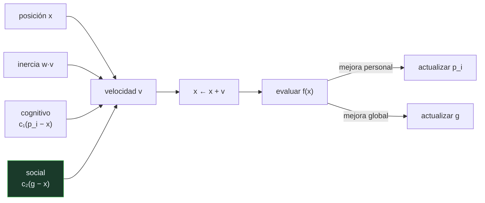

# P92 — Enjambre de partículas

> Ruta probabilística · Optimizar sin gradiente con dos memorias: la propia y la del
> grupo. Y la del grupo hace casi todo el trabajo.

**Nivel:** L2 · **Motor:** `pso` · **Notebook:** [`P92_pso.ipynb`](../../../notebooks/papers/P92_pso.ipynb)
· **Anexo:** [complejidad y coste](../../annexes/A05_COMPLEJIDAD_Y_COSTE.md)

## 1. Identificación

| Campo | Valor |
|---|---|
| **Título original** | *Particle Swarm Optimization* |
| **Autoría** | James Kennedy, Russell Eberhart |
| **Año** | 1995 |
| **Venue** | Proceedings of ICNN'95 — International Conference on Neural Networks, 1942–1948 |
| **Fuente primaria** | [doi:10.1109/ICNN.1995.488968](https://doi.org/10.1109/ICNN.1995.488968) |
| **Acceso** | Restringido |
| **Fecha de consulta** | 2026-08-17 |

## 2. Problema anterior

Muchas funciones objetivo no se pueden derivar: son simulaciones, cajas negras, resultados de un
proceso físico o están contaminadas de ruido. Los métodos de gradiente no se pueden aplicar.

Las alternativas poblacionales de la época —los algoritmos genéticos de
[P90](../P90_algoritmos_geneticos/README.md)— exigían codificar el problema como cromosoma, definir
operadores de cruce y ajustar media docena de hiperparámetros. Para un problema continuo, esa
maquinaria es desproporcionada.

## 3. Propuesta

Un enjambre de partículas que **vuelan** por el espacio de soluciones. Cada una lleva una
velocidad que se actualiza combinando tres cosas:

```text
v ← w·v  +  c₁·r₁·(mejor_personal − x)  +  c₂·r₂·(mejor_global − x)
x ← x + v
```

la **inercia** (seguir como iba), la **memoria propia** (volver a donde le fue bien) y la **memoria
del grupo** (ir hacia donde le fue bien a alguien).

No hay cruce, no hay mutación, no hay selección: ninguna partícula muere. La idea viene de simular
bandadas de pájaros, y sus autores llegan a ella desde la psicología social, no desde la
optimización.

## 4. Intuición sin fórmulas

Un grupo buscando setas en un bosque. Cada uno recuerda dónde encontró las suyas y todos oyen
cuando alguien grita que ha dado con un buen claro.

Nadie tiene un mapa. La búsqueda emerge de la tensión entre volver a lo conocido e ir hacia donde
otro ha tenido suerte.

**Dónde deja de funcionar la analogía:** los buscadores humanos razonan sobre el terreno. Aquí no
hay ningún modelo del problema: solo posiciones, velocidades y comparaciones de valor. Es lo que lo
hace aplicable a cajas negras y lo que le impide ofrecer garantía alguna.

## 5. Matemática mínima

```text
v ← w·v + c₁·r₁·(p_i − x) + c₂·r₂·(g − x)          r₁, r₂ ~ U(0,1)
x ← x + v

    w   inercia          c₁  componente cognitivo       c₂  componente social
```

La miniatura optimiza Rastrigin en 2D —muchos mínimos locales, óptimo global en (0,0)— con 30
partículas y 60 iteraciones:

| Configuración | Mejor valor | Dispersión final |
|---|---:|---:|
| enjambre completo | **0,0** | 0,0594 |
| sin componente social (c₂ = 0) | 2,56 | — |
| sin componente cognitivo (c₁ = 0) | **0,0** | **0,0081** |
| búsqueda aleatoria, mismo presupuesto | 0,6546 | — |

Quitar el término social destroza el método. Quitar el cognitivo **no empeora el resultado** en
esta función: lo que cambia es la dispersión del enjambre, siete veces menor. El componente
cognitivo no acelera — conserva diversidad.

<!-- puente:inicio -->
> [!TIP]
> **Puente matemático.** Esta sección da por sabido lo siguiente. Si algo no te suena,
> léelo primero: está explicado una sola vez, en un solo sitio, y sirve para todas las fichas.

| Dónde | Qué necesitas de ahí |
|---|---|
| [**A05 §1** · Notación O(): qué dice y qué no](../../annexes/A05_COMPLEJIDAD_Y_COSTE.md#1-notación-o-qué-dice-y-qué-no) | por qué el coste se mide en evaluaciones de la función objetivo y no en iteraciones |
<!-- puente:fin -->

## 6. Arquitectura o flujo



## 7. Qué observar en el paper original

- Que el artículo original **no lleva el peso de inercia**: es una adición de Shi y Eberhart (1998)
  sin la cual el método a menudo no converge. La versión que se usa hoy no es la de 1995.
- La **motivación desde la psicología social** —Kennedy es psicólogo social— y no desde la
  optimización. El vocabulario de «cognitivo» y «social» viene de ahí.
- Lo corto que es el algoritmo: dos líneas de actualización. Esa simplicidad explica buena parte de
  su adopción.
- Los **valores de los coeficientes** que proponen y la ausencia de teoría que los determine.

## 8. Evidencia y resultados

Experimentos sobre funciones de referencia y sobre el entrenamiento de pesos de redes neuronales
pequeñas, comparando con algoritmos genéticos.

> Es un artículo de congreso corto, con evaluación limitada para el estándar actual. Su influencia
> vino después, con las mejoras que lo hicieron estable.

La miniatura mide dos cosas: que bate a la búsqueda aleatoria con el mismo presupuesto, y qué
aporta cada uno de los dos términos por separado —incluyendo el resultado incómodo de que quitar
el cognitivo no empeora el valor final.

## 9. Impacto

- Se convirtió en una de las metaheurísticas más usadas, con miles de variantes publicadas y
  aplicaciones en ingeniería, energía y ajuste de hiperparámetros.
- Su simplicidad lo hizo accesible: se implementa en veinte líneas y no exige codificar el problema.
- Es también un caso de estudio sobre la **inflación de variantes**: buena parte de la literatura
  posterior propone modificaciones sin comparación honesta contra la versión base bien ajustada.
- Y aporta al programa un ejemplo limpio del compromiso entre explorar y explotar, medible con la
  dispersión del enjambre.

## 10. Limitaciones

1. **Sin garantía de convergencia al óptimo global** ni cota útil de tiempo. Es una
   metaheurística: se justifica por comportamiento empírico.
2. **Los coeficientes lo determinan todo** y no hay teoría cerrada que los fije. Un resultado sin
   declararlos no es reproducible.
3. **Pierde diversidad en dimensión alta** y se estanca. Funciona mejor en decenas de dimensiones
   que en miles.
4. **La versión del artículo no incluye la inercia**, sin la cual el enjambre a menudo diverge.
5. **El teorema No Free Lunch** aplica igual que a cualquier otro optimizador: no hay ventaja
   general, solo ventaja en ciertas clases de problemas.

## 11. Errores comunes

| Error | Corrección |
|---|---|
| «PSO es mejor que los algoritmos genéticos» | Depende del problema. En continuo y baja dimensión suele ser más simple y rápido; el No Free Lunch impide cualquier afirmación general. |
| «Los coeficientes tienen valores canónicos» | Se ajustan por experimento. Con inercia alta el enjambre no converge; con inercia baja colapsa en la primera solución decente. |
| «El componente cognitivo acelera la convergencia» | En la miniatura no cambia el valor final: lo que cambia es la dispersión, siete veces mayor. Conserva diversidad, que es otra cosa. |
| «Más partículas siempre es mejor» | Más partículas cuestan más evaluaciones por iteración. Con presupuesto fijo, hay un compromiso entre tamaño del enjambre y número de iteraciones. |
| «Si no encuentra el óptimo, faltan iteraciones» | Puede haber colapsado: si la dispersión es casi cero, iterar más no explora nada nuevo. |

## 12. Relación con trabajos anteriores

- **[P90 Algoritmos genéticos](../P90_algoritmos_geneticos/README.md) (1973)** — la otra familia
  poblacional, con recombinación y selección.
- **Reynolds (1987)** — los *boids*: la simulación de bandadas de la que sale la intuición.
- **Heppner y Grenander (1990)** — el modelo de comportamiento de bandadas que los autores citan.

## 13. Relación con trabajos posteriores

- **Shi y Eberhart (1998)** — el peso de inercia, sin el cual el método no es fiable.
  [doi:10.1109/ICEC.1998.699146](https://doi.org/10.1109/ICEC.1998.699146)
- **[P93 Colonia de hormigas](../P93_aco/README.md) (1996)** — la otra forma de compartir
  información en una población: dejando marcas en el entorno.
- **Wolpert y Macready (1997)** — *No Free Lunch*: el límite común a toda esta familia.
  [doi:10.1109/4235.585893](https://doi.org/10.1109/4235.585893)

## 14. Notebook asociado

[`P92_pso.ipynb`](../../../notebooks/papers/P92_pso.ipynb)

**Qué implementa:** el enjambre completo sobre Rastrigin, más dos ablaciones —sin componente social y sin componente cognitivo— con su valor final y la dispersión del enjambre, y la comparación con búsqueda aleatoria del mismo presupuesto.

**Qué NO implementa:** no hay peso de inercia adaptativo, ni topologías de vecindad, ni dimensión alta. Rastrigin 2D es un banco de pruebas benigno y no dice nada sobre el comportamiento a escala.

```bash
ai-evolution paper-lab P92 --seed 7
```

## 15. Actividades Bloom

| Nivel | Actividad |
|---|---|
| **Recordar** | Escribe la ecuación de actualización de la velocidad y nombra sus tres términos. |
| **Explicar** | Explica qué aporta cada una de las dos memorias. |
| **Aplicar** | Ejecuta el notebook y compara la dispersión final de las tres configuraciones. |
| **Analizar** | Analiza por qué quitar el componente social empeora tanto el resultado. |
| **Evaluar** | «PSO encontró el óptimo, luego es mejor que el método anterior». Evalúa la afirmación. |
| **Crear** | Aplica PSO a una función objetivo no derivable de tu trabajo y barre el peso de inercia entre 0,4 y 0,95; documenta dónde deja de converger. |

## 16. Autoevaluación

1. ¿Qué tres términos componen la velocidad de una partícula?
2. ¿Qué aporta el componente social?
3. ¿Y el cognitivo?
4. ¿Necesita gradiente?
5. ¿Qué le falta al artículo original?
6. ¿Garantiza el óptimo global?
7. ¿Cuándo conviene frente a un método de gradiente?

## 17. Respuestas esperadas

1. Inercia (seguir en la misma dirección), componente cognitivo (atracción hacia el mejor histórico propio) y componente social (atracción hacia el mejor histórico del grupo).
2. Comunicación: sin él, el enjambre son búsquedas locales independientes. En la miniatura el resultado empeora de 0,0 a 2,56.
3. Diversidad. En esta función no mejora el valor final, y la dispersión del enjambre es siete veces mayor con él que sin él: es un seguro contra converger demasiado pronto.
4. No. Solo evalúa la función objetivo y compara valores, por eso sirve para simulaciones, cajas negras y funciones con ruido.
5. El peso de inercia, que añaden Shi y Eberhart en 1998 y sin el cual el enjambre a menudo diverge. La versión que se usa hoy no es la de 1995.
6. No, ni tiene cota útil de tiempo. Es una metaheurística justificada empíricamente.
7. Cuando la función no es derivable, es cara y ruidosa, o cuando no se tiene acceso a su forma. Si hay gradiente disponible y fiable, casi siempre conviene usarlo.

## 18. Fuentes primarias

- Kennedy, J. y Eberhart, R. (1995). *Particle Swarm Optimization*. **Proceedings of ICNN'95**,
  1942–1948. [doi:10.1109/ICNN.1995.488968](https://doi.org/10.1109/ICNN.1995.488968) ·
  consultado 2026-08-17.
- Shi, Y. y Eberhart, R. (1998). *A Modified Particle Swarm Optimizer*.
  [doi:10.1109/ICEC.1998.699146](https://doi.org/10.1109/ICEC.1998.699146) · consultado 2026-08-17.
- Wolpert, D. y Macready, W. (1997). *No Free Lunch Theorems for Optimization*.
  [doi:10.1109/4235.585893](https://doi.org/10.1109/4235.585893) · consultado 2026-08-17.

---

[⬅️ Anterior: P91 Redes bayesianas](../P91_redes_bayesianas/README.md) ·
[📇 Índice](../../catalog/PAPERS_INDEX.md) ·
[📝 Evaluación](../../../assessments/papers/P92_pso.md) ·
[🏫 Clase 034 · Optimización por enjambre y colonia](../../../classes/part-02-probabilistic-evolutionary-and-decision-ai/034-optimizacion-por-enjambre-y-colonia/README.md) ·
[➡️ Siguiente: P93 Colonia de hormigas](../P93_aco/README.md)
