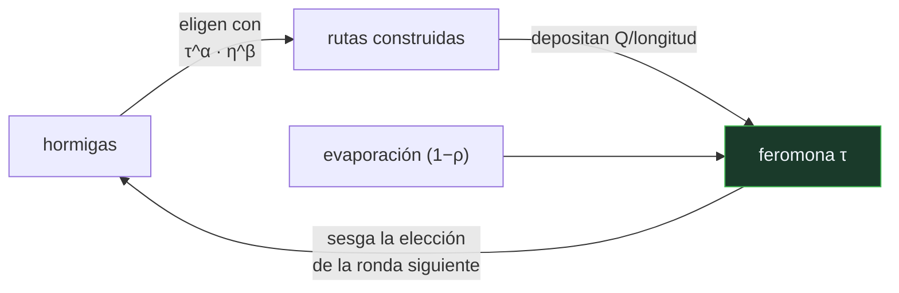

# P93 — Colonia de hormigas

> Ruta probabilística · La memoria no está en los agentes: está en el entorno. Un rastro
> que se refuerza y se evapora resuelve lo que ninguna hormiga sabría resolver.

**Nivel:** L2 · **Motor:** `aco` · **Notebook:** [`P93_aco.ipynb`](../../../notebooks/papers/P93_aco.ipynb)
· **Anexo:** [complejidad y coste](../../annexes/A05_COMPLEJIDAD_Y_COSTE.md)

## 1. Identificación

| Campo | Valor |
|---|---|
| **Título original** | *Ant System: Optimization by a Colony of Cooperating Agents* |
| **Autoría** | Marco Dorigo, Vittorio Maniezzo, Alberto Colorni |
| **Año** | 1996 |
| **Venue** | IEEE Transactions on Systems, Man and Cybernetics, Part B, 26(1), 29–41 |
| **Fuente primaria** | [doi:10.1109/3477.484436](https://doi.org/10.1109/3477.484436) |
| **Acceso** | Restringido |
| **Fecha de consulta** | 2026-08-17 |

## 2. Problema anterior

En problemas combinatorios como el del viajante, las heurísticas golosas construyen la solución
paso a paso tomando siempre la decisión que parece mejor **ahora**. El resultado es que una
elección temprana barata condena a un final caro, y el método no tiene forma de aprender de eso:
cada ejecución empieza de cero.

Mantener una memoria global de qué combinaciones funcionaron es caro y difícil de compartir entre
procesos que exploran en paralelo.

## 3. Propuesta

Que la memoria viva **en el problema, no en los agentes**. Cada hormiga construye una solución
eligiendo el siguiente paso con probabilidad proporcional a:

```text
τ(i,j)^α · η(i,j)^β
```

donde `τ` es la feromona acumulada en esa arista —lo que aprendió la colonia— y `η` la heurística
local —lo que se ve desde aquí—. Al terminar, cada hormiga deposita feromona proporcional a la
calidad de su solución.

Y una segunda mitad imprescindible: la **evaporación**. Sin ella el sistema se queda con la primera
ruta decente. El olvido es lo que mantiene abierta la exploración.

## 4. Intuición sin fórmulas

Un camino de tierra en un parque. Nadie lo diseñó: se formó porque mucha gente pasó por ahí, y se
mantiene porque la hierba no vuelve a crecer donde se pisa.

Si dejan de pasar, el camino desaparece. La información —«por aquí se va bien»— no está en la
cabeza de nadie: está en el suelo.

**Dónde deja de funcionar la analogía:** el camino del parque no se refuerza según lo bueno que sea
el destino. Aquí sí: la cantidad de feromona depositada es proporcional a la calidad de la solución
completa, y esa realimentación es lo que convierte el rastro en optimización y no solo en costumbre.

## 5. Matemática mínima

```text
Elección:      p(i→j) ∝ τ(i,j)^α · η(i,j)^β          η = 1 / distancia

Actualización: τ ← (1 − ρ)·τ + Σ_k Δτ^k              Δτ^k = Q / longitud(ruta_k)
               ────────────   ──────────
                evaporar       reforzar
```

La miniatura resuelve un viajante de 6 ciudades elegido para que la heurística golosa **falle**:

| Método | Longitud |
|---|---:|
| óptimo (fuerza bruta sobre 60 rutas) | **26,9634** |
| vecino más cercano | 29,5826 — un 9,7 % peor |
| colonia de hormigas | **26,9634** |

Y el rastro: lo que crece no es la cantidad de feromona sino su **concentración**. La mejor arista
pasa de destacar 1,35× sobre la media a 2,5×. El refuerzo distingue; la evaporación aplana.

<!-- puente:inicio -->
> [!TIP]
> **Puente matemático.** Esta sección da por sabido lo siguiente. Si algo no te suena,
> léelo primero: está explicado una sola vez, en un solo sitio, y sirve para todas las fichas.

| Dónde | Qué necesitas de ahí |
|---|---|
| [**A05 §1** · Notación O(): qué dice y qué no](../../annexes/A05_COMPLEJIDAD_Y_COSTE.md#1-notación-o-qué-dice-y-qué-no) | por qué el viajante con n ciudades tiene (n−1)!/2 rutas y hace falta una heurística |
<!-- puente:fin -->

## 6. Arquitectura o flujo



## 7. Qué observar en el paper original

- El concepto de **estigmergia**, tomado del estudio de las termitas por Grassé: coordinación
  indirecta a través de modificaciones del entorno.
- El papel del exponente **β**, que pondera la heurística local frente a la feromona. Con β alto el
  sistema es casi goloso; con β bajo, casi ciego.
- La discusión sobre **estancamiento**: si la feromona se concentra demasiado pronto, la colonia
  deja de explorar. La evaporación y los límites de τ son las respuestas.
- Que los autores presentan el método como un **marco general** —no solo para el viajante— y lo
  aplican también a asignación cuadrática.

## 8. Evidencia y resultados

Experimentos sobre instancias estándar del viajante y del problema de asignación cuadrática,
comparando con heurísticas específicas y con recocido simulado.

> El propio artículo reconoce que en el viajante el método **no bate** a las heurísticas
> especializadas. Su argumento es la generalidad: el mismo esquema se aplica a problemas donde no
> existe una heurística específica buena.

La miniatura usa una instancia pequeña con el óptimo conocido por fuerza bruta, y elegida a
propósito para que el vecino más cercano se equivoque. Sirve para ver el mecanismo con la respuesta
delante, no para medir rendimiento.

## 9. Impacto

- Fundó la **optimización por colonias de hormigas** como familia, con aplicaciones en
  enrutamiento de redes, planificación y logística.
- Su heredero directo, **Ant Colony System** (1997), sí compite con los mejores métodos en algunas
  clases de problemas.
- El principio de **estigmergia** —coordinar sin comunicación directa, a través del entorno— es una
  idea de diseño que reaparece en sistemas multiagente y en robótica de enjambre.
- Y ofrece un modelo mental útil: cuando varios procesos exploran en paralelo, dejar marcas en un
  medio compartido puede ser más simple y más robusto que coordinarlos.

## 10. Limitaciones

1. **No bate a los métodos específicos.** Para el viajante existen Lin-Kernighan y Concorde, que
   resuelven instancias enormes de forma óptima o casi.
2. **Muchos parámetros** —α, β, ρ, número de hormigas, Q— y ninguno con valor canónico. Ajustarlos
   es el trabajo real.
3. **Riesgo de estancamiento**: si la feromona se concentra demasiado pronto, la colonia deja de
   explorar y converge a una solución mediocre.
4. **Coste por iteración alto**: cada hormiga construye una solución completa.
5. **Sin garantía de optimalidad** ni cota de tiempo, como toda metaheurística.

## 11. Errores comunes

| Error | Corrección |
|---|---|
| «Las hormigas se comunican entre sí» | No se comunican: modifican el entorno y leen el entorno. Eso es estigmergia, y es lo que hace el sistema robusto a que una hormiga falle. |
| «Más feromona siempre es mejor» | Sin evaporación el sistema se casa con la primera ruta decente. El olvido es la mitad del mecanismo, no una pérdida. |
| «La feromona crece con las iteraciones» | En la miniatura la feromona máxima baja. Lo que crece es su CONCENTRACIÓN: cuánto destaca la mejor arista sobre la media. |
| «Sirve para cualquier problema de optimización» | Necesita que la solución se pueda construir paso a paso y que los pasos se puedan reforzar. En optimización continua no encaja de forma natural. |
| «Es el mejor método para el viajante» | Los propios autores dicen lo contrario. Su argumento es la generalidad, no el rendimiento en un problema con métodos especializados. |

## 12. Relación con trabajos anteriores

- **[P90 Algoritmos genéticos](../P90_algoritmos_geneticos/README.md) (1973)** y
  **[P92 PSO](../P92_pso/README.md) (1995)** — las otras dos familias poblacionales, con memoria en
  los individuos y no en el entorno.
- **Grassé (1959)** — la estigmergia en la construcción de termiteros: el concepto biológico de
  partida.
- **[P67 A*](../P67_a_estrella/README.md) (1968)** — la búsqueda con garantía, para contrastar qué
  se gana y qué se pierde al renunciar a ella.

## 13. Relación con trabajos posteriores

- **Dorigo y Gambardella (1997)** — *Ant Colony System*: la versión competitiva.
  [doi:10.1109/4235.585892](https://doi.org/10.1109/4235.585892)
- **Di Caro y Dorigo (1998)** — AntNet: enrutamiento adaptativo en redes de comunicaciones.
- **Concorde** — el resolvedor específico del viajante, para saber contra qué se compite.
  [math.uwaterloo.ca/tsp/concorde](https://www.math.uwaterloo.ca/tsp/concorde.html)

## 14. Notebook asociado

[`P93_aco.ipynb`](../../../notebooks/papers/P93_aco.ipynb)

**Qué implementa:** una colonia completa sobre un viajante de 6 ciudades con el óptimo conocido por fuerza bruta, la comparación con el vecino más cercano, y la evolución de la concentración del rastro.

**Qué NO implementa:** no hay Ant Colony System, ni límites de feromona, ni actualización solo por la mejor hormiga. Seis ciudades no dicen nada sobre escalabilidad.

```bash
ai-evolution paper-lab P93 --seed 7
```

## 15. Actividades Bloom

| Nivel | Actividad |
|---|---|
| **Recordar** | Escribe la regla de elección de la hormiga y nombra sus dos factores. |
| **Explicar** | Explica para qué sirve la evaporación. |
| **Aplicar** | Ejecuta el notebook y sigue la concentración del rastro por iteración. |
| **Analizar** | Analiza por qué el vecino más cercano falla en esta instancia. |
| **Evaluar** | «La colonia encontró el óptimo, luego el método es bueno para el viajante». Evalúa la afirmación. |
| **Crear** | Modela un problema de rutas de tu trabajo con una colonia y compáralo con la heurística que ya uses, midiendo también el coste de cómputo. |

## 16. Autoevaluación

1. ¿Dónde está la memoria del sistema?
2. ¿Qué dos factores determinan la elección de una hormiga?
3. ¿Qué pasa sin evaporación?
4. ¿Qué es la estigmergia?
5. ¿Bate este método a los específicos del viajante?
6. ¿Qué crece con las iteraciones: la feromona o su concentración?
7. ¿Qué tipo de problemas admite este esquema?

## 17. Respuestas esperadas

1. En el entorno: en la feromona depositada sobre las aristas. Ninguna hormiga guarda información entre rondas, y el sistema sigue aprendiendo.
2. La feromona acumulada en esa arista, elevada a α, y la heurística local —la inversa de la distancia—, elevada a β. Uno aporta lo aprendido y el otro lo que se ve desde aquí.
3. El sistema se estanca: refuerza indefinidamente la primera ruta decente que encuentre y deja de explorar. La evaporación es lo que mantiene viva la exploración.
4. La coordinación indirecta a través de modificaciones del entorno, sin comunicación directa entre agentes. El término viene del estudio de las termitas.
5. No, y los propios autores lo dicen. Lin-Kernighan y Concorde resuelven instancias enormes de forma óptima o casi. El argumento del método es su generalidad.
6. La concentración. En la miniatura la feromona máxima baja mientras la razón entre la máxima y la media sube de 1,35 a 2,5.
7. Los que admiten construir la solución paso a paso, con pasos que se puedan reforzar individualmente. En optimización continua no encaja de forma natural.

## 18. Fuentes primarias

- Dorigo, M., Maniezzo, V. y Colorni, A. (1996). *Ant System: Optimization by a Colony of
  Cooperating Agents*. **IEEE Transactions on SMC-B**, 26(1), 29–41.
  [doi:10.1109/3477.484436](https://doi.org/10.1109/3477.484436) · consultado 2026-08-17.
- Dorigo, M. y Gambardella, L. (1997). *Ant Colony System*.
  [doi:10.1109/4235.585892](https://doi.org/10.1109/4235.585892) · consultado 2026-08-17.
- Applegate, D. et al. *Concorde TSP Solver*.
  [math.uwaterloo.ca/tsp/concorde](https://www.math.uwaterloo.ca/tsp/concorde.html) ·
  consultado 2026-08-17.

---

[⬅️ Anterior: P92 Enjambre de partículas](../P92_pso/README.md) ·
[📇 Índice](../../catalog/PAPERS_INDEX.md) ·
[📝 Evaluación](../../../assessments/papers/P93_aco.md) ·
[🏫 Clase 034 · Optimización por enjambre y colonia](../../../classes/part-02-probabilistic-evolutionary-and-decision-ai/034-optimizacion-por-enjambre-y-colonia/README.md) ·
[➡️ Siguiente: P94 Programación probabilística](../P94_programacion_probabilistica/README.md)
