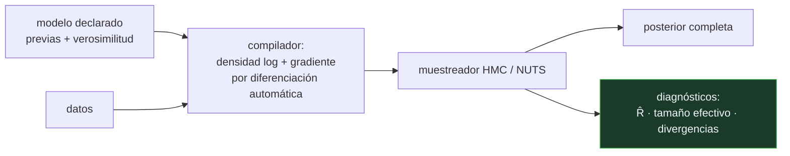

# P94 — Programación probabilística

> Ruta probabilística · Escribes el modelo; el motor hace la inferencia. Y devuelve una
> distribución, no un número — que es donde está la información que importa.

**Nivel:** L3 · **Motor:** `programacion_probabilistica` · **Notebook:** [`P94_programacion_probabilistica.ipynb`](../../../notebooks/papers/P94_programacion_probabilistica.ipynb)
· **Anexo:** [probabilidad y verosimilitud](../../annexes/A02_PROBABILIDAD_Y_VEROSIMILITUD.md)

## 1. Identificación

| Campo | Valor |
|---|---|
| **Título original** | *Stan: A Probabilistic Programming Language* |
| **Autoría** | Bob Carpenter, Andrew Gelman, Matthew D. Hoffman y otros |
| **Año** | 2017 |
| **Venue** | Journal of Statistical Software, 76(1) |
| **Fuente primaria** | [doi:10.18637/jss.v076.i01](https://doi.org/10.18637/jss.v076.i01) |
| **Acceso** | Abierto |
| **Fecha de consulta** | 2026-08-17 |

## 2. Problema anterior

Cada modelo bayesiano nuevo exigía escribir a mano su propio muestreador: derivar las
condicionales, implementar el algoritmo, depurar la matemática. Probar una variante del modelo
—cambiar una previa, añadir un nivel jerárquico— significaba rehacer todo ese trabajo.

El resultado práctico es que la gente no probaba variantes. Se quedaba con el primer modelo que
consiguió implementar, que rara vez es el mejor y casi nunca el que hubiera elegido si comparar
fuese barato.

## 3. Propuesta

Separar **qué se supone del mundo** de **cómo se calcula**. Un lenguaje declarativo donde se
escriben las previas y la verosimilitud:

```text
theta ~ beta(2, 2);
y ~ bernoulli(theta);
```

y un motor de inferencia general —Monte Carlo hamiltoniano con el muestreador NUTS— que devuelve
la posterior completa, más diagnósticos de convergencia que avisan cuando no hay que fiarse.

El compilador genera el gradiente de la densidad logarítmica por diferenciación automática, que es
lo que hace viable el enfoque hamiltoniano sin que nadie derive nada a mano.

## 4. Intuición sin fórmulas

La diferencia entre decir *cómo* ordenar una lista y decir *qué* orden quieres. SQL no te obliga a
escribir el algoritmo de búsqueda: declaras la consulta y el motor decide el plan.

Aquí igual: declaras el modelo y el motor decide cómo muestrear la posterior.

**Dónde deja de funcionar la analogía:** un plan de consulta malo tarda más; un muestreador que no
converge devuelve **números plausibles y equivocados** sin avisar. Por eso los diagnósticos no son
opcionales, y por eso Stan los reporta por defecto.

## 5. Matemática mínima

```text
Modelo declarado:
    theta ~ Beta(2, 2)              ← previa
    y[i]  ~ Bernoulli(theta)        ← verosimilitud

El motor calcula:  P(theta | y)  ∝  P(y | theta) · P(theta)
```

La miniatura ajusta 40 lanzamientos con 25 caras:

| Resultado | Valor |
|---|---|
| máxima verosimilitud (estimación puntual) | 0,825 |
| posterior por muestreo, media | **0,7936** |
| intervalo creíble del 90 % | **[0,6844 – 0,8835]** |
| posterior analítico Beta(35, 9), media | 0,7955 |

El muestreo coincide con la solución exacta: el motor no inventa, resuelve lo que el modelo
implica. Y la estimación puntual no dice **nada** sobre la incertidumbre — con 40 lanzamientos el
intervalo es ancho, y ese ancho es parte del resultado.

<!-- puente:inicio -->
> [!TIP]
> **Puente matemático.** Esta sección da por sabido lo siguiente. Si algo no te suena,
> léelo primero: está explicado una sola vez, en un solo sitio, y sirve para todas las fichas.

| Dónde | Qué necesitas de ahí |
|---|---|
| [**A02 §3** · Verosimilitud y entropía cruzada](../../annexes/A02_PROBABILIDAD_Y_VEROSIMILITUD.md#3-verosimilitud-y-entropía-cruzada) | qué es la verosimilitud que el modelo declara y cómo se combina con la previa |
<!-- puente:fin -->

## 6. Arquitectura o flujo



## 7. Qué observar en el paper original

- La **separación entre bloques** del lenguaje —datos, parámetros, modelo, cantidades generadas— y
  qué significa cada uno. Es donde vive la disciplina del enfoque.
- El papel de la **diferenciación automática**: sin gradiente barato, el Monte Carlo hamiltoniano no
  es viable, y sin él Stan sería BUGS.
- Los **diagnósticos** —R̂, tamaño efectivo de muestra, transiciones divergentes— y por qué se
  reportan por defecto: nadie los miraría si hubiera que pedirlos.
- La discusión sobre **reparametrización** y por qué a veces un modelo matemáticamente equivalente
  muestrea mucho mejor. Es conocimiento práctico difícil de encontrar en otro sitio.

## 8. Evidencia y resultados

El artículo describe el lenguaje, el compilador y el motor, con ejemplos de modelos y comparación
de rendimiento contra alternativas de la época (BUGS, JAGS).

> Es un artículo de software en una revista de software. Su evidencia es que el sistema funciona,
> escala y se usa; no hay un teorema que demostrar.

La miniatura implementa Metropolis-Hastings en vez de HMC —cabe en veinte líneas— sobre un modelo
con solución analítica conocida, precisamente para poder comprobar que el resultado del muestreo es
el correcto.

## 9. Impacto

- Stan se convirtió en la herramienta estándar de la estadística bayesiana aplicada, con interfaces
  en R, Python y Julia.
- Cambió la práctica: probar variantes de modelo pasó de ser un proyecto a ser una tarde, y eso
  cambió qué modelos se usan.
- La **programación probabilística** como paradigma se extendió a otros sistemas —PyMC, Pyro,
  NumPyro, Turing— y a la investigación en inferencia amortizada.
- Y aporta al programa una disciplina transferible: reportar la **distribución** y no solo su media.
  Un número sin incertidumbre es una afirmación incompleta.

## 10. Limitaciones

1. **HMC necesita gradientes**, así que los parámetros discretos hay que marginalizarlos a mano.
   Es la limitación práctica más molesta.
2. **No escala a millones de parámetros** como el descenso estocástico. Para modelos muy grandes se
   usa inferencia variacional, con otras garantías.
3. **La reparametrización importa mucho** y es un arte: modelos equivalentes muestrean de forma muy
   distinta.
4. **Los diagnósticos hay que mirarlos.** Una cadena que no convergió produce una posterior con
   aspecto perfecto.
5. **Declarar un modelo no lo hace correcto.** El motor resuelve lo que le pidas, incluidos
   modelos con supuestos absurdos.

## 11. Errores comunes

| Error | Corrección |
|---|---|
| «El motor encuentra el modelo correcto» | Resuelve el modelo que le declares. Si los supuestos son malos, la posterior es una respuesta precisa a la pregunta equivocada. |
| «Basta con reportar la media de la posterior» | Eso desperdicia lo que distingue al enfoque. La incertidumbre —el intervalo— es parte del resultado, y con pocos datos es la parte importante. |
| «Si la cadena terminó, la posterior es válida» | Hay que mirar R̂, el tamaño efectivo de muestra y las divergencias. Una cadena no convergida devuelve números plausibles y equivocados. |
| «La previa es un detalle técnico» | Con pocos datos domina el resultado. Es un supuesto explícito que hay que justificar y someter a análisis de sensibilidad. |
| «La programación probabilística sustituye al aprendizaje automático» | Responden preguntas distintas. Aquí se declara un modelo generativo y se obtiene incertidumbre; allí se ajusta una función y se mide predicción. |

## 12. Relación con trabajos anteriores

- **[P91 Redes bayesianas](../P91_redes_bayesianas/README.md) (1986)** — la estructura que hace
  tratable la inferencia; aquí se declara con un lenguaje en vez de con un grafo.
- **Lunn et al. (2000)** — BUGS: el primer sistema de programación probabilística de uso extendido.
- **Neal (2011)** — Monte Carlo hamiltoniano: el algoritmo que Stan hace práctico.

## 13. Relación con trabajos posteriores

- **Hoffman y Gelman (2014)** — NUTS, el muestreador que elimina el ajuste manual del número de
  pasos. [JMLR 15](https://www.jmlr.org/papers/v15/hoffman14a.html)
- **[P95 Herramientas causales](../P95_causalidad/README.md) (2019)** — el límite de lo que un
  modelo probabilístico puede responder sin supuestos causales.
- **PyMC, Pyro, NumPyro, Turing** — la familia de sistemas que siguió, con distintos compromisos
  entre expresividad y velocidad.

## 14. Notebook asociado

[`P94_programacion_probabilistica.ipynb`](../../../notebooks/papers/P94_programacion_probabilistica.ipynb)

**Qué implementa:** un modelo declarado en dos líneas, inferencia por Metropolis-Hastings con calentamiento, la posterior con su intervalo creíble, y la comprobación contra el posterior analítico conocido.

**Qué NO implementa:** no hay HMC ni NUTS, ni diferenciación automática, ni diagnósticos de convergencia —que son lo primero que hay que mirar—. El modelo tiene solución analítica, así que el muestreo es didáctico, no necesario.

```bash
ai-evolution paper-lab P94 --seed 7
```

## 15. Actividades Bloom

| Nivel | Actividad |
|---|---|
| **Recordar** | Escribe el modelo declarado con sus dos líneas. |
| **Explicar** | Explica qué separa un lenguaje probabilístico que antes iba junto. |
| **Aplicar** | Ejecuta el notebook y compara la posterior con la estimación puntual. |
| **Analizar** | Analiza por qué el intervalo creíble es ancho con 40 datos. |
| **Evaluar** | «La cadena terminó, luego la posterior es correcta». Evalúa la afirmación. |
| **Crear** | Escribe un modelo bayesiano de un problema tuyo en un lenguaje probabilístico real y reporta posterior y diagnósticos, con análisis de sensibilidad a la previa. |

## 16. Autoevaluación

1. ¿Qué separa la programación probabilística?
2. ¿Qué devuelve el motor?
3. ¿Qué aporta frente a una estimación puntual?
4. ¿Qué hace posible el Monte Carlo hamiltoniano?
5. ¿Por qué se reportan diagnósticos por defecto?
6. ¿Qué limitación tiene con parámetros discretos?
7. ¿Garantiza el motor que el modelo sea correcto?

## 17. Respuestas esperadas

1. Qué se supone del mundo —el modelo— de cómo se calcula la inferencia. Se declara lo primero y el motor resuelve lo segundo.
2. La posterior completa: una distribución sobre los parámetros, con su media, sus cuantiles y su forma. No un número.
3. La incertidumbre. En la miniatura, la estimación puntual es 0,825 y la posterior da un intervalo del 90 % entre 0,684 y 0,884: ese ancho es información que el punto no tiene.
4. La diferenciación automática, que da el gradiente de la densidad logarítmica sin que nadie lo derive a mano. Sin gradiente barato, HMC no es viable.
5. Porque una cadena que no ha convergido produce una posterior de aspecto perfecto. Si hubiera que pedirlos, nadie los miraría.
6. HMC necesita gradientes, así que los parámetros discretos no se pueden muestrear directamente: hay que marginalizarlos a mano en el modelo.
7. No. Resuelve el modelo que se le declare. Un modelo con supuestos absurdos produce una posterior precisa y equivocada.

## 18. Fuentes primarias

- Carpenter, B. et al. (2017). *Stan: A Probabilistic Programming Language*. **Journal of
  Statistical Software**, 76(1). [doi:10.18637/jss.v076.i01](https://doi.org/10.18637/jss.v076.i01)
  · consultado 2026-08-17.
- Hoffman, M. y Gelman, A. (2014). *The No-U-Turn Sampler*.
  [JMLR 15](https://www.jmlr.org/papers/v15/hoffman14a.html) · consultado 2026-08-17.
- Gelman, A. et al. *Bayesian Data Analysis*.
  [stat.columbia.edu/~gelman/book](http://www.stat.columbia.edu/~gelman/book/) ·
  consultado 2026-08-17.

---

[⬅️ Anterior: P93 Colonia de hormigas](../P93_aco/README.md) ·
[📇 Índice](../../catalog/PAPERS_INDEX.md) ·
[📝 Evaluación](../../../assessments/papers/P94_programacion_probabilistica.md) ·
[🏫 Clase 035 · Programación probabilística y causalidad](../../../classes/part-02-probabilistic-evolutionary-and-decision-ai/035-programacion-probabilistica-y-causalidad/README.md) ·
[➡️ Siguiente: P95 Herramientas causales](../P95_causalidad/README.md)
