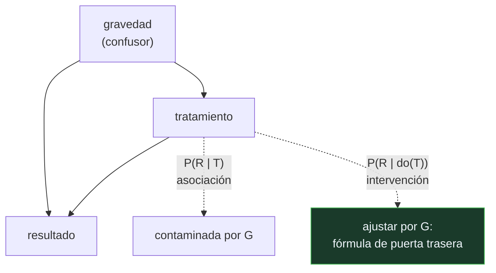

# P95 — Herramientas causales

> Ruta probabilística · Ver no es hacer. Tres peldaños —asociar, intervenir, imaginar— y
> ninguna cantidad de datos permite subir del primero sin declarar supuestos.

**Nivel:** L3 · **Motor:** `causalidad` · **Notebook:** [`P95_causalidad.ipynb`](../../../notebooks/papers/P95_causalidad.ipynb)
· **Anexo:** [probabilidad y verosimilitud](../../annexes/A02_PROBABILIDAD_Y_VEROSIMILITUD.md)

## 1. Identificación

| Campo | Valor |
|---|---|
| **Título original** | *The Seven Tools of Causal Inference, with Reflections on Machine Learning* |
| **Autoría** | Judea Pearl |
| **Año** | 2019 |
| **Venue** | Communications of the ACM, 62(3), 54–60 |
| **Fuente primaria** | [doi:10.1145/3241036](https://doi.org/10.1145/3241036) |
| **Acceso** | Abierto |
| **Fecha de consulta** | 2026-08-17 |

## 2. Problema anterior

El aprendizaje automático ajusta funciones sobre distribuciones observadas. Con eso responde
preguntas de **asociación**: qué esperar de `Y` cuando se ve `X`.

Pero las decisiones que importan son de **intervención**: qué pasa con `Y` si **hago** `X`. Y esas
dos preguntas tienen respuestas distintas cuando hay confusores — variables que influyen a la vez
en quién recibe el tratamiento y en el resultado.

Ninguna cantidad de datos observacionales distingue un caso del otro. Es una limitación
estructural, no de tamaño de muestra ni de capacidad del modelo.

## 3. Propuesta

La **escalera de la causalidad**, con tres peldaños que exigen cada vez más:

```text
1. ASOCIACIÓN     P(Y | X)         ver           lo que hace el aprendizaje automático
2. INTERVENCIÓN   P(Y | do(X))     hacer         exige el grafo causal
3. CONTRAFÁCTICO  P(Y_x | X', Y')  imaginar      exige el modelo estructural completo
```

Y siete herramientas para operar en los peldaños superiores: modelos gráficos, el operador `do`, el
criterio de puerta trasera, la fórmula de ajuste, el análisis de mediación, la transportabilidad
entre poblaciones y el tratamiento de datos faltantes.

La tesis central: la estructura causal se **declara**, no se estima de la tabla.

## 4. Intuición sin fórmulas

Los termómetros y la fiebre. Ver un termómetro alto predice fiebre perfectamente. Romper el
termómetro no cura a nadie.

La correlación es idéntica en los dos casos; la consecuencia de intervenir, opuesta. Y no hay forma
de distinguirlas mirando más lecturas de termómetro.

**Dónde deja de funcionar la analogía:** aquí sabemos cuál causa a cuál. En un problema real esa es
justamente la pregunta, y responderla exige conocimiento del dominio, experimentos o supuestos
defendidos — nunca solo datos observacionales.

## 5. Matemática mínima

```text
Confusor: variable que influye en el tratamiento Y en el resultado

Fórmula de ajuste (criterio de puerta trasera):
    P(Y | do(X)) = Σ_z P(Y | X, Z = z) · P(Z = z)
                          ────────────    ────────
                          dentro de cada   ponderado por
                          estrato          la población total
```

La miniatura reproduce la **paradoja de Simpson** con un tratamiento y dos grupos de gravedad:

| Grupo | Tasa con tratamiento | Tasa sin tratamiento | ¿Gana el tratamiento? |
|---|---:|---:|:--:|
| leves | 0,931 | 0,8667 | **sí** |
| graves | 0,730 | 0,6875 | **sí** |
| **agregado** | **0,780** | **0,8257** | **no** |
| tras ajustar por gravedad | **0,8325** | 0,7789 | **sí** |

Gana en los dos subgrupos y pierde en el total. Los tres números son correctos. Cuál hay que creer
depende de si la gravedad es **causa** del tratamiento —hay que ajustar— o **consecuencia** suya
—ajustar sería el error—. Los datos son idénticos en ambos casos.

<!-- puente:inicio -->
> [!TIP]
> **Puente matemático.** Esta sección da por sabido lo siguiente. Si algo no te suena,
> léelo primero: está explicado una sola vez, en un solo sitio, y sirve para todas las fichas.

| Dónde | Qué necesitas de ahí |
|---|---|
| [**A02 §3** · Verosimilitud y entropía cruzada](../../annexes/A02_PROBABILIDAD_Y_VEROSIMILITUD.md#3-verosimilitud-y-entropía-cruzada) | qué es exactamente una probabilidad condicional, y por qué `P(Y|X)` no es `P(Y|do(X))` |
<!-- puente:fin -->

## 6. Arquitectura o flujo



## 7. Qué observar en el paper original

- La formulación de los **tres peldaños** y el argumento de por qué no se puede subir sin
  información externa a los datos. Es el núcleo del artículo.
- El **criterio de puerta trasera**: qué conjunto de variables hay que ajustar y cuál no. Ajustar de
  más también es un error, y eso sorprende a casi todo el mundo.
- Las **reflexiones sobre aprendizaje automático** de la segunda mitad: qué le falta a un modelo que
  solo ajusta distribuciones, y por qué el tamaño no lo resuelve.
- La distinción entre **mediación** y **confusión**, que se confunden a menudo y llevan a ajustes
  opuestos.

## 8. Evidencia y resultados

Es un artículo de posición y síntesis en una revista de divulgación técnica. Presenta el marco y
las herramientas; las demostraciones están en la literatura previa del autor.

> No hay experimentos. Su fuerza es la claridad del marco y la precisión con la que separa lo que
> se puede y no se puede concluir de datos observacionales.

La miniatura construye un caso de Simpson con números elegidos para que la inversión sea nítida, y
muestra que ninguna operación sobre la tabla decide cuál lectura es la correcta.

## 9. Impacto

- La escalera de la causalidad se ha convertido en vocabulario común para discutir qué puede y no
  puede responder un sistema de aprendizaje automático.
- Empujó el interés por la **inferencia causal** en aprendizaje automático: representaciones
  causales, generalización fuera de distribución, robustez ante cambios de entorno.
- Da un criterio operativo para leer cualquier resultado observacional: preguntar qué grafo se está
  suponiendo, y si ese supuesto se ha declarado.
- Y cierra el círculo con [P91](../P91_redes_bayesianas/README.md): el mismo grafo que hace
  tratable la inferencia probabilística es el que permite distinguir ver de hacer.

## 10. Limitaciones

1. **El grafo hay que ponerlo**, y en la mayoría de los problemas reales no se conoce. El artículo
   no resuelve cómo descubrirlo.
2. **El ajuste correcto depende del grafo supuesto.** Con otro grafo, ajustar por la misma variable
   puede ser el error.
3. **El tercer peldaño exige el modelo estructural completo**, mucho más que un grafo, y rara vez
   está disponible.
4. **La comunidad de resultados potenciales (Rubin) discute** parte del énfasis y del vocabulario;
   los dos marcos son en buena medida traducibles y la disputa es más de estilo de lo que parece.
5. **Es un artículo programático**: enuncia herramientas, no las enseña. Para aplicarlas hace falta
   la literatura técnica.

## 11. Errores comunes

| Error | Corrección |
|---|---|
| «Con suficientes datos se puede inferir causalidad» | No de datos puramente observacionales. La paradoja de Simpson se vuelve más nítida con más datos, no desaparece. |
| «Correlación no implica causalidad, y ya está» | El artículo va mucho más allá: da las condiciones bajo las cuales sí se puede estimar un efecto causal de datos observacionales, y cuáles son. |
| «Ajustar por todas las variables disponibles es lo seguro» | Ajustar por un mediador o por un colisionador introduce sesgo. Qué ajustar depende del grafo, y ajustar de más también es un error. |
| «El aprendizaje automático resolverá esto con más capacidad» | Es una limitación estructural del primer peldaño, no de capacidad. Un modelo más grande ajusta mejor la misma distribución observada. |
| «Los contrafácticos se calculan con el grafo» | El tercer peldaño exige el modelo estructural completo —las ecuaciones, no solo las flechas—, y eso rara vez se tiene. |

## 12. Relación con trabajos anteriores

- **[P91 Redes bayesianas](../P91_redes_bayesianas/README.md) (1986)** — el mismo grafo, usado
  para inferencia probabilística en vez de causal.
- **Rubin (1974)** — el marco de resultados potenciales: la otra tradición de la inferencia causal.
- **[P80 Las dos culturas](../P80_dos_culturas/README.md) (2001)** — la advertencia sobre
  interpretar modelos ajustados como si describieran mecanismos.

## 13. Relación con trabajos posteriores

- **Pearl y Mackenzie** — *The Book of Why*: la versión divulgativa del programa.
  [bayes.cs.ucla.edu/WHY](https://bayes.cs.ucla.edu/WHY/)
- **Schölkopf et al. (2021)** — hacia el aprendizaje de representaciones causales.
  [doi:10.1109/JPROC.2021.3058954](https://doi.org/10.1109/JPROC.2021.3058954)
- **[P72 Neuro-simbólico](../P72_neurosimbolico/README.md) (2020)** — la otra propuesta de
  incorporar conocimiento estructurado a lo que se aprende de datos.

## 14. Notebook asociado

[`P95_causalidad.ipynb`](../../../notebooks/papers/P95_causalidad.ipynb)

**Qué implementa:** la escalera de la causalidad con sus tres operaciones, una paradoja de Simpson completa con la inversión de signo, y el ajuste por el confusor con la fórmula de puerta trasera.

**Qué NO implementa:** no hay descubrimiento de estructura causal, ni criterio de puerta trasera implementado en general, ni contrafácticos —que exigen el modelo estructural completo—.

```bash
ai-evolution paper-lab P95 --seed 7
```

## 15. Actividades Bloom

| Nivel | Actividad |
|---|---|
| **Recordar** | Enumera los tres peldaños de la escalera y su operación. |
| **Explicar** | Explica qué es un confusor. |
| **Aplicar** | Ejecuta el notebook y comprueba la inversión de signo. |
| **Analizar** | Analiza por qué ajustar por la gravedad es correcto solo bajo un supuesto causal concreto. |
| **Evaluar** | «Con más datos la paradoja de Simpson desaparece». Evalúa la afirmación. |
| **Crear** | Toma una decisión de tu trabajo justificada por una correlación, dibuja el grafo causal que estás suponiendo sin decirlo y comprueba si el ajuste cambia la conclusión. |

## 16. Autoevaluación

1. ¿Cuáles son los tres peldaños de la escalera?
2. ¿Qué diferencia hay entre `P(Y|X)` y `P(Y|do(X))`?
3. ¿Qué es la paradoja de Simpson?
4. ¿Qué decide cuál lectura es la correcta?
5. ¿Es seguro ajustar por todas las variables?
6. ¿Puede el aprendizaje automático subir de peldaño con más datos?
7. ¿Qué exige el tercer peldaño?

## 17. Respuestas esperadas

1. Asociación —`P(Y|X)`, ver—, intervención —`P(Y|do(X))`, hacer— y contrafáctico —`P(Y_x|X',Y')`, imaginar lo que habría pasado—.
2. El primero es la distribución observada de `Y` entre quienes tienen `X`. El segundo es lo que ocurriría si se **impusiera** `X`, eliminando las causas que normalmente determinan quién lo recibe.
3. Que una asociación puede invertir su signo al agregar o desagregar por un tercer factor. En la miniatura el tratamiento gana en los dos subgrupos y pierde en el total.
4. Un supuesto causal declarado fuera de los datos: si la gravedad causa el tratamiento hay que ajustar; si es consecuencia suya, ajustar es el error. Los números son idénticos en ambos casos.
5. No. Ajustar por un mediador o por un colisionador introduce sesgo. El criterio de puerta trasera dice exactamente qué conjunto ajustar.
6. No. Es una limitación estructural del primer peldaño. Más datos y más capacidad ajustan mejor la misma distribución observada, que no contiene la respuesta.
7. El modelo estructural completo: las ecuaciones que generan cada variable, no solo el grafo de quién influye en quién.

## 18. Fuentes primarias

- Pearl, J. (2019). *The Seven Tools of Causal Inference, with Reflections on Machine Learning*.
  **Communications of the ACM**, 62(3), 54–60.
  [doi:10.1145/3241036](https://doi.org/10.1145/3241036) · consultado 2026-08-17.
- Pearl, J. y Mackenzie, D. *The Book of Why*.
  [bayes.cs.ucla.edu/WHY](https://bayes.cs.ucla.edu/WHY/) · consultado 2026-08-17.
- Schölkopf, B. et al. (2021). *Toward Causal Representation Learning*.
  [doi:10.1109/JPROC.2021.3058954](https://doi.org/10.1109/JPROC.2021.3058954) ·
  consultado 2026-08-17.

---

[⬅️ Anterior: P94 Programación probabilística](../P94_programacion_probabilistica/README.md) ·
[📇 Índice](../../catalog/PAPERS_INDEX.md) ·
[📝 Evaluación](../../../assessments/papers/P95_causalidad.md) ·
[🏫 Clase 035 · Programación probabilística y causalidad](../../../classes/part-02-probabilistic-evolutionary-and-decision-ai/035-programacion-probabilistica-y-causalidad/README.md) ·
[➡️ Siguiente: P96 Filtro de Kalman](../P96_kalman/README.md)
