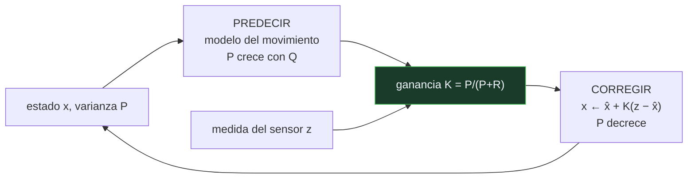

# P96 — Filtro de Kalman

> Ruta encarnada · Fusiona un modelo y un sensor ponderando cada uno por su propia
> incertidumbre. Y esa ponderación se ajusta sola, paso a paso.

**Nivel:** L3 · **Motor:** `kalman` · **Notebook:** [`P96_kalman.ipynb`](../../../notebooks/papers/P96_kalman.ipynb)
· **Anexo:** [probabilidad y verosimilitud](../../annexes/A02_PROBABILIDAD_Y_VEROSIMILITUD.md)

## 1. Identificación

| Campo | Valor |
|---|---|
| **Título original** | *A New Approach to Linear Filtering and Prediction Problems* |
| **Autoría** | Rudolf E. Kálmán |
| **Año** | 1960 |
| **Venue** | Journal of Basic Engineering, 82(1), 35–45 |
| **Fuente primaria** | [doi:10.1115/1.3662552](https://doi.org/10.1115/1.3662552) |
| **Acceso** | Restringido |
| **Fecha de consulta** | 2026-08-17 |

## 2. Problema anterior

Un vehículo tiene dos fuentes de información sobre dónde está, y las dos mienten. El modelo del
movimiento predice bien a corto plazo y acumula error sin límite. El sensor no acumula error pero
es ruidoso en cada lectura.

Promediarlos trata igual a las dos fuentes, e ignora que la confianza en cada una cambia con el
tiempo. Y el filtrado óptimo de Wiener, que sí resolvía el problema, exigía procesar todo el
historial de señal y suponer estacionariedad — impracticable a bordo de nada.

## 3. Propuesta

Mantener dos cosas: la estimación del estado y **su varianza**. Con ellas, el ciclo es:

```text
Predecir:   x̂ ← f(x, u)          P ← P + Q
Corregir:   K ← P / (P + R)      x ← x̂ + K·(z − x̂)      P ← (1 − K)·P
```

La **ganancia** `K` no es un parámetro que se ajuste: sale del cociente entre la incertidumbre del
modelo y la del sensor. Si el sensor es malo, `K` baja sola y el filtro le hace menos caso.

Y es **recursivo**: solo necesita el estado anterior, no el historial. Cabe en la memoria de un
ordenador de vuelo de 1969.

## 4. Intuición sin fórmulas

Caminar por casa a oscuras. Sabes cuántos pasos has dado desde la puerta —tu modelo— y de vez en
cuando tocas un mueble —tu sensor—. Ninguna de las dos cosas es exacta.

Al principio confías en el conteo, porque acabas de salir de un sitio conocido. Cuanto más andas,
menos vale el conteo y más caso haces a lo que tocas.

**Dónde deja de funcionar la analogía:** tú decides a ojo cuánto fiarte de cada cosa. El filtro lo
calcula, y ese cálculo es exacto —óptimo, de hecho— si el sistema es lineal y el ruido gaussiano.

## 5. Matemática mínima

```text
Predicción:   x̂ₖ = A·xₖ₋₁ + B·uₖ            Pₖ⁻ = A·Pₖ₋₁·Aᵀ + Q
Ganancia:     Kₖ = Pₖ⁻·Hᵀ (H·Pₖ⁻·Hᵀ + R)⁻¹
Corrección:   xₖ = x̂ₖ + Kₖ(zₖ − H·x̂ₖ)        Pₖ = (I − Kₖ·H)·Pₖ⁻

    Q = covarianza del proceso      R = covarianza del sensor
```

La miniatura sigue una posición durante 40 pasos:

| Estrategia | Error |
|---|---:|
| solo el sensor | 1,8895 |
| solo el modelo | 0,7943 |
| media móvil de 5 | 2,2179 |
| **filtro de Kalman** | **0,4559** |

El filtro no usa ninguna información adicional: las mismas dos fuentes, mejor combinadas. Y la
ganancia arranca en **0,208** y baja a **0,106**; con un sensor diez veces peor, cae sola a
**0,034**.

<!-- puente:inicio -->
> [!TIP]
> **Puente matemático.** Esta sección da por sabido lo siguiente. Si algo no te suena,
> léelo primero: está explicado una sola vez, en un solo sitio, y sirve para todas las fichas.

| Dónde | Qué necesitas de ahí |
|---|---|
| [**A02 §3** · Verosimilitud y entropía cruzada](../../annexes/A02_PROBABILIDAD_Y_VEROSIMILITUD.md#3-verosimilitud-y-entropía-cruzada) | por qué combinar dos estimaciones ponderando por la inversa de su varianza es lo óptimo |
<!-- puente:fin -->

## 6. Arquitectura o flujo



## 7. Qué observar en el paper original

- Que el artículo aborda el problema en **espacio de estados**, no en el dominio de la frecuencia
  como Wiener. Ese cambio de representación es lo que lo hace recursivo y aplicable.
- La **ecuación de Riccati** para la covarianza, y el hecho de que en régimen estacionario la
  ganancia converge a una constante que se puede precalcular.
- Que el filtro es **óptimo** —mínimo error cuadrático medio— bajo linealidad y ruido gaussiano, y
  que fuera de esos supuestos deja de tener garantía.
- El contexto: Kálmán presenta el trabajo en ingeniería mecánica, y su adopción llega por la vía de
  la NASA antes que por la académica.

## 8. Evidencia y resultados

Es un artículo matemático: deriva las ecuaciones y demuestra la optimalidad bajo sus supuestos,
con ejemplos de problemas de predicción.

> No hay experimentos. La validación llega con la implementación de Schmidt en el Ames Research
> Center y su uso en la navegación del programa Apollo, que es lo que hizo famoso al filtro.

La miniatura compara cuatro estimadores sobre los mismos datos ruidosos para exhibir lo único que
importa entender: que la ganancia sale de las varianzas y no de un ajuste manual.

## 9. Impacto

- Es probablemente el algoritmo de estimación más ejecutado del mundo: navegación aérea y marítima,
  GPS, seguimiento de objetivos, control de procesos, fusión de sensores en cualquier robot.
- Llevó a la Luna literalmente: la navegación del Apollo lo usaba.
- Sus variantes —extendido, unscented, filtros de partículas— cubren el caso no lineal, y todas
  heredan esta estructura de predecir y corregir.
- En robótica es la base de [SLAM](../P99_slam/README.md): el mismo mecanismo, con el mapa dentro
  del vector de estado.

## 10. Limitaciones

1. **Óptimo solo con sistema lineal y ruido gaussiano.** Fuera de ahí hay que usar variantes que
   ya no tienen garantía.
2. **Q y R hay que estimarlas.** Ponerlas mal es la causa más frecuente de que un filtro se
   comporte mal en producción: si `R` es demasiado optimista, el filtro persigue el ruido.
3. **Diverge en silencio.** Un modelo mal especificado produce estimaciones confiadas y erróneas,
   con la varianza reportada cada vez más pequeña.
4. **Supone que el modelo del sistema se conoce.** En muchos problemas reales esa es la parte
   difícil.
5. **Ruido correlacionado en el tiempo** rompe los supuestos, y ocurre constantemente con sensores
   reales.

## 11. Errores comunes

| Error | Corrección |
|---|---|
| «El filtro promedia el modelo y el sensor» | Los pondera por sus varianzas, y ese peso cambia en cada paso. En la miniatura la ganancia pasa de 0,208 a 0,106 sin que nadie la toque. |
| «La ganancia es un hiperparámetro que se ajusta» | Sale del cociente entre las incertidumbres. Lo que sí hay que estimar es Q y R, y ese es el trabajo real. |
| «Si la varianza reportada es pequeña, la estimación es buena» | Un modelo mal especificado reduce la varianza mientras se aleja de la verdad. La confianza del filtro no es una comprobación independiente. |
| «Sirve para cualquier sistema» | Es óptimo para sistemas lineales con ruido gaussiano. Con no linealidades fuertes hay que usar el filtro extendido o de partículas, sin garantía de optimalidad. |
| «Una media móvil hace lo mismo y es más simple» | Trata todas las medidas por igual, ignora que hay un modelo del movimiento e introduce retraso. En la miniatura da 2,2179 frente a 0,4559. |

## 12. Relación con trabajos anteriores

- **Wiener (1949)** — filtrado óptimo en el dominio de la frecuencia: correcto y no recursivo.
- **[P87 Teorema de Bayes](../P87_bayes/README.md) (1763)** — el filtro es actualización bayesiana
  con distribuciones gaussianas.
- **Gauss (1809)** — mínimos cuadrados, el antecedente del criterio que se minimiza.

## 13. Relación con trabajos posteriores

- **Kalman y Bucy (1961)** — la versión en tiempo continuo.
  [doi:10.1115/1.3658902](https://doi.org/10.1115/1.3658902)
- **[P99 SLAM](../P99_slam/README.md) (2006)** — el mismo filtro con el mapa dentro del estado.
- **Julier y Uhlmann (1997)** — el filtro *unscented*, para no linealidades fuertes.
- **Grewal y Andrews (2010)** — la historia del filtro en el programa Apollo.
  [doi:10.1109/MCS.2010.936465](https://doi.org/10.1109/MCS.2010.936465)

## 14. Notebook asociado

[`P96_kalman.ipynb`](../../../notebooks/papers/P96_kalman.ipynb)

**Qué implementa:** un filtro de Kalman escalar completo sobre una trayectoria ruidosa, comparado con el sensor solo, el modelo solo y una media móvil, con la evolución de la ganancia y su reacción a un sensor peor.

**Qué NO implementa:** es escalar y con velocidad conocida: no hay matrices de covarianza, ni estimación conjunta de velocidad, ni el caso no lineal, que es donde vive la dificultad real.

```bash
ai-evolution paper-lab P96 --seed 7
```

## 15. Actividades Bloom

| Nivel | Actividad |
|---|---|
| **Recordar** | Escribe las ecuaciones de predicción y corrección. |
| **Explicar** | Explica de dónde sale la ganancia. |
| **Aplicar** | Ejecuta el notebook y observa cómo cambia la ganancia con un sensor peor. |
| **Analizar** | Analiza por qué la media móvil introduce retraso y el filtro no. |
| **Evaluar** | «El filtro reporta poca varianza, luego la estimación es buena». Evalúa la afirmación. |
| **Crear** | Implementa un filtro para una señal real de tu trabajo estimando Q y R de los datos, y compáralo con una media móvil. |

## 16. Autoevaluación

1. ¿Qué dos fuentes combina el filtro?
2. ¿Qué es la ganancia y de dónde sale?
3. ¿Por qué es recursivo y por qué importa?
4. ¿Bajo qué supuestos es óptimo?
5. ¿Qué pasa si se estima mal R?
6. ¿En qué se diferencia de una media móvil?
7. ¿Cómo se extiende a sistemas no lineales?

## 17. Respuestas esperadas

1. Una predicción del modelo del sistema y una medida del sensor, cada una con su propia incertidumbre.
2. Es el peso que se da a la medida frente a la predicción, y sale del cociente entre la varianza de la predicción y la suma de ambas varianzas. No se ajusta a mano.
3. Porque solo necesita el estado anterior y su varianza, no el historial completo. Eso permitió ejecutarlo en el hardware de los años sesenta, y es la razón de que se adoptara.
4. Sistema lineal y ruido gaussiano de media cero. Bajo esos supuestos minimiza el error cuadrático medio.
5. Si se supone al sensor mejor de lo que es, el filtro le hace demasiado caso y persigue el ruido; si se le supone peor, ignora información útil y se queda con la deriva del modelo.
6. La media móvil pesa todas las medidas por igual, no usa el modelo del movimiento e introduce retraso. El filtro pondera por incertidumbre y predice.
7. Con el filtro extendido —linealizando alrededor de la estimación— o el unscented —propagando puntos sigma—. Ninguno conserva la garantía de optimalidad.

## 18. Fuentes primarias

- Kálmán, R. E. (1960). *A New Approach to Linear Filtering and Prediction Problems*. **Journal of
  Basic Engineering**, 82(1), 35–45. [doi:10.1115/1.3662552](https://doi.org/10.1115/1.3662552) ·
  consultado 2026-08-17.
- Kalman, R. y Bucy, R. (1961). *New Results in Linear Filtering and Prediction Theory*.
  [doi:10.1115/1.3658902](https://doi.org/10.1115/1.3658902) · consultado 2026-08-17.
- Grewal, M. y Andrews, A. (2010). *Applications of Kalman Filtering in Aerospace 1960 to the
  Present*. [doi:10.1109/MCS.2010.936465](https://doi.org/10.1109/MCS.2010.936465) ·
  consultado 2026-08-17.

---

[⬅️ Anterior: P95 Herramientas causales](../P95_causalidad/README.md) ·
[📇 Índice](../../catalog/PAPERS_INDEX.md) ·
[📝 Evaluación](../../../assessments/papers/P96_kalman.md) ·
[🏫 Clase 137 · Sensores, actuadores y fusión](../../../classes/part-11-embodied-ai-robotics-and-computer-use/137-sensores-actuadores-y-fusion/README.md) ·
[➡️ Siguiente: P97 Subsunción](../P97_subsuncion/README.md)
