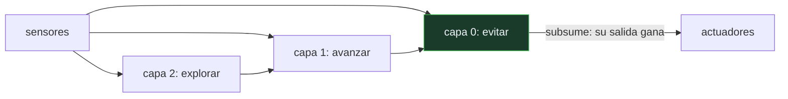

# P97 — Subsunción

> Ruta encarnada · Un robot competente sin modelo del mundo, sin planificador y sin
> representación central. Capas de reflejos que se pisan unas a otras.

**Nivel:** L2 · **Motor:** `subsuncion` · **Notebook:** [`P97_subsuncion.ipynb`](../../../notebooks/papers/P97_subsuncion.ipynb)
· **Anexo:** [complejidad y coste](../../annexes/A05_COMPLEJIDAD_Y_COSTE.md)

## 1. Identificación

| Campo | Valor |
|---|---|
| **Título original** | *A Robust Layered Control System for a Mobile Robot* |
| **Autoría** | Rodney A. Brooks |
| **Año** | 1986 |
| **Venue** | IEEE Journal of Robotics and Automation, 2(1), 14–23 |
| **Fuente primaria** | [doi:10.1109/JRA.1986.1087032](https://doi.org/10.1109/JRA.1986.1087032) |
| **Acceso** | Restringido |
| **Fecha de consulta** | 2026-08-17 |

## 2. Problema anterior

La arquitectura dominante descomponía el robot por **funciones**: percepción → modelado →
planificación → ejecución. Cada módulo entrega al siguiente, y el plan se construye sobre un modelo
del mundo.

Tenía dos problemas prácticos. Mantener el modelo actualizado consume casi todo el cómputo y toda
la atención de ingeniería. Y si el mundo cambia entre el modelado y la ejecución, el robot ejecuta
con confianza un plan que ya no es válido — que es peor que no tener plan.

## 3. Propuesta

Descomponer por **comportamientos** en vez de por funciones. Cada capa conecta directamente
percepción con acción y funciona por su cuenta:

```text
capa 2:  explorar
capa 1:  vagar
capa 0:  evitar obstáculos     ← puede SUBSUMIR la salida de las de arriba
```

Las capas se construyen incrementalmente: primero la 0, que ya produce un robot que funciona;
después la 1, encima, sin tocar la 0. No hay representación compartida, no hay plan y no hay estado
central. Cada capa mira el mundo directamente.

## 4. Intuición sin fórmulas

Conducir por una carretera conocida mientras hablas por teléfono. No estás planificando la
trayectoria: hay una parte de ti que mantiene el coche en el carril y frena si algo se cruza, sin
consultar nada.

Y si aparece un obstáculo, esa parte **interrumpe** todo lo demás. No negocia con la conversación:
la pisa.

**Dónde deja de funcionar la analogía:** tú sí tienes un plan —ir a un sitio— y en algún momento
hay que consultarlo. Brooks construye robots sin ningún plan, y por eso su enfoque no escala a
tareas con objetivos a largo plazo.

## 5. Matemática mínima

No hay formalismo: la aportación es arquitectónica. Cada capa se implementa como una red de
máquinas de estados finitos con temporizadores, conectadas por cables que se pueden **inhibir**
(bloquear una entrada) o **suprimir** (sustituir una salida).

La miniatura compara las dos arquitecturas en un pasillo con obstáculos:

| Situación | Subsunción | Percibir-planificar-actuar |
|---|---:|---:|
| mundo conocido, colisiones | **0** | **0** |
| estado interno guardado | **0** | 3 obstáculos |
| aparece un obstáculo no previsto | **0 colisiones** | **1 colisión** |

Con el mapa correcto los dos funcionan. La diferencia es lo que cuesta tener el mapa correcto — y
lo que pasa cuando no lo está.

<!-- puente:inicio -->
> [!TIP]
> **Puente matemático.** Esta sección da por sabido lo siguiente. Si algo no te suena,
> léelo primero: está explicado una sola vez, en un solo sitio, y sirve para todas las fichas.

| Dónde | Qué necesitas de ahí |
|---|---|
| [**A05 §1** · Notación O(): qué dice y qué no](../../annexes/A05_COMPLEJIDAD_Y_COSTE.md#1-notación-o-qué-dice-y-qué-no) | por qué mantener y consultar un modelo del mundo tiene un coste que crece con el entorno |
<!-- puente:fin -->

## 6. Arquitectura o flujo



## 7. Qué observar en el paper original

- La **construcción incremental**: la capa 0 sola ya es un robot que funciona. Se añaden capas
  encima sin modificar las de abajo, y cada nivel se puede probar por separado.
- Los mecanismos concretos de **inhibición y supresión**, que son cómo una capa se impone sobre otra
  sin que exista un árbitro central.
- La afirmación de que **no hay representación**: no hay ninguna estructura de datos que describa el
  mundo. Es la parte que más se discutió.
- Que Brooks argumenta desde **robots construidos**, no desde simulación. Ese detalle es central en
  su polémica con la comunidad simbólica.

## 8. Evidencia y resultados

El artículo describe la arquitectura y los robots móviles construidos con ella, con su
comportamiento observado en entornos de oficina reales.

> La evidencia es cualitativa: los robots funcionan, son robustos ante fallos de sensor y se
> construyeron en meses. No hay comparación cuantitativa con la arquitectura clásica.

La miniatura sí construye esa comparación, con una advertencia: está montada a favor del reactivo,
porque el planificador ejecuta a ciegas. Un sistema real replanifica al detectar la discrepancia.

## 9. Impacto

- Fundó la **robótica situada** y cambió la práctica de la robótica móvil durante una década.
- Brooks fundó iRobot, y el Roomba —el robot doméstico más vendido de la historia— es descendiente
  directo de esta arquitectura.
- Provocó una de las polémicas más productivas del campo, con
  [Símbolos y búsqueda](../P58_simbolos_y_busqueda/README.md) al otro lado.
- El desenlace fue una síntesis: las arquitecturas actuales son **híbridas**, con una capa reactiva
  rápida y una deliberativa lenta. Ese es exactamente el patrón de un agente con modelo de lenguaje
  que planifica mientras un bucle de seguridad vigila cada acción.

## 10. Limitaciones

1. **No escala a objetivos a largo plazo.** Sin representación no hay forma de perseguir una meta
   que exija varios pasos coordinados.
2. **Añadir capas se vuelve inmanejable.** Las interacciones entre capas crecen y depurarlas es
   difícil precisamente porque no hay estado central que inspeccionar.
3. **La comparación del artículo es cualitativa** y no mide frente a alternativas bien
   implementadas.
4. **«Sin representación» es discutible**: el estado de las máquinas de estados finitos es
   representación, aunque sea distribuida y local.
5. **La síntesis posterior le da la razón a medias**: nadie construye hoy robots complejos sin
   ninguna capa deliberativa.

## 11. Errores comunes

| Error | Corrección |
|---|---|
| «Brooks demuestra que planificar no sirve» | Demuestra que la tubería clásica es frágil cuando el mundo cambia durante la ejecución. Las arquitecturas actuales son híbridas. |
| «Un sistema reactivo no puede tener objetivos» | Puede tener objetivos implícitos en la estructura de capas. Lo que no puede es razonar sobre objetivos nuevos que no estén cableados. |
| ««Sin representación» significa sin estado» | Las máquinas de estados finitos tienen estado. Lo que no hay es un modelo del mundo centralizado y compartido. |
| «La subsunción es más simple de programar» | Cada capa lo es. Las interacciones entre muchas capas son notoriamente difíciles de depurar, y ese fue su límite práctico. |
| «Es una arquitectura superada» | El patrón sobrevive: cualquier sistema con un bucle de seguridad rápido que puede interrumpir a un planificador lento está usando subsunción con otro nombre. |

## 12. Relación con trabajos anteriores

- **[P58 Símbolos y búsqueda](../P58_simbolos_y_busqueda/README.md) (1976)** — la tesis que este
  artículo ataca de frente.
- **Walter (1950)** — las tortugas cibernéticas: robots con comportamiento complejo y dos
  «neuronas».
- **[P59 Agentes inteligentes](../P59_agente_racional/README.md) (1995)** — el survey que ordena
  este debate en el vocabulario de agentes reactivos y deliberativos.

## 13. Relación con trabajos posteriores

- **Brooks (1990)** — *Elephants Don't Play Chess*.
  [doi:10.1016/S0921-8890(05)80025-9](https://doi.org/10.1016/S0921-8890%2805%2980025-9)
- **Brooks (1991)** — *Intelligence Without Representation*: la formulación más provocadora.
  [doi:10.1016/0004-3702(91)90053-M](https://doi.org/10.1016/0004-3702%2891%2990053-M)
- **[P102 PPO](../P102_ppo/README.md) (2017)** — el control aprendido, que es la tercera vía: ni
  cablear reflejos ni planificar sobre un modelo.
- **[P106 OSWorld](../P106_osworld/README.md) (2024)** — agentes que actúan sobre un entorno que
  cambia mientras piensan: el mismo problema, otro cuerpo.

## 14. Notebook asociado

[`P97_subsuncion.ipynb`](../../../notebooks/papers/P97_subsuncion.ipynb)

**Qué implementa:** las dos arquitecturas sobre el mismo pasillo, con el conteo de estado interno y el comportamiento de cada una cuando aparece un obstáculo que no estaba en el mapa.

**Qué NO implementa:** el pasillo es unidimensional y los sensores son perfectos. Y la comparación está montada a favor del reactivo: el planificador no replanifica, y eso se declara.

```bash
ai-evolution paper-lab P97 --seed 7
```

## 15. Actividades Bloom

| Nivel | Actividad |
|---|---|
| **Recordar** | Describe las tres capas del ejemplo y qué hace cada una. |
| **Explicar** | Explica qué significa que una capa subsuma a otra. |
| **Aplicar** | Ejecuta el notebook y compara el estado interno de las dos arquitecturas. |
| **Analizar** | Analiza por qué el planificador choca cuando el mundo cambia. |
| **Evaluar** | «Este artículo demuestra que planificar es un error». Evalúa la afirmación. |
| **Crear** | Diseña la descomposición por capas de un agente tuyo e indica qué capa puede interrumpir a cuál. |

## 16. Autoevaluación

1. ¿Por qué función descompone la arquitectura clásica y por qué la subsunción?
2. ¿Qué significa subsumir?
3. ¿Cuánto estado interno guarda un sistema de subsunción?
4. ¿Qué quiere decir «el mundo es su propio mejor modelo»?
5. ¿Cuál es el límite del enfoque?
6. ¿Qué arquitecturas se usan hoy?
7. ¿Es cierto que no hay representación?

## 17. Respuestas esperadas

1. La clásica por funciones —percepción, modelado, planificación, ejecución— y la subsunción por comportamientos, cada uno conectando sensores con actuadores directamente.
2. Que una capa inferior puede suprimir o inhibir la salida de una superior. La capa de evitar obstáculos se impone sobre la de avanzar sin negociar con ella.
3. Ninguno en el sentido de un modelo del mundo. Hay estado local en las máquinas de estados de cada capa, pero no una representación central compartida.
4. Que consultar el mundo directamente a través de los sensores es más fiable y más barato que mantener un modelo interno que puede quedarse desfasado.
5. Que no escala a tareas con objetivos a largo plazo, y que las interacciones entre muchas capas se vuelven difíciles de depurar.
6. Híbridas: una capa reactiva rápida que garantiza seguridad y una deliberativa más lenta que persigue el objetivo. La discusión acabó en síntesis, no en victoria.
7. Es discutible. No hay modelo central del mundo, pero el estado de las máquinas de estados es representación distribuida. La afirmación fuerte de Brooks es más retórica que técnica.

## 18. Fuentes primarias

- Brooks, R. A. (1986). *A Robust Layered Control System for a Mobile Robot*. **IEEE Journal of
  Robotics and Automation**, 2(1), 14–23.
  [doi:10.1109/JRA.1986.1087032](https://doi.org/10.1109/JRA.1986.1087032) · consultado 2026-08-17.
- Brooks, R. A. (1990). *Elephants Don't Play Chess*.
  [doi:10.1016/S0921-8890(05)80025-9](https://doi.org/10.1016/S0921-8890%2805%2980025-9) ·
  consultado 2026-08-17.
- Brooks, R. A. (1991). *Intelligence Without Representation*.
  [doi:10.1016/0004-3702(91)90053-M](https://doi.org/10.1016/0004-3702%2891%2990053-M) ·
  consultado 2026-08-17.

---

[⬅️ Anterior: P96 Filtro de Kalman](../P96_kalman/README.md) ·
[📇 Índice](../../catalog/PAPERS_INDEX.md) ·
[📝 Evaluación](../../../assessments/papers/P97_subsuncion.md) ·
[🏫 Clase 136 · Arquitectura percepción-planificación-acción](../../../classes/part-11-embodied-ai-robotics-and-computer-use/136-arquitectura-percepcion-planificacion-accion/README.md) ·
[➡️ Siguiente: P98 RRT](../P98_rrt/README.md)
