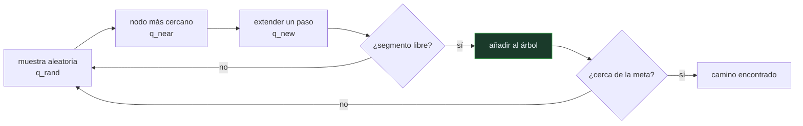

# P98 — RRT

> Ruta encarnada · Planificar en espacios continuos de muchas dimensiones sin
> discretizarlos: un árbol que crece hacia muestras aleatorias.

**Nivel:** L3 · **Motor:** `rrt` · **Notebook:** [`P98_rrt.ipynb`](../../../notebooks/papers/P98_rrt.ipynb)
· **Anexo:** [complejidad y coste](../../annexes/A05_COMPLEJIDAD_Y_COSTE.md)

## 1. Identificación

| Campo | Valor |
|---|---|
| **Título original** | *RRT-Connect: An Efficient Approach to Single-Query Path Planning* |
| **Autoría** | James J. Kuffner, Steven M. LaValle |
| **Año** | 2000 |
| **Venue** | Proceedings of ICRA 2000, 995–1001 |
| **Fuente primaria** | [doi:10.1109/ROBOT.2000.844730](https://doi.org/10.1109/ROBOT.2000.844730) |
| **Acceso** | Restringido |
| **Fecha de consulta** | 2026-08-17 |

## 2. Problema anterior

Un brazo de siete articulaciones tiene un espacio de configuración de siete dimensiones. Para
aplicar búsqueda en grafo —[A*](../P67_a_estrella/README.md) y familia— hay que discretizarlo, y
con diez pasos por eje eso son diez millones de celdas. Con más precisión o más articulaciones, la
cifra deja de tener sentido.

Los campos potenciales evitaban discretizar pero se quedaban atrapados en mínimos locales, y
detectar colisiones exactas en el espacio de configuración es caro: hay que poder preguntar poco.

## 3. Propuesta

No representar el espacio. Muestrear configuraciones al azar y hacer crecer un árbol desde el
inicio hacia cada muestra:

```text
repetir:
    q_rand ← muestra aleatoria (a veces, la meta)
    q_near ← nodo del árbol más cercano
    q_new  ← un paso desde q_near hacia q_rand
    si el segmento está libre → añadir q_new
```

La propiedad que lo hace funcionar es geométrica: la probabilidad de que un nodo sea el más cercano
a la siguiente muestra es proporcional al volumen de su región de Voronoi, así que **el árbol se
sesga solo hacia las regiones grandes sin explorar**.

RRT-Connect añade la mejora práctica: dos árboles, uno desde el inicio y otro desde la meta,
creciendo el uno hacia el otro.

## 4. Intuición sin fórmulas

Explorar una cueva a oscuras con una cuerda. Vas lanzando la cuerda hacia direcciones al azar y,
cada vez, avanzas un poco desde el punto de la cuerda ya tendida que esté más cerca de donde
apuntaste.

Sin darte cuenta acabas explorando primero las galerías grandes, porque son las que más "cubren" al
apuntar al azar.

**Dónde deja de funcionar la analogía:** en una cueva ves por dónde vas. Aquí el algoritmo solo
puede preguntar «¿este segmento está libre?», y esa consulta es lo caro. Todo el diseño está
orientado a hacer pocas.

## 5. Matemática mínima

```text
Completitud probabilística:
    si existe solución, la probabilidad de encontrarla → 1 cuando el número de muestras → ∞

NO optimalidad: el camino devuelto no es el más corto, ni tiende a serlo
```

La miniatura planifica en un espacio 100×100 con dos obstáculos:

| Magnitud | Valor |
|---|---:|
| nodos expandidos (sesgo 5 %) | **297** |
| celdas de una rejilla 2×2 equivalente | 2 500 |
| longitud del camino | 264,0 |
| línea recta | 127,28 |
| **exceso sobre la recta** | **107 %** |

Y el sesgo hacia la meta importa mucho: sin sesgo hacen falta **394** nodos; con un 20 %, **191**.

<!-- puente:inicio -->
> [!TIP]
> **Puente matemático.** Esta sección da por sabido lo siguiente. Si algo no te suena,
> léelo primero: está explicado una sola vez, en un solo sitio, y sirve para todas las fichas.

| Dónde | Qué necesitas de ahí |
|---|---|
| [**A05 §1** · Notación O(): qué dice y qué no](../../annexes/A05_COMPLEJIDAD_Y_COSTE.md#1-notación-o-qué-dice-y-qué-no) | por qué discretizar un espacio de d dimensiones da kᵈ celdas y deja de ser viable enseguida |
<!-- puente:fin -->

## 6. Arquitectura o flujo



## 7. Qué observar en el paper original

- El argumento del **sesgo de Voronoi**: por qué el árbol explora primero lo grande sin que nadie
  se lo diga. Es la propiedad que justifica el método.
- La mejora de **RRT-Connect**: dos árboles y el paso *connect*, que extiende repetidamente en vez
  de un solo paso. Es lo que hace el método rápido en la práctica.
- Que el planteamiento es de **consulta única**: no se construye una estructura reutilizable, se
  resuelve esta consulta. Los mapas de caminos probabilísticos (PRM) son la alternativa multiconsulta.
- La ausencia total de **optimalidad**: el artículo no la promete y el camino tiene el aspecto de
  zigzag característico.

## 8. Evidencia y resultados

Experimentos sobre problemas de planificación con brazos manipuladores y comparación con
planificadores de la época, midiendo tiempo de cálculo y número de consultas de colisión.

> El criterio que importa en este campo no es la longitud del camino sino el **número de consultas
> de colisión**, porque es lo que domina el coste real.

La miniatura mide en dos dimensiones, donde el método no aporta nada frente a una rejilla. Sirve
para ver el mecanismo y sus dos propiedades —completitud probabilística sí, optimalidad no— con la
respuesta a la vista.

## 9. Impacto

- Es el planificador de movimiento más usado en robótica: está en ROS, en MoveIt y en la mayoría de
  los sistemas de manipulación.
- Abrió la familia de **planificadores basados en muestreo**, que es hoy el enfoque dominante para
  espacios de configuración de alta dimensión.
- **RRT\*** (Karaman y Frazzoli, 2011) añade optimalidad asintótica: el camino converge al óptimo
  al aumentar las muestras, a costa de más cómputo. Es la misma disyuntiva entre voraz y óptimo que
  planteaba [A*](../P67_a_estrella/README.md).
- Y aporta una idea transferible: cuando el espacio es demasiado grande para representarlo,
  muestrearlo puede ser mejor que discretizarlo.

## 10. Limitaciones

1. **No es óptimo ni tiende a serlo.** El camino tiene zigzags y hay que podarlo y suavizarlo
   antes de ejecutarlo.
2. **Pasillos estrechos.** El muestreo uniforme casi nunca cae en un corredor angosto, y ahí el
   método se atasca. Es su punto débil conocido.
3. **No determinista**: dos ejecuciones dan caminos distintos, lo que complica la reproducibilidad
   y las pruebas.
4. **La métrica de distancia importa** y en espacios de configuración con rotaciones no es obvia
   cuál usar.
5. **Sin restricciones dinámicas** en su forma básica: el robot puede girar instantáneamente. Con
   restricciones no holónomas la extensión es mucho más delicada.

## 11. Errores comunes

| Error | Corrección |
|---|---|
| «RRT encuentra el camino más corto» | Encuentra *un* camino. En la miniatura, un 107 % más largo que la línea recta. Para optimalidad asintótica hace falta RRT*. |
| «Más muestras dan un camino mejor» | Dan más probabilidad de encontrar uno, no uno más corto. La longitud no mejora con las muestras en RRT básico. |
| «El camino se puede ejecutar tal cual» | Tiene zigzags y nodos innecesarios. En la práctica se poda y se suaviza antes de mandarlo al controlador. |
| «El sesgo hacia la meta cuanto mayor, mejor» | Con sesgo demasiado alto degenera en una búsqueda voraz que se queda atrapada. Es un equilibrio: en la miniatura, 5 % y 20 % funcionan y 100 % no exploraría. |
| «Es completo» | Es **probabilísticamente** completo: la probabilidad de encontrar solución tiende a 1 con infinitas muestras. Con presupuesto finito puede no encontrar una que existe. |

## 12. Relación con trabajos anteriores

- **[P67 A*](../P67_a_estrella/README.md) (1968)** — la búsqueda con garantía sobre grafos
  discretos, que es lo que aquí no se puede aplicar.
- **Kavraki et al. (1996)** — mapas de caminos probabilísticos (PRM): el otro gran enfoque basado
  en muestreo, para múltiples consultas.
- **Khatib (1986)** — campos potenciales: la alternativa sin discretizar que se atasca en mínimos
  locales.

## 13. Relación con trabajos posteriores

- **Karaman y Frazzoli (2011)** — RRT*: optimalidad asintótica.
  [doi:10.1177/0278364911406761](https://doi.org/10.1177/0278364911406761)
- **LaValle** — *Planning Algorithms*, el manual abierto de referencia.
  [lavalle.pl/planning](http://lavalle.pl/planning/)
- **[P99 SLAM](../P99_slam/README.md) (2006)** — el mapa sobre el que se planifica también hay que
  construirlo.

## 14. Notebook asociado

[`P98_rrt.ipynb`](../../../notebooks/papers/P98_rrt.ipynb)

**Qué implementa:** un RRT completo con detección de colisión por segmentos, comparación de nodos expandidos con tres niveles de sesgo hacia la meta, y la medición del exceso de longitud sobre la línea recta.

**Qué NO implementa:** no hay RRT-Connect con dos árboles, ni RRT*, ni poda ni suavizado, ni restricciones dinámicas. Y en dos dimensiones el método no aporta nada frente a una rejilla.

```bash
ai-evolution paper-lab P98 --seed 7
```

## 15. Actividades Bloom

| Nivel | Actividad |
|---|---|
| **Recordar** | Escribe el bucle principal de RRT. |
| **Explicar** | Explica el sesgo de Voronoi. |
| **Aplicar** | Ejecuta el notebook y compara los tres niveles de sesgo hacia la meta. |
| **Analizar** | Analiza por qué el camino resultante es tan largo. |
| **Evaluar** | «RRT encontró el camino, luego el problema está resuelto». Evalúa la afirmación. |
| **Crear** | Implementa RRT sobre un espacio con un pasillo estrecho y mide cuántos nodos hacen falta frente a un espacio abierto. |

## 16. Autoevaluación

1. ¿Por qué no se puede discretizar el espacio de configuración?
2. ¿Qué es el sesgo de Voronoi?
3. ¿Es RRT completo?
4. ¿Es óptimo?
5. ¿Qué aporta RRT-Connect?
6. ¿Cuál es su punto débil conocido?
7. ¿Qué hay que hacer con el camino antes de ejecutarlo?

## 17. Respuestas esperadas

1. Porque el número de celdas crece como kᵈ con la dimensión. Con siete articulaciones y diez pasos por eje son diez millones de celdas, y eso es un caso pequeño.
2. Que la probabilidad de que un nodo sea el más cercano a la siguiente muestra es proporcional al volumen de su región de Voronoi. Como las regiones grandes están en zonas poco exploradas, el árbol se sesga solo hacia ellas.
3. Es **probabilísticamente** completo: si existe solución, la probabilidad de encontrarla tiende a 1 al aumentar las muestras. Con presupuesto finito puede fallar.
4. No, ni tiende a serlo. En la miniatura el camino es un 107 % más largo que la línea recta. RRT* añade optimalidad asintótica.
5. Dos árboles, uno desde el inicio y otro desde la meta, creciendo el uno hacia el otro, más un paso *connect* que extiende repetidamente en vez de un solo paso.
6. Los pasillos estrechos: el muestreo uniforme casi nunca cae dentro de un corredor angosto y el árbol se atasca en la entrada.
7. Podarlo —quitar nodos intermedios que se pueden saltar— y suavizarlo. El camino en bruto tiene zigzags que el robot no puede seguir bien.

## 18. Fuentes primarias

- Kuffner, J. y LaValle, S. (2000). *RRT-Connect: An Efficient Approach to Single-Query Path
  Planning*. **ICRA 2000**, 995–1001.
  [doi:10.1109/ROBOT.2000.844730](https://doi.org/10.1109/ROBOT.2000.844730) · consultado 2026-08-17.
- Karaman, S. y Frazzoli, E. (2011). *Sampling-based Algorithms for Optimal Motion Planning*.
  [doi:10.1177/0278364911406761](https://doi.org/10.1177/0278364911406761) · consultado 2026-08-17.
- LaValle, S. *Planning Algorithms*. [lavalle.pl/planning](http://lavalle.pl/planning/) ·
  consultado 2026-08-17.

---

[⬅️ Anterior: P97 Subsunción](../P97_subsuncion/README.md) ·
[📇 Índice](../../catalog/PAPERS_INDEX.md) ·
[📝 Evaluación](../../../assessments/papers/P98_rrt.md) ·
[🏫 Clase 139 · Planificación de movimiento y navegación](../../../classes/part-11-embodied-ai-robotics-and-computer-use/139-planificacion-de-movimiento-y-navegacion/README.md) ·
[➡️ Siguiente: P99 SLAM](../P99_slam/README.md)
