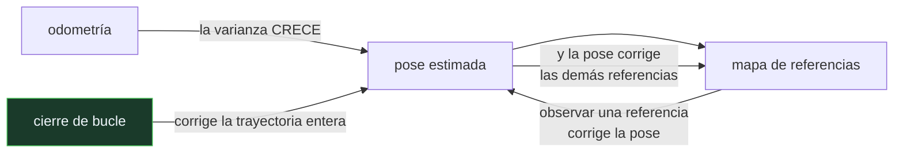

# P99 — SLAM

> Ruta encarnada · Para localizarte necesitas un mapa; para hacer el mapa necesitas
> localizarte. La única salida es estimar las dos cosas a la vez.

**Nivel:** L3 · **Motor:** `slam` · **Notebook:** [`P99_slam.ipynb`](../../../notebooks/papers/P99_slam.ipynb)
· **Anexo:** [probabilidad y verosimilitud](../../annexes/A02_PROBABILIDAD_Y_VEROSIMILITUD.md)

## 1. Identificación

| Campo | Valor |
|---|---|
| **Título original** | *Simultaneous Localization and Mapping: Part I* |
| **Autoría** | Hugh Durrant-Whyte, Tim Bailey |
| **Año** | 2006 |
| **Venue** | IEEE Robotics & Automation Magazine, 13(2), 99–110 |
| **Fuente primaria** | [doi:10.1109/MRA.2006.1638022](https://doi.org/10.1109/MRA.2006.1638022) |
| **Acceso** | Restringido |
| **Fecha de consulta** | 2026-08-17 |

## 2. Problema anterior

Un robot que se mueve acumula error de odometría sin límite: cada medida de avance añade su
ruido y nada lo corrige. Para acotarlo hacen falta referencias externas — un mapa.

Pero si el mapa no existe de antemano, hay que construirlo observando el entorno desde una posición
que ya es incierta. El error del mapa hereda el de la pose, y la corrección de la pose hereda el
del mapa. Es circular, y durante años se resolvió suponiendo conocido uno de los dos.

## 3. Propuesta

Aceptar la circularidad y estimar el **estado conjunto**: la pose del robot y las posiciones de
todas las referencias, en un solo vector con una sola matriz de covarianza.

La clave que el artículo formaliza es que los errores de pose y mapa están **correlacionados**, y
esa correlación es información: la covarianza cruzada es lo que permite que observar una referencia
corrija la pose *y* que la pose corrija las demás referencias.

De ahí sale el resultado de convergencia: la incertidumbre del mapa decrece monótonamente y tiene
un límite inferior determinado por la incertidumbre inicial de la pose.

## 4. Intuición sin fórmulas

Dibujar el plano de un edificio a oscuras, contando pasos. Cada habitación que anotas queda mal
situada, porque tu conteo de pasos ya venía con error.

Y entonces vuelves a una habitación que ya habías anotado. En ese momento sabes dos cosas a la vez:
dónde estás realmente y cuánto se había torcido todo el plano desde entonces. Con ese dato corriges
el recorrido entero hacia atrás.

**Dónde deja de funcionar la analogía:** tú reconoces la habitación sin dudar. Un robot tiene que
decidir si esta esquina es la misma que vio hace diez minutos, y equivocarse ahí no degrada el
mapa: lo rompe.

## 5. Matemática mínima

```text
Estado conjunto:  x = [ pose , m₁ , m₂ , … , mₙ ]

    ⎡ P_vv   P_vm ⎤     P_vm ≠ 0  ← la covarianza CRUZADA es la información clave
P = ⎣ P_mvᵀ  P_mm ⎦

Observar una referencia actualiza la pose Y, a través de P_vm, todas las demás referencias.
```

La miniatura recorre 60 pasos de ida y 60 de vuelta:

| Escenario | Error de pose | Varianza |
|---|---:|---:|
| solo odometría | 1,227 | **10,8** |
| SLAM sin cierre de bucle | 1,0311 | 5,7 |
| **SLAM con cierre de bucle** | **0,5043** | — |

La varianza con odometría sola **crece sin techo**. Con SLAM se acota, y al reencontrar una
referencia vista al principio la deriva acumulada se corrige de golpe.

<!-- puente:inicio -->
> [!TIP]
> **Puente matemático.** Esta sección da por sabido lo siguiente. Si algo no te suena,
> léelo primero: está explicado una sola vez, en un solo sitio, y sirve para todas las fichas.

| Dónde | Qué necesitas de ahí |
|---|---|
| [**A02 §3** · Verosimilitud y entropía cruzada](../../annexes/A02_PROBABILIDAD_Y_VEROSIMILITUD.md#3-verosimilitud-y-entropía-cruzada) | cómo se combinan dos estimaciones inciertas, que es lo que hace cada observación de referencia |
<!-- puente:fin -->

## 6. Arquitectura o flujo



## 7. Qué observar en el paper original

- La formalización de la **estructura de la covarianza** y por qué el bloque cruzado no se puede
  ignorar. Es el resultado técnico central.
- Los **resultados de convergencia**: la incertidumbre del mapa decrece de forma monótona y tiene un
  suelo determinado por la incertidumbre inicial.
- Que el artículo es un **tutorial en dos partes**. La parte I cubre el problema y la solución con
  filtro; la parte II, el estado del arte y los métodos basados en grafos.
- La sección sobre **asociación de datos**, que el propio artículo señala como el problema abierto y
  que sigue siéndolo.

## 8. Evidencia y resultados

Es un tutorial de revisión: formaliza el problema, presenta la solución con filtro extendido y
resume dos décadas de resultados, con referencias a implementaciones sobre robots reales.

> No presenta experimentos propios. Su valor es haber fijado la formulación y el vocabulario con los
> que el área trabajó durante la década siguiente.

La miniatura implementa una versión escalar que **ignora la covarianza cruzada** —la aproximación
que el artículo señala como incorrecta— y aun así exhibe los dos fenómenos que importan: el techo
de la varianza y el efecto del cierre de bucle.

## 9. Impacto

- SLAM es la capacidad que hace posibles los robots móviles autónomos, los aspiradores que mapean
  la casa, la realidad aumentada y buena parte de la conducción autónoma.
- La formulación con filtro de este artículo dio paso a los métodos basados en **grafos de poses**,
  que son los que se usan hoy y escalan mucho mejor.
- El **cierre de bucle** se convirtió en un subcampo propio: reconocer un lugar ya visitado es un
  problema de percepción con literatura y bancos de pruebas específicos.
- Y aporta al programa un patrón general: cuando dos incógnitas se determinan mutuamente, estimar
  el estado conjunto es la única salida honesta.

## 10. Limitaciones

1. **La asociación de datos es el problema real**, y el filtro la da por resuelta. Un falso
   positivo al cerrar un bucle destruye el mapa sin aviso.
2. **El filtro extendido escala mal**: la matriz de covarianza crece con el cuadrado del número de
   referencias, y su actualización con el cubo.
3. **La linealización acumula error.** El filtro extendido puede ser inconsistente —reportar menos
   incertidumbre de la que tiene— en trayectorias largas.
4. **Supone un mundo estático.** Con objetos que se mueven, las referencias dejan de serlo.
5. **Los métodos basados en grafos lo superaron** en escala y precisión, y son los que se usan
   hoy.

## 11. Errores comunes

| Error | Corrección |
|---|---|
| «SLAM es localización con un mapa dado» | Es localización **y** mapeo simultáneos: el mapa no existe de antemano y se construye desde una pose que ya es incierta. |
| «Se pueden estimar pose y mapa por separado» | Sus errores están correlacionados. Ignorar la covarianza cruzada produce estimaciones inconsistentes, y ese es el resultado central del artículo. |
| «Con mejores sensores desaparece la deriva» | La deriva de odometría es acumulativa por construcción. Mejores sensores la hacen más lenta; solo una referencia externa la acota. |
| «El cierre de bucle es una optimización» | Es el evento que más información aporta de todo el recorrido, y también el más peligroso: cerrarlo mal rompe el mapa entero. |
| «El filtro extendido es el estado del arte» | Lo fue. Hoy dominan los métodos basados en grafos de poses, que escalan mucho mejor y permiten reoptimizar el pasado. |

## 12. Relación con trabajos anteriores

- **[P96 Filtro de Kalman](../P96_kalman/README.md) (1960)** — el estimador sobre el que se monta
  todo, con el mapa dentro del vector de estado.
- **Smith, Self y Cheeseman (1990)** — la formulación original de las relaciones espaciales
  inciertas y su correlación.
- **[P98 RRT](../P98_rrt/README.md) (2000)** — planificar sobre el mapa que aquí se construye.

## 13. Relación con trabajos posteriores

- **Bailey y Durrant-Whyte (2006)** — parte II del tutorial: estado del arte y métodos de grafo.
  [doi:10.1109/MRA.2006.1678144](https://doi.org/10.1109/MRA.2006.1678144)
- **Cadena et al. (2016)** — SLAM treinta años después: qué se resolvió y qué sigue abierto.
  [doi:10.1109/TRO.2016.2624754](https://doi.org/10.1109/TRO.2016.2624754)
- **Mur-Artal et al. (2015)** — ORB-SLAM: SLAM visual con una sola cámara.
  [doi:10.1109/TRO.2015.2463671](https://doi.org/10.1109/TRO.2015.2463671)

## 14. Notebook asociado

[`P99_slam.ipynb`](../../../notebooks/papers/P99_slam.ipynb)

**Qué implementa:** un SLAM escalar con recorrido de ida y vuelta, comparando odometría sola, SLAM sin cierre de bucle y con él, con la evolución de la varianza de la pose y el mapa estimado.

**Qué NO implementa:** ignora la covarianza cruzada —justo lo que el artículo señala como esencial—, es unidimensional, las referencias son distinguibles y el cierre de bucle se fuerza por construcción.

```bash
ai-evolution paper-lab P99 --seed 7
```

## 15. Actividades Bloom

| Nivel | Actividad |
|---|---|
| **Recordar** | Explica por qué el problema es circular. |
| **Explicar** | Describe qué representa la covarianza cruzada. |
| **Aplicar** | Ejecuta el notebook y observa la varianza de la pose en los tres escenarios. |
| **Analizar** | Analiza por qué el cierre de bucle corrige la trayectoria entera y no solo la pose actual. |
| **Evaluar** | «Con mejores sensores no haría falta SLAM». Evalúa la afirmación. |
| **Crear** | Implementa SLAM en dos dimensiones con referencias indistinguibles y provoca una asociación errónea; documenta el efecto sobre el mapa. |

## 16. Autoevaluación

1. ¿Por qué localizar y mapear no se pueden separar?
2. ¿Qué representa la covarianza cruzada?
3. ¿Qué le pasa a la varianza con odometría sola?
4. ¿Qué aporta el cierre de bucle?
5. ¿Cuál es el problema abierto que el artículo señala?
6. ¿Por qué escala mal el filtro extendido?
7. ¿Qué métodos se usan hoy?

## 17. Respuestas esperadas

1. Porque el mapa se construye desde una pose incierta y la pose se corrige con un mapa incierto. Cada uno hereda el error del otro, así que hay que estimar el estado conjunto.
2. La correlación entre el error de la pose y el error de cada referencia. Es lo que permite que observar una referencia corrija también las demás.
3. Crece sin techo: cada paso añade la varianza del proceso y nada la reduce. En la miniatura llega a 10,8 en 120 pasos.
4. Corrige de golpe toda la deriva acumulada desde la última vez que se vio esa referencia. En la miniatura el error final pasa de 1,03 a 0,50.
5. La asociación de datos: decidir si una referencia observada es la misma que se vio antes. Un falso positivo destruye el mapa.
6. Porque la matriz de covarianza crece con el cuadrado del número de referencias y su actualización con el cubo. Con miles de referencias es impracticable.
7. Métodos basados en grafos de poses, que guardan la trayectoria como grafo de restricciones y la reoptimizan entera al cerrar un bucle. Escalan mucho mejor.

## 18. Fuentes primarias

- Durrant-Whyte, H. y Bailey, T. (2006). *Simultaneous Localization and Mapping: Part I*.
  **IEEE Robotics & Automation Magazine**, 13(2), 99–110.
  [doi:10.1109/MRA.2006.1638022](https://doi.org/10.1109/MRA.2006.1638022) · consultado 2026-08-17.
- Bailey, T. y Durrant-Whyte, H. (2006). *SLAM: Part II*.
  [doi:10.1109/MRA.2006.1678144](https://doi.org/10.1109/MRA.2006.1678144) · consultado 2026-08-17.
- Cadena, C. et al. (2016). *Past, Present, and Future of Simultaneous Localization and Mapping*.
  [doi:10.1109/TRO.2016.2624754](https://doi.org/10.1109/TRO.2016.2624754) · consultado 2026-08-17.

---

[⬅️ Anterior: P98 RRT](../P98_rrt/README.md) ·
[📇 Índice](../../catalog/PAPERS_INDEX.md) ·
[📝 Evaluación](../../../assessments/papers/P99_slam.md) ·
[🏫 Clase 138 · Localización, mapeo y SLAM](../../../classes/part-11-embodied-ai-robotics-and-computer-use/138-localizacion-mapeo-y-slam/README.md) ·
[➡️ Siguiente: P100 Seguridad física](../P100_seguridad_fisica/README.md)
