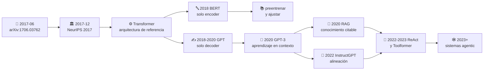

# 🌐 Dónde vive la investigación de IA

> **Regla del eje:** una afirmación sobre un paper se sostiene con la **fuente primaria**.
> Un blog, un hilo o un resumen generado por IA son pistas para encontrar el paper, nunca
> sustituto de haberlo abierto.

El error más frecuente al empezar es confundir **dónde se publica** con **dónde se busca**.
Google Scholar no publica nada: indexa. arXiv no revisa nada: aloja. Saber qué hace cada
sitio cambia cómo se cita y cuánta confianza merece lo que encuentras.

## 📊 El mapa en una tabla

| Sitio | Qué es realmente | Revisión por pares | Cuándo usarlo |
|---|---|:---:|---|
| [arXiv](https://arxiv.org/) | Repositorio de preprints | ❌ No | Ver la investigación **antes** de que se publique formalmente |
| [NeurIPS](https://neurips.cc/) | Conferencia | ✅ Sí | ML e IA en sentido amplio |
| [ICML](https://icml.cc/) | Conferencia | ✅ Sí | ML avanzado, teoría, optimización |
| [ICLR](https://iclr.cc/) | Conferencia | ✅ Sí | Deep learning, representaciones, arquitecturas |
| [ACL Anthology](https://aclanthology.org/) | Archivo abierto de ACL/NAACL/EMNLP | ✅ Sí | PLN, LLM, traducción, evaluación lingüística |
| [OpenReview](https://openreview.net/) | Plataforma de revisión **abierta** | ✅ Sí (visible) | Leer las objeciones de los revisores y las réplicas |
| [Semantic Scholar](https://www.semanticscholar.org/) | Índice y grafo de citas | — | Rastrear qué papers citan a este |
| [Google Scholar](https://scholar.google.com/) | Índice de citas | — | Encontrar versiones alternativas |
| [Papers with Code](https://paperswithcode.com/) | Enlace paper ↔ implementación | — | Buscar código, con reservas |

## 📄 arXiv — el primer lugar donde mirar

Es donde aparece primero casi toda la investigación relevante de IA, a menudo meses antes
de la conferencia. Las categorías que importan para este programa:

| Categoría | Contenido | Enlace |
|---|---|---|
| `cs.AI` | Inteligencia artificial en general | [listado](https://arxiv.org/list/cs.AI/recent) |
| `cs.LG` | Machine learning (la más activa) | [listado](https://arxiv.org/list/cs.LG/recent) |
| `cs.CL` | Lenguaje computacional: NLP, LLM, traducción | [listado](https://arxiv.org/list/cs.CL/recent) |
| `cs.CV` | Visión por computador | [listado](https://arxiv.org/list/cs.CV/recent) |
| `stat.ML` | Machine learning desde la estadística | [listado](https://arxiv.org/list/stat.ML/recent) |

> [!WARNING]
> **Un preprint no ha pasado revisión por pares.** Puede contener errores, ser retirado o
> cambiar entre versiones (`v1`, `v2`, `v3`). Cita siempre la versión que leíste. Un paper
> muy citado en arXiv que nunca fue aceptado en ningún venue es una señal a investigar, no
> a ignorar — pero es una señal.

## 🏛️ Conferencias — el filtro de la comunidad

En IA, la publicación de referencia es la **conferencia**, no la revista. Es una diferencia
cultural con otras disciplinas y explica los ciclos rápidos del campo.

- **NeurIPS** — la más grande y transversal. Publicó AlexNet (2012), el Transformer (2017),
  GPT-3, RAG, InstructGPT, Toolformer y DPO.
- **ICML** — machine learning avanzado; más peso en teoría y optimización.
- **ICLR** — nació en torno al deep learning y las representaciones. Usa OpenReview, así que
  todo su proceso editorial es público.
- **ACL / NAACL / EMNLP** — el mundo del lenguaje. Su archivo, **ACL Anthology**, es de
  acceso abierto y permanente: si un paper de PLN está ahí, esa es la cita canónica.

## 🔍 OpenReview — el sitio infravalorado

Es el único lugar donde se ve el paper **y su discusión**: qué objetaron los revisores, qué
respondieron los autores, qué cambió entre versiones y por qué se aceptó o rechazó.

Para aprender a leer críticamente vale tanto como el paper. Ejercicio de nivel L3 de este
eje: **buscar una revisión negativa de un paper aceptado y decidir si la objeción quedó
realmente resuelta o solo respondida con elegancia.**

## 🧭 Buscadores — para rastrear, no para citar

**Semantic Scholar** y **Google Scholar** sirven para reconstruir linajes: quién citó a
quién, qué vino antes y qué vino después. Semantic Scholar además expone una
[API pública](https://api.semanticscholar.org/) que permite automatizar la vigilancia.

> [!CAUTION]
> El número de citas mide **atención**, no calidad ni corrección. Papers muy citados han
> sido posteriormente matizados o refutados; papers poco citados han resultado
> fundamentales años después.

## 🧬 La ruta histórica, contada como circulación entre fuentes

Así viajó la idea que sostiene casi todo lo que usas hoy:

Cada flecha del diagrama es un paper concreto con su ficha en este eje:
[índice completo](../catalog/PAPERS_INDEX.md).

## ✅ Higiene de citación (obligatoria en este eje)

1. Registra **autores, año, título, venue, URL y fecha de consulta**.
2. Cita la **versión** que leíste (`arXiv:1706.03762v5`, no solo `arXiv:1706.03762`).
3. Prefiere el venue revisado si existe; usa arXiv cuando no exista o para la versión extendida.
4. **No cites un paper que no abriste.** Se detecta preguntando por el número de una figura.
5. No conviertas un número de un resumen ajeno en un dato tuyo sin verlo en la tabla original.
6. Distingue siempre: **hecho documentado** / **simplificación didáctica** / **inferencia propia**.

## ⚖️ Copyright y acceso

Este repositorio **enlaza** a las fuentes; no aloja PDFs de terceros con licencia restrictiva.

Los tres papers más antiguos del eje (P01 Rosenblatt, P02 Rumelhart y P03 Hochreiter) están
en revistas de suscripción. Vías legítimas: la versión de acceso abierto del autor, el
repositorio institucional de su universidad, o una biblioteca. La versión en
[ACL Anthology](https://aclanthology.org/) siempre es abierta cuando existe.

---

Los datos de esta guía están también en formato legible por máquina en
[`catalog/sources.yaml`](../catalog/sources.yaml), con fecha de revisión.

[⬅️ Eje de papers](../README.md) ·
[📖 Cómo leer un paper](COMO_LEER_UN_PAPER_DE_IA.md) ·
[🔁 Método en 5 pasadas](METODO_DE_LECTURA_EN_5_PASADAS.md) ·
[🧾 Plantilla de ficha](PLANTILLA_FICHA_PAPER.md) ·
[📚 Glosario](GLOSARIO_PAPERS_IA.md)
